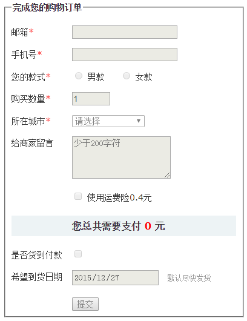
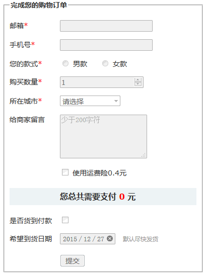
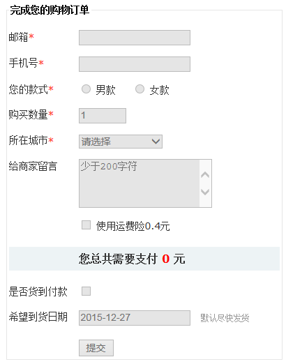

# pointer-events:none和覆盖层方法的问题

经常会遇到需求，需要禁用div中或者form元素中一堆表单控件元素，如`<input>`，`<select>`，`<textarea>`元素。

很多人用的下面这两种方法实现：

1. 设置pointer-events:none，例如：
    ```css
    form {
      pointer-events: none;
    }
    ```
2. 使用::before伪元素创建一个浮层该在所有的表单元素上，例如：

    ```css
    form {
      position: relative;
    }

    form::before {
      content: '';
      position: absolute;
      left: 0;
      right: 0;
      top: 0;
      bottom: 0;
      background-color: rgba(0,0,0,.001);
    }
    ```

以上两个方向虽然可以让点击无效，但是并没有阻止键盘访问，也就是Tab键索引，或者回车都能触发表单行为，使用new FormData(form)也能获取表单控件值，并不是真正意义上禁用，问题很大。

那有没有什么简单方法轻松禁用所有表单元素呢？难道真要遍历所有的控件元素再设置`[disabled]`属性吗？

# fieldset元素轻松实现

其实，要真正意义上禁用所有的表单元素很简单，嵌套在`<fieldset>`元素中，然后设置`<fieldset>`元素disabled就可以了，代码示意如下：

```html
<form>
    <fieldset disabled>
        <legend>表单标题</legend>
        <...>
    </fieldset>
</form>
```

下图是Chrome浏览器下的效果：



Firefox浏览器下：



Edge浏览器下：



# IE浏览器的瑕疵和解决

然后，IE浏览器（包括Edge）下有个瑕疵，那就是UI样式上虽然禁用了，键盘也无法响应，但是，输入框内容居然可以输入，而且表单的提交行为居然也可以点击触发，有些不完美，怎么办呢？

可以再辅助下面的CSS：

```css
fieldset[disabled] {
   -ms-pointer-events: none;
   pointer-events: none;
}
```

IE10+浏览器都可以完美禁用。

如果兼容IE8，IE9浏览器的话，那使用伪元素创建一个浮层覆盖在所有表单元素上面，就是一开始提到的覆盖方法