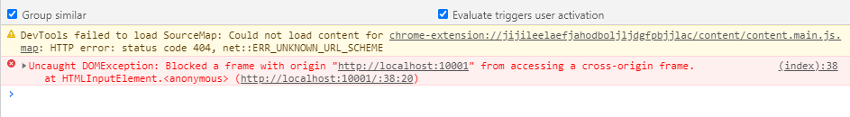
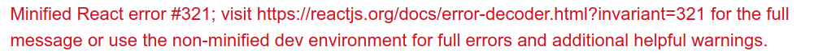
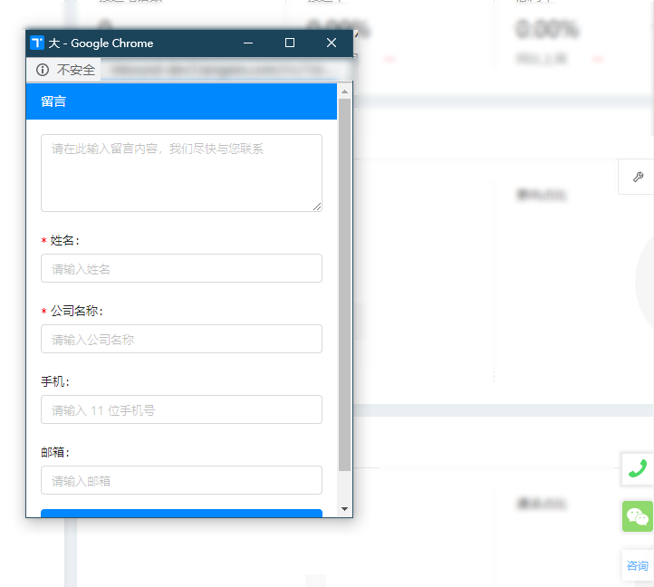
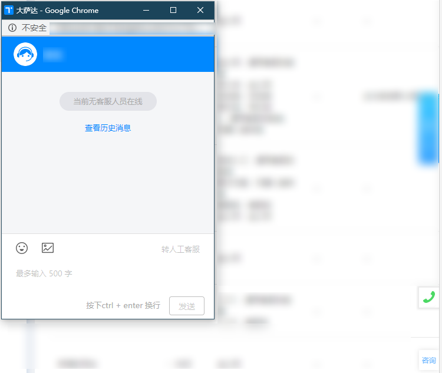

# 需求背景

由于客服聊天组件需要支持以新窗口的形式打开，也就是以 window.open 的新窗口打开，同时需要支持嵌入公司自己的产品端，在技术攻关的过程中遇到很多问题，特此记录

# 问题及解决方案

标记为横线的为完成需求后发现现阶段不需要做的

1. 跨域窗口间的通信：<s>编写底层通信库</s>、通过 url 传递
2. 嵌入公司产品端：独立客服聊天组件的运行环境
3. 设置新窗口位置：需要注意兼容分屏情况
4. 监听新窗口打开情况：<s>通过底层库发消息</s>、获取 window.open 的 closed 属性
5. <s>监听新窗口是否加载完成</s>：<s>通过底层库发消息</s>
6. 聊天消息输入类 html 字符：匹配特定字符进行 html 渲染，其他字符按文本渲染

# 具体解决

## 跨域窗口间通信

### 底层库编写

因为需要知道打开的是哪个技能组（相当于群），需要传递技能组的相关信息，首先需要编写底层库，核心代码如下

```js
export default class Bus {
    private syncFns: Array<SyncFn> = []

    constructor(public origin: string, syncFn: SyncFn | Array<SyncFn>) {
        this.init()
        this.syncFns = Array.isArray(syncFn) ? syncFn : [syncFn]
    }

    private init(): void {
        window.addEventListener("message", this.receiveMsg.bind(this), false)
    }

    // 获取跨域消息
    private receiveMsg(e) {
        const { origin } = e
        if (this.origin !== '*' && origin !== this.origin) return
        const { name, data } = e.data
        this.syncFns.forEach(item => {
            if (item.name === name) {
                item.fn(data, e)
            }
        })
    }

    // 发送跨域消息
    postMessage(windowInstance: object, swMessage: SWMessage, targetOrigin: string) {
        windowInstance && windowInstance.postMessage(swMessage, targetOrigin)
    }
}
```

### 传递数据

注意加重部分，由于以上代码不知道什么时候新窗口加载完毕，提前发送消息会没效果，所以设置了延时

```js{13-24}
// 主页面 index.html，访问域名为 http://localhost:10001
var caller = new Bus('http://127.0.0.1:10001', [
  {
    name: 'message',
    fn: (data) => {
      console.log('收到新窗口的消息', data);
    }
  }
]);

document.querySelector('#button').addEventListener('click', function() {
  var popup = window.open('http://127.0.0.1:10001/popup.html', '', 'width=300,height=300,top=100,left=200');
  setTimeout(() => {
    caller.postMessage(
      popup,
      {
        name: 'nickname',
        data: {
          name: 'towavephone'
        }
      },
      'http://127.0.0.1:10001'
    );
  }, 2000);
});
```

```js
// 新窗口页面 popup.html，访问域名为 http://127.0.0.1:10001/popup.html
var caller = new Bus('http://localhost:10001', [
  {
    name: 'nickname',
    fn: (data, e) => {
      console.log('收到主页面的消息', data);
      caller.postMessage(
        e.source,
        {
          name: 'message',
          data: {
            name: `hello ${data.name}`
          }
        },
        'http://localhost:10001'
      );
    }
  }
]);
```

执行效果：


### 监听新窗口是否加载完成

setTimeout 设置的延时不够准确，需要采用以下方案

#### 监听 window.open 的 onload 事件（跨域下失效）

```js{13-24}
// 主页面 index.html，访问域名为 http://localhost:10001
var caller = new Bus('http://127.0.0.1:10001', [
  {
    name: 'message',
    fn: (data) => {
      console.log('收到新窗口的消息', data);
    }
  }
]);

document.querySelector('#button').addEventListener('click', function() {
  var popup = window.open('http://127.0.0.1:10001/popup.html', '', 'width=300,height=300,top=100,left=200');
  popup.onload = function() {
    caller.postMessage(
      popup,
      {
        name: 'nickname',
        data: {
          name: 'towavephone'
        }
      },
      'http://127.0.0.1:10001'
    );
  };
});
```

刚开始打算监听 window.open 的 onload 事件，但是在不同域名下会报错



#### 跨域发送消息检测加载完成

```js{2,10-16,21-37}
// 主页面 index.html，访问域名为 http://localhost:10001
var isLoaded = false;
var caller = new Bus('http://127.0.0.1:10001', [
  {
    name: 'message',
    fn: (data) => {
      console.log('收到新窗口的消息', data);
    }
  },
  {
    name: 'newWindowLoad',
    fn: () => {
      isLoaded = true;
      console.log('新窗口加载完成');
    }
  }
]);

document.querySelector('#button').addEventListener('click', function() {
  var popup = window.open('http://127.0.0.1:10001/popup.html', '', 'width=300,height=300,top=100,left=200');
  isLoaded = false;
  var timer = setInterval(() => {
    if (!isLoaded) {
      return;
    }
    timer && clearInterval(timer);
    caller.postMessage(
      popup,
      {
        name: 'nickname',
        data: {
          name: 'towavephone'
        }
      },
      'http://127.0.0.1:10001'
    );
  }, 0);
});
```

```js{21-27}
// 新窗口页面 popup.html，访问域名为 http://127.0.0.1:10001/popup.html
var caller = new Bus('http://localhost:10001', [
  {
    name: 'nickname',
    fn: (data, e) => {
      console.log('收到主页面的消息', data);
      caller.postMessage(
        e.source,
        {
          name: 'message',
          data: {
            name: `hello ${data.name}`
          }
        },
        'http://localhost:10001'
      );
    }
  }
]);

caller.postMessage(
  window.opener,
  {
    name: 'newWindowLoad'
  },
  'http://localhost:10001'
);
```

当新窗口的页面加载完毕时会发出 `newWindowLoad` 消息，主页面接收后，标志变量 `isLoaded` 置为 `true`，此时尚在轮询的消息就可以发出。


### 通过 url 传递数据

之后由于新窗口需要刷新后也要保持当前技能组的打开，以上方案在刷新新窗口后数据会丢失，所以通过 url 来传递数据

## 独立客服组件运行环境

由于客服组件需要嵌入公司产品端，因为采用的技术栈和公司产品端的技术栈一致，这时会遇到很多问题：

1. react 和 react-lite 的冲突，react 16 与 react 15 不能同时引入到一个页面，具体见 https://github.com/facebook/react/issues/16029 
2. babel-polyfill 引入 2 次导致不能正常加载 

### 独立运行环境

由于在开发服本地是正常的，编译为生产版本后冲突，首先想到了是不是生成文件 js 编号的冲突，于是做出以下修改

```js
optimization: {
  // 以模块文件路径作为要加载模块的 key，不设置时默认以递增数字为 key
  namedModules: true,
  // 分包文件同理
  namedChunks: true,
}
```

然后发现 react 和 react-lite 的共存时还是会报错，除非能保证客服组件的脚本能先于公司产品端去加载，这样的话就需要动到各个产品端的 index.html 文件，然而这样的话改动影响面会比较大，也不好在 index.html 中去读取到环境变量

最后理了下思路，发现应该是产品端所有加载文件默认都在 webpackJsonp 变量下，需要将客服组件项目加载到不同的变量下才能做到环境上的隔绝

```js{5}
output: {
  filename: '[name].js',
  chunkFilename: '[name].[chunkhash].chunk.js',
  // 关键的一步，使同一网页上的多个 webpack 运行，互不影响
  jsonpFunction: 'ponyWebpackJsonp',
},
```

具体的原理可参考：[Module federation 原理研究](/module-federation-principle-research/)

### babel-polyfill 引入 2 次

这里的话因为引入了 babel-polyfil，所以需要将客服组件项目中的 `global._babelPolyfill = true;` 这一行屏蔽掉，防止公司产品端报错，暂时未想到更好的办法

```js
// global._babelPolyfill = true;
```

## 设置新窗口位置

需要注意下分屏的情况，新窗口在副屏的定位是错的，需要做特殊处理，主屏上没问题

```js
// 兼容左右分屏情况
const { availTop, availLeft } = window.screen;
if (availLeft) {
  left += availLeft;
}
if (availTop) {
  top += availTop;
}
```

[chrome 弹窗在双屏情况下 left 居中定位异常分析](https://segmentfault.com/a/1190000017989734)

## 监听新窗口打开情况

通过监听 window.open 的 closed 属性，因为有多个新窗口打开，需要遍历 window.open 数组

```js
this.popups = [];
const popup = window.open(url, '');
this.popups.push(popup);

// 得到打开的新窗口
this.popups.filter((item) => !item.closed);
```

## 解决聊天框代码注入

由于聊天表情是由有限的几个字符组成的，格式为 `[高兴]`, 所以只要匹配这几个字符，然后以 dangerouslySetInnerHTML 渲染，其他字符以普通文本字符渲染就可以

```js
// EmojiList：表情字符列表，symbolToHTML：特定字符转为 html 方法
renderText = (text) => {
  const renderContent = [];
  text.replace(/\[([^[\]]+?)\]|./g, (symbol) => {
    if (/\[([^[\]]+?)\]/.test(symbol) && EmojiList.find((item) => item.symbol === symbol)) {
      renderContent.push(<span dangerouslySetInnerHTML={{ __html: symbolToHTML(symbol) }} />);
    } else {
      renderContent.push(symbol);
    }
  });
  return <div>{renderContent}</div>;
};
```

# 效果截图





# 总结

1. 传递到新窗口的 url 过长需要编码
2. 独立运行环境部分的 react 冲突可能是作用域提升导致的冲突，待具体研究
3. babel-polyfill 引入 2 次，如何复用 ployfill 的代码待研究
