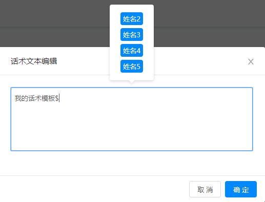
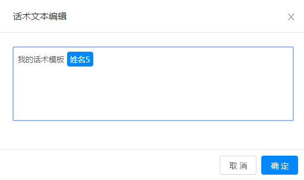
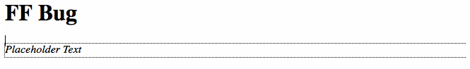
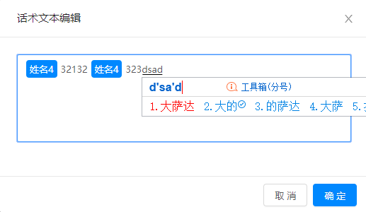
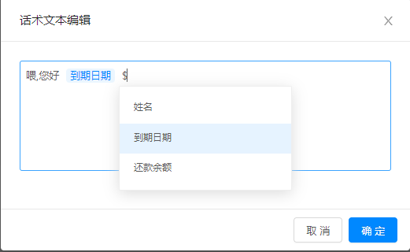

# 需求背景

最近要做一个需求类似于富文本框的功能，需要输入带有 span 标签并显示，同时 span 标签是一个整体，只能同时输入同时删除，目前需求只有这一个 html 标签，暂时无其他标签





# 需求难点

## placeholder 提示语

input 和 textarea 能轻松实现 placeholder 提示语的效果，但作用于 contenteditable 的元素，placeholder 不起作用，可以通过 css 的:empty 解决：

```css
[contenteditable=true]:empty::before {
  content: attr(placeholder);
}
```

## 获取输入框的内容

可以利用 innerHTML、innerText、textContent 获取输入框的内容，详细对比介绍一下这几个方法：

1. innerHTML 返回或修改标签之间的内容，包括标签和文本信息，基本上所有浏览器都支持。
2. innerText 打印标签之间的纯文本信息，会将标签过滤掉,此功能最初由 Internet Explorer 引入，在 Firefox 上存在兼容问题。

### innerText !== textContent

innerText 和 textContent 均能获取标签的内容，但二者存在差别，使用的时候还需注意浏览器兼容性：

1. textContent 会获取 style 元素里的文本（若有 script 元素也是这样），而 innerText 不会
2. textContent 会保留空行、空格与换行符
3. innerText 并不是标准，而 textContent 更早被纳入标准中
4. innerText 会忽略 display: none 标签内的内容，textContent 则不会
5. 性能上 textContent > innerText

## 光标的位置

首先遇到的一个问题是利用上述方法实现 placeholder 后，输入框的光标在 Firefox 中的位置会比其它浏览器要高一截。



尝试了很多方法来解决均无果，最终发现默认放置 `<\br>` 标签后，光标位置正常了。

### 受控组件下光标每次输入跳到文本开头

另一个需求是输入文本时，在 react 富文本组件受控（即 setState) 的影响下，光标每次输入会跳到文本开头，而非受控组件不会出现此问题，但是需求原因，非受控组件是 react 的一种反模式，同时也会影响到组件的取值赋值过程不好同步，解决办法是只能自己控制光标的位置，实现受控组件

```js
function isChildOf(node, parentId) {
  while (node !== null) {
    if (node.id === parentId) {
      return true;
    }
    node = node.parentNode;
  }

  return false;
}

function getCurrentCursorPosition(parentId) {
  const selection = window.getSelection();
  let charCount = -1;
  let node;

  if (selection.focusNode) {
    if (isChildOf(selection.focusNode, parentId)) {
      node = selection.focusNode;
      charCount = selection.focusOffset;
      while (node) {
        if (node.id === parentId) {
          break;
        }

        if (node.previousSibling) {
          node = node.previousSibling;
          charCount += node.textContent.length;
        } else {
          node = node.parentNode;
          if (node === null) {
            break;
          }
        }
      }
    }
  }

  return charCount;
}

function createRange(node, chars, range) {
  if (!range) {
    range = document.createRange();
    range.selectNode(node);
    range.setStart(node, 0);
  }

  if (chars.count === 0) {
    range.setEnd(node, chars.count);
  } else if (node && chars.count > 0) {
    if (node.nodeType === Node.TEXT_NODE) {
      if (node.textContent.length < chars.count) {
        chars.count -= node.textContent.length;
      } else {
        range.setEnd(node, chars.count);
        chars.count = 0;
      }
    } else {
      for (let lp = 0; lp < node.childNodes.length; lp++) {
        range = createRange(node.childNodes[lp], chars, range);

        if (chars.count === 0) {
          break;
        }
      }
    }
  }

  return range;
}

function setCurrentCursorPosition(that, chars, node) {
  if (chars >= 0) {
    const selection = window.getSelection();

    const range = createRange(that, { count: chars }, node);

    if (range) {
      range.collapse(false);
      selection.removeAllRanges();
      selection.addRange(range);
    }
  }
}
```

具体用法是先得到富文本框之前的光标位置，然后在 setState 之后恢复光标的位置

```js
const lastRange = getCurrentCursorPosition(this.id);
this.setState(innerHTML, () => {
  const that = document.getElementById(this.id);
  setCurrentCursorPosition(that, lastRange);
});
```

### 删除遇到 span 时光标跳到文本开头

接着又遇到一个坑，因为想实现的是整体删除 span，所以设置了 contenteditable 属性为 false，在删除光标遇到带有 span 标签的字符时，光标也会跳到不正确的位置

经过一步步的调试，发现取出函数 getCurrentCursorPosition 的光标位置是不对的，它取出的是在 span 内部光标的位置，比如说`3233<span> 我是 </span>`，此时取出的光标位置值为 2，而不是 6，考虑到修改 getCurrentCursorPosition 会影响之前的 bug，所以只能在删除遇到标签时做下特殊处理，在遇到 span 标签删除后，光标强制移到文本最后

```js
function selectAllText(elem) { // 将光标移到文本末尾
  if (window.getSelection) {
    elem.focus();
    const range = window.getSelection();
    range.selectAllChildren(elem);
    range.collapseToEnd();
  } else if (document.selection) {
    const range = document.selection.createTextRange();
    range.moveToElementText(elem);
    range.collapse(false);
    range.select(); /* 避免产生空格*/
  }
}

const selection = window.getSelection();
if (selection.focusNode.id === this.id) { // 焦点在 span 内部，即光标遇到 span 标签
  this.props.onChange(innerHTML, () => {
    const that = document.getElementById(this.id);
    selectAllText(that);
  });
  return;
}
```

## 中文输入法会将英文字符一起输入

在输入中文字符时，会将英文字符一起输入，解决办法是触发相应事件给一个标志变量，判断中文输入是否已完成



```html
<html>
  <script>
    handlingComposition = () => {
      this.isCompositionEnd = false;
    }

    handleComposition = (e) => {
      this.isCompositionEnd = true;
      // 以下是解决中文字符在文本框末尾时不赋值的 bug
      this.setState(e.target.innerHTML, () => {
        const that = document.getElementById(this.id);
        selectAllText(that); // 光标跳转到最后
      });
    }

    emitChange = (e) => {
      if (!this.isCompositionEnd) {
        return; // 直接跳过，不赋值
      }
    }
  </script>
  <div
    contentEditable
    onInput={this.emitChange}
    onCompositionStart={this.handlingComposition}
    onCompositionUpdate={this.handlingComposition}
    onCompositionEnd={this.handleComposition}
  />
</html>
```

暂时遇到这么多问题，以后遇到 bug 再更新

以上更新于`2018-11-26 08:55:56`

---

# 最终解决方案 draft-js

## 代码注释

以上方法有很多未知的 bug，比较明显的问题就是光标会到处乱跑，自己解决起来有太多的坑，故采用业界比较成熟的 
[draft-js-plugins](https://github.com/draft-js-plugins/draft-js-plugins)，底层采用 facebook 的开源库 [draft-js](https://github.com/facebook/draft-js)，期间也遇到不少问题，详见代码注释

```jsx{12-13,23-29}
import React from 'react';
import PropTypes from 'prop-types';
import { EditorState } from 'draft-js';
import { convertFromHTML, convertToHTML } from 'draft-convert';
import classnames from 'classnames';
import Editor from 'draft-js-plugins-editor';
import createMentionPlugin, { defaultSuggestionsFilter, defaultTheme } from 'draft-js-mention-plugin';
import 'draft-js-mention-plugin/lib/plugin.css';
import utils from 'utils';

import styles from './styles.css';
// 为了解决ie9下parseFromString('', 'text/html')的报错
import './DomParserPloyfill';

class GraphHintTextArea extends React.PureComponent { // eslint-disable-line react/prefer-stateless-function
  constructor(props) {
    super(props);
    let theme = {
      ...defaultTheme,
      mention: styles.mention,
    };
    const browser = utils.getBrowserInfo();
    if (browser.name === 'msie' && browser.version === '9') {
      theme = {
        ...defaultTheme,
        mention: styles.mention,
        mentionSuggestions: styles.mentionSuggestions,
      };
    }
    // 设置mention标签的可变性、触发字符、样式
    this.mentionPlugin = createMentionPlugin({
      entityMutability: 'IMMUTABLE',
      mentionTrigger: '$',
      theme,
    });

    const { value } = this.props;
    const contentState = convertFromHTML({
      // 遇到class带有mention的标签进行实体的不可变转化，此时mention即话术变量标签是一体的
      // 删除只能整个删除，添加也将转化为普通字符
      // eslint-disable-next-line consistent-return
      htmlToEntity: (nodeName, node, createEntity) => {
        if (nodeName === 'span' && node.className === 'mention') {
          const name = node.innerText || '';
          return createEntity('$mention', 'IMMUTABLE', {
            mention: {
              name,
              _id: node.id,
            },
          });
        }
      },
    })(value);

    this.state = {
      editorState: EditorState.createWithContent(contentState),
      suggestions: [],
    };
  }

  // componentDidMount = () => {
  //   this.focus();
  // }

  // https://github.com/facebook/draft-js/issues/1198
  // 因为此处最开始打算使用componentWillReceiveProps，但在和onChange一起作用时，
  // 导致多次执行，光标跳到行首，只能采用非受控组件的方式手动调用
  setEditorContent(text) {
    const contentState = convertFromHTML({
      // eslint-disable-next-line consistent-return
      htmlToEntity: (nodeName, node, createEntity) => {
        if (nodeName === 'span' && node.className === 'mention') {
          const name = node.innerText || '';
          return createEntity('$mention', 'IMMUTABLE', {
            mention: {
              name,
              _id: node.id,
            },
          });
        }
      },
    })(text);
    const { editorState } = this.state;
    // 这里必须用push方法，不然会导致编辑器提示框不能弹出
    // https://github.com/draft-js-plugins/draft-js-plugins/issues/210
    const newEditorState = EditorState.push(editorState, contentState);
    this.setState({
      editorState: newEditorState,
    });
  }

  // https://github.com/draft-js-plugins/draft-js-plugins/issues/800
  // 不能直接调用focus，否则会造成draft-js-mention-plugin的失效
  // focus = () => {
  //   setTimeout(() => {
  //     this.editor.focus();
  //   }, 0);
  // }

  handleChange = (editorState) => {
    const contentState = editorState.getCurrentContent();
    const pureText = this.convertToPureText(contentState);
    // 暂时不能阻挡非受控组件的输入
    // const { maxLength } = this.props;
    // if (pureText.length > maxLength) {
    //   return;
    // }
    this.setState({
      editorState,
    }, () => {
      this.triggerChange(contentState, pureText);
    });
  };

  handleSearchChange = ({ value }) => {
    const { hints } = this.props;
    this.setState({
      suggestions: defaultSuggestionsFilter(value, hints),
    });
  };

  // 这里是转成看到标签的效果，目的是得到实际字符
  convertToPureText = (contentState) => {
    let htmlToPureText = convertToHTML({
      // eslint-disable-next-line consistent-return
      blockToHTML: (data) => {
        const { type } = data;
        if (type === 'unstyled') {
          return {
            start: '',
            end: '',
            empty: '',
          };
        }
      },
    })(contentState);
    htmlToPureText = htmlToPureText.replace(/<\/?.+?\/?>|\s+/g, '');
    return htmlToPureText;
  }

  // 这里是转成要传给后端的效果
  triggerChange = (contentState, pureText) => {
    const { onChange } = this.props;
    let html = convertToHTML({
      // 将遇到的实体标签转化为${id}，以便后端进行处理
      entityToHTML: (entity, originalText) => {
        if (entity.type === '$mention') {
          return `$\{${entity.data.mention._id}}`;
        }
        return originalText;
      },
      // 语音合成需求要求，去除所有换行，即所有无用标签p，否则会读出标签p
      // https://github.com/HubSpot/draft-convert/issues/59
      // eslint-disable-next-line consistent-return
      blockToHTML: (data) => {
        const { type } = data;
        if (type === 'unstyled') {
          return {
            start: '',
            end: '',
            // empty属性代表所有换行都去掉，而不是转为空格
            empty: '',
          };
        }
      },
    })(contentState);
    // 语音合成需求要求，去掉所有空白字符（包含空格、制表符、换页符）和html标签（包含<div class="test"></div>、、<My-Tag></My-Tag>这几种）
    html = html.replace(/<\/?.+?\/?>|\s+/g, '');
    if (typeof onChange === 'function') {
      onChange(html, pureText);
    }
    return html;
  }

  handleFocus = () => {
    const { onFocus } = this.props;
    if (typeof onFocus === 'function') {
      onFocus();
    }
  }

  handleBlur = () => {
    const { onBlur } = this.props;
    if (typeof onBlur === 'function') {
      onBlur();
    }
  }

  render() {
    const { placeholder, className } = this.props;
    const { MentionSuggestions } = this.mentionPlugin;
    const plugins = [this.mentionPlugin];
    return (<div className={classnames(styles.editor, className)}>
      <Editor
        editorState={this.state.editorState}
        onChange={this.handleChange}
        plugins={plugins}
        placeholder={placeholder}
        onFocus={this.handleFocus}
        onBlur={this.handleBlur}
        ref={(r) => { this.editor = r; }}
      />
      <MentionSuggestions
        onSearchChange={this.handleSearchChange}
        suggestions={this.state.suggestions}
      />
    </div>);
  }
}

GraphHintTextArea.propTypes = {
  placeholder: PropTypes.string,
  onChange: PropTypes.func,
  value: PropTypes.string,
  hints: PropTypes.array,
  className: PropTypes.string,
  onFocus: PropTypes.func,
  onBlur: PropTypes.func,
};

export default GraphHintTextArea;
```

效果如下：



## 兼容性问题

这里遇到两个兼容性问题，如以上代码高亮部分

- 在 IE9 下 draft-js 源码里面的 `parseFromString('', 'text/html')` 会报错，引入一段兼容代码如下

```js
/*
 * DOMParser HTML extension
 * 2012-09-04
 *
 * By Eli Grey, http://eligrey.com
 * Public domain.
 * NO WARRANTY EXPRESSED OR IMPLIED. USE AT YOUR OWN RISK.
 */

/*! @source https://gist.github.com/1129031 */
/* global document, DOMParser*/

// eslint-disable-next-line func-names
(function (DOMParser) {
  // eslint-disable-next-line
  const DOMParser_proto = DOMParser.prototype, real_parseFromString = DOMParser_proto.parseFromString;
  // Firefox/Opera/IE throw errors on unsupported types
  try {
    // WebKit returns null on unsupported types
    if ((new DOMParser()).parseFromString('', 'text/html')) {
      // text/html parsing is natively supported
      return;
    }
  // eslint-disable-next-line no-empty
  } catch (ex) {

  }

  // eslint-disable-next-line func-names
  DOMParser_proto.parseFromString = function (markup, type) {
    if (/^\s*text\/html\s*(?:;|$)/i.test(type)) {
      const doc = document.implementation.createHTMLDocument('');
      if (markup.toLowerCase().indexOf('<!doctype') > -1) {
        doc.documentElement.innerHTML = markup;
      } else {
        doc.body.innerHTML = markup;
      }
      return doc;
    // eslint-disable-next-line no-else-return
    } else {
      // eslint-disable-next-line prefer-rest-params
      return real_parseFromString.apply(this, arguments);
    }
  };
}(DOMParser));
```

- IE9 下不能弹出下拉框，这里笔者查看了源码发现了是 IE9 不支持动画 CSS 属性，即 transfrom 属性，故在 IE9 下单独处理，去掉 tranfrom 变换
