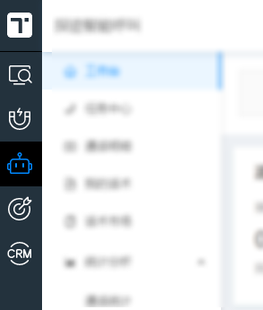

# 需求背景

如下图所示，由于多个产品共存，当初设计产品架构时，侧边栏、打电话组件是存在于每个项目的子模块中的。迫于产品越来越多，需要动到侧边栏的时候越来越频繁，随着产品的不断增加导致了需要编译每个项目的工作越来越重，急需一种新的架构来分离侧边栏与各自产品端。



# 技术方案

基本原理类似于之前的文章 [记一次组件打包为链接的实践](/components-pack-as-library/)，也就是主框架也就是侧边栏项目提前设定好元素的位置，再用 ReactDOM.render 方法去渲染结点，当然还有许多其他要注意的地方，比如链接的缓存规则、路由之间的跳转、子框架应用间的通信、样式和脚本的隔离等等。

参考市面上已有的解决的方案，发现比较符合微前端框架的适用场景，于是开始用以下微前端框架来做出一个 demo 级别的应用

1. [ice-stark](https://github.com/ice-lab/icestark)
2. [single-spa](https://github.com/single-spa/single-spa)
3. [qiankun](https://github.com/umijs/qiankun)

# 具体实施

## ice-stark

### 主框架

以下是在 ice/stark 1.4.1 的版本上开始做的，需要添加代码如下：

src\platform\layout\index.js

以路径作为识别子应用的方式，子应用需要配置 publicPath，否则访问不到

这里假设产品 1 是采用了旧框架的子应用，产品 2 采用了新的

```js
import { AppRouter, AppRoute } from '@ice/stark';
<AppRouter
  NotFoundComponent={<div>未找到</div>}
  LoadingComponent={<div>加载中</div>}
  onRouteChange={this.handleRouteChange}
>
  <AppRoute
    path="/product1"
    basename="/product1"
    title="产品1"
    entry="产品1的域名/index.html"
  />
  <AppRoute
    path="/product2"
    basename="/product2"
    title="产品2"
    entry="产品2的域名/index.html"
  />
</AppRouter>
```

结合公司实际的应用场景，不同产品对应着不同的域名，这就不能用路径的方式来识别子应用的加载，需要作出如下改动

当然对应的子应用就不需要路径别名的配置了，这样实现的缺点是 onRouteChange 这个函数不再起作用，而且不能控制子应用的缓存，这些不同域名的缓存全部交给对应的 nginx 来做了

```js
import { AppRouter, AppRoute } from '@ice/stark';
<AppRouter
  NotFoundComponent={<div>未找到</div>}
  LoadingComponent={<div>加载中</div>}
  onRouteChange={this.handleRouteChange}
>
  {
    产品1的域名 ? <AppRoute
      path="/"
      basename="/"
      title="产品1"
      entry="产品1的域名/index.html"
    /> : null
  }

  {
    产品2的域名 ? <AppRoute
      path="/"
      basename="/"
      title="产品2"
      entry="产品2的域名/index.html"
    /> : null
  }
</AppRouter>
```

### 子框架

#### 老项目

老项目采用了 react-router 3.2.1，区别于新项目

以下是在 ice/stark-app 1.2.0 的版本上开始做的，需要添加代码如下：

##### 入口文件

app\app.js

```js{1-3,5-7,11,16-38}
import { applyRouterMiddleware, Router, browserHistory, useRouterHistory } from 'react-router';
import { createHistory } from 'history';
import { isInIcestark, getMountNode, registerAppEnter, registerAppLeave, getBasename } from '@ice/stark-app';

const baseHistory = useRouterHistory(createHistory)({
  basename: getBasename(),
});

const isIE9 = utils.getBrowserInfo().msie && utils.getBrowserInfo().version === '9.0';

const history = syncHistoryWithStore(baseHistory, store, {
  selectLocationState: makeSelectLocationState(),
  adjustUrlOnReplay: isIE9 ? false : undefined,
});

const router = () => (<ConfigProvider locale={zhCN}>
  <Provider store={store}>
    <Router
      history={history}
      routes={rootRoute}
      render={
        // Scroll to top when going to a new page, imitating default browser behaviour
        applyRouterMiddleware(useScroll())
      }
    />
  </Provider>
</ConfigProvider>);

if (isInIcestark()) {
  registerAppEnter(() => {
    ReactDOM.render(router(), getMountNode());
  });
  registerAppLeave(() => {
    ReactDOM.unmountComponentAtNode(getMountNode());
  });
} else {
  ReactDOM.render(router(), document.getElementById('app'));
}
```

##### 网络请求

网络请求、资源都需要绝对路径，这就涉及到资源的跨域，需要处理

app\utils\httpFetch.js

```js{2,12-17}
export default function httpFetch(url, options) {
  const newUrl = __COMMON_VARS__.robots + url;
  // already forced sign out and has shown modal, cancel fetch
  if (hasShownForcedSignOutModal) {
    return new Promise((resolve, reject) => {
      const error = new Error();
      error.status = 401;
      reject(error);
    });
  }
  // eslint-disable-next-line no-param-reassign
  options = {
    ...options,
    credentials: 'include',
  };
  return runFetch(newUrl, options)
    .then((response) => checkStatus(response, newUrl, options));
}
```

##### webpack配置

internals\webpack\webpack.base.babel.js

```js{3}
output: Object.assign({ // Compile into js/build.js
  path: path.resolve(process.cwd(), 'build'),
  publicPath: `${globalVars.robots}/product1/`,
}, options.output), // Merge with env dependent settings
```

##### nodejs服务器配置

server\index.js

```js{2-5,13-20,27}
// 设置允许资源文件跨域访问该服务
app.all('*', (req, res, next) => {
  res.header('Access-Control-Allow-Origin', '*');
  next();
});

// Copy proxy.config.example.json to proxy.config.json to setup proxy
const proxy = require('http-proxy-middleware');
config.proxies.forEach((item) => {
  app.use(item.match, proxy({
    target: item.host,
    changeOrigin: true,
    // 修改响应头信息，实现跨域并允许带cookie
    onProxyRes(proxyRes, req, res) {
      res.header('Access-Control-Allow-Origin', req.headers.origin);
      res.header('Access-Control-Allow-Credentials', 'true');
      res.header('Access-Control-Allow-Headers', 'Content-Type, Content-Length, Authorization, Accept, X-Requested-With, Pragma, Cache-Control');
    },
    // 修改响应信息中的cookie域名
    // cookieDomainRewrite: 'www.domain1.com', // 可以为false，表示不修改
  }));
});

// In production we need to pass these values in instead of relying on webpack
setup(app, {
  outputPath: resolve(process.cwd(), 'build'),
  publicPath: '/product1',
});
```

#### 新项目

新项目采用了 react-router 3.2.1，相同的部分不再阐述，只有入口文件不同于老项目

##### 入口文件

```js
import { BrowserRouter, Router } from 'react-router-dom';
import { isInIcestark, getMountNode, registerAppEnter, registerAppLeave, getBasename } from '@ice/stark-app';

const router = () => (<Provider
  {...stores}
>
  <Router history={history}>
    <BrowserRouter basename={getBasename()}>
      <ConfigProvider locale={zhCN}>
        <App />
      </ConfigProvider>
    </BrowserRouter>
  </Router>
</Provider>);

if (isInIcestark()) {
  registerAppEnter(() => {
    ReactDOM.render(router(), getMountNode());
  });
  registerAppLeave(() => {
    ReactDOM.unmountComponentAtNode(getMountNode());
  });
} else {
  ReactDOM.render(router(), document.getElementById('app'), renderCallback);
}
```

## single-spa

待研究，不过这个框架只兼容 IE 10

## qiankun

待研究，不过这个框架不兼容 IE

# 实现效果


