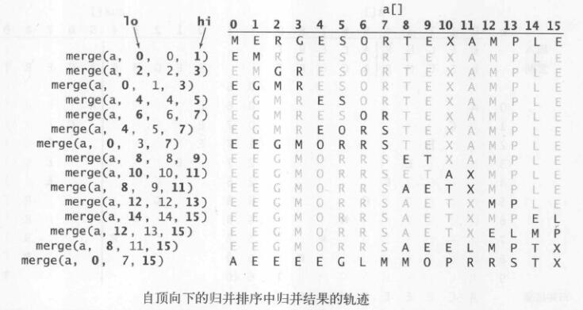
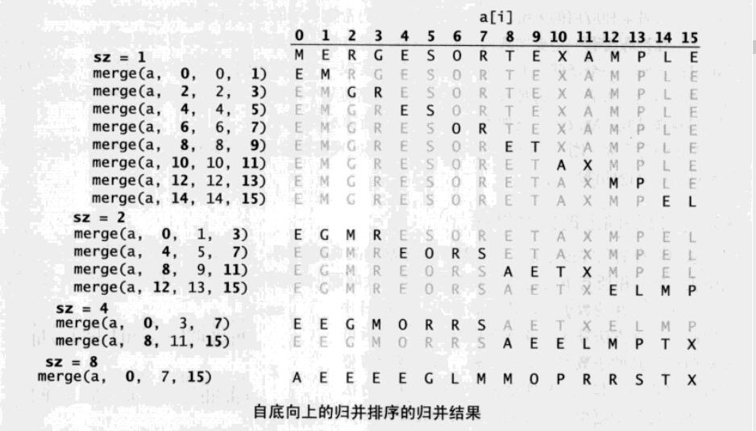
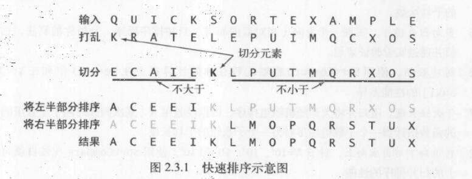
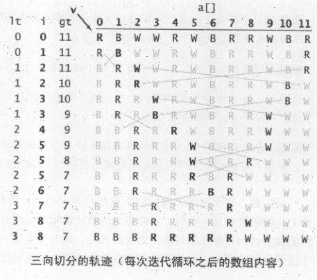
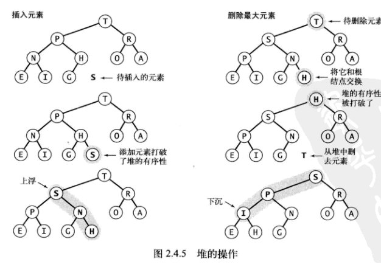
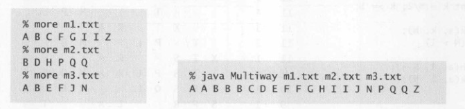
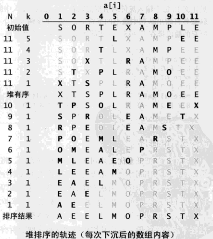
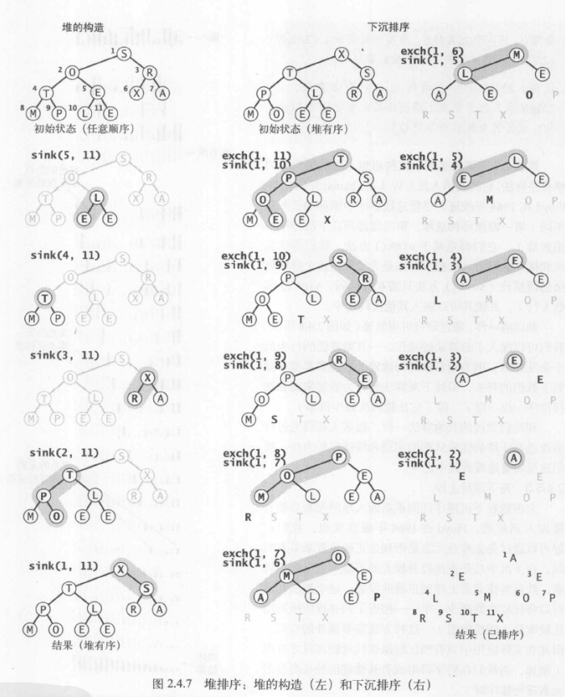
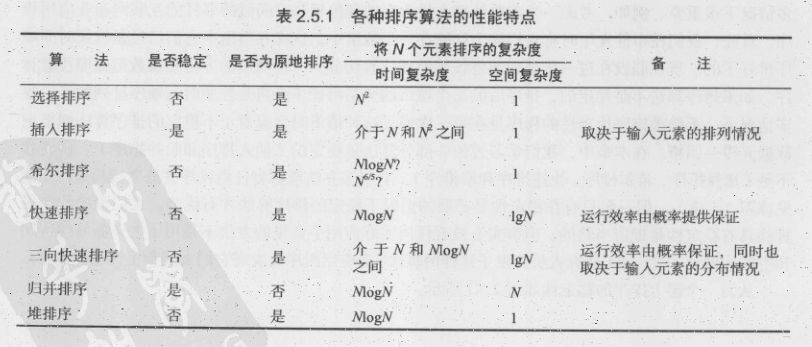

## 选择排序

### 思路

> 首先，找到数组中最小的那个元素，其次，将它和数组的第一个元素交换位置（如果第一个元素就是最小元素那么它就和自己交换）。再次，在剩下的元素中找到最小的元素，将它与数组的第二个元素交换位置。如此往复，直到将整个数组排序。

### 特点

> - 对于长度为 N 的数组，选择排序需要大约 $$ N^2/2 $$ 次比较，N 次交换

- 运行时间和输入无关，其他算法会更善于利用输入的初始状态
- 数据移动是最少的，每次交换都会改变两个数组元素的值，因此选择排序用了 N 次交换，其他任何算法都不具备这个特征（大部分的增长数量级都是线性对数或是平方级别）

### 实现

```java
public class Selection
{
    public static void sort(Comparable[] a)
    { // 将a[]按升序排列
        int N = a.length; // 数组长度
        for (int i = 0; i < N; i++)
        {   // 将a[i]和a[i+1..N]中最小的元素交换
            int min = i; // 最小元素的索引
            for (int j = i+1; j < N; j++)
            if (less(a[j], a[min])) min = j;
            exch(a, i, min);
        }
    }
    // less()、exch()、isSorted()和main()方法见“排序算法类模板”
}
```

## 插入排序

### 思路

> 在计算机的实现中，为了给要插入的元素腾出空间，我们需要将其余所有元素在插入之前都向右移动一位。这种算法叫做插入排序

### 特点

> - 和选择排序不同的是，插入排序所需的时间取决于输入中元素初始顺序

- 对于随机排列的长度为 N 且主键不重复的数组，平均情况下插入排序需要～$ N^2 /4 $次比较以及～ $ N^2 /4$ 次交换，最坏情况下需要 ～$N^2 /2$ 次比较和 ～$N^2 /2$ 次交换，最好情况下需要 N-1 次比较和 0 次交换
- 倒置指的是数组中的两个顺序颠倒的元素。比如 E X A M P L E 中有 11 对倒置：E-A、 X-A、 X-M、 X-P、 X-L、 X-E、 M-L、 M-E、 P-L、 P-E 以及 L-E，如果数组中倒置的数量小于数组大小的某个倍数，那么我们说这个数组是部分有序的。几种典型的部分有序的数组：
- 数组中每个元素距离它的最终位置都不远；
- 一个有序的大数组接一个小数组；
- 数组中只有几个元素的位置不正确。
- 插入排序对这样的数组很有效，而选择排序则不然。事实上，当倒置的数量很少时，插入排序很可能比本章中的其他任何算法都要快。
- 插入排序需要的交换操作和数组中倒置的数量相同，需要的比较次数大于等于倒置的数量，小于等于倒置的数量加上数组的大小再减一

## 实现

```java
public class Insertion
{
    public static void sort(Comparable[] a)
    { // 将a[]按升序排列
        int N = a.length;
        for (int i = 1; i < N; i++)
        {
            // 将 a[i] 插入到 a[i-1]、a[i-2]、a[i-3]...之中
            for (int j = i; j > 0 && less(a[j], a[j-1]); j--)
            exch(a, j, j-1);
        }
    }
    // less()、exch()、isSorted()和main()方法见“排序算法类模板”
}
```

## 选择排序与插入排序的比较

### 特点

> - 对于随机排序的无重复主键的数组，插入排序和选择排序的运行时间是平方级别的，两者之比应该是一个较小的常数

## 希尔排序

### 思路

> 希尔排序为了加快速度简单地改进了插入排序，交换不相邻的元素以对数组的局部进行排序，并最终用插入排序将局部有序的数组排序算法 2.3 的实现使用了序列 1/2（3 k -1），从 N /3 开始递减至 1。我们把这个序列称为递增序列。

### 特点

> - 透彻理解希尔排序的性能至今仍然是一项挑战

- 插入排序的增量改进版
- 使用递增序列 1, 4, 13, 40, 121, 364…的希尔排序所需的比较次数不会超出 N 的若干倍乘以递增序列的长度。
- 对于中等大小的数组它的运行时间是可以接受的。它的代码量很小，且不需要使用额外的内存空间

### 实现

```java
public class Shell
{
    public static void sort(Comparable[] a)
    { // 将a[]按升序排列
        int N = a.length;
        int h = 1;
        while (h < N/3) h = 3*h + 1; // 1, 4, 13, 40, 121, 364, 1093, ...
        while (h >= 1)
        {   // 将数组变为h有序
            for (int i = h; i < N; i++)
            {   // 将a[i]插入到a[i-h], a[i-2*h], a[i-3*h]... 之中
                for (int j = i; j >= h && less(a[j], a[j-h]); j -= h)
                exch(a, j, j-h);
            }
            h = h/3;
        }
    }
    // less()、exch()、isSorted()和main()方法见“排序算法类模板”
}
```

## 归并排序

### 思路

> 将两个有序的数组合并成一个更大的有序数组，递归的将两半排序，然后将结果归并起来。

### 特点

> - 优点：保证将任意长度为 N 的数组排序所需时间和 NlogN 成正比

- 缺点：所需的额外空间和 N 成正比。
- 对于长度为 N 的任意数组，自顶向下的归并排序需要$$ 1/2NlgN $$至 $$ NlgN $$ 次比较
- 对于长度为 N 的任意数组，自顶向下的归并排序最多需要访问数组$$ 6NlgN $$次
- 对于长度为 N 的任意数组，自底向上的归并排序需要 $$ 1/2NlgN $$ 至 $$ NlgN $$ 次比较，最多访问数组 $$ 6NlgN $$ 次

### 原地归并抽象方法

```java
public static void merge(Comparable[] a,int lo,int mid,int hi){
    //将a[lo...mid]和a[mid+1...hi]归并
    int i=lo,j=mid+1;
    for(int k=lo;k<=hi;k++){
        aux[k]=a[k];
    }
    for(int k=lo;k<=hi;k++){
        // 左半边用尽（取右半边元素）,右半边用尽（取左半边元素），左半边大于右半边（取右半边元素），右半边大于左半边（取左半边元素）
        if(i>mid) a[k]=aux[j++];
        else if(j>hi) a[k]=aux[i++];
        else if(less(aux[j],aux[i])) a[k]=aux[j++];
        else a[k]=aux[i++];
    }
}
```

### 自顶向下实现



```java
public class Merge
{
    private static Comparable[] aux;
    public static void sort(Comparable[] a){
        aux=new Comparable[a.length];//一次性分配空间
        sort(a,0,a.length-1);
    }
    private static void sort(Comparable[] a,int lo,int hi){
        //将数组a[lo...hi]排序
        if(hi<=lo) return;
        int mid=lo+(hi-lo)/2;
        sort(a,lo,mid);
        sort(a,mid+1,hi);
        merge(a,lo,mid,hi);
    }
}
```

### 自底向上实现



```java
public class MergeBU
{
    private static Comparable[] aux;
    public static void sort(Comparable[] a){
        int N=a.length;
        aux=new Comparable[N];
        //sz：子数组大小
        for(int sz=1;sz<N;sz=sz+sz){
            //lo：子数组索引
            for(int lo=0;lo<N-sz;lo+=sz+sz){
                merge(a,lo,lo+sz-1,Math.min(lo+sz+sz-1,N-1));
            }
        }
    }
}
```

### 改进方法

> - 对小规模子数组使用插入排序。

- 测试数组是否已经有序：如果 a[mid]小于等于 a[mid+1]，我们认为数组已经有序并跳过 merge 方法。
- 不将元素复制到辅助数组。

## 快速排序

### 思路

> 是一种分治的排序算法，将一个数组分成两个子数组，将两部分独立的排序。

### 特点

> - 原地排序，且与长度为 N 的数组排序所需的时间和 NlgN 成正比。

- 缺点是非常脆弱，实现时要小心避免低劣的性能，可能会降级到平方级别
- 快速排序和归并排序是互补的：归并排序将数组分成两个子数组分别排序，递归调用发生在处理整个数组之前；而快速排序是指当数组的两个子数组都有序时整个数组也就自然有序了，递归调用发生在处理整个数组之后。
- 归并排序中，一个数组被切分成两半；而对于快速排序，切分的位置取决于数组的内容。
- 将长度为 N 的无重复数组排序，快速排序平均需要~2NlgN 次比较（以及 1/6 次交换）。
- 快速排序最多需要约$$N^2/2$$次比较，但随机打乱数组能够预防这种情况。
- 对于大小为 N 的数组，算法的运行时间在 1.39NlgN 的某个常数因子的范围之内。比归并排序更快，因为它移动数据的次数更少，虽然比较次数多了 39%。

### 实现



```java
public class Quick
{
    public static void sort(Comparable[] a){
        // 消除对输入的依赖，避免切分不平衡
        StdRandom.shuffle(a);
        sort(a,0,a.length-1);
    }
    private static void sort(Comparable[] a,int lo,int hi){
        if(lo>=hi) return;
        int j=partition(a,lo,hi);
        sort(a,lo,j-1);
        sort(a,j+1,hi);
    }
    private static int partition(Comparable[] a,int lo,int hi){
        int i=lo,j=hi+1;
        Comparable v=a[lo];
        while(true){
            while(less(a[++i],v)) if(i==hi) break;
            while(less(v,a[--j])) if(j==lo) break;
            // 避免指针错过
            if(i>=j) break;
            exch(a,i,j);
        }
        //将v=a[j]放入正确的位置
        exch(a,lo,j);
        return j;
    }
}
```

### 算法改进

> - 切换到插入排序：if(hi<=lo) return;替换为 if(hi<=lo+M) {Insertion.sort(a,lo,hi); return;}，转换参数 M 的最佳值和系统相关一般取 5~15 之间。

- 三取样切分：使用子数组的一小部分元素的中位数来切分数组，当取样大小设为 3 并用大小居中的元素切分的效果最好。还可以将取样元素放在数组末尾作为“哨兵”来去掉 partition()中的数组边界测试。
- 熵最优排序：将数组切分为 3 部分，分别对应小于，等于和大于切分元素的数组元素。

### 三向切分的快速排序



```java
// 适用于多个重复主键的元素，对于此情况，它将排序时间从线性对数降低到了线性级别。
public class Quick3way
{
    private static void sort(Comparable[] a,int lo,int hi)
    {
        if(hi<=lo) return;
        int lt=lo,i=lo+1,gt=hi;
        Comparable v=a[lo];
        while(i<=gt){
            int cmp=a[i].compareTo(v);
            if(cmp<0) exch(a,lt++,i++);
            else if(cmp>0) exch(a,gt--,i);
            else i++;
        }
        sort(a,lo,lt-1);
        sort(a,gt+1,hi);
    }
}
```

## 优先队列

### 思路

> 利用二叉树的最大堆

### 特点

> - 插入元素和删除最大元素的操作用时和队列大小成对数关系。

- 对于一个含有 N 个元素的基于堆的优先队列，插入元素操作只需不超过(lgN+1)次比较，删除最大元素的操作需要不超过 2lgN 次比较。
- 在一个大小为 N 的索引优先队列中，插入元素、改变优先级、删除和删除最小元素操作所需比较次数和 logN 成正比。

### 基于堆的优先队列



```java
public class MaxPQ<Key extends Comparable<Key>>
{

    private Key[] pq;
    private int N=0;
    public MaxPQ(int maxN){
        pq=(Key[])new Comparable[maxN+1];
    }
    public boolean isEmpty(){
        return N==0;
    }
    public int size(){
        return N;
    }
    public void insert(Key v){
        pq[++N]=v;
        swim(N);
    }
    public Key delMax(){
        //从根节点得到最大元素
        Key max=pq[1];
        //将其和最后一个节点交换
        exch(1,N--);
        //防止越界
        pq[N+1]=null;
        //恢复堆的有序性
        sink(1);
        return max;
    }
    private boolean less(int i,int j){
        return pq[i].compareTo(pq[j])<0;
    }
    private void exch(int i,int j){
        Key t=pq[i];pq[i]=pq[j];pq[j]=t;
    }
    private void swim(int k){
        while(k>1&&less(k/2,k)){
            exch(k,k/2);
            k=k/2;
        }
    }
    private void sink(int k){
        while(2*k<=N){
            int j=2*k;
            // 放在右子树
            if(j<N&&less(j,j+1)) j++;
            if(!less(k,j)) break;
            exch(j,k);
            k=j;
        }
    }
}
```

### 算法改进

> - 多叉堆：三叉树或 N 叉树

- 调整数组大小：添加一个无参数的构造函数，在 insert()添加将数组长度加倍的代码，在 delMax()中添加将数组长度减半的代码。
- 元素的不可变性：假设用例代码不会改变优先队列转换为强制条件，一般不会这么做。
- 索引优先队列：允许用例引用已经进入优先队列中的元素，给每个元素一个索引。

### 使用优先队列的多向归并



1. streams 大小是 N，对应 N 行有序数据（每一行有多个字符串，而且是有序的）。
2. merge 里面，第一个 for 循环，根据每行第一个字符串，建立小根堆（可以找出 N 个字符串中最小的一个。因为每一行也是有序的，所以也是 N 行所有字符串中最小的）。
3. while 是每次输出 N 行中最小的字符串。输出后，删掉这个最小的字符串。但是该字符串所在的行可能后面还有其它的字符串（if），所以，把下一个字符串重新参与 N 行首字符串建立的小根堆。
4. 直观过程：N 行的 N 个首字符串--->划掉最小的，并输出之--->划掉的那一个所在行的下一个字符串加入进来，仍然是 N 个字符串。（当然，没有下一个字符串的行就不用管了）--->划掉最小的，并输出之--->（重复）--->一直到划掉所有的字符串。
5. 比如，有三个班级要进行体检，每次体检都从每个班来一个人进屋体检，每个班级都按生日排好序（比如从 1 月到 12 月往后排），但是医生只有一个，每个人体检结束之后，叫自己班的人进屋。每次体检需要按照屋里面人的生日顺序进行体检，直到所有人都体检结束

```java
public class Multiway
{
    public static void merge(In[] streams){
        int N=streams.length;
        IndexMinPQ<String> pq=new IndexMinPQ<String>(N);
        for(int i=0;i<N;i++){
            if(!streams[i].isEmpty()){
                pq.insert(i,streams[i].readString());
            }
        }
        while(!pq.isEmpty()){
            StdOut.println(pq.min());
            int i=pq.delMin();
            // 将该输入的下一个字符串添加为一个元素
            if(!streams[i].isEmpty()){
                pq.insert(i,streams[i].readString());
            }
        }
    }
    public static void main(String[] args){
        int N=args.length;
        In[] streams=new In[N];
        for(int i=0;i<N;i++){
            streams[i]=new In(args[i]);
        }
        merge(streams);
    }
}
```

## 堆排序

### 思路

> 把任意优先队列变成一种排序方法，将所有元素插入一个查找最小元素的优先队列，然后重复调用删除最小元素的操作来将他们按顺序删去。

### 特点

> - 用下沉操作由 N 个元素构造堆只需少于 2N 次比较以及少于 N 次交换。

- 将 N 个元素排序，堆排序只需少于(2NlgN+2N)次比较(以及一半次数的交换)。
- 同时最优的利用空间和时间的方法，在最坏情况下也能保证使用~2NlgN 次比较和恒定的额外空间。
- 空间十分紧张时很适用，但现代系统很少使用，因为缓存未命中次数远远高于在相邻元素间比较的算法，如快速排序，归并排序，甚至是希尔排序。

### 实现





```java
public static void sort(Comparable[] a){
    int N=a.length;
    // 重建堆有序的二叉树，注意都是从非叶子结点处重建二叉树
    for(int k=N/2;K>=1;k--){
        sink(a,k,N);
    }
    // 最大元素a[1]与a[N]交换并修复堆
    while(N>1){
        exch(a,1,N--);
        sink(a,1,N);
    }
}
```

### 算法改进

> - 先下沉后上浮：免去检查元素是否到达正确位置来节省时间，在下沉中总是直接提升较大的子节点直至堆底，然后再使元素上浮到正确的位置，可以使元素比较减少一半，但需要额外的空间，只有在比较操作代价较高时使用。

## 算法总结

### 稳定性

> - 如果一个排序算法能够保留数组中重复元素的相对位置则可以被称为是稳定的。

- 冒泡、基数、插入、归并排序是稳定的，其他不是
- 可以把任意的排序算法变成稳定的



> - 见上表，快速排序是最快的通用排序算法。

- java 系统库选择对原始数据使用三向切分的快速排序，对引用类型使用归并排序。
- 应用例子：
- 找出重复元素：排序后记录连续出现的重复元素。
- 排名：计算 Kendall tau 距离。
- 优先队列：TopM 和 Multiway 多路归并问题。
- 中位数与顺序统计：直接排序或利用快速排序的切分方法,复杂度为线性。
- 平均来说，基于切分的选择算法的运行时间是线性级别的。
- 设计一个能够保证最坏情况下也只需要线性比较次数的算法是一个经典问题，现在暂未解决。

```java
//查找第k小的数
public static Comparable select(Comparable[] a,int k){
    StdRandom.shuffle(a);
    int lo=0,hi=a.length-1;
    while(hi>lo){
        int j=partition(a,lo,hi);
        if(j==k) return a[k];
        else if(j>k) hi=j-1;
        else lo=j+1;
    }
    return a[k];
}
```

### 排序应用

> - 商业计算：处理上百万大小的数组。

- 信息搜索：排序后二分查找。
- 运筹学：负载均衡问题。
- 事件驱动模拟：
- 数值计算
- 组合搜索
