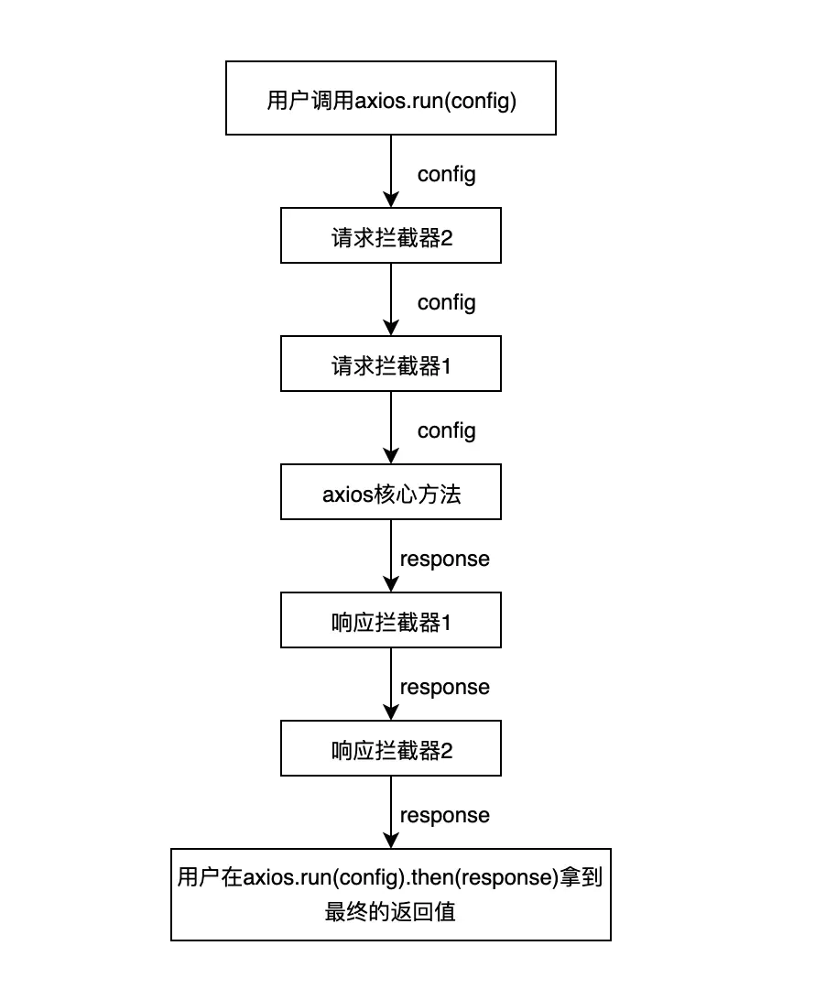

# 前言

前端中的库很多，开发这些库的作者会尽可能的覆盖到大家在业务中千奇百怪的需求，但是总有无法预料到的，所以优秀的库就需要提供一种机制，让开发者可以干预插件中间的一些环节，从而完成自己的一些需求。

本文将从 koa、axios、vuex 和 redux 的实现来教你怎么编写属于自己的插件机制。

# axios

首先我们模拟一个简单的 axios，这里不涉及请求的逻辑，只是简单的返回一个 Promise，可以通过 config 中的 error 参数控制 Promise 的状态。

axios 的拦截器机制用流程图来表示其实就是这样的：



```js
const axios = config => {
  if (config.error) {
    return Promise.reject({
      error: "error in axios"
    });
  } else {
    return Promise.resolve({
      ...config,
      result: config.result
    });
  }
};
```

如果传入的 config 中有 error 参数，就返回一个 rejected 的 promise，反之则返回 resolved 的 promise。

先简单看一下 axios 官方提供的拦截器示例：

```js
axios.interceptors.request.use(
  function(config) {
    // 在发送请求之前做些什么
    return config;
  },
  function(error) {
    // 对请求错误做些什么
    return Promise.reject(error);
  }
);

// 添加响应拦截器
axios.interceptors.response.use(
  function(response) {
    // 对响应数据做点什么
    return response;
  },
  function(error) {
    // 对响应错误做点什么
    return Promise.reject(error);
  }
);
```

可以看出，不管是 request 还是 response 的拦截请求，都会接受两个函数作为参数，一个是用来处理正常流程，一个是处理失败流程，这让人想到了什么？

没错，promise.then 接受的同样也是这两个参数。

axios 内部正是利用了 promise 的这个机制，把 use 传入的两个函数作为一个 intercetpor，每一个 intercetpor 都有 resolved 和 rejected 两个方法。

```js
// 把
axios.interceptors.response.use(func1, func2)

// 在内部存储为
{
    resolved: func1,
    rejected: func2
}
```

接下来简单实现一下，这里我们简化一下，把 axios.interceptor.request.use 转为 axios.useRequestInterceptor 来简单实现：

```js
// 先构造一个对象 存放拦截器
axios.interceptors = {
  request: [],
  response: []
};

// 注册请求拦截器
axios.useRequestInterceptor = (resolved, rejected) => {
  axios.interceptors.request.push({ resolved, rejected });
};

// 注册响应拦截器
axios.useResponseInterceptor = (resolved, rejected) => {
  axios.interceptors.response.push({ resolved, rejected });
};

// 运行拦截器
axios.run = config => {
  const chain = [
    {
      resolved: axios,
      rejected: undefined
    }
  ];

  // 把请求拦截器往数组头部推
  axios.interceptors.request.forEach(interceptor => {
    chain.unshift(interceptor);
  });

  // 把响应拦截器往数组尾部推
  axios.interceptors.response.forEach(interceptor => {
    chain.push(interceptor);
  });

  // 把 config 也包装成一个 promise
  let promise = Promise.resolve(config);

  // 暴力 while 循环解忧愁
  // 利用 promise.then 的能力递归执行所有的拦截器
  while (chain.length) {
    const { resolved, rejected } = chain.shift();
    promise = promise.then(resolved, rejected);
  }

  // 最后暴露给用户的就是响应拦截器处理过后的 promise
  return promise;
};
```

从 axios.run 这个函数看运行时的机制，首先构造一个 chain 作为 promise 链，并且把正常的请求也就是我们的请求参数 axios 也构造为一个拦截器的结构，接下来

- 把 request 的 interceptor 给 unshift 到 chain 顶部
- 把 response 的 interceptor 给 push 到 chain 尾部

```js
// 请求拦截器1
axios.useRequestInterceptor(resolved1, rejected1);
// 请求拦截器2
axios.useRequestInterceptor(resolved2, rejected2);
// 响应拦截器1
axios.useResponseInterceptor(resolved1, rejected1);
// 响应拦截器
axios.useResponseInterceptor(resolved2, rejected2);
```

这样子构造出来的 promise 链就是这样的 chain 结构：

```js
[
    请求拦截器2，// ↓config
    请求拦截器1，// ↓config
    axios请求核心方法, // ↓response
    响应拦截器1, // ↓response
    响应拦截器// ↓response
]
```

有了这个 chain 之后，只需要一句简短的代码：

```js
let promise = Promise.resolve(config);

while (chain.length) {
  const { resolved, rejected } = chain.shift();
  promise = promise.then(resolved, rejected);
}

return promise;
```

promise 就会把这个链从上而下的执行了。

以这样的一段测试代码为例：

```js
axios.useRequestInterceptor(config => {
  return {
    ...config,
    extraParams1: "extraParams1"
  };
});

axios.useRequestInterceptor(config => {
  return {
    ...config,
    extraParams2: "extraParams2"
  };
});

axios.useResponseInterceptor(
  resp => {
    const {
      extraParams1,
      extraParams2,
      result: { code, message }
    } = resp;
    return `${extraParams1} ${extraParams2} ${message}`;
  },
  error => {
    console.log("error", error);
  }
);
```

1. 成功的调用

    在成功的调用下输出 `result1: extraParams1 extraParams2 message1`
    ```js
    (async function() {
      const result = await axios.run({
        message: "message1"
      });
      console.log("result1: ", result);
    })();
    ```
2. 失败的调用

    ```js
    (async function() {
      const result = await axios.run({
        error: true
      });
      console.log("result3: ", result);
    })();
    ```

在失败的调用下，则进入响应拦截器的 rejected 分支：

首先打印出拦截器定义的错误日志：

```
error { error: 'error in axios' }
```

然后由于失败的拦截器

```js
error => {
  console.log('error', error)
},
```

没有返回任何东西，打印出 `result3: undefined`

可以看出，axios 的拦截器是非常灵活的，可以在请求阶段任意的修改 config，也可以在响应阶段对 response 做各种处理，这也是因为用户对于请求数据的需求就是非常灵活的，没有必要干涉用户的自由度。

// TODO 插件机制、拦截器、中间件：https://juejin.cn/post/6844904039608500237
