## 无序链表的顺序查找

### 特点

> - 在含有N对键值的基于（无序）链表的符号表中，未命中的查找和插入操作都需要N次比较。命中的查找在最坏情况下需要N次比较。特别的，向一个空表中插入N个不同的键需要$~N^2/2$次比较

### 实现

```java
public class SequentialSearchST<Key,Value>{
    private Node first;
    private class Node{
        Key key;
        Value val;
        Node next;
        public Node(Key key,Value val,Node next){
            this.key=key;
            this.val=val;
            this.next=next;
        }
    }
    public Value get(Key key){
        for(Node x=first;x!=null;x=x.next){
            if(key.equals(x.key)){
                return x.val;
            }
        }
        return null;
    }
    public void put(Key key,Value val){
        for(Node x=first;x!=null;x=x.next){
            if(key.equals(x.key)){
                x.val=val;
                return;
            }
        }
        first=new Node(key,val,first);
    }
}
```

## 有序数组的二分查找

### 特点

> - 在N个键的有序数组中进行二分查找最多需要(lgN+1)次比较（无论是否成功）。
- 向大小为N的有序数组中插入一个新的元素在最坏情况下需要访问~2N次数组，因此向一个空符号表中插入N个元素在最坏情况下需要访问$~N^2$次数组

### 实现

```java
public class BinarySearchST<Key extends Comparable<Key>, Value>{
    private Key[] keys;
    private Value[] vals;
    private int N;
    public BinarySearchST(int capacity){
        keys=(Key[])new Comparable[capacity];
        vals=(Value[])new Object[capacity];
    }
    public int size(){
        return N;
    }
    public Value get(Key key){
        if(isEmpty()) return null;
        int i=rank(key);
        if(i<N&&keys[i].compareTo(key)==0) return vals[i];
        else return null;
    }
    public int rank(Key key){
        int lo=0,hi=N-1;
        while(lo<=hi){
            int mid=lo+(hi-lo)/2;
            int cmp=key.compareTo(keys[mid]);
            if(cmp<0) hi=mid-1;
            else if(cmp>0) lo=mid+1;
            else return mid;
        }
        return lo;
    }
    public void put(Key key,Value val){
        int i=rank(key);
        if(i<N&&keys[i].compareTo(key)==0){
            vals[i]=val; return;
        }
        for(int j=N;j>i;j--){
            keys[j]=keys[j-1];
            vals[j]=vals[j-1];
        }
        keys[i]=key; vals[i]=val;
        N++;
    }
    public Iterable<Key> keys(Key lo,Key hi){
        Queue<Key> q=new Queue<Key>();
        for(int i=rank(lo);i<rank(hi);i++){
            q.enqueue(keys[i])
        }
        if(contains(hi)){
            q.enqueue(keys[rank(hi)]);
        }
    }
}
```

## 预览

### 比较

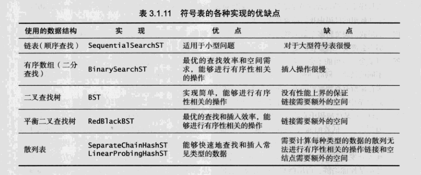

## 二叉查找树

### 思路

> 使用每个结点含有两个链接的二叉查找树高效实现符号表。

### 特点


> - 在由N个随机键构造的二叉查找树中，查找命中平均所需的比较次数为~2lnN（约1.39lgN）。
- 在由N个随机键构造的二叉查找树中插入和查找未命中平均所需的比较次数为~2lnN（约1.39lgN）。
- 虽然查找命中比二分查找高约39%，但是插入操作访问数组的次数是线性级别的。
- 在一颗二叉查找树中，所有操作在最坏情况下所需的时间都和树的高度成正比。


### 实现

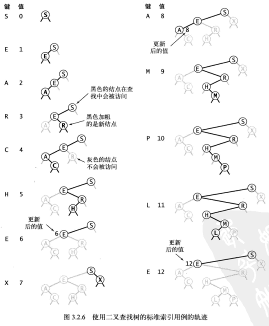

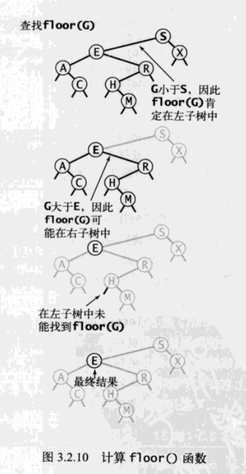

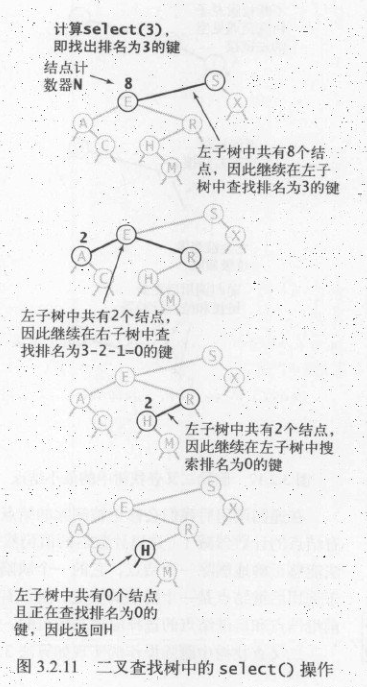

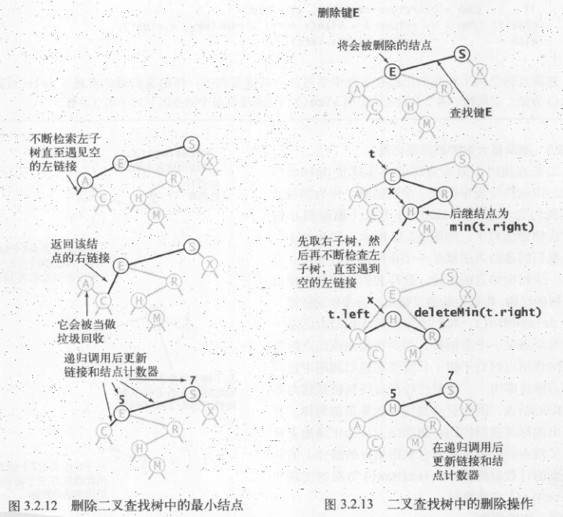

```java
public class BST<Key extends Compareable<Key>,Value>{
    private Node root;
    private class Node{
        private Key key;
        private Value val;
        private Node left,right;
        int N;
        public Node(Key key,Value val,int N){
            this.key=key;
            this.val=val;
            this.N=N;
        }
    }
    public int size(){
        return size(root);
    }
    private int size(Node x){
        if(x==null) return 0;
        else return x.N;
    }
    public Value get(Key key){
        return get(root,key);
    }
    private Value get(Node x,Key key){
        if(x==null) return null;
        int cmp=key.compareTo(x.key);
        if(cmp>0) return get(x.right,key);
        else return get(x.left,key);
        else return x.val;
    }
    public void put(Key key,Value val){
        // 查找key，找到并更新它的值，否则创建一个新结点。
        root=put(root,key,val);
    }
    private Node put(Node x,Key key,Value val){
        //如果key存在以x为根结点的子树中则更新它的值；
        //否则将以key和val为键值对的新结点插入到该子树中。
        if(x==null) return new Node(key,val,1);
        int cmp=key.compareTo(x.key);
        if(cmp<0) x.left=put(x.left,key,val);
        else if(cmp>0) x.right=put(x.right,key,val);
        else x.val=val;
        x.N=size(x.left)+size(x.right)+1;
        return x;
    }
    public Key min(){
        return min(root).key;
    }
    private Node min(Node x){
        if(x.left==null) return x;
        return min(x.left);
    }
    public Key floor(Key key){
        Node x=floor(root,key);
        if(x==null) return null;
        return x.key;
    }
    private Node floor(Node x,Key key){
        /**
        如果 key 小于根节点的 key，那么小于等于 key 的最大键节点一定在左子树中；如果 key 大于根节点的 key，只有当根节点右子树中存在小于等于 key 的节点，小于等于 key 的最大键节点才在右子树中，否则根节点就是小于等于 key 的最大键节点。
        **/
        if(x==null) return null;
        int cmp=key.compareTo(x.key);
        if(cmp==0) return x;
        if(cmp<0) return floor(x.left,key);
        Node t=floor(x.right,key);
        if(t!=null) return t;
        else return x;
    }
    public Key select(int k){
        return select(root,k).key;
    }
    private Node select(Node x,int k){
        // 返回排名为k的结点
        if(x==null) return null;
        int t=size(x.left);
        if(t>k) return select(x.left,k);
        if(t==k) return x;
        if(t<k) return select(x.right,k-t-1);
    }
    public int rank(Key key){
        return rank(key,root);
    }
    private int rank(Key key,Node x){
        // 返回以x为根结点的子树中小于x的key的数量
        if(x==null) return 0;
        int cmp=key.compareTo(x.key);
        if(cmp==0) return size(x.left);
        else if(cmp<0) return rank(key,x.left);
        else return rank(key,x.right)+size(x.left)+1;
    }
    public void deleteMin(){
        root=deleteMin(root);
    }
    private Node deleteMin(Node x){
        // 令指向最小节点的链接指向最小节点的右子树。
        if(x.left==null) return x.right;
        x.left=deleteMin(x.left);
        x.N=size(x.left)+size(x.right)+1;
        return x;
    }
    public delete(Key key){
        root=delete(root,key);
    }
    private Node delete(Node x,Key key){
        // 如果待删除的节点只有一个子树，那么只需要让指向待// 删除节点的链接指向唯一的子树即可；否则，让右子树// 的最小节点替换该节点。
        if(x==null) return null;
        int cmp=key.compareTo(x.key);
        if(cmp<0) x.left=delete(x.left,key);
        else if(cmp>0) x.right=delete(x.right,key);
        else {
            if(x.right==null) return x.left;
            if(x.left==null) return x.right;
            Node t=x;
            x=min(t.right);
            x.right=deleteMin(t.right);
            x.left=t.left;
        }
        x.N=size(x.left)+size(x.right)+1;
        return x;
    }
    public Iterable<Key> keys(){
        return keys(min(),max());
    }
    public Iterable<Key> keys(Key lo,Key hi){
        Queue<Key> queue=new Queue<Key>();
        keys(root,queue,lo,hi);
        return queue;
    }
    private void keys(Node x,Queue<Key> queue,Key lo,Key hi){
        // 利用二叉查找树中序遍历的结果为有序序列的特点。
        if(x==null) return;
        int cmplo=lo.compareTo(x.key);
        int cmphi=hi.compareTo(x.key);
        // 查找左子树
        if(cmplo<0) keys(x.left,queue,lo,hi);
        // 查找根结点
        if(cmplo<=0&&cmphi>=0) queue.enqueue(x.key);
        // 查找右子树
        if(cmphi>0) keys(x.right,queue,lo,hi);
    }
}
```

## 平衡查找树

### 思路

>保证所有查找都能在~lgN次比较内结束，为了保证树的平衡性，我们允许树中的一个结点保存多个键。

### 特点

> - 一颗完美平衡的 2-3 查找树的所有空链接到根节点的距离应该是相同的。
- 2-3 查找树插入操作的变换都是局部的，除了相关的节点和链接之外不必修改或者检查树的其它部分，而这些局部变换不会影响树的全局有序性和平衡性。
- 2-3 查找树的查找和插入操作复杂度和插入顺序 无关 ，在最坏的情况下查找和插入操作访问的节点必然不超过 logN 个，含有 10 亿个节点的 2-3 查找树最多只需要访问 30 个节点就能进行任意的查找和插入操作。
- 在一颗大小为N的2-3树中，查找和插入操作访问的结点必然不超过lgN个。


### 实现

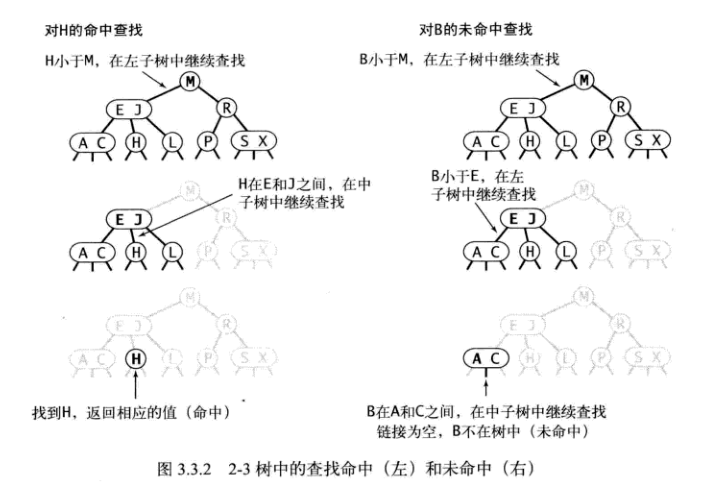

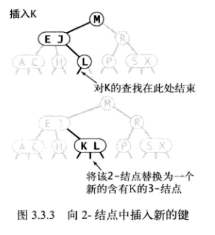

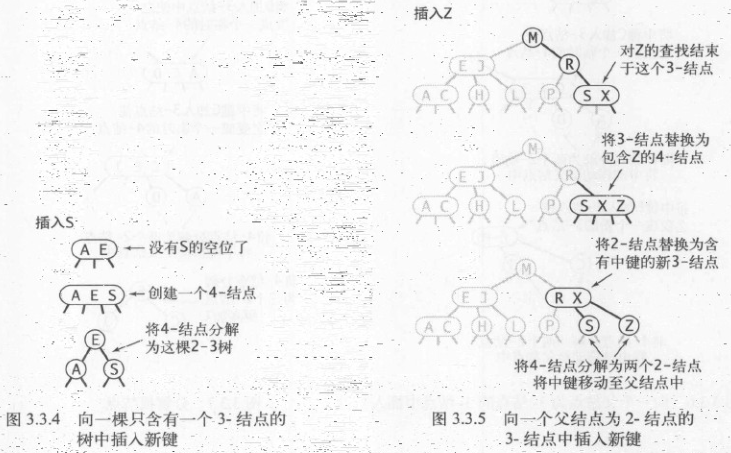

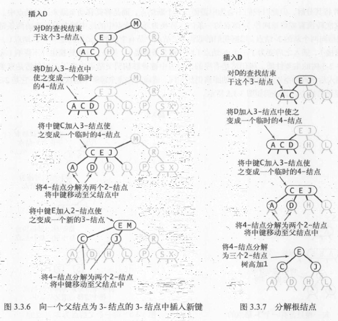

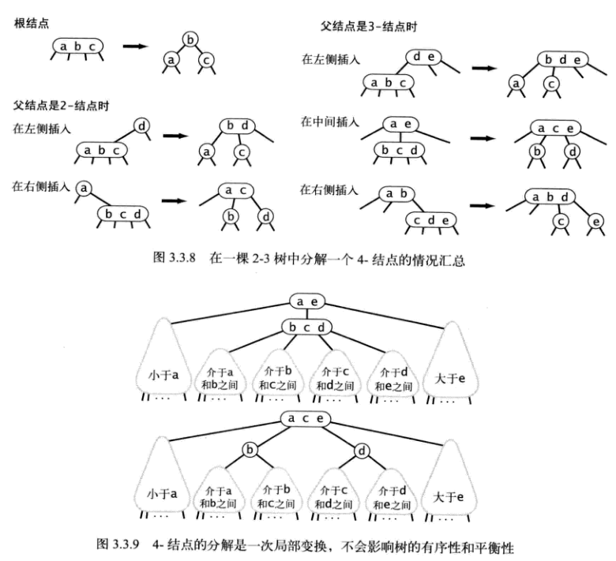

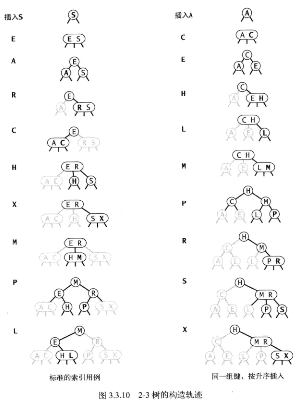

## 红黑二叉查找树

### 思路

> 2-3 查找树需要用到 2- 节点和 3- 节点，红黑树使用红链接来实现 3- 节点。指向一个节点的链接颜色如果为红色，那么这个节点和上层节点表示的是一个 3- 节点，而黑色则是普通链接。

### 特点

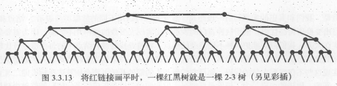

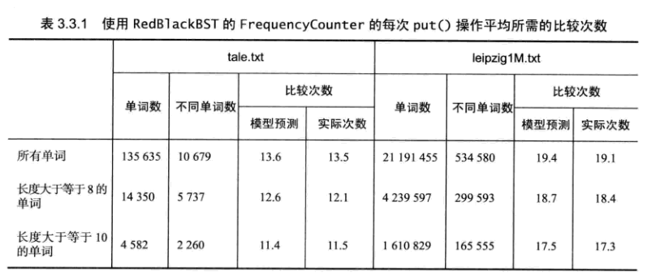

> - 红链接都为左链接；
- 完美黑色平衡，即任意空链接到根节点的路径上的黑链接数量相同。
- 没有任何一个结点同时和两条红链接相连。
- 画红黑树时可以将红链接画平。
- 所有基于红黑树的符号表的实现都能保证操作的运行时间为对数级别（范围查找除外，它所需的时间和返回的键的数量成正比）。
- 一颗大小为N的红黑树的高度不会超过2lgN；
- 一颗大小为N的红黑树中，根结点到任意结点的平均路径长度为~1.00lgN。


### 红黑树的结点表示


```java
public class RedBlackBST<Key extends Comparable<Key>,Value>{
    private Node root;
    private static final boolean RED = true;
    private static final boolean BLACK = false;

    private class Node{
        Key key;
        Value val;
        int N;
        boolean color;
        Node left,right;
    }
    
    private boolean isRed(Node x){
        if(x==null) return false;
        return x.color == RED;
    }
}
```

### 左旋转

>因为合法的红链接都为左链接，如果出现右链接为红链接，那么就需要进行左旋转操作。

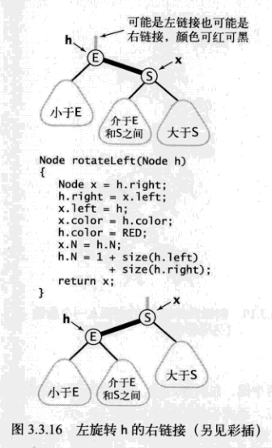

```java
Node rotateLeft(Node h){
    Node x=h.right;
    h.right=x.left;
    x.left=h;
    x.color=h.color;
    h.color=RED;
    x.N=h.N;
    h.N=1+size(h.left)+size(h.right);
    return x;
}
```

### 右旋转

>进行右旋转是为了转换两个连续的左红链接，这会在之后的插入过程中探讨。

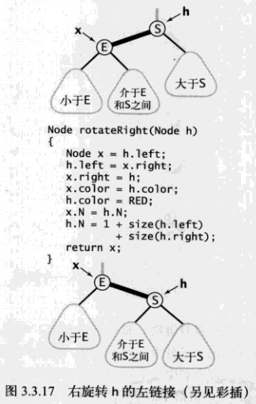

```java
Node rotateRight(Node h){
    Node x=h.left;
    h.left=x.right;
    x.right=h;
    x.color=h.color;
    h.color=RED;
    x.N=h.N;
    h.N=size(h.left)+size(h.right)+1;
    return x;
}
```

### 颜色转换

> 一个4-节点在红黑树中表现为一个结点的左右子节点都是红色的。分裂4-节点除了需要将子节点的颜色由红变黑之外，同时需要将父节点的颜色由黑变红，从2-3树的角度来看就是讲中间结点上移到上层结点。

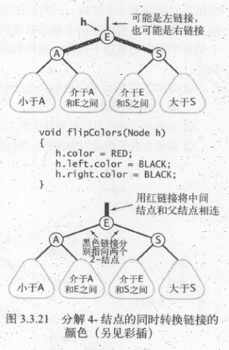

```java
void filpColors(Node h){
    h.color=RED;
    h.left.color=BLACK;
    h.right.color=BlACK;
}
```

### 插入

> 先将一个节点按二叉查找树的方法插入到正确位置，然后再进行如下的颜色操作：
1. 如果右子节点是红色的而左子节点是黑色的，进行左旋转；
2. 如果左子节点是红色的且它的左子节点也是红色的，进行右旋转；
3. 如果左右子节点都是红色的，进行颜色转换。

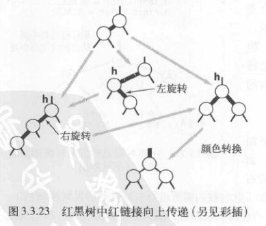

```java
public class RedBlackBST<Key extends Comparable<Key>,Value>{
    private Node root;
    private class Node;
    private boolean isRed(Node h);
    private Node rotateLeft(Node h);
    private Node rotateRight(Node h);
    private Node filpColors(Node h);

    // 见二叉查找树中的方法
    private int size();
    public void put(Key key,Value val){
        root=put(root,key,val);
        root.color=BLACK;
    }
    private Node put(Node h,Key key,Value val){
        if(h==null) return new Node(key,val,1,RED);
        int cmp=key.compareTo(h.key);
        if(cmp<0) h.left=put(h.left,key,val);
        else if(cmp>0) h.right=put(h.right,key,val);
        else h.val=val;
        if(isRed(h.right)&&!isRed(h.left)) h=rotateLeft(h);
        if(isRed(h.left)&&isRed(h.left.left)) h=rotateRight(h);
        if(isRed(h.right)&&isRed(h.left)) h=filpColors(h);
        h.N=size(h.left)+size(h.right)+1;
        return h;
    }
}
```

### 删除最小键

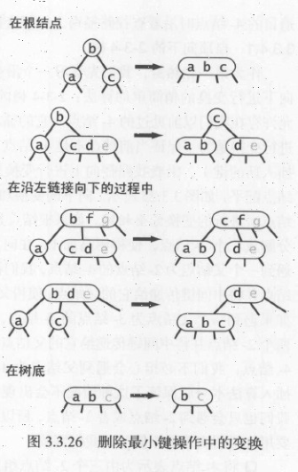

>如果最小键在一个 2- 节点中，那么删除该键会留下一个空链接，就破坏了平衡性，因此要确保最小键不在 2- 节点中。将 2- 节点转换成 3- 节点或者 4- 节点有两种方法，一种是向上层节点拿一个 key，一种是向兄弟节点拿一个 key。如果上层节点是 2- 节点，那么就没办法从上层节点拿 key 了，因此要保证删除路径上的所有节点都不是 2- 节点。在向下删除的过程中，保证以下情况之一成立：

1. 如果当前节点的左子节点不是 2- 节点，完成；
2. 如果当前节点的左子节点是 2- 节点而它的兄弟节点不是 2- 节点，向兄弟节点拿一个 key 过来；
3. 如果当前节点的左子节点和它的兄弟节点都是 2- 节点，将左子节点、父节点中的最小键和最近的兄弟节点合并为一个 4- 节点。

## 总结

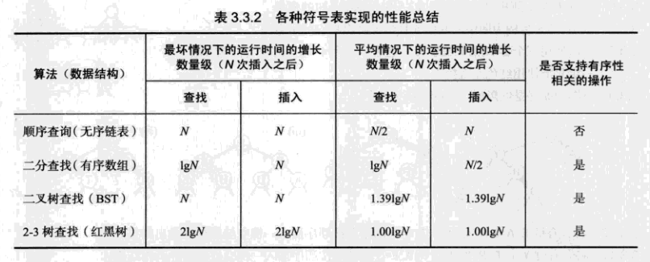

## 散列表

### 特点

>散列表类似于数组，可以把散列表的散列值看成数组的索引值。访问散列表和访问数组元素一样快速，它可以在常数时间内实现查找和插入的符号表。
由于无法通过散列值知道键的大小关系，因此散列表无法实现有序性操作。

### 散列函数

> - 对于一个大小为 M 的散列表，散列函数能够把任意键转换为 [0, M-1] 内的正整数，该正整数即为 hash值。
- 散列表有冲突的存在，也就是两个不同的键可能有相同的 hash 值。
- 散列函数应该满足以下三个条件：
 1. 一致性：相等的键应当有相等的 hash 值，两个键相等表示调用 equals() 返回的值相等。
 2. 高效性：计算应当简便，有必要的话可以把 hash 值缓存起来，在调用 hash 函数时直接返回。
 3. 均匀性：所有键的 hash 值应当均匀地分布到 [0, M-1] 之间，这个条件至关重要，直接影响到散列表的性能。

> - 可以将整数散列到 [0, M-1] 之间，例如一个正整数 k，计算 k%M 既可得到一个 [0, M-1] 之间的 hash 值。注意 M 必须是一个素数，否则无法利用键包含的所有信息。例如 M 为 10k，那么只能利用键的后 k 位。
- 对于其它数，可以将其转换成整数的形式，然后利用除留余数法。例如对于浮点数，可以将其表示成二进制形式，然后使用二进制形式的整数值进行除留余数法。
- 对于有多部分组合的键，每部分都需要计算 hash 值，并且最后合并时需要让每部分 hash 值都具有同等重要的地位。可以将该键看成 R 进制的整数，键中每部分都具有不同的权值。

- 例如，字符串的散列函数实现如下:
    ```java
    int hash = 0;
    for(int i = 0; i < s.length(); i++)
        hash = (R * hash + s.charAt(i)) % M;
    ```

- 再比如，拥有多个成员的自定义类的哈希函数如下,R 的值不是很重要，通常取 31。
    ```java
    int hash = (((day * R + month) % M) * R + year) % M;
    ```

- Java 中的 hashCode() 实现了 hash 函数，但是默认使用对象的内存地址值。在使用 hashCode() 函数时，应当结合除留余数法来使用。因为内存地址是 32 位整数，我们只需要 31 位的非负整数，因此应当屏蔽符号位之后再使用除留余数法。
    ```java
    int hash = (x.hashCode() & 0x7fffffff) % M;
    ```
- 使用 Java 自带的 HashMap 等自带的哈希表实现时，只需要去实现 Key 类型的 hashCode() 函数即可。Java 规定 hashCode() 能够将键均匀分布于所有的 32 位整数，Java 中的 String、Integer 等对象的 hashCode() 都能实现这一点。以下展示了自定义类型如何实现 hashCode()。
    ```java
    public class Transaction{
        private final String who;
        private final Date when;
        private final double amount;

        public int hashCode(){
            int hash = 17;
            hash = 31 * hash + who.hashCode();
            hash = 31 * hash + when.hashCode();
            hash = 31 * hash + ((Double) amount).hashCode();
            return hash;
        }
    }
    ```

### 基于拉链法的散列表


