# Chrome 架构

在开始之前，我们一起看下，Chrome 打开一个页面需要启动多少进程？你可以点击 Chrome 浏览器右上角的“选项”菜单，选择“更多工具”子菜单，点击“任务管理器”，这将打开 Chrome 的任务管理器的窗口，如下图

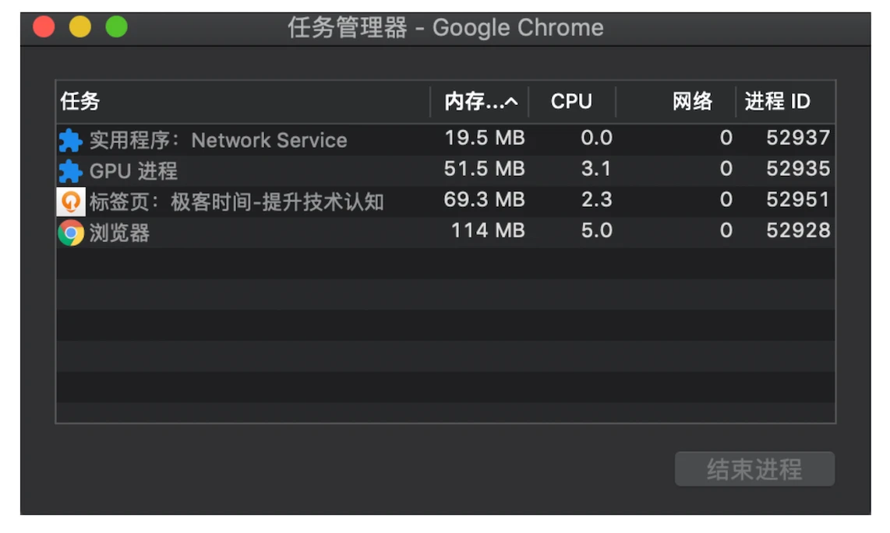

和 Windows 任务管理器一样，Chrome 任务管理器也是用来展示运行中 Chrome 使用的进程信息的。从图中可以看到，Chrome 启动了 4 个进程，你也许会好奇，只是打开了 1 个页面，为什么要启动这么多进程呢？

在解答这个问题之前，我们需要了解一下进程的概念，不过由于好多人容易把进程和线程的概念混淆，从而影响后续其他概念的理解，所以这里我就将这两个概念以及它们之间的关系一并为你讲解下。

## 进程和线程

不过，在介绍进程和线程之前，我需要先讲解下什么是并行处理，因为如果你理解了并行处理的概念，那么再理解进程和线程之间的关系就会变得轻松许多。

### 什么是并行处理

计算机中的并行处理就是同一时刻处理多个任务，比如我们要计算下面这三个表达式的值，并显示出结果

```
A = 1+2
B = 20/5
C = 7*8
```

在编写代码的时候，我们可以把这个过程拆分为四个任务：

- 任务 1 是计算 A=1+2；
- 任务 2 是计算 B=20/5；
- 任务 3 是计算 C=7\*8；
- 任务 4 是显示最后计算的结果

正常情况下程序可以使用单线程来处理，也就是分四步按照顺序分别执行这四个任务。

如果采用多线程，会怎么样呢？我们只需分“两步走”：第一步，使用三个线程同时执行前三个任务；第二步，再执行第四个显示任务。

通过对比分析，你会发现用单线程执行需要四步，而使用多线程只需要两步。因此，使用并行处理能大大提升性能

### 线程 VS 进程

多线程可以并行处理任务，但是线程是不能单独存在的，它是由进程来启动和管理的。那什么又是进程呢？

一个进程就是一个程序的运行实例。详细解释就是，启动一个程序的时候，操作系统会为该程序创建一块内存，用来存放代码、运行中的数据和一个执行任务的主线程，我们把这样的一个运行环境叫进程。

为了让你更好地理解上述计算过程，我画了下面这张对比图

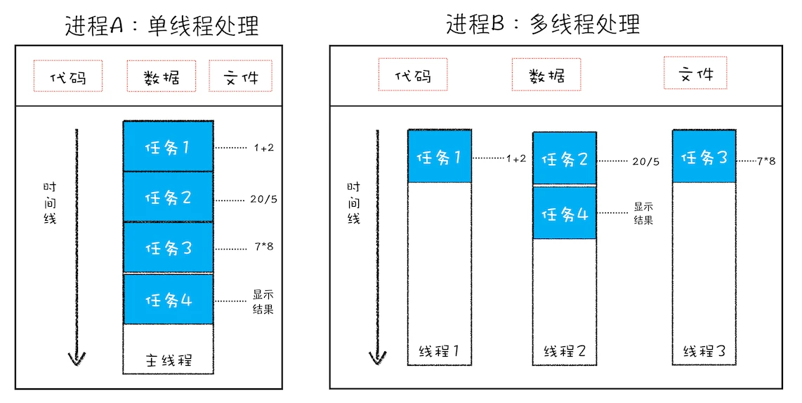

从图中可以看到，线程是依附于进程的，而进程中使用多线程并行处理能提升运算效率。

总结来说，进程和线程之间的关系有以下 4 个特点

1. 进程中的任意一线程执行出错，都会导致整个进程的崩溃。

   我们可以模拟以下场景：

   ```
   A = 1+2
   B = 20/0
   C = 7*8
   ```

   我把上述三个表达式稍作修改，在计算 B 的值的时候，我把表达式的分母改成 0，当线程执行到 B = 20/0 时，由于分母为 0，线程会执行出错，这样就会导致整个进程的崩溃，当然另外两个线程执行的结果也没有了

2. 线程之间共享进程中的数据。

   如下图所示，线程之间可以对进程的公共数据进行读写操作。

   

   从上图可以看出，线程 1、线程 2、线程 3 分别把执行的结果写入 A、B、C 中，然后线程 2 继续从 A、B、C 中读取数据，用来显示执行结果。

3. 当一个进程关闭之后，操作系统会回收进程所占用的内存。

   当一个进程退出时，操作系统会回收该进程所申请的所有资源；即使其中任意线程因为操作不当导致内存泄漏，当进程退出时，这些内存也会被正确回收。

   比如之前的 IE 浏览器，支持很多插件，而这些插件很容易导致内存泄漏，这意味着只要浏览器开着，内存占用就有可能会越来越多，但是当关闭浏览器进程时，这些内存就都会被系统回收掉

4. 进程之间的内容相互隔离。

   进程隔离是为保护操作系统中进程互不干扰的技术，每一个进程只能访问自己占有的数据，也就避免出现进程 A 写入数据到进程 B 的情况。正是因为进程之间的数据是严格隔离的，所以一个进程如果崩溃了，或者挂起了，是不会影响到其他进程的。如果进程之间需要进行数据的通信，这时候就需要使用用于进程间通信（IPC）的机制了。

## 单进程浏览器时代

在了解了进程和线程之后，我们再来一起看下单进程浏览器的架构。顾名思义，单进程浏览器是指浏览器的所有功能模块都是运行在同一个进程里，这些模块包含了网络、插件、JavaScript 运行环境、渲染引擎和页面等。其实早在 2007 年之前，市面上浏览器都是单进程的。单进程浏览器的架构如下图所示

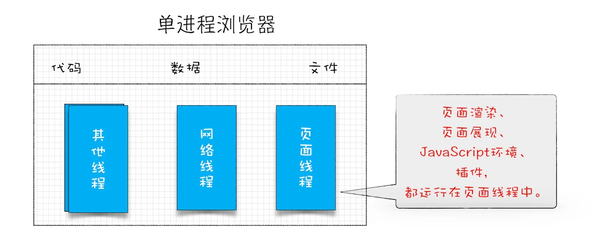

如此多的功能模块运行在一个进程里，是导致单进程浏览器不稳定、不流畅和不安全的一个主要因素。下面我就来一一分析下出现这些问题的原因

### 不稳定

早期浏览器需要借助于插件来实现诸如 Web 视频、Web 游戏等各种强大的功能，但是插件是最容易出问题的模块，并且还运行在浏览器进程之中，所以一个插件的意外崩溃会引起整个浏览器的崩溃。

除了插件之外，渲染引擎模块也是不稳定的，通常一些复杂的 JavaScript 代码就有可能引起渲染引擎模块的崩溃。和插件一样，渲染引擎的崩溃也会导致整个浏览器的崩溃

### 不流畅

从上面的“单进程浏览器架构示意图”可以看出，所有页面的渲染模块、JavaScript 执行环境以及插件都是运行在同一个线程中的，这就意味着同一时刻只能有一个模块可以执行。

比如，下面这个无限循环的脚本：

```js
function freeze() {
  while (1) {
    console.log("freeze");
  }
}
freeze();
```

如果让这个脚本运行在一个单进程浏览器的页面里，你感觉会发生什么？

因为这个脚本是无限循环的，所以当其执行时，它会独占整个线程，这样导致其他运行在该线程中的模块就没有机会被执行。因为浏览器中所有的页面都运行在该线程中，所以这些页面都没有机会去执行任务，这样就会导致整个浏览器失去响应，变卡顿。这块内容要继续往深的地方讲就到页面的事件循环系统了，具体相关内容会在后面的模块中为你深入讲解。

除了上述脚本或者插件会让单进程浏览器变卡顿外，页面的内存泄漏也是单进程变慢的一个重要原因。通常浏览器的内核都是非常复杂的，运行一个复杂点的页面再关闭页面，会存在内存不能完全回收的情况，这样导致的问题是使用时间越长，内存占用越高，浏览器会变得越慢。

### 不安全

这里依然可以从插件和页面脚本两个方面来解释该原因。

插件可以使用 C/C++ 等代码编写，通过插件可以获取到操作系统的任意资源，当你在页面运行一个插件时也就意味着这个插件能完全操作你的电脑。如果是个恶意插件，那么它就可以释放病毒、窃取你的账号密码，引发安全性问题。

至于页面脚本，它可以通过浏览器的漏洞来获取系统权限，这些脚本获取系统权限之后也可以对你的电脑做一些恶意的事情，同样也会引发安全问题。

以上这些就是当时浏览器的特点，不稳定，不流畅，而且不安全。这是一段不堪回首的过去，也许你没有经历过，不过你可以想象一下这样的场景：当你正在用浏览器打开多个页面时，突然某个页面崩溃了或者失去响应，随之而来的是整个浏览器的崩溃或者无响应，然后你发现你给老板写的邮件页面也随之消失了，这时你的心情会不会和页面一样崩溃呢

## 多进程浏览器时代

好在现代浏览器已经解决了这些问题，是如何解决的呢？这就得聊聊我们这个“多进程浏览器时代”了

### 早期多进程架构

你可以先看看下面这张图，这是 2008 年 Chrome 发布时的进程架构。

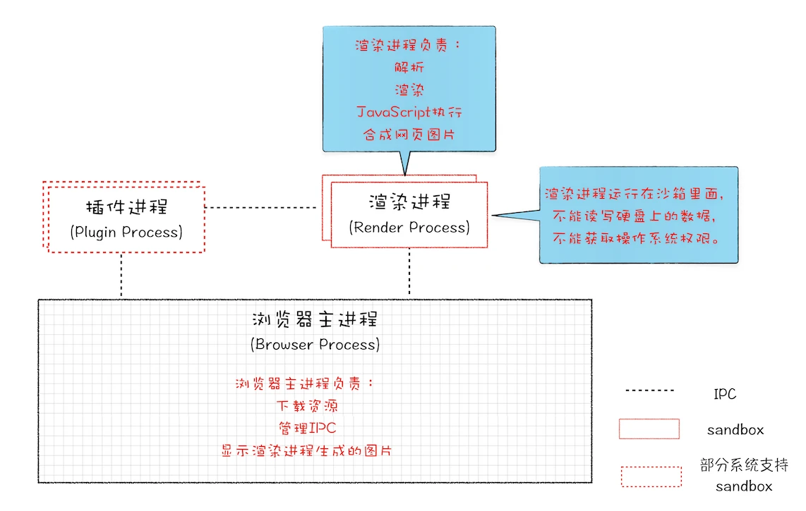

从图中可以看出，Chrome 的页面是运行在单独的渲染进程中的，同时页面里的插件也是运行在单独的插件进程之中，而进程之间是通过 IPC 机制进行通信（如图中虚线部分）。

**我们先看看如何解决不稳定的问题**。由于进程是相互隔离的，所以当一个页面或者插件崩溃时，影响到的仅仅是当前的页面进程或者插件进程，并不会影响到浏览器和其他页面，这就完美地解决了页面或者插件的崩溃会导致整个浏览器崩溃，也就是不稳定的问题。

**接下来再来看看不流畅的问题是如何解决的**。同样，JavaScript 也是运行在渲染进程中的，所以即使 JavaScript 阻塞了渲染进程，影响到的也只是当前的渲染页面，而并不会影响浏览器和其他页面，因为其他页面的脚本是运行在它们自己的渲染进程中的。所以当我们再在 Chrome 中运行上面那个死循环的脚本时，没有响应的仅仅是当前的页面。

对于内存泄漏的解决方法那就更简单了，因为当关闭一个页面时，整个渲染进程也会被关闭，之后该进程所占用的内存都会被系统回收，这样就轻松解决了浏览器页面的内存泄漏问题。

**最后我们再来看看上面的两个安全问题是怎么解决的**。采用多进程架构的额外好处是可以使用安全沙箱，你可以把沙箱看成是操作系统给进程上了一把锁，沙箱里面的程序可以运行，但是不能在你的硬盘上写入任何数据，也不能在敏感位置读取任何数据，例如你的文档和桌面。Chrome 把插件进程和渲染进程锁在沙箱里面，这样即使在渲染进程或者插件进程里面执行了恶意程序，恶意程序也无法突破沙箱去获取系统权限。

好了，分析完早期的 Chrome 浏览器后，相信你已经了解了浏览器采用多进程架构的必要性

### 目前多进程架构

不过 Chrome 的发展是滚滚向前的，相较之前，目前的架构又有了很多新的变化。我们先看看最新的 Chrome 进程架构，你可以参考下图

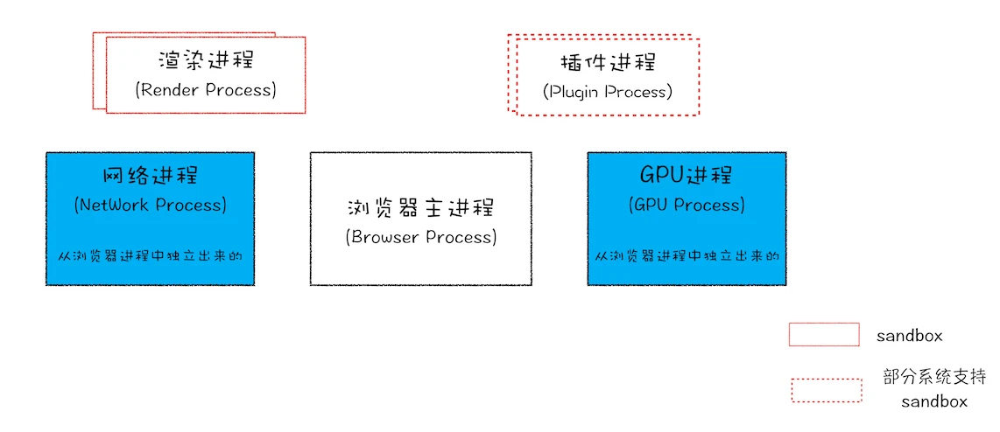

从图中可以看出，最新的 Chrome 浏览器包括：1 个浏览器（Browser）主进程、1 个 GPU 进程、1 个网络（NetWork）进程、多个渲染进程和多个插件进程

下面我们来逐个分析下这几个进程的功能。

- **浏览器进程**。主要负责界面显示、用户交互、子进程管理，同时提供存储等功能。
- **渲染进程**。核心任务是将 HTML、CSS 和 JavaScript 转换为用户可以与之交互的网页，排版引擎 Blink 和 JavaScript 引擎 V8 都是运行在该进程中，默认情况下，Chrome 会为每个 Tab 标签创建一个渲染进程。出于安全考虑，渲染进程都是运行在沙箱模式下。
- **GPU 进程**。其实，Chrome 刚开始发布的时候是没有 GPU 进程的。而 GPU 的使用初衷是为了实现 3D CSS 的效果，只是随后网页、Chrome 的 UI 界面都选择采用 GPU 来绘制，这使得 GPU 成为浏览器普遍的需求。最后，Chrome 在其多进程架构上也引入了 GPU 进程。
- **网络进程**。主要负责页面的网络资源加载，之前是作为一个模块运行在浏览器进程里面的，直至最近才独立出来，成为一个单独的进程。
- **插件进程**。主要是负责插件的运行，因插件易崩溃，所以需要通过插件进程来隔离，以保证插件进程崩溃不会对浏览器和页面造成影响

讲到这里，现在你应该就可以回答文章开头提到的问题了：仅仅打开了 1 个页面，为什么有 4 个进程？因为打开 1 个页面至少需要 1 个网络进程、1 个浏览器进程、1 个 GPU 进程以及 1 个渲染进程，共 4 个；如果打开的页面有运行插件的话，还需要再加上 1 个插件进程。

不过凡事都有两面性，虽然多进程模型提升了浏览器的稳定性、流畅性和安全性，但同样不可避免地带来了一些问题

- **更高的资源占用**。因为每个进程都会包含公共基础结构的副本（如 JavaScript 运行环境），这就意味着浏览器会消耗更多的内存资源。
- **更复杂的体系架构**。浏览器各模块之间耦合性高、扩展性差等问题，会导致现在的架构已经很难适应新的需求了

对于上面这两个问题，Chrome 团队一直在寻求一种弹性方案，既可以解决资源占用高的问题，也可以解决复杂的体系架构的问题

### 未来面向服务的架构

为了解决这些问题，在 2016 年，Chrome 官方团队使用“面向服务的架构”（Services Oriented Architecture，简称 SOA）的思想设计了新的 Chrome 架构。也就是说 Chrome 整体架构会朝向现代操作系统所采用的“面向服务的架构” 方向发展，原来的各种模块会被重构成独立的服务（Service），每个服务（Service）都可以在独立的进程中运行，访问服务（Service）必须使用定义好的接口，通过 IPC 来通信，从而构建一个更内聚、松耦合、易于维护和扩展的系统，更好实现 Chrome 简单、稳定、高速、安全的目标。如果你对面向服务的架构感兴趣，你可以去网上搜索下资料，这里就不过多介绍了。

Chrome 最终要把 UI、数据库、文件、设备、网络等模块重构为基础服务，类似操作系统底层服务，下面是 Chrome“面向服务的架构”的进程模型图


目前 Chrome 正处在老的架构向服务化架构过渡阶段，这将是一个漫长的迭代过程。

Chrome 正在逐步构建 Chrome 基础服务（Chrome Foundation Service），如果你认为 Chrome 是“便携式操作系统”，那么 Chrome 基础服务便可以被视为该操作系统的“基础”系统服务层。

同时 Chrome 还提供灵活的弹性架构，在强大性能设备上会以多进程的方式运行基础服务，但是如果在资源受限的设备上（如下图），Chrome 会将很多服务整合到一个进程中，从而节省内存占用。

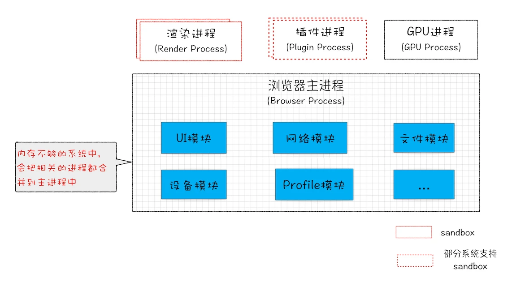

## 总结

本文主要是从 Chrome 进程架构的视角，分析了浏览器的进化史。

最初的浏览器都是单进程的，它们不稳定、不流畅且不安全，之后出现了 Chrome，创造性地引入了多进程架构，并解决了这些遗留问题。随后 Chrome 试图应用到更多业务场景，如移动设备、VR、视频等，为了支持这些场景，Chrome 的架构体系变得越来越复杂，这种架构的复杂性倒逼 Chrome 开发团队必须进行架构的重构，最终 Chrome 团队选择了面向服务架构（SOA）形式，这也是 Chrome 团队现阶段的一个主要任务。

鉴于目前架构的复杂性，要完整过渡到面向服务架构，估计还需要好几年时间才能完成。不过 Chrome 开发是一个渐进的过程，新的特性会一点点加入进来，这也意味着我们随时能看到 Chrome 新的变化。

总体说来，Chrome 是以一个非常快速的速度在进化，越来越多的业务和应用都逐渐转至浏览器来开发，身为开发人员，我们不能坐视不管，而应该紧跟其步伐，收获这波技术红利

# TCP 协议

在衡量 Web 页面性能的时候有一个重要的指标叫“FP（First Paint）”，是指从页面加载到首次开始绘制的时长。这个指标直接影响了用户的跳出率，更快的页面响应意味着更多的 PV、更高的参与度，以及更高的转化率。那什么影响 FP 指标呢？其中一个重要的因素是网络加载速度

要想优化 Web 页面的加载速度，你需要对网络有充分的了解。而理解网络的关键是要对网络协议有深刻的认识，不管你是使用 HTTP，还是使用 WebSocket，它们都是基于 TCP/IP 的，如果你对这些原理有足够了解，也就清楚如何去优化 Web 性能，或者能更轻松地定位 Web 问题了。此外，TCP/IP 的设计思想还有助于拓宽你的知识边界，从而在整体上提升你对项目的理解和解决问题的能力。

好，接下来我们回到正题，开始今天的内容。在网络中，一个文件通常会被拆分为很多数据包来进行传输，而数据包在传输过程中又有很大概率丢失或者出错。那么如何保证页面文件能被完整地送达浏览器呢？

这篇文章将站在数据包的视角，给出问题答案

## 一个数据包的“旅程”

下面我将分别从“数据包如何送达主机”“主机如何将数据包转交给应用”和“数据是如何被完整地送达应用程序”这三个角度来为你讲述数据的传输过程

互联网，实际上是一套理念和协议组成的体系架构。其中，协议是一套众所周知的规则和标准，如果各方都同意使用，那么它们之间的通信将变得毫无障碍

互联网中的数据是通过数据包来传输的。如果发送的数据很大，那么该数据就会被拆分为很多小数据包来传输。比如你现在听的音频数据，是拆分成一个个小的数据包来传输的，并不是一个大的文件一次传输过来的

#### IP：把数据包送达目的主机

数据包要在互联网上进行传输，就要符合网际协议（Internet Protocol，简称 IP）标准。互联网上不同的在线设备都有唯一的地址，地址只是一个数字，这和大部分家庭收件地址类似，你只需要知道一个家庭的具体地址，就可以往这个地址发送包裹，这样物流系统就能把物品送到目的地

计算机的地址就称为 IP 地址，访问任何网站实际上只是你的计算机向另外一台计算机请求信息。

如果要想把一个数据包从主机 A 发送给主机 B，那么在传输之前，数据包上会被附加上主机 B 的 IP 地址信息，这样在传输过程中才能正确寻址。额外地，数据包上还会附加上主机 A 本身的 IP 地址，有了这些信息主机 B 才可以回复信息给主机 A。这些附加的信息会被装进一个叫 IP 头的数据结构里。IP 头是 IP 数据包开头的信息，包含 IP 版本、源 IP 地址、目标 IP 地址、生存时间等信息

为了方便理解，我先把网络简单分为三层结构，如下图

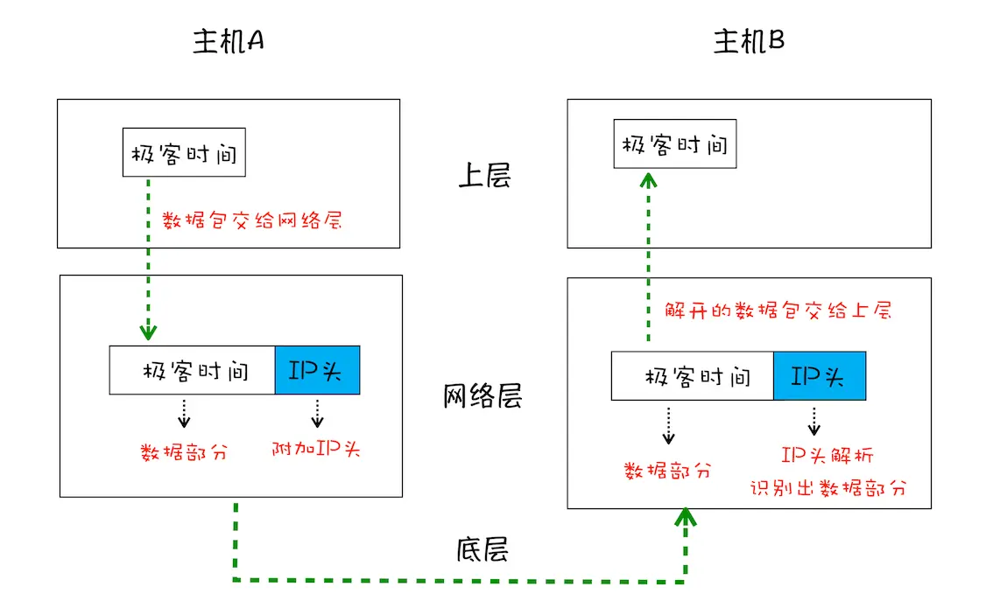

> 下面我们一起来看下一个数据包从主机 A 到主机 B 的旅程：

- 上层将含有“极客时间”的数据包交给网络层；
- 网络层再将 IP 头附加到数据包上，组成新的 IP 数据包，并交给底层；
- 底层通过物理网络将数据包传输给主机 B；
- 数据包被传输到主机 B 的网络层，在这里主机 B 拆开数据包的 IP 头信息，并将拆开来的数据部分交给上层；
- 最终，含有“极客时间”信息的数据包就到达了主机 B 的上层了

### UDP：把数据包送达应用程序

IP 是非常底层的协议，只负责把数据包传送到对方电脑，但是对方电脑并不知道把数据包交给哪个程序，是交给浏览器还是交给王者荣耀？因此，需要基于 IP 之上开发能和应用打交道的协议，最常见的是“用户数据包协议（User Datagram Protocol）”，简称 UDP。

UDP 中一个最重要的信息是端口号，端口号其实就是一个数字，每个想访问网络的程序都需要绑定一个端口号。通过端口号 UDP 就能把指定的数据包发送给指定的程序了，所以 IP 通过 IP 地址信息把数据包发送给指定的电脑，而 UDP 通过端口号把数据包分发给正确的程序。和 IP 头一样，端口号会被装进 UDP 头里面，UDP 头再和原始数据包合并组成新的 UDP 数据包。UDP 头中除了目的端口，还有源端口号等信息

为了支持 UDP 协议，我把前面的三层结构扩充为四层结构，在网络层和上层之间增加了传输层，如下图所示：


下面我们一起来看下一个数据包从主机 A 旅行到主机 B 的路线：

- 上层将含有“极客时间”的数据包交给传输层；
- 传输层会在数据包前面附加上 UDP 头，组成新的 UDP 数据包，再将新的 UDP 数据包交给网络层；
- 网络层再将 IP 头附加到数据包上，组成新的 IP 数据包，并交给底层；
- 数据包被传输到主机 B 的网络层，在这里主机 B 拆开 IP 头信息，并将拆开来的数据部分交给传输层；
- 在传输层，数据包中的 UDP 头会被拆开，并根据 UDP 中所提供的端口号，把数据部分交给上层的应用程序；
- 最终，含有“极客时间”信息的数据包就旅行到了主机 B 上层应用程序这里

在使用 UDP 发送数据时，有各种因素会导致数据包出错，虽然 UDP 可以校验数据是否正确，但是对于错误的数据包，UDP 并不提供重发机制，只是丢弃当前的包，而且 UDP 在发送之后也无法知道是否能达到目的地。

虽说 UDP 不能保证数据可靠性，但是传输速度却非常快，所以 UDP 会应用在一些关注速度、但不那么严格要求数据完整性的领域，如在线视频、互动游戏等

### TCP：把数据完整地送达应用程序

对于浏览器请求，或者邮件这类要求数据传输可靠性（reliability）的应用，如果使用 UDP 来传输会存在两个问题：

- 数据包在传输过程中容易丢失；
- 大文件会被拆分成很多小的数据包来传输，这些小的数据包会经过不同的路由，并在不同的时间到达接收端，而 UDP 协议并不知道如何组装这些数据包，从而把这些数据包还原成完整的文件

基于这两个问题，我们引入 TCP 了。TCP（Transmission Control Protocol，传输控制协议）是一种面向连接的、可靠的、基于字节流的传输层通信协议。相对于 UDP，TCP 有下面两个特点:

- 对于数据包丢失的情况，TCP 提供重传机制；
- TCP 引入了数据包排序机制，用来保证把乱序的数据包组合成一个完整的文件。

和 UDP 头一样，TCP 头除了包含了目标端口和本机端口号外，还提供了用于排序的序列号，以便接收端通过序号来重排数据包。

下面看看 TCP 下的单个数据包的传输流程


通过上图你应该可以了解一个数据包是如何通过 TCP 来传输的。TCP 单个数据包的传输流程和 UDP 流程差不多，不同的地方在于，通过 TCP 头的信息保证了一块大的数据传输的完整性。

下面我们再看下完整的 TCP 连接过程，通过这个过程你可以明白 TCP 是如何保证重传机制和数据包的排序功能的。

从下图可以看出，一个完整的 TCP 连接的生命周期包括了“建立连接”“传输数据”和“断开连接”三个阶段。

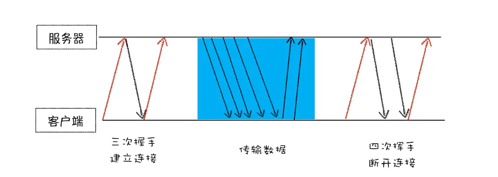

- 首先，**建立连接阶段**。这个阶段是通过“三次握手”来建立客户端和服务器之间的连接。TCP 提供面向连接的通信传输。面向连接是指在数据通信开始之前先做好两端之间的准备工作。所谓三次握手，是指在建立一个 TCP 连接时，客户端和服务器总共要发送三个数据包以确认连接的建立。
- 其次，**传输数据阶段**。在该阶段，接收端需要对每个数据包进行确认操作，也就是接收端在接收到数据包之后，需要发送确认数据包给发送端。所以当发送端发送了一个数据包之后，在规定时间内没有接收到接收端反馈的确认消息，则判断为数据包丢失，并触发发送端的重发机制。同样，一个大的文件在传输过程中会被拆分成很多小的数据包，这些数据包到达接收端后，接收端会按照 TCP 头中的序号为其排序，从而保证组成完整的数据。
- 最后，**断开连接阶段**。数据传输完毕之后，就要终止连接了，涉及到最后一个阶段“四次挥手”来保证双方都能断开连接

到这里你应该就明白了，TCP 为了保证数据传输的可靠性，牺牲了数据包的传输速度，因为“三次握手”和“数据包校验机制”等把传输过程中的数据包的数量提高了一倍。

## 总结

- 互联网中的数据是通过数据包来传输的，数据包在传输过程中容易丢失或出错。
- IP 负责把数据包送达目的主机。
- UDP 负责把数据包送达具体应用。
- 而 TCP 保证了数据完整地传输，它的连接可分为三个阶段：建立连接、传输数据和断开连接。
- 其实了解 TCP 协议，是为了全方位了解 HTTP，包括其实际功能和局限性，之后才会更加深刻地理解为什么要推出 HTTP/2，以及为什么要推出 QUIC 协议，也就是未来的 HTTP/3。这是一个由浅入深、循序渐进的过程，我希望你能稳扎稳打，学好这每一步、每一个协议，后面“水到自然渠成”

# HTTP 请求流程

一个 TCP 连接过程包括了建立连接、传输数据和断开连接三个阶段。

而 HTTP 协议，正是建立在 TCP 连接基础之上的。HTTP 是一种允许浏览器向服务器获取资源的协议，是 Web 的基础，通常由浏览器发起请求，用来获取不同类型的文件，例如 HTML 文件、CSS 文件、JavaScript 文件、图片、视频等。此外，HTTP 也是浏览器使用最广的协议，所以要想学好浏览器，就要先深入了解 HTTP。

不知道你是否有过下面这些疑问：

1. 为什么通常在第一次访问一个站点时，打开速度很慢，当再次访问这个站点时，速度就很快了？
2. 当登录过一个网站之后，下次再访问该站点，就已经处于登录状态了，这是怎么做到的呢？

这一切的秘密都隐藏在 HTTP 的请求过程中。所以，在今天这篇文章中，我将通过分析一个 HTTP 请求过程中每一步的状态来带你了解完整的 HTTP 请求过程，希望你看完这篇文章后，能够对 HTTP 协议有个全新的认识

## 浏览器端发起 HTTP 请求流程

如果你在浏览器地址栏里键入地址：http://baidu.com，那么接下来，浏览器会完成哪些动作呢？下面我们就一步一步详细“追踪”下

### 构建请求

首先，浏览器构建请求行信息（如下所示），构建好后，浏览器准备发起网络请求

```
GET /index.html HTTP1.1
```

### 查找缓存

在真正发起网络请求之前，浏览器会先在浏览器缓存中查询是否有要请求的文件。其中，浏览器缓存是一种在本地保存资源副本，以供下次请求时直接使用的技术。

当浏览器发现请求的资源已经在浏览器缓存中存有副本，它会拦截请求，返回该资源的副本，并直接结束请求，而不会再去源服务器重新下载。这样做的好处有：

- 缓解服务器端压力，提升性能（获取资源的耗时更短了）；
- 对于网站来说，缓存是实现快速资源加载的重要组成部分。
- 当然，如果缓存查找失败，就会进入网络请求过程了。

### 准备 IP 地址和端口

不过，先不急，在了解网络请求之前，我们需要先看看 HTTP 和 TCP 的关系。因为浏览器使用 HTTP 协议作为应用层协议，用来封装请求的文本信息；并使用 TCP/IP 作传输层协议将它发到网络上，所以在 HTTP 工作开始之前，浏览器需要通过 TCP 与服务器建立连接。也就是说 HTTP 的内容是通过 TCP 的传输数据阶段来实现的，你可以结合下图更好地理解这二者的关系。

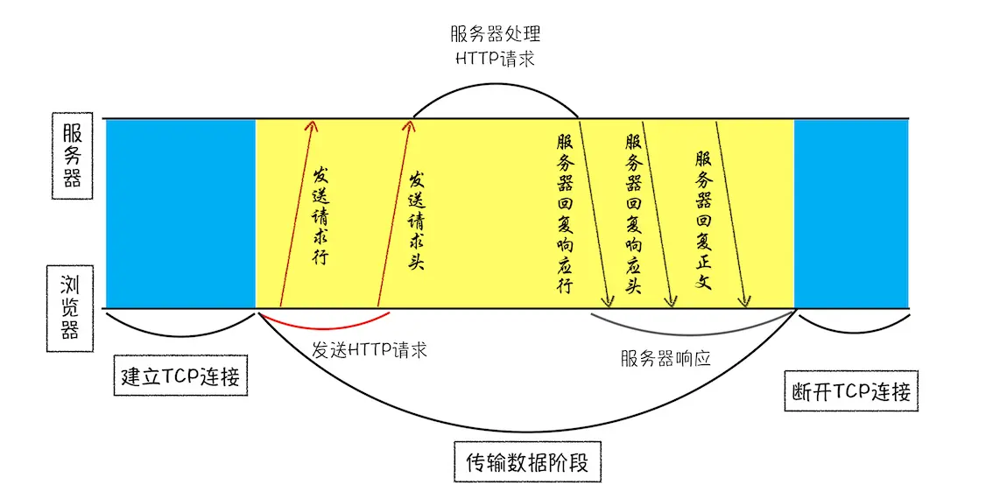

那接下来你可以思考这么“一连串”问题：

- HTTP 网络请求的第一步是做什么呢？结合上图看，是和服务器建立 TCP 连接。
- 那建立连接的信息都有了吗？上一篇文章中，我们讲到建立 TCP 连接的第一步就是需要准备 IP 地址和端口号。
- 那怎么获取 IP 地址和端口号呢？这得看看我们现在有什么，我们有一个 URL 地址，那么是否可以利用 URL 地址来获取 IP 和端口信息呢？

在上一篇文章中，我们介绍过数据包都是通过 IP 地址传输给接收方的。由于 IP 地址是数字标识，比如极客时间网站的 IP 是 39.106.233.176, 难以记忆，但使用极客时间的域名（time.geekbang.org）就好记多了，所以基于这个需求又出现了一个服务，负责把域名和 IP 地址做一一映射关系。这套域名映射为 IP 的系统就叫做“域名系统”，简称 DNS（Domain Name System）。

所以，这样一路推导下来，你会发现在第一步浏览器会请求 DNS 返回域名对应的 IP。当然浏览器还提供了 DNS 数据缓存服务，如果某个域名已经解析过了，那么浏览器会缓存解析的结果，以供下次查询时直接使用，这样也会减少一次网络请求。

> - 递归：客户端只发一次请求，要求对方给出最终结果。
> - 迭代：客户端发出一次请求，对方如果没有授权回答，它就会返回一个能解答这个查询的其它名称服务器列表，客户端会再向返回的列表中发出请求，直到找到最终负责所查域名的名称服务器，从它得到最终结果。
> - 授权回答：向 dns 服务器查询一个域名，刚好这个域名是本服务器负责，返回的结果就是授权回答。

- 客户端——本地 dns 服务端：这部分属于递归查询。
- 本地 dns 服务端——外网：这部分属于迭代查询。
- 递归查询时，返回的结果只有两种：查询成功或查询失败。
- 迭代查询，又称作重指引,返回的是最佳的查询点或者主机地址。
- 在本地有两种缓存，浏览器缓存和操作系统(OS)缓存，优先访问浏览器缓存。

拿到 IP 之后，接下来就需要获取端口号了。通常情况下，如果 URL 没有特别指明端口号，那么 HTTP 协议默认是 80 端口。

### 等待 TCP 队列

现在已经把端口和 IP 地址都准备好了，那么下一步是不是可以建立 TCP 连接了呢？

答案依然是“不行”。Chrome 有个机制，同一个域名同时最多只能建立 6 个 TCP 连接，如果在同一个域名下同时有 10 个请求发生，那么其中 4 个请求会进入排队等待状态，直至进行中的请求完成。

当然，如果当前请求数量少于 6，会直接进入下一步，建立 TCP 连接。

### 建立 TCP 连接

排队等待结束之后，终于可以快乐地和服务器握手了，在 HTTP 工作开始之前，浏览器通过 TCP 与服务器建立连接。而 TCP 的工作方式，我在上一篇文章中已经做过详细介绍了，如果有必要，你可以自行回顾下，这里我就不再重复讲述了。

### 发送 HTTP 请求

一旦建立了 TCP 连接，浏览器就可以和服务器进行通信了。而 HTTP 中的数据正是在这个通信过程中传输的。

你可以结合下图来理解，浏览器是如何发送请求信息给服务器的。


首先浏览器会向服务器发送请求行，它包括了请求方法、请求 URI（Uniform Resource Identifier）和 HTTP 版本协议。

发送请求行，就是告诉服务器浏览器需要什么资源，最常用的请求方法是 Get。比如，直接在浏览器地址栏键入极客时间的域名（time.geekbang.org），这就是告诉服务器要 Get 它的首页资源。

另外一个常用的请求方法是 POST，它用于发送一些数据给服务器，比如登录一个网站，就需要通过 POST 方法把用户信息发送给服务器。如果使用 POST 方法，那么浏览器还要准备数据给服务器，这里准备的数据是通过请求体来发送。

在浏览器发送请求行命令之后，还要以请求头形式发送其他一些信息，把浏览器的一些基础信息告诉服务器。比如包含了浏览器所使用的操作系统、浏览器内核等信息，以及当前请求的域名信息、浏览器端的 Cookie 信息，等等

## 服务器端处理 HTTP 请求流程

历经千辛万苦，HTTP 的请求信息终于被送达了服务器。接下来，服务器会根据浏览器的请求信息来准备相应的内容

### 返回请求

一旦服务器处理结束，便可以返回数据给浏览器了。你可以通过工具软件 curl 来查看返回请求数据，具体使用方法是在命令行中输入以下命令：

```
curl -i https://time.geekbang.org/
```

注意这里加上了 -i 是为了返回响应行、响应头和响应体的数据，返回的结果如下图所示，你可以结合这些数据来理解服务器是如何响应浏览器的。


首先服务器会返回响应行，包括协议版本和状态码。

但并不是所有的请求都可以被服务器处理的，那么一些无法处理或者处理出错的信息，怎么办呢？服务器会通过请求行的状态码来告诉浏览器它的处理结果，比如：

- 最常用的状态码是 200，表示处理成功；
- 如果没有找到页面，则会返回 404

状态码类型很多，这里我就不过多介绍了，网上有很多资料，你可以自行查询和学习。

随后，正如浏览器会随同请求发送请求头一样，服务器也会随同响应向浏览器发送响应头。响应头包含了服务器自身的一些信息，比如服务器生成返回数据的时间、返回的数据类型（JSON、HTML、流媒体等类型），以及服务器要在客户端保存的 Cookie 等信息。

发送完响应头后，服务器就可以继续发送响应体的数据，通常，响应体就包含了 HTML 的实际内容。

以上这些就是服务器响应浏览器的具体过程

### 断开连接

通常情况下，一旦服务器向客户端返回了请求数据，它就要关闭 TCP 连接。不过如果浏览器或者服务器在其头信息中加入了：

```
Connection:Keep-Alive
```

那么 TCP 连接在发送后将仍然保持打开状态，这样浏览器就可以继续通过同一个 TCP 连接发送请求。保持 TCP 连接可以省去下次请求时需要建立连接的时间，提升资源加载速度。比如，一个 Web 页面中内嵌的图片就都来自同一个 Web 站点，如果初始化了一个持久连接，你就可以复用该连接，以请求其他资源，而不需要重新再建立新的 TCP 连接。

### 重定向

到这里似乎请求流程快结束了，不过还有一种情况你需要了解下，比如当你在浏览器中打开 geekbang.org 后，你会发现最终打开的页面地址是 https://www.geekbang.org。

这两个 URL 之所以不一样，是因为涉及到了一个重定向操作。跟前面一样，你依然可以使用 curl 来查看下请求 geekbang.org 会返回什么内容？

在控制台输入如下命令：

```
curl -I geekbang.org
```

注意这里输入的参数是 -I，和 -i 不一样，-I 表示只需要获取响应头和响应行数据，而不需要获取响应体的数据，最终返回的数据如下图所示：

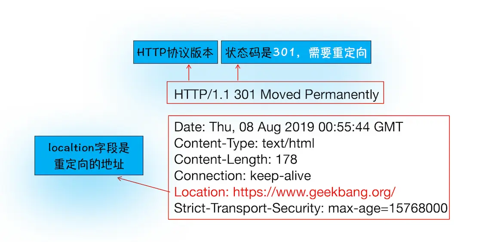

从图中你可以看到，响应行返回的状态码是 301，状态 301 就是告诉浏览器，我需要重定向到另外一个网址，而需要重定向的网址正是包含在响应头的 Location 字段中，接下来，浏览器获取 Location 字段中的地址，并使用该地址重新导航，这就是一个完整重定向的执行流程。这也就解释了为什么输入的是 geekbang.org，最终打开的却是 https://www.geekbang.org 了。

不过也不要认为这种跳转是必然的。如果你打开 https://12306.cn，你会发现这个站点是打不开的。这是因为12306的服务器并没有处理跳转，所以必须要手动输入完整的 https://www.12306.com 才能打开页面。

## 问题解答

说了这么多，相信你现在已经了解了 HTTP 的请求流程，那现在我们再回过头来看看文章开头提出的问题。

### 为什么很多站点第二次打开速度会很快？

如果第二次页面打开很快，主要原因是第一次加载页面过程中，缓存了一些耗时的数据。

那么，哪些数据会被缓存呢？从上面介绍的核心请求路径可以发现，DNS 缓存和页面资源缓存这两块数据是会被浏览器缓存的。其中，DNS 缓存比较简单，它主要就是在浏览器本地把对应的 IP 和域名关联起来，这里就不做过多分析了。

我们重点看下浏览器资源缓存，下面是缓存处理的过程：


首先，我们看下服务器是通过什么方式让浏览器缓存数据的？

从上图的第一次请求可以看出，当服务器返回 HTTP 响应头给浏览器时，浏览器是通过响应头中的 Cache-Control 字段来设置是否缓存该资源。通常，我们还需要为这个资源设置一个缓存过期时长，而这个时长是通过 Cache-Control 中的 Max-age 参数来设置的，比如上图设置的缓存过期时间是 2000 秒。

```
Cache-Control:Max-age=2000
```

这也就意味着，在该缓存资源还未过期的情况下, 如果再次请求该资源，会直接返回缓存中的资源给浏览器。

但如果缓存过期了，浏览器则会继续发起网络请求，并且在 HTTP 请求头中带上：

```
If-None-Match:"4f80f-13c-3a1xb12a"
```

服务器收到请求头后，会根据 If-None-Match 的值来判断请求的资源是否有更新。

- 如果没有更新，就返回 304 状态码，相当于服务器告诉浏览器：“这个缓存可以继续使用，这次就不重复发送数据给你了。”
- 如果资源有更新，服务器就直接返回最新资源给浏览器。

简要来说，很多网站第二次访问能够秒开，是因为这些网站把很多资源都缓存在了本地，浏览器缓存直接使用本地副本来回应请求，而不会产生真实的网络请求，从而节省了时间。同时，DNS 数据也被浏览器缓存了，这又省去了 DNS 查询环节

### 登录状态是如何保持的？

- 通过上面的介绍，你已经了解了缓存是如何工作的。下面我们再一起看下登录状态是如何保持的。
- 用户打开登录页面，在登录框里填入用户名和密码，点击确定按钮。点击按钮会触发页面脚本生成用户登录信息，然后调用 POST 方法提交用户登录信息给服务器。
- 服务器接收到浏览器提交的信息之后，查询后台，验证用户登录信息是否正确，如果正确的话，会生成一段表示用户身份的字符串，并把该字符串写到响应头的 Set-Cookie 字段里，如下所示，然后把响应头发送给浏览器

  ```
  Set-Cookie: UID=3431uad;
  ```

- 浏览器在接收到服务器的响应头后，开始解析响应头，如果遇到响应头里含有 Set-Cookie 字段的情况，浏览器就会把这个字段信息保存到本地。比如把 UID=3431uad 保持到本地。
- 当用户再次访问时，浏览器会发起 HTTP 请求，但在发起请求之前，浏览器会读取之前保存的 Cookie 数据，并把数据写进请求头里的 Cookie 字段里（如下所示），然后浏览器再将请求头发送给服务器。

  ```
  Cookie: UID=3431uad;
  ```

- 服务器在收到 HTTP 请求头数据之后，就会查找请求头里面的“Cookie”字段信息，当查找到包含 UID=3431uad 的信息时，服务器查询后台，并判断该用户是已登录状态，然后生成含有该用户信息的页面数据，并把生成的数据发送给浏览器。
- 浏览器在接收到该含有当前用户的页面数据后，就可以正确展示用户登录的状态信息了

好了，通过这个流程你可以知道浏览器页面状态是通过使用 Cookie 来实现的。Cookie 流程可以参考下图：


简单地说，如果服务器端发送的响应头内有 Set-Cookie 的字段，那么浏览器就会将该字段的内容保持到本地。当下次客户端再往该服务器发送请求时，客户端会自动在请求头中加入 Cookie 值后再发送出去。服务器端发现客户端发送过来的 Cookie 后，会去检查究竟是从哪一个客户端发来的连接请求，然后对比服务器上的记录，最后得到该用户的状态信息。

## 总结

本篇文章的内容比较多、比较碎，但是非常重要，所以我先来总结下今天的主要内容。

为了便于你理解，我画了下面这张详细的“HTTP 请求示意图”，用来展现浏览器中的 HTTP 请求所经历的各个阶段。

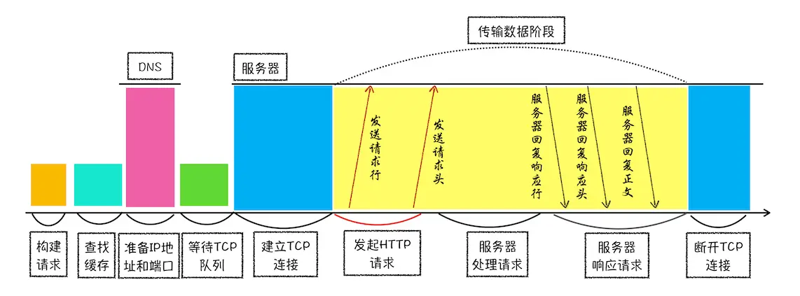

从图中可以看到，浏览器中的 HTTP 请求从发起到结束一共经历了如下八个阶段：构建请求、查找缓存、准备 IP 和端口、等待 TCP 队列、建立 TCP 连接、发起 HTTP 请求、服务器处理请求、服务器返回请求和断开连接。

然后我还通过 HTTP 请求路径解答了两个经常会碰到的问题，一个涉及到了 Cache 流程，另外一个涉及到如何使用 Cookie 来进行状态管理。

通过今天系统的讲解，想必你已经了解了一个 HTTP 完整的工作流程，相信这些知识点之于你以后的学习或工作会很有帮助。

# 渲染流程（上）

在上一篇文章中我们介绍了导航相关的流程，那导航被提交后又会怎么样呢？就进入了渲染阶段。这个阶段很重要，了解其相关流程能让你“看透”页面是如何工作的，有了这些知识，你可以解决一系列相关的问题，比如能熟练使用开发者工具，因为能够理解开发者工具里面大部分项目的含义，能优化页面卡顿问题，使用 JavaScript 优化动画流程，通过优化样式表来防止强制同步布局，等等。

既然它的功能这么强大，那么今天，我们就来好好聊聊渲染流程。

通常，我们编写好 HTML、CSS、JavaScript 等文件，经过浏览器就会显示出漂亮的页面（如下图所示），但是你知道它们是如何转化成页面的吗？这背后的原理，估计很多人都答不上来。


从图中可以看出，左边输入的是 HTML、CSS、JavaScript 数据，这些数据经过中间渲染模块的处理，最终输出为屏幕上的像素。

这中间的渲染模块就是我们今天要讨论的主题。为了能更好地理解下文，你可以先结合下图快速抓住 HTML、CSS 和 JavaScript 的含义：


从上图可以看出，HTML 的内容是由标记和文本组成。标记也称为标签，每个标签都有它自己的语意，浏览器会根据标签的语意来正确展示 HTML 内容。比如上面的 `<p>` 标签是告诉浏览器在这里的内容需要创建一个新段落，中间的文本就是段落中需要显示的内容

如果需要改变 HTML 的字体颜色、大小等信息，就需要用到 CSS。CSS 又称为层叠样式表，是由选择器和属性组成，比如图中的 p 选择器，它会把 HTML 里面 `<p>` 标签的内容选择出来，然后再把选择器的属性值应用到 `<p>` 标签内容上。选择器里面有个 color 属性，它的值是 red，这是告诉渲染引擎把 `<p>` 标签的内容显示为红色

至于 JavaScript（简称为 JS），使用它可以使网页的内容“动”起来，比如上图中，可以通过 JavaScript 来修改 CSS 样式值，从而达到修改文本颜色的目的。

搞清楚 HTML、CSS 和 JavaScript 的含义后，那么接下来我们就正式开始分析渲染模块了。

由于渲染机制过于复杂，所以渲染模块在执行过程中会被划分为很多子阶段，输入的 HTML 经过这些子阶段，最后输出像素。我们把这样的一个处理流程叫做渲染流水线，其大致流程如下图所示：

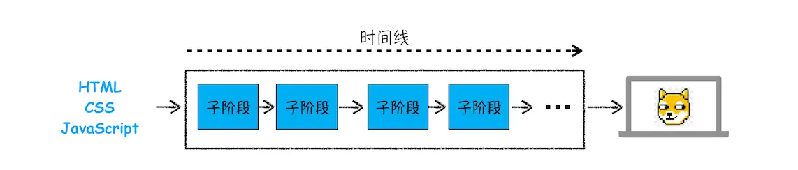

按照渲染的时间顺序，流水线可分为如下几个子阶段：**构建 DOM 树、样式计算、布局阶段、分层、绘制、分块、光栅化和合成**。内容比较多，我会用两篇文章来为你详细讲解这各个子阶段。接下来，在介绍每个阶段的过程中，你应该重点关注以下三点内容

- 开始每个子阶段都有其输入的内容；
- 然后每个子阶段有其处理过程；
- 最终每个子阶段会生成输出内容。

理解了这三部分内容，能让你更加清晰地理解每个子阶段。

## 构建 DOM 树

为什么要构建 DOM 树呢？这是因为浏览器无法直接理解和使用 HTML，所以需要将 HTML 转换为浏览器能够理解的结构——DOM 树。

这里我们还需要简单介绍下什么是树结构，为了更直观地理解，你可以参考下面我画的几个树结构：


从图中可以看出，树这种结构非常像我们现实生活中的“树”，其中每个点我们称为节点，相连的节点称为父子节点。树结构在浏览器中的应用还是比较多的，比如下面我们要介绍的渲染流程，就在频繁地使用树结构。

接下来咱们还是言归正传，来看看 DOM 树的构建过程，你可以参考下图


从图中可以看出，构建 DOM 树的输入内容是一个非常简单的 HTML 文件，然后经由 HTML 解析器解析，最终输出树状结构的 DOM。

为了更加直观地理解 DOM 树，你可以打开 Chrome 的“开发者工具”，选择“Console”标签来打开控制台，然后在控制台里面输入“document”后回车，这样你就能看到一个完整的 DOM 树结构，如下图所示：


图中的 document 就是 DOM 结构，你可以看到，DOM 和 HTML 内容几乎是一样的，但是和 HTML 不同的是，DOM 是保存在内存中树状结构，可以通过 JavaScript 来查询或修改其内容。

那下面就来看看如何通过 JavaScript 来修改 DOM 的内容，在控制台中输入：

```js
document.getElementsByTagName("p")[0].innerText = "black";
```

这行代码的作用是把第一个 `<p>` 标签的内容修改为 black，具体执行结果你可以参考下图：


从图中可以看出，在执行了一段修改第一个 `<p>` 标签的 JavaScript 代码后，DOM 的第一个 p 节点的内容成功被修改，同时页面中的内容也被修改了

好了，现在我们已经生成 DOM 树了，但是 DOM 节点的样式我们依然不知道，要让 DOM 节点拥有正确的样式，这就需要样式计算了

## 样式计算

样式计算的目的是为了计算出 DOM 节点中每个元素的具体样式，这个阶段大体可分为三步来完成

### 把 CSS 转换为浏览器能够理解的结构

那 CSS 样式的来源主要有哪些呢？你可以先参考下图：


从图中可以看出，CSS 样式来源主要有三种：

- 通过 link 引用的外部 CSS 文件
- `<style>` 标记内的 CSS
- 元素的 style 属性内嵌的 CSS

和 HTML 文件一样，浏览器也是无法直接理解这些纯文本的 CSS 样式，所以当渲染引擎接收到 CSS 文本时，会执行一个转换操作，将 CSS 文本转换为浏览器可以理解的结构——styleSheets。

为了加深理解，你可以在 Chrome 控制台中查看其结构，只需要在控制台中输入 document.styleSheets，然后就看到如下图所示的结构


从图中可以看出，这个样式表包含了很多种样式，已经把那三种来源的样式都包含进去了。当然样式表的具体结构不是我们今天讨论的重点，你只需要知道渲染引擎会把获取到的 CSS 文本全部转换为 styleSheets 结构中的数据，并且该结构同时具备了查询和修改功能，这会为后面的样式操作提供基础

### 转换样式表中的属性值，使其标准化

现在我们已经把现有的 CSS 文本转化为浏览器可以理解的结构了，那么接下来就要对其进行属性值的标准化操作。

要理解什么是属性值标准化，你可以看下面这样一段 CSS 文本

```css
body {
  font-size: 2em;
}
p {
  color: blue;
}
span {
  display: none;
}
div {
  font-weight: bold;
}
div p {
  color: green;
}
div {
  color: red;
}
```

可以看到上面的 CSS 文本中有很多属性值，如 2em、blue、bold，这些类型数值不容易被渲染引擎理解，所以需要将所有值转换为渲染引擎容易理解的、标准化的计算值，这个过程就是属性值标准化。

那标准化后的属性值是什么样子的？

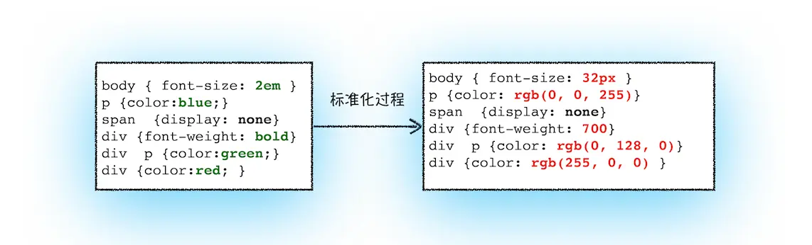

从图中可以看到，2em 被解析成了 32px，red 被解析成了 rgb(255,0,0)，bold 被解析成了 700……

### 计算出 DOM 树中每个节点的具体样式

现在样式的属性已被标准化了，接下来就需要计算 DOM 树中每个节点的样式属性了，如何计算呢？

这就涉及到 CSS 的继承规则和层叠规则了。

首先是 CSS 继承。CSS 继承就是每个 DOM 节点都包含有父节点的样式。这么说可能有点抽象，我们可以结合具体例子，看下面这样一张样式表是如何应用到 DOM 节点上的。

```css
body {
  font-size: 20px;
}
p {
  color: blue;
}
span {
  display: none;
}
div {
  font-weight: bold;
  color: red;
}
div p {
  color: green;
}
```

这张样式表最终应用到 DOM 节点的效果如下图所示：

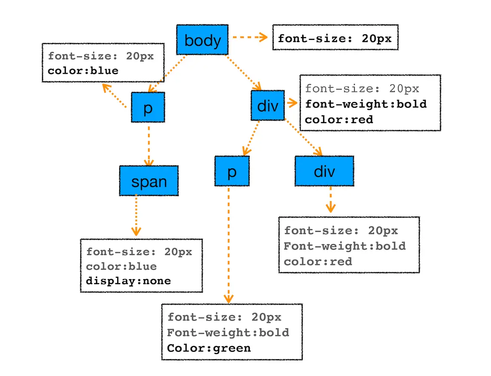

从图中可以看出，所有子节点都继承了父节点样式。比如 body 节点的 font-size 属性是 20，那 body 节点下面的所有节点的 font-size 都等于 20。

为了加深你对 CSS 继承的理解，你可以打开 Chrome 的“开发者工具”，选择第一个“element”标签，再选择“style”子标签，你会看到如下界面

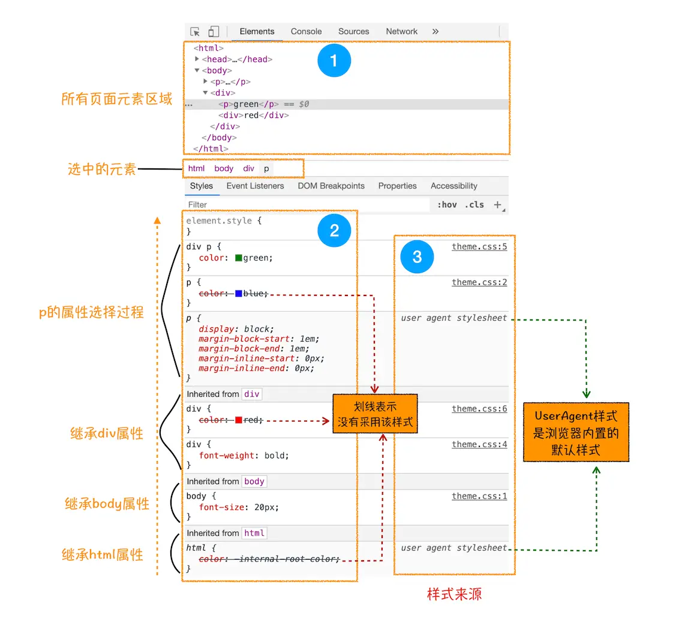

这个界面展示的信息很丰富，大致可描述为如下

- 首先，可以选择要查看的元素的样式（位于图中的区域 2 中），在图中的第 1 个区域中点击对应的元素元素，就可以了下面的区域查看该元素的样式了。比如这里我们选择的元素是 `<p>` 标签，位于 html.body.div.这个路径下面
- 其次，可以从样式来源（位于图中的区域 3 中）中查看样式的具体来源信息，看看是来源于样式文件，还是来源于 UserAgent 样式表。这里需要特别提下 UserAgent 样式，它是浏览器提供的一组默认样式，如果你不提供任何样式，默认使用的就是 UserAgent 样式。
- 最后，可以通过区域 2 和区域 3 来查看样式继承的具体过程。

以上就是 CSS 继承的一些特性，样式计算过程中，会根据 DOM 节点的继承关系来合理计算节点样式。

样式计算过程中的第二个规则是样式层叠（即 CSS 选择器优先级）。层叠是 CSS 的一个基本特征，它是一个定义了如何合并来自多个源的属性值的算法。它在 CSS 处于核心地位，CSS 的全称“层叠样式表”正是强调了这一点。关于层叠的具体规则这里就不做过多介绍了，网上资料也非常多，你可以自行搜索学习

总之，样式计算阶段的目的是为了计算出 DOM 节点中每个元素的具体样式，在计算过程中需要遵守 CSS 的继承和层叠两个规则。这个阶段最终输出的内容是每个 DOM 节点的样式，并被保存在 ComputedStyle 的结构内。

如果你想了解每个 DOM 元素最终的计算样式，可以打开 Chrome 的“开发者工具”，选择第一个“element”标签，然后再选择“Computed”子标签，如下图所示：


上图红色方框中显示了 html.body.div.p 标签的 ComputedStyle 的值。你想要查看哪个元素，点击左边对应的标签就可以了

## 布局阶段

现在，我们有 DOM 树和 DOM 树中元素的样式，但这还不足以显示页面，因为我们还不知道 DOM 元素的几何位置信息。那么接下来就需要计算出 DOM 树中可见元素的几何位置，我们把这个计算过程叫做布局。

Chrome 在布局阶段需要完成两个任务：创建布局树和布局计算

### 创建布局树

你可能注意到了 DOM 树还含有很多不可见的元素，比如 head 标签，还有使用了 display:none 属性的元素。所以在显示之前，我们还要额外地构建一棵只包含可见元素布局树。

我们结合下图来看看布局树的构造过程：

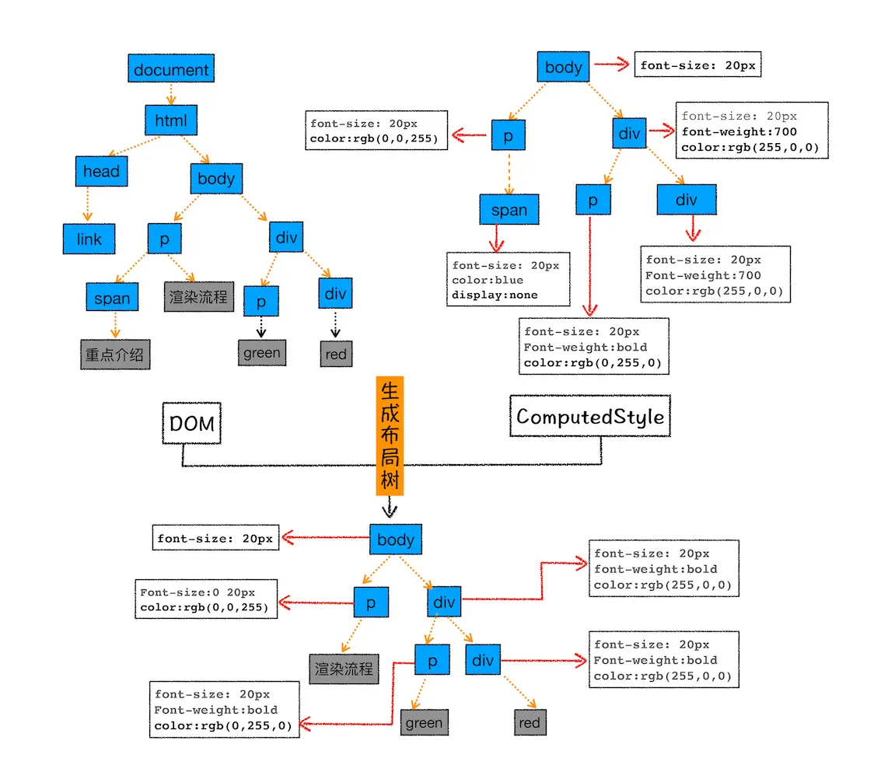

从上图可以看出，DOM 树中所有不可见的节点都没有包含到布局树中。

为了构建布局树，浏览器大体上完成了下面这些工作

遍历 DOM 树中的所有可见节点，并把这些节点加到布局中；而不可见的节点会被布局树忽略掉，如 head 标签下面的全部内容，再比如 body.p.span 这个元素，因为它的属性包含 dispaly:none，所以这个元素也没有被包进布局树

### 布局计算

现在我们有了一棵完整的布局树。那么接下来，就要计算布局树节点的坐标位置了。布局的计算过程非常复杂，我们这里先跳过不讲，等到后面章节中我再做详细的介绍。

在执行布局操作的时候，会把布局运算的结果重新写回布局树中，所以布局树既是输入内容也是输出内容，这是布局阶段一个不合理的地方，因为在布局阶段并没有清晰地将输入内容和输出内容区分开来。针对这个问题，Chrome 团队正在重构布局代码，下一代布局系统叫 LayoutNG，试图更清晰地分离输入和输出，从而让新设计的布局算法更加简单。

## 总结

好了，今天正文就到这里，我画了下面这张比较完整的渲染流水线，你可以结合这张图来回顾下今天的内容。


从图中可以看出，本节内容我们介绍了渲染流程的前三个阶段：DOM 生成、样式计算和布局。要点可大致总结为如下：

- 浏览器不能直接理解 HTML 数据，所以第一步需要将其转换为浏览器能够理解的 DOM 树结构；
- 生成 DOM 树后，还需要根据 CSS 样式表，来计算出 DOM 树所有节点的样式；
- 最后计算 DOM 元素的布局信息，使其都保存在布局树中。

# 渲染流程（下）

在上篇文章中，我们介绍了渲染流水线中的 DOM 生成、样式计算和布局三个阶段，那今天我们接着讲解渲染流水线后面的阶段。

这里还是先简单回顾下上节前三个阶段的主要内容：在 HTML 页面内容被提交给渲染引擎之后，渲染引擎首先将 HTML 解析为浏览器可以理解的 DOM；然后根据 CSS 样式表，计算出 DOM 树所有节点的样式；接着又计算每个元素的几何坐标位置，并将这些信息保存在布局树中

## 分层

现在我们有了布局树，而且每个元素的具体位置信息都计算出来了，那么接下来是不是就要开始着手绘制页面了？

答案依然是否定的。

因为页面中有很多复杂的效果，如一些复杂的 3D 变换、页面滚动，或者使用 z-indexing 做 z 轴排序等，为了更加方便地实现这些效果，渲染引擎还需要为特定的节点生成专用的图层，并生成一棵对应的图层树（LayerTree）。如果你熟悉 PS，相信你会很容易理解图层的概念，正是这些图层叠加在一起构成了最终的页面图像。

要想直观地理解什么是图层，你可以打开 Chrome 的“开发者工具-更多工具”，选择“Layers”标签，就可以看到可视化页面的分层情况，如下图所示


从上图可以看出，渲染引擎给页面分了很多图层，这些图层按照一定顺序叠加在一起，就形成了最终的页面，你可以参考下图


现在你知道了浏览器的页面实际上被分成了很多图层，这些图层叠加后合成了最终的页面。下面我们再来看看这些图层和布局树节点之间的关系，如文中图所示：


通常情况下，并不是布局树的每个节点都包含一个图层，如果一个节点没有对应的层，那么这个节点就从属于父节点的图层。如上图中的 span 标签没有专属图层，那么它们就从属于它们的父节点图层。但不管怎样，最终每一个节点都会直接或者间接地从属于一个层。

那么需要满足什么条件，渲染引擎才会为特定的节点创建新的层呢？通常满足下面两点中任意一点的元素就可以被提升为单独的一个图层。

第一点，拥有层叠上下文属性的元素会被提升为单独的一层。

页面是个二维平面，但是层叠上下文能够让 HTML 元素具有三维概念，这些 HTML 元素按照自身属性的优先级分布在垂直于这个二维平面的 z 轴上。你可以结合下图来直观感受下：


从图中可以看出，明确定位属性的元素、定义透明属性的元素、使用 CSS 滤镜的元素等，都拥有层叠上下文属性。

第二点，需要剪裁（clip）的地方也会被创建为图层。

不过首先你需要了解什么是剪裁，结合下面的 HTML 代码：

```html
<style>
  div {
    width: 200;
    height: 200;
    overflow: auto;
    background: gray;
  }
</style>
<body>
  <div>
    <p>
      所以元素有了层叠上下文的属性或者需要被剪裁，那么就会被提升成为单独一层，你可以参看下图：
    </p>
    <p>
      从上图我们可以看到，document层上有A和B层，而B层之上又有两个图层。这些图层组织在一起也是一颗树状结构。
    </p>
    <p>
      图层树是基于布局树来创建的，为了找出哪些元素需要在哪些层中，渲染引擎会遍历布局树来创建层树（Update
      LayerTree）。
    </p>
  </div>
</body>
```

在这里我们把 div 的大小限定为 200\*200 像素，而 div 里面的文字内容比较多，文字所显示的区域肯定会超出 200\*200 的面积，这时候就产生了剪裁，渲染引擎会把裁剪文字内容的一部分用于显示在 div 区域，下图是运行时的执行结果

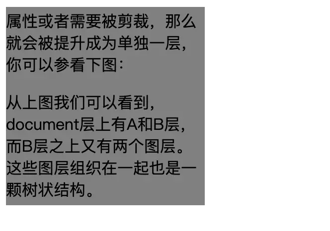

出现这种裁剪情况的时候，渲染引擎会为文字部分单独创建一个层，如果出现滚动条，滚动条也会被提升为单独的层。你可以参考下图：


所以说，元素有了层叠上下文的属性或者需要被剪裁，满足这任意一点，就会被提升成为单独一层。

## 图层绘制

在完成图层树的构建之后，渲染引擎会对图层树中的每个图层进行绘制，那么接下来我们看看渲染引擎是怎么实现图层绘制的？

试想一下，如果给你一张纸，让你先把纸的背景涂成蓝色，然后在中间位置画一个红色的圆，最后再在圆上画个绿色三角形。你会怎么操作呢？

通常，你会把你的绘制操作分解为三步：

- 制蓝色背景；
- 在中间绘制一个红色的圆；
- 再在圆上绘制绿色三角形

渲染引擎实现图层的绘制与之类似，会把一个图层的绘制拆分成很多小的绘制指令，然后再把这些指令按照顺序组成一个待绘制列表，如下图所示：


从图中可以看出，绘制列表中的指令其实非常简单，就是让其执行一个简单的绘制操作，比如绘制粉色矩形或者黑色的线等。而绘制一个元素通常需要好几条绘制指令，因为每个元素的背景、前景、边框都需要单独的指令去绘制。所以在图层绘制阶段，输出的内容就是这些待绘制列表。

你也可以打开“开发者工具”的“Layers”标签，选择“document”层，来实际体验下绘制列表，如下图所示：

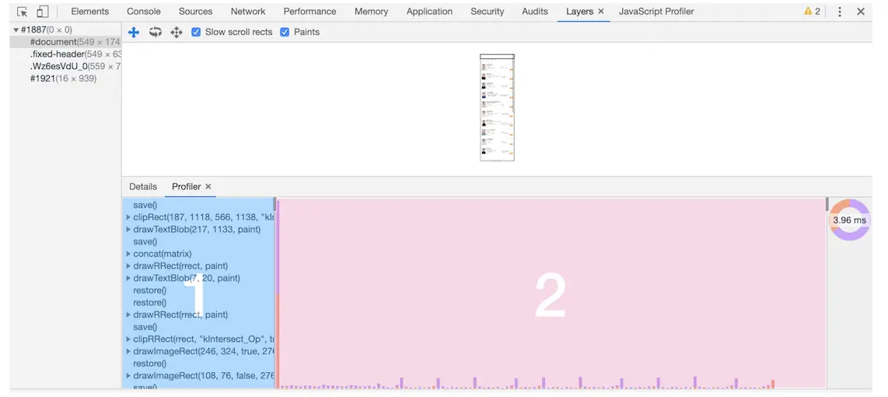

在该图中，区域 1 就是 document 的绘制列表，拖动区域 2 中的进度条可以重现列表的绘制过程。

## 栅格化（raster）操作

绘制列表只是用来记录绘制顺序和绘制指令的列表，而实际上绘制操作是由渲染引擎中的合成线程来完成的。你可以结合下图来看下渲染主线程和合成线程之间的关系：

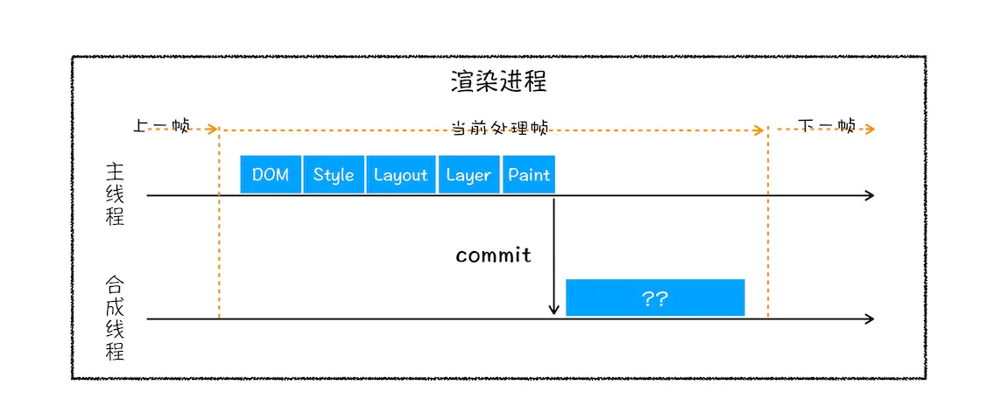

如上图所示，当图层的绘制列表准备好之后，主线程会把该绘制列表提交（commit）给合成线程，那么接下来合成线程是怎么工作的呢？

那我们得先来看看什么是视口，你可以参看下图：

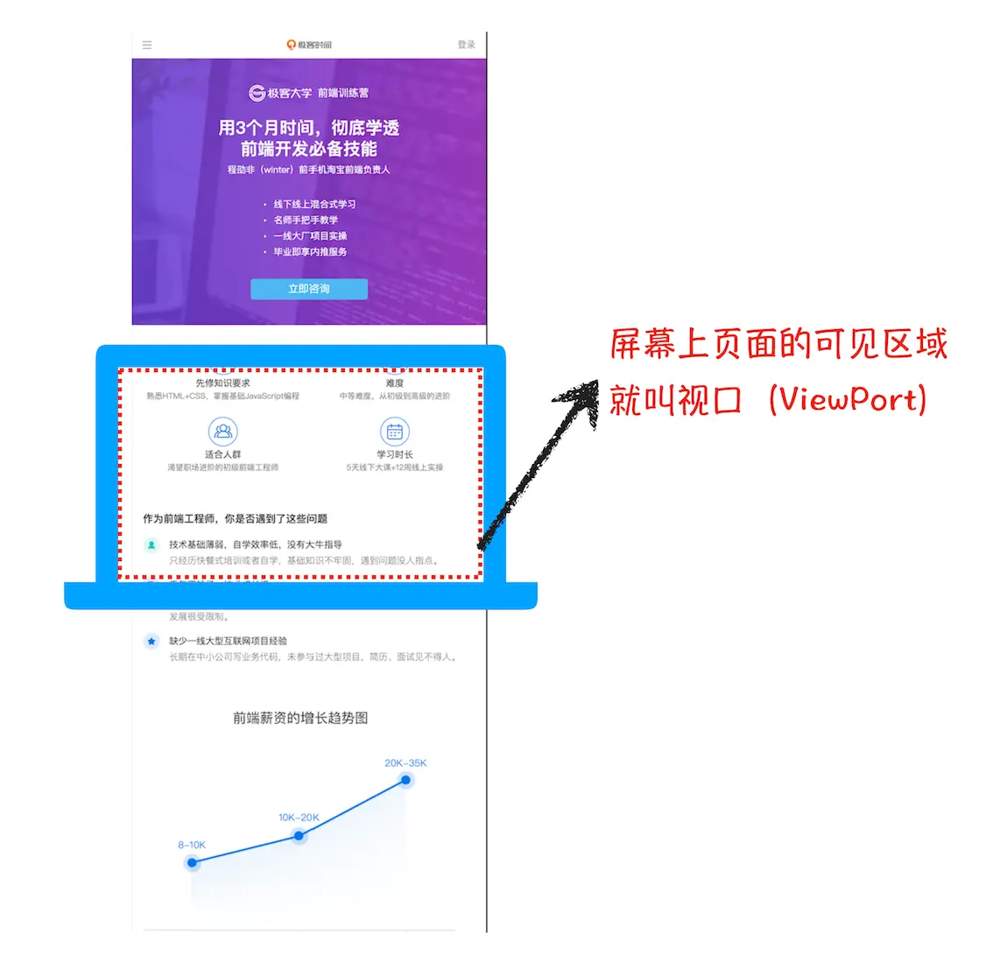

通常一个页面可能很大，但是用户只能看到其中的一部分，我们把用户可以看到的这个部分叫做视口（viewport）。

在有些情况下，有的图层可以很大，比如有的页面你使用滚动条要滚动好久才能滚动到底部，但是通过视口，用户只能看到页面的很小一部分，所以在这种情况下，要绘制出所有图层内容的话，就会产生太大的开销，而且也没有必要。

基于这个原因，合成线程会将图层划分为图块（tile），这些图块的大小通常是 256x256 或者 512x512，如下图所示：

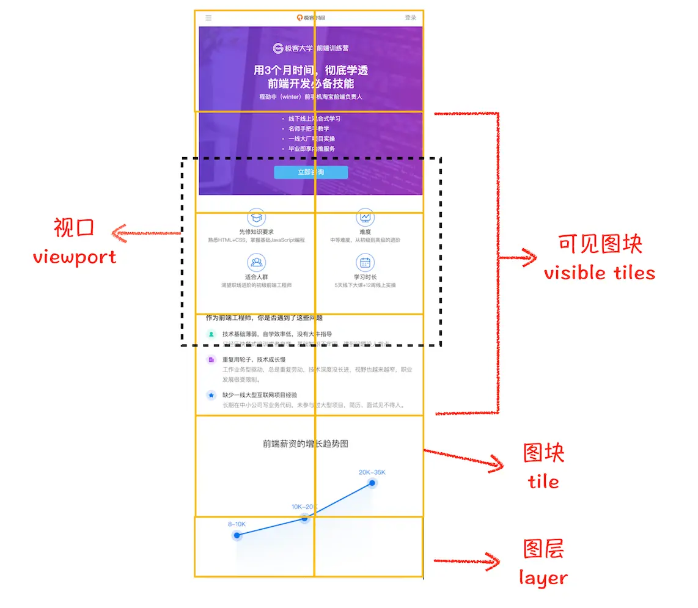

然后合成线程会按照视口附近的图块来优先生成位图，实际生成位图的操作是由栅格化来执行的。所谓栅格化，是指将图块转换为位图。而图块是栅格化执行的最小单位。渲染进程维护了一个栅格化的线程池，所有的图块栅格化都是在线程池内执行的，运行方式如下图所示：

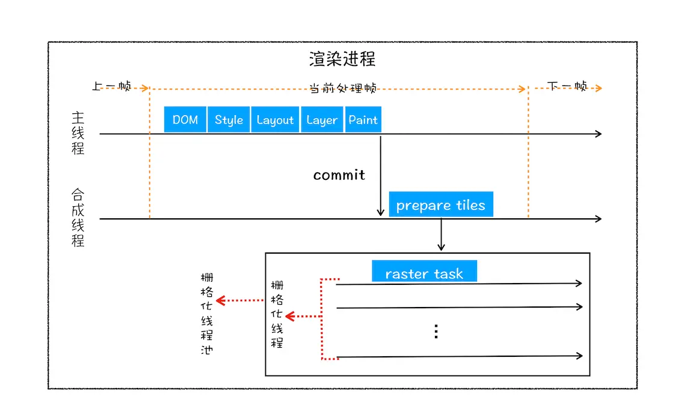

通常，栅格化过程都会使用 GPU 来加速生成，使用 GPU 生成位图的过程叫快速栅格化，或者 GPU 栅格化，生成的位图被保存在 GPU 内存中。

相信你还记得，GPU 操作是运行在 GPU 进程中，如果栅格化操作使用了 GPU，那么最终生成位图的操作是在 GPU 中完成的，这就涉及到了跨进程操作。具体形式你可以参考下图：

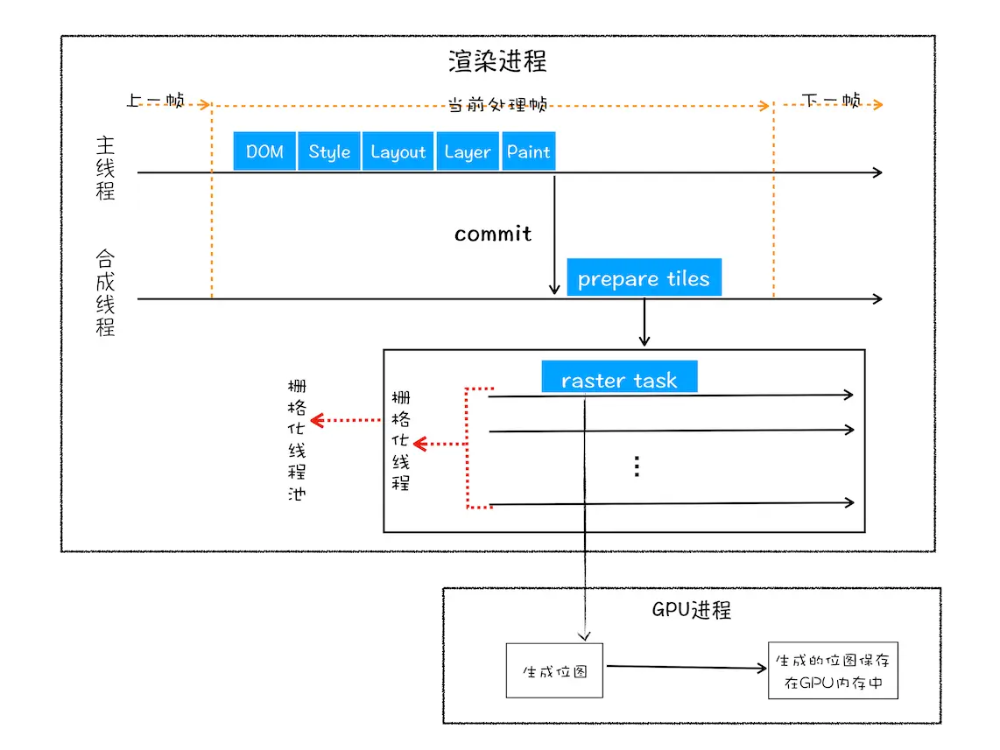

从图中可以看出，渲染进程把生成图块的指令发送给 GPU，然后在 GPU 中执行生成图块的位图，并保存在 GPU 的内存中。

## 合成和显示

一旦所有图块都被光栅化，合成线程就会生成一个绘制图块的命令——“DrawQuad”，然后将该命令提交给浏览器进程。

浏览器进程里面有一个叫 viz 的组件，用来接收合成线程发过来的 DrawQuad 命令，然后根据 DrawQuad 命令，将其页面内容绘制到内存中，最后再将内存显示在屏幕上。

到这里，经过这一系列的阶段，编写好的 HTML、CSS、JavaScript 等文件，经过浏览器就会显示出漂亮的页面了。

## 渲染流水线大总结

好了，我们现在已经分析完了整个渲染流程，从 HTML 到 DOM、样式计算、布局、图层、绘制、光栅化、合成和显示。下面我用一张图来总结下这整个渲染流程：

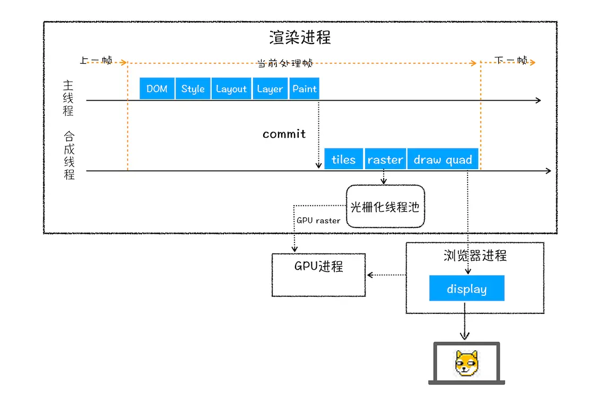

结合上图，一个完整的渲染流程大致可总结为如下

- 渲染进程将 HTML 内容转换为能够读懂的 DOM 树结构。
- 渲染引擎将 CSS 样式表转化为浏览器可以理解的 styleSheets，计算出 DOM 节点的样式。
- 创建布局树，并计算元素的布局信息。
- 对布局树进行分层，并生成分层树。
- 为每个图层生成绘制列表，并将其提交到合成线程。
- 合成线程将图层分成图块，并在光栅化线程池中将图块转换成位图。
- 合成线程发送绘制图块命令 DrawQuad 给浏览器进程。
- 浏览器进程根据 DrawQuad 消息生成页面，并显示到显示器上

## 相关概念

有了上面介绍渲染流水线的基础，我们再来看看三个和渲染流水线相关的概念——“重排”“重绘”和“合成”。理解了这三个概念对于你后续 Web 的性能优化会有很大帮助。

### 更新了元素的几何属性（重排）

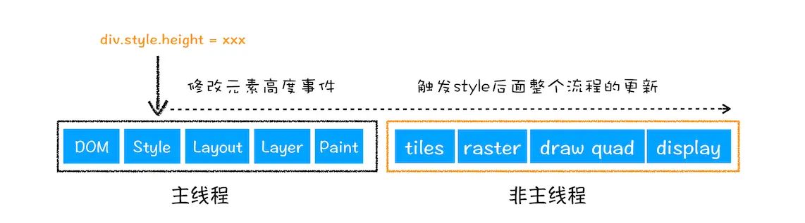

从上图可以看出，如果你通过 JavaScript 或者 CSS 修改元素的几何位置属性，例如改变元素的宽度、高度等，那么浏览器会触发重新布局，解析之后的一系列子阶段，这个过程就叫重排。无疑，重排需要更新完整的渲染流水线，所以开销也是最大的

### 更新元素的绘制属性（重绘）

接下来，我们再来看看重绘，比如通过 JavaScript 更改某些元素的背景颜色，渲染流水线会怎样调整呢？你可以参考下图：


从图中可以看出，如果修改了元素的背景颜色，那么布局阶段将不会被执行，因为并没有引起几何位置的变换，所以就直接进入了绘制阶段，然后执行之后的一系列子阶段，这个过程就叫重绘。相较于重排操作，重绘省去了布局和分层阶段，所以执行效率会比重排操作要高一些。

### 直接合成阶段

那如果你更改一个既不要布局也不要绘制的属性，会发生什么变化呢？渲染引擎将跳过布局和绘制，只执行后续的合成操作，我们把这个过程叫做合成。具体流程参考下图

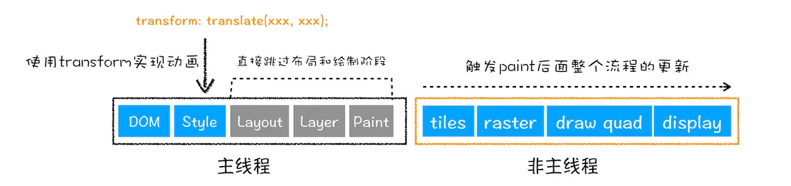

在上图中，我们使用了 CSS 的 transform 来实现动画效果，这可以避开重排和重绘阶段，直接在非主线程上执行合成动画操作。这样的效率是最高的，因为是在非主线程上合成，并没有占用主线程的资源，另外也避开了布局和绘制两个子阶段，所以相对于重绘和重排，合成能大大提升绘制效率。

至于如何用这些概念去优化页面，我们会在后面相关章节做详细讲解的，这里你只需要先结合“渲染流水线”弄明白这三个概念及原理就行

## 总结

通过本文的分析，你应该可以看到，Chrome 的渲染流水线还是相当复杂晦涩，且难以理解，不过 Chrome 团队在不断添加新功能的同时，也在不断地重构一些子阶段，目的就是让整体渲染架构变得更加简单和高效，正所谓大道至简。

## 思考时间

在优化 Web 性能的方法中，减少重绘、重排是一种很好的优化方式，那么结合文中的分析，你能总结出来为什么减少重绘、重排能优化 Web 性能吗？那又有那些具体的实践方法能减少重绘、重排呢？

- 触发 repaint reflow 的操作尽量放在一起，比如改变 dom 高度和设置 margin 分开写，可能会出发两次重排
- 通过虚拟 dom 层计算出操作总得差异，一起提交给浏览器。之前还用过 createdocumentfragment 来汇总 append 的 dom,来减少触发重排重绘次数。
