# 栈空间和堆空间：数据是如何存储的

对于前端开发者来说，JavaScript 的内存机制是一个不被经常提及的概念，因此很容易被忽视。特别是一些非计算机专业的同学，对内存机制可能没有非常清晰的认识，甚至有些同学根本就不知道 JavaScript 的内存机制是什么。

但是如果你想成为行业专家，并打造高性能前端应用，那么你就必须要搞清楚 JavaScript 的内存机制了。

其实，要搞清楚 JavaScript 的内存机制并不是一件很困难的事，在接下来的三篇文章（数据在内存中的存放、JavaScript 处理垃圾回收以及 V8 执行代码）中，我们将通过内存机制的介绍，循序渐进带你走进 JavaScript 内存的世界。

今天我们讲述第一部分的内容——JavaScript 中的数据是如何存储在内存中的。虽然 JavaScript 并不需要直接去管理内存，但是在实际项目中为了能避开一些不必要的坑，你还是需要了解数据在内存中的存储方式的

## 让人疑惑的代码

首先，我们先看下面这两段代码：

```js
function foo() {
  var a = 1;
  var b = a;
  a = 2;
  console.log(a);
  console.log(b);
}
foo();
```

```js
function foo() {
  var a = { name: '极客时间' };
  var b = a;
  a.name = '极客邦';
  console.log(a);
  console.log(b);
}
foo();
```

若执行上述这两段代码，你知道它们输出的结果是什么吗？下面我们就来一个一个分析下。

执行第一段代码，打印出来 a 的值是 2，b 的值是 1，这没什么难以理解的。

接着，再执行第二段代码，你会发现，仅仅改变了 a 中 name 的属性值，但是最终 a 和 b 打印出来的值都是 `{name: "极客邦"}`。这就和我们预期的不一致了，因为我们想改变的仅仅是 a 的内容，但 b 的内容也同时被改变了。

要彻底弄清楚这个问题，我们就得先从“JavaScript 是什么类型的语言”讲起。

## JavaScript 是什么类型的语言

每种编程语言都具有内建的数据类型，但它们的数据类型常有不同之处，使用方式也很不一样，比如 C 语言在定义变量之前，就需要确定变量的类型，你可以看下面这段 C 代码：

```c++
int main()
{
   int a = 1;
   char* b = " 极客时间 ";
   bool c = true;
   return 0;
}
```

上述代码声明变量的特点是：在声明变量之前需要先定义变量类型，我们把这种在使用之前就需要确认其变量数据类型的称为静态语言。

相反地，我们把在运行过程中需要检查数据类型的语言称为动态语言。比如我们所讲的 JavaScript 就是动态语言，因为在声明变量之前并不需要确认其数据类型。

虽然 C 语言是静态，但是在 C 语言中，我们可以把其他类型数据赋予给一个声明好的变量，如：

```
c = a
```

前面代码中，我们把 int 型的变量 a 赋值给了 bool 型的变量 c，这段代码也是可以编译执行的，因为在赋值过程中，C 编译器会把 int 型的变量悄悄转换为 bool 型的变量，我们通常把这种偷偷转换的操作称为隐式类型转换。而支持隐式类型转换的语言称为弱类型语言，不支持隐式类型转换的语言称为强类型语言。在这点上，C 和 JavaScript 都是弱类型语言。

对于各种语言的类型，你可以参考下图

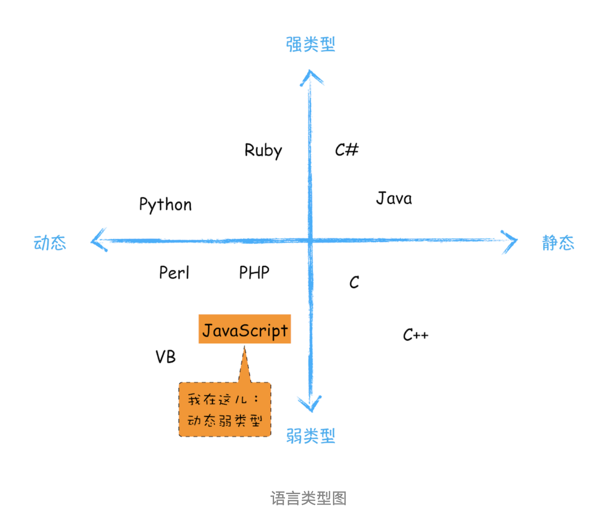

## JavaScript 的数据类型

现在我们知道了，JavaScript 是一种弱类型的、动态的语言。那这些特点意味着什么呢？

- 弱类型，意味着你不需要告诉 JavaScript 引擎这个或那个变量是什么数据类型，JavaScript 引擎在运行代码的时候自己会计算出来。
- 动态，意味着你可以使用同一个变量保存不同类型的数据

那么接下来，我们再来看看 JavaScript 的数据类型，你可以看下面这段代码：

```js
var bar;
bar = 12;
bar = '极客时间';
bar = true;
bar = null;
bar = { name: '极客时间' };
```

从上述代码中你可以看出，我们声明了一个 bar 变量，然后可以使用各种类型的数据值赋予给该变量。

在 JavaScript 中，如果你想要查看一个变量到底是什么类型，可以使用“typeof”运算符。具体使用方式如下所示：

```js
var bar;
console.log(typeof bar); //undefined
bar = 12;
console.log(typeof bar); //number
bar = '极客时间';
console.log(typeof bar); //string
bar = true;
console.log(typeof bar); //boolean
bar = null;
console.log(typeof bar); //object
bar = { name: '极客时间' };
console.log(typeof bar); //object
```

执行这段代码，你可以看到打印出来了不同的数据类型，有 undefined、number、boolean、object 等。那么接下来我们就来谈谈 JavaScript 到底有多少种数据类型。

其实 JavaScript 中的数据类型一种有 8 种，它们分别是：

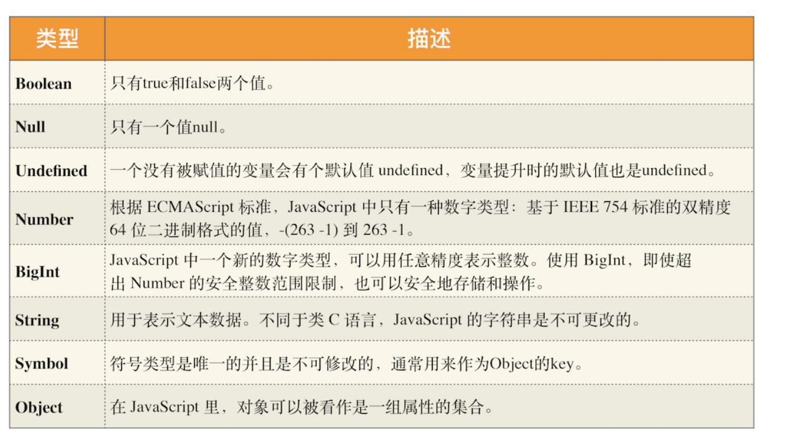

了解这些类型之后，还有三点需要你注意一下。

第一点，使用 typeof 检测 Null 类型时，返回的是 Object。这是当初 JavaScript 语言的一个 Bug，一直保留至今，之所以一直没修改过来，主要是为了兼容老的代码。

第二点，Object 类型比较特殊，它是由上述 7 种类型组成的一个包含了 key-value 对的数据类型。如下所示：

```js
let myObj = {
  name: '极客时间',
  update: function(){....}
}
```

从中你可以看出来，Object 是由 key-value 组成的，其中的 vaule 可以是任何类型，包括函数，这也就意味着你可以通过 Object 来存储函数，Object 中的函数又称为方法，比如上述代码中的 update 方法。

第三点，我们把前面的 7 种数据类型称为原始类型，把最后一个对象类型称为引用类型，之所以把它们区分为两种不同的类型，是因为它们在内存中存放的位置不一样。到底怎么个不一样法呢？接下来，我们就来讲解一下 JavaScript 的原始类型和引用类型到底是怎么储存的。

## 内存空间

要理解 JavaScript 在运行过程中数据是如何存储的，你就得先搞清楚其存储空间的种类。下面是我画的 JavaScript 的内存模型，你可以参考下：


从图中可以看出， 在 JavaScript 的执行过程中， 主要有三种类型内存空间，分别是代码空间、栈空间和堆空间。

其中的代码空间主要是存储可执行代码的，这个我们后面再做介绍，今天主要来说说栈空间和堆空间。

## 栈空间和堆空间

这里的栈空间就是我们之前反复提及的调用栈，是用来存储执行上下文的。为了搞清楚栈空间是如何存储数据的，我们还是先看下面这段代码：

```js
function foo() {
  var a = '极客时间';
  var b = a;
  var c = { name: '极客时间' };
  var d = c;
}
foo();
```

前面文章我们已经讲解过了，当执行一段代码时，需要先编译，并创建执行上下文，然后再按照顺序执行代码。那么下面我们来看看，当执行到第 3 行代码时，其调用栈的状态，你可以参考下面这张调用栈状态图：

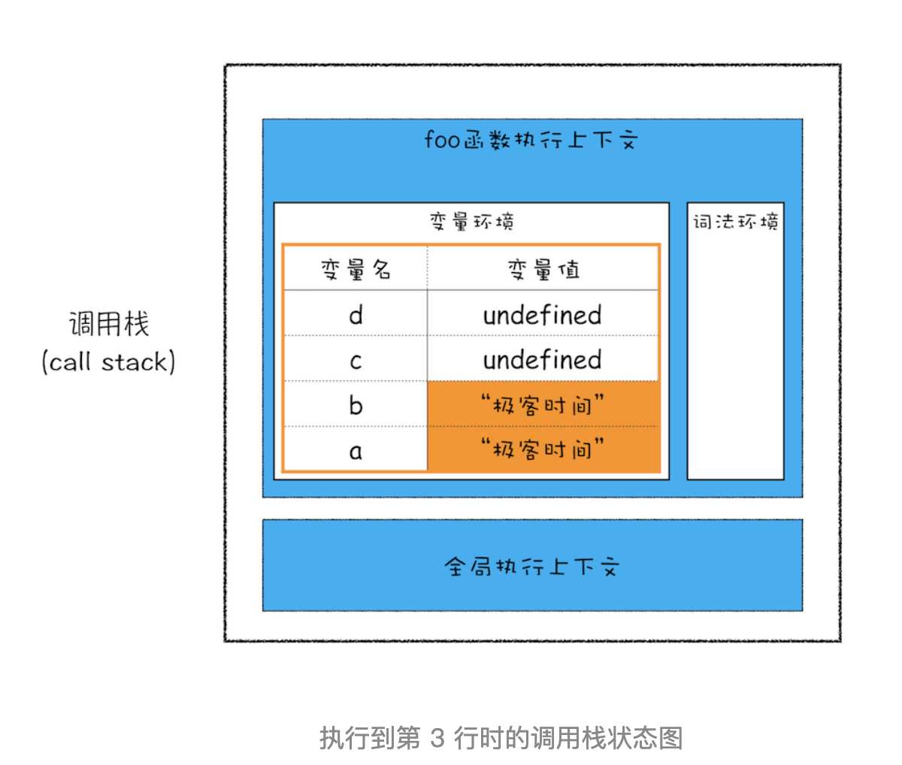

从图中可以看出来，当执行到第 3 行时，变量 a 和变量 b 的值都被保存在执行上下文中，而执行上下文又被压入到栈中，所以你也可以认为变量 a 和变量 b 的值都是存放在栈中的。

接下来继续执行第 4 行代码，由于 JavaScript 引擎判断右边的值是一个引用类型，这时候处理的情况就不一样了，JavaScript 引擎并不是直接将该对象存放到变量环境中，而是将它分配到堆空间里面，分配后该对象会有一个在“堆”中的地址，然后再将该数据的地址写进 c 的变量值，最终分配好内存的示意图如下所示：

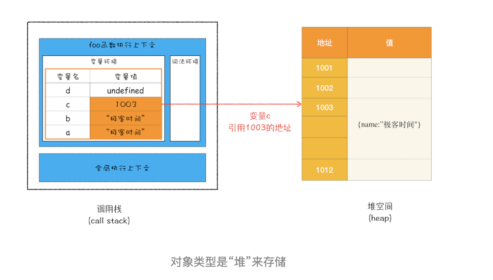

从上图你可以清晰地观察到，对象类型是存放在堆空间的，在栈空间中只是保留了对象的引用地址，当 JavaScript 需要访问该数据的时候，是通过栈中的引用地址来访问的，相当于多了一道转手流程。

好了，现在你应该知道了原始类型的数据值都是直接保存在“栈”中的，引用类型的值是存放在“堆”中的。不过你也许会好奇，为什么一定要分“堆”和“栈”两个存储空间呢？所有数据直接存放在“栈”中不就可以了吗？

答案是不可以的。这是因为 JavaScript 引擎需要用栈来维护程序执行期间上下文的状态，如果栈空间大了话，所有的数据都存放在栈空间里面，那么会影响到上下文切换的效率，进而又影响到整个程序的执行效率。比如文中的 foo 函数执行结束了，JavaScript 引擎需要离开当前的执行上下文，只需要将指针下移到上个执行上下文的地址就可以了，foo 函数执行上下文栈区空间全部回收，具体过程你可以参考下图：

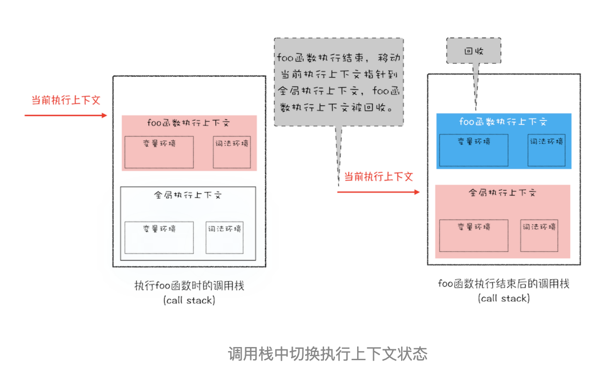

所以通常情况下，栈空间都不会设置太大，主要用来存放一些原始类型的小数据。而引用类型的数据占用的空间都比较大，所以这一类数据会被存放到堆中，堆空间很大，能存放很多大的数据，不过缺点是分配内存和回收内存都会占用一定的时间。

解释了程序在执行过程中为什么需要堆和栈两种数据结构后，我们还是回到示例代码那里，看看它最后一步将变量 c 赋值给变量 d 是怎么执行的？

在 JavaScript 中，赋值操作和其他语言有很大的不同，原始类型的赋值会完整复制变量值，而引用类型的赋值是复制引用地址。

所以 d=c 的操作就是把 c 的引用地址赋值给 d，你可以参考下图

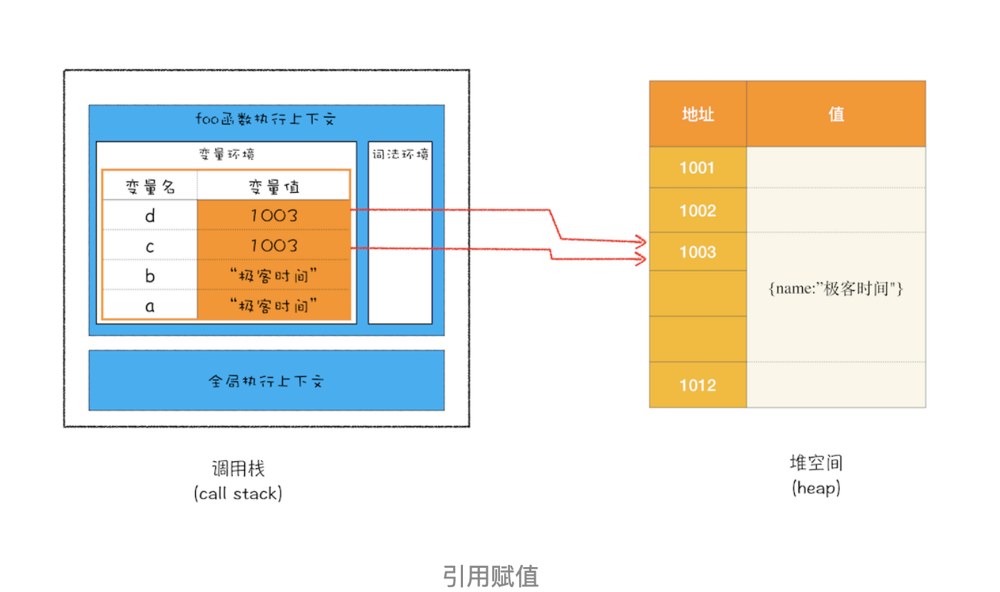

从图中你可以看到，变量 c 和变量 d 都指向了同一个堆中的对象，所以这就很好地解释了文章开头的那个问题，通过 c 修改 name 的值，变量 d 的值也跟着改变，归根结底它们是同一个对象。

## 再谈闭包

现在你知道了作用域内的原始类型数据会被存储到栈空间，引用类型会被存储到堆空间，基于这两点的认知，我们再深入一步，探讨下闭包的内存模型。

```js
function foo() {
  var myName = '极客时间';
  let test1 = 1;
  const test2 = 2;
  var innerBar = {
    setName: function(newName) {
      myName = newName;
    },
    getName: function() {
      console.log(test1);
      return myName;
    }
  };
  return innerBar;
}
var bar = foo();
bar.setName('极客邦');
bar.getName();
console.log(bar.getName());
```

当执行这段代码的时候，你应该有过这样的分析：由于变量 myName、test1、test2 都是原始类型数据，所以在执行 foo 函数的时候，它们会被压入到调用栈中；当 foo 函数执行结束之后，调用栈中 foo 函数的执行上下文会被销毁，其内部变量 myName、test1、test2 也应该一同被销毁。

要解释这个现象，我们就得站在内存模型的角度来分析这段代码的执行流程。

- 当 JavaScript 引擎执行到 foo 函数时，首先会编译，并创建一个空执行上下文。
- 在编译过程中，遇到内部函数 setName，JavaScript 引擎还要对内部函数做一次快速的词法扫描，发现该内部函数引用了 foo - 函数中的 myName 变量，由于是内部函数引用了外部函数的变量，所以 JavaScript 引擎判断这是一个闭包，于是在堆空间创建换一个“closure(foo)”的对象（这是一个内部对象，JavaScript 是无法访问的），用来保存 myName 变量。
- 接着继续扫描到 getName 方法时，发现该函数内部还引用变量 test1，于是 JavaScript 引擎又将 test1 添加到“closure(foo)”对象中。这时候堆中的“closure(foo)”对象中就包含了 myName 和 test1 两个变量了。
- 由于 test2 并没有被内部函数引用，所以 test2 依然保存在调用栈中

通过上面的分析，我们可以画出执行到 foo 函数中“return innerBar”语句时的调用栈状态，如下图所示：

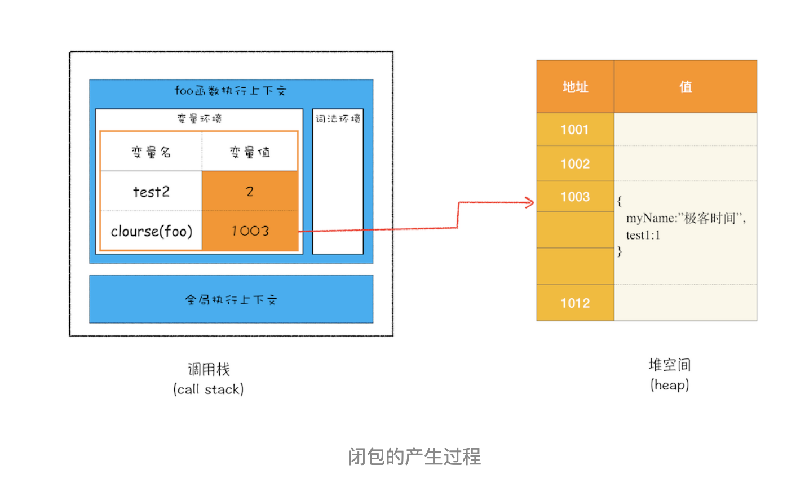

从上图你可以清晰地看出，当执行到 foo 函数时，闭包就产生了；当 foo 函数执行结束之后，返回的 getName 和 setName 方法都引用“clourse(foo)”对象，所以即使 foo 函数退出了，“clourse(foo)”依然被其内部的 getName 和 setName 方法引用。所以在下次调用 bar.setName 或者 bar.getName 时，创建的执行上下文中就包含了“clourse(foo)”。

总的来说，产生闭包的核心有两步：第一步是需要预扫描内部函数；第二步是把内部函数引用的外部变量保存到堆中。

## 总结

好了，今天就讲到这里，下面我来简单总结下今天的要点。

我们介绍了 JavaScript 中的 8 种数据类型，它们可以分为两大类——原始类型和引用类型。

其中，原始类型的数据是存放在栈中，引用类型的数据是存放在堆中的。堆中的数据是通过引用和变量关联起来的。也就是说，JavaScript 的变量是没有数据类型的，值才有数据类型，变量可以随时持有任何类型的数据。

然后我们分析了，在 JavaScript 中将一个原始类型的变量 a 赋值给 b，那么 a 和 b 会相互独立、互不影响；但是将引用类型的变量 a 赋值给变量 b，那会导致 a、b 两个变量都同时指向了堆中的同一块数据。

最后，我们还站在内存模型的视角分析了闭包的产生过程。

## 思考时间

在实际的项目中，经常需要完整地拷贝一个对象，也就是说拷贝完成之后两个对象之间就不能互相影响。那该如何实现呢？

结合下面这段代码，你可以分析下它是如何将对象 jack 拷贝给 jack2，然后在完成拷贝操作时两个 jack 还互不影响的呢。

```js
let jack = {
  name: 'jack.ma',
  age: 40,
  like: {
    dog: {
      color: 'black',
      age: 3
    },
    cat: {
      color: 'white',
      age: 2
    }
  }
};
function copy(src) {
  let dest;
  // 实现拷贝代码，将 src 的值完整地拷贝给 dest
  // 在这里实现
  return dest;
}
let jack2 = copy(jack);

// 比如修改 jack2 中的内容，不会影响到 jack 中的值
jack2.like.dog.color = 'green';
console.log(jack.like.dog.color); // 打印出来的应该是 "black"
```

关于 foo 函数执行上下文销毁过程：foo 函数执行结束之后，当前执行状态的指针下移到栈中的全局执行上下文的位置，foo 函数的执行上下文的那块数据就挪出来，这也就是 foo 函数执行上下文的销毁过程，这个文中有提到，你可以参考“调用栈中切换执行上下文状态“图。

第二个问题：innerBar 返回后，含有 setName 和 getName 对象，这两个对象里面包含了堆中的 closure(foo)的引用。虽然 foo 执行上下文销毁了，foo 函数中的对 closure(foo)的引用也断开了，但是 setName 和 getName 里面又重新建立起来了对 closure(foo)引用。

你可以：

- 打开“开发者工具”
- 在控制台执行上述代码
- 然后选择“Memory”标签，点击"take snapshot" 获取 V8 的堆内存快照。
- 然后“command+f"(mac) 或者 "ctrl+f"(win),搜索“setName”，然后你就会发现 setName 对象下面包含了 raw_outer_scope_info_or_feedback_metadata，对闭包的引用数据就在这里面。`

# 垃圾回收：垃圾数据如何自动回收

有些数据被使用之后，可能就不再需要了，我们把这种数据称为垃圾数据。如果这些垃圾数据一直保存在内存中，那么内存会越用越多，所以我们需要对这些垃圾数据进行回收，以释放有限的内存空间

## 不同语言的垃圾回收策略

通常情况下，垃圾数据回收分为手动回收和自动回收两种策略。

如 C/C++ 就是使用手动回收策略，何时分配内存、何时销毁内存都是由代码控制的，你可以参考下面这段 C 代码：

```c++
// 在堆中分配内存
char* p =  (char*)malloc(2048);  // 在堆空间中分配 2048 字节的空间，并将分配后的引用地址保存到 p 中

 // 使用 p 指向的内存
 {
   //....
 }

// 使用结束后，销毁这段内存
free(p)；
p = NULL；
```

从上面这段 C 代码可以看出来，要使用堆中的一块空间，我们需要先调用 mallco 函数分配内存，然后再使用；当不再需要这块数据的时候，就要手动调用 free 函数来释放内存。如果这段数据已经不再需要了，但是又没有主动调用 free 函数来销毁，那么这种情况就被称为内存泄漏。

另外一种使用的是自动垃圾回收的策略，如 JavaScript、Java、Python 等语言，产生的垃圾数据是由垃圾回收器来释放的，并不需要手动通过代码来释放。

对于 JavaScript 而言，也正是这个“自动”释放资源的特性带来了很多困惑，也让一些 JavaScript 开发者误以为可以不关心内存管理，这是一个很大的误解。

那么在本文，我们将围绕“JavaScript 的数据是如何回收的”这个话题来展开探讨。因为数据是存储在栈和堆两种内存空间中的，所以接下来我们就来分别介绍“栈中的垃圾数据”和“堆中的垃圾数据”是如何回收的。

## 调用栈中的数据是如何回收的

首先是调用栈中的数据，我们还是通过一段示例代码的执行流程来分析其回收机制，具体如下：

```js
function foo() {
  var a = 1;
  var b = { name: '极客邦' };
  function showName() {
    var c = '极客时间';
    var d = { name: '极客时间' };
  }
  showName();
}
foo();
```

当执行到第 6 行代码时，其调用栈和堆空间状态图如下所示：

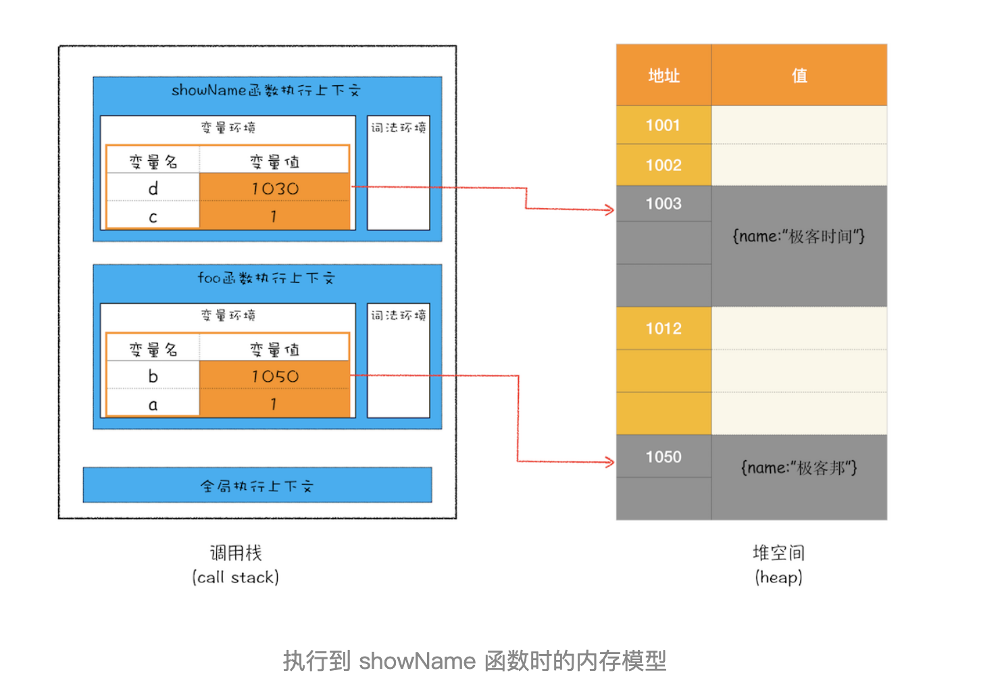

从图中可以看出，原始类型的数据被分配到栈中，引用类型的数据会被分配到堆中。当 foo 函数执行结束之后，foo 函数的执行上下文会从堆中被销毁掉，那么它是怎么被销毁的呢？下面我们就来分析一下。

在上篇文章中，我们简单介绍过了，如果执行到 showName 函数时，那么 JavaScript 引擎会创建 showName 函数的执行上下文，并将 showName 函数的执行上下文压入到调用栈中，最终执行到 showName 函数时，其调用栈就如上图所示。与此同时，还有一个记录当前执行状态的指针（称为 ESP），指向调用栈中 showName 函数的执行上下文，表示当前正在执行 showName 函数。

接着，当 showName 函数执行完成之后，函数执行流程就进入了 foo 函数，那这时就需要销毁 showName 函数的执行上下文了。ESP 这时候就帮上忙了，JavaScript 会将 ESP 下移到 foo 函数的执行上下文，这个下移操作就是销毁 showName 函数执行上下文的过程。

你可能会有点懵，ESP 指针向下移动怎么就能把 showName 的执行上下文销毁了呢？具体你可以看下面这张移动 ESP 前后的对比图

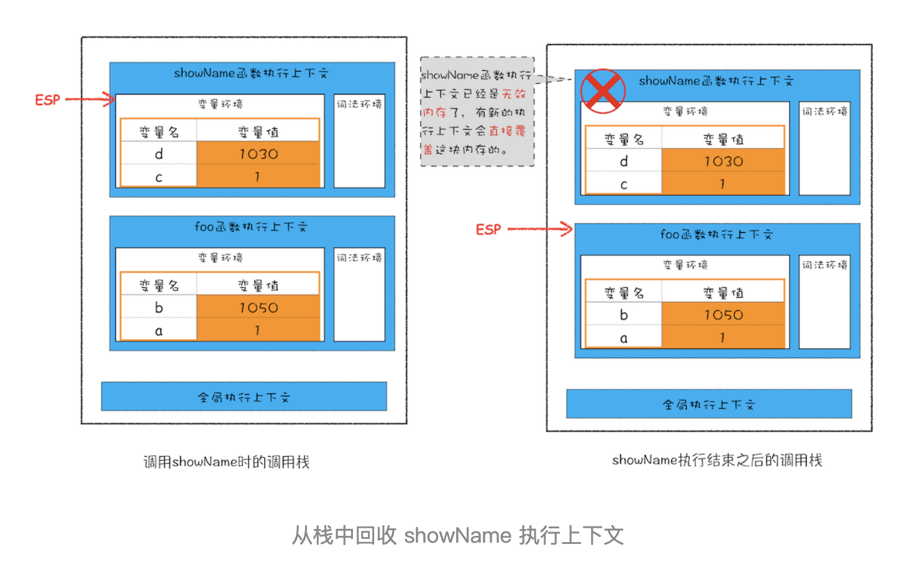

从图中可以看出，当 showName 函数执行结束之后，ESP 向下移动到 foo 函数的执行上下文中，上面 showName 的执行上下文虽然保存在栈内存中，但是已经是无效内存了。比如当 foo 函数再次调用另外一个函数时，这块内容会被直接覆盖掉，用来存放另外一个函数的执行上下文。

所以说，当一个函数执行结束之后，JavaScript 引擎会通过向下移动 ESP 来销毁该函数保存在栈中的执行上下文。

## 堆中的数据是如何回收的

通过上面的讲解，我想现在你应该已经知道，当上面那段代码的 foo 函数执行结束之后，ESP 应该是指向全局执行上下文的，那这样的话，showName 函数和 foo 函数的执行上下文就处于无效状态了，不过保存在堆中的两个对象依然占用着空间，如下图所示

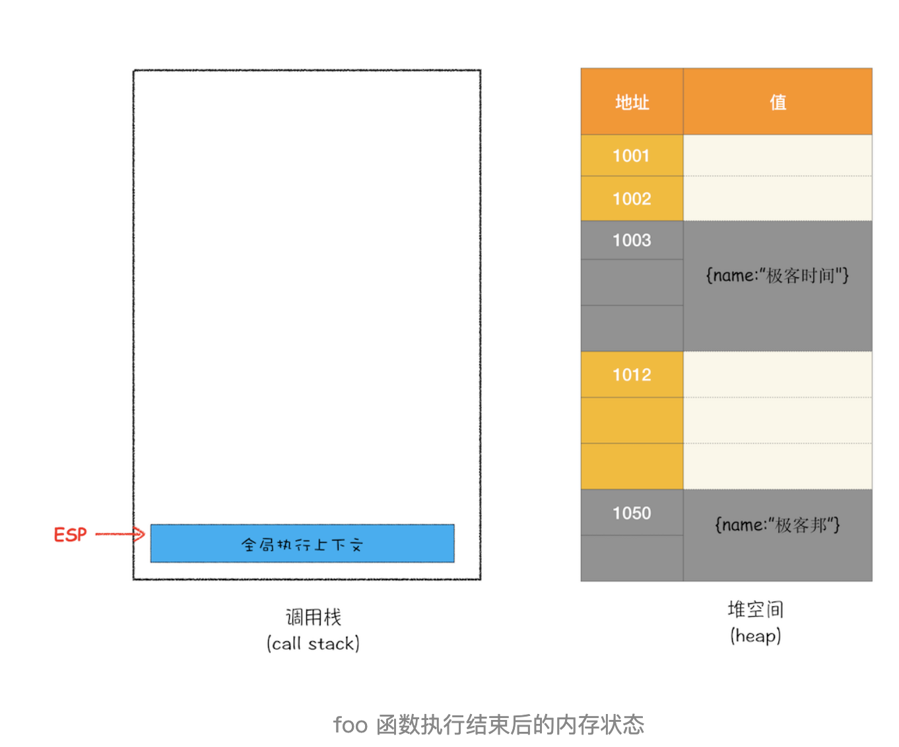

从图中可以看出，1003 和 1050 这两块内存依然被占用。要回收堆中的垃圾数据，就需要用到 JavaScript 中的垃圾回收器了。

所以，接下来我们就来通过 Chrome 的 JavaScript 引擎 V8 来分析下堆中的垃圾数据是如何回收的。

## 代际假说和分代收集

不过在正式介绍 V8 是如何实现回收之前，你需要先学习下代际假说（The Generational Hypothesis）的内容，这是垃圾回收领域中一个重要的术语，后续垃圾回收的策略都是建立在该假说的基础之上的，所以很是重要。

代际假说有以下两个特点：

- 第一个是大部分对象在内存中存在的时间很短，简单来说，就是很多对象一经分配内存，很快就变得不可访问；
- 第二个是不死的对象，会活得更久。

其实这两个特点不仅仅适用于 JavaScript，同样适用于大多数的动态语言，如 Java、Python 等。

有了代际假说的基础，我们就可以来探讨 V8 是如何实现垃圾回收的了。

通常，垃圾回收算法有很多种，但是并没有哪一种能胜任所有的场景，你需要权衡各种场景，根据对象的生存周期的不同而使用不同的算法，以便达到最好的效果。

所以，在 V8 中会把堆分为新生代和老生代两个区域，新生代中存放的是生存时间短的对象，老生代中存放的生存时间久的对象。

新生区通常只支持 1 ～ 8M 的容量，而老生区支持的容量就大很多了。对于这两块区域，V8 分别使用两个不同的垃圾回收器，以便更高效地实施垃圾回收。

- 副垃圾回收器，主要负责新生代的垃圾回收。
- 主垃圾回收器，主要负责老生代的垃圾回收。

## 垃圾回收器的工作流程

现在你知道了 V8 把堆分成两个区域——新生代和老生代，并分别使用两个不同的垃圾回收器。其实不论什么类型的垃圾回收器，它们都有一套共同的执行流程。

第一步是标记空间中活动对象和非活动对象。所谓活动对象就是还在使用的对象，非活动对象就是可以进行垃圾回收的对象。

第二步是回收非活动对象所占据的内存。其实就是在所有的标记完成之后，统一清理内存中所有被标记为可回收的对象。

第三步是做内存整理。一般来说，频繁回收对象后，内存中就会存在大量不连续空间，我们把这些不连续的内存空间称为内存碎片。当内存中出现了大量的内存碎片之后，如果需要分配较大连续内存的时候，就有可能出现内存不足的情况。所以最后一步需要整理这些内存碎片，但这步其实是可选的，因为有的垃圾回收器不会产生内存碎片，比如接下来我们要介绍的副垃圾回收器。

那么接下来，我们就按照这个流程来分析新生代垃圾回收器（副垃圾回收器）和老生代垃圾回收器（主垃圾回收器）是如何处理垃圾回收的。

## 副垃圾回收器

副垃圾回收器主要负责新生区的垃圾回收。而通常情况下，大多数小的对象都会被分配到新生区，所以说这个区域虽然不大，但是垃圾回收还是比较频繁的。

新生代中用 Scavenge 算法来处理。所谓 Scavenge 算法，是把新生代空间对半划分为两个区域，一半是对象区域，一半是空闲区域，如下图所示

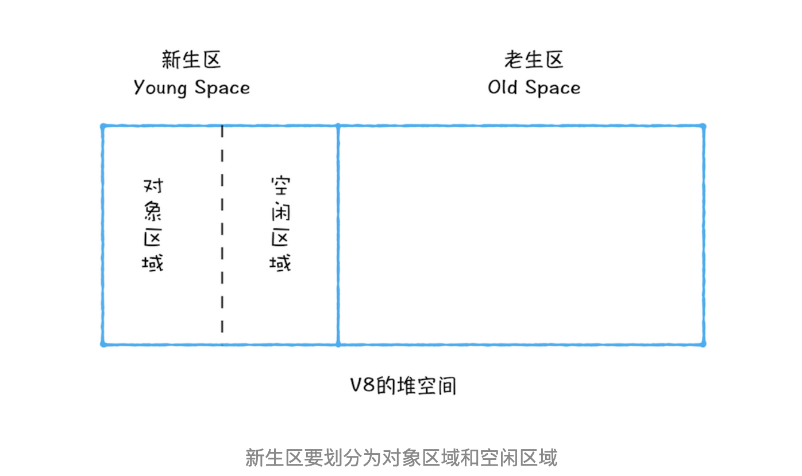

新加入的对象都会存放到对象区域，当对象区域快被写满时，就需要执行一次垃圾清理操作。

在垃圾回收过程中，首先要对对象区域中的垃圾做标记；标记完成之后，就进入垃圾清理阶段，副垃圾回收器会把这些存活的对象复制到空闲区域中，同时它还会把这些对象有序地排列起来，所以这个复制过程，也就相当于完成了内存整理操作，复制后空闲区域就没有内存碎片了。

完成复制后，对象区域与空闲区域进行角色翻转，也就是原来的对象区域变成空闲区域，原来的空闲区域变成了对象区域。这样就完成了垃圾对象的回收操作，同时这种角色翻转的操作还能让新生代中的这两块区域无限重复使用下去。

由于新生代中采用的 Scavenge 算法，所以每次执行清理操作时，都需要将存活的对象从对象区域复制到空闲区域。但复制操作需要时间成本，如果新生区空间设置得太大了，那么每次清理的时间就会过久，所以为了执行效率，一般新生区的空间会被设置得比较小。

也正是因为新生区的空间不大，所以很容易被存活的对象装满整个区域。为了解决这个问题，JavaScript 引擎采用了对象晋升策略，也就是经过两次垃圾回收依然还存活的对象，会被移动到老生区中。

## 主垃圾回收器

主垃圾回收器主要负责老生区中的垃圾回收。除了新生区中晋升的对象，一些大的对象会直接被分配到老生区。因此老生区中的对象有两个特点，一个是对象占用空间大，另一个是对象存活时间长。

由于老生区的对象比较大，若要在老生区中使用 Scavenge 算法进行垃圾回收，复制这些大的对象将会花费比较多的时间，从而导致回收执行效率不高，同时还会浪费一半的空间。因而，主垃圾回收器是采用标记 - 清除（Mark-Sweep）的算法进行垃圾回收的。下面我们来看看该算法是如何工作的。

首先是标记过程阶段。标记阶段就是从一组根元素开始，递归遍历这组根元素，在这个遍历过程中，能到达的元素称为活动对象，没有到达的元素就可以判断为垃圾数据。

比如最开始的那段代码，当 showName 函数执行退出之后，这段代码的调用栈和堆空间如下图所示：

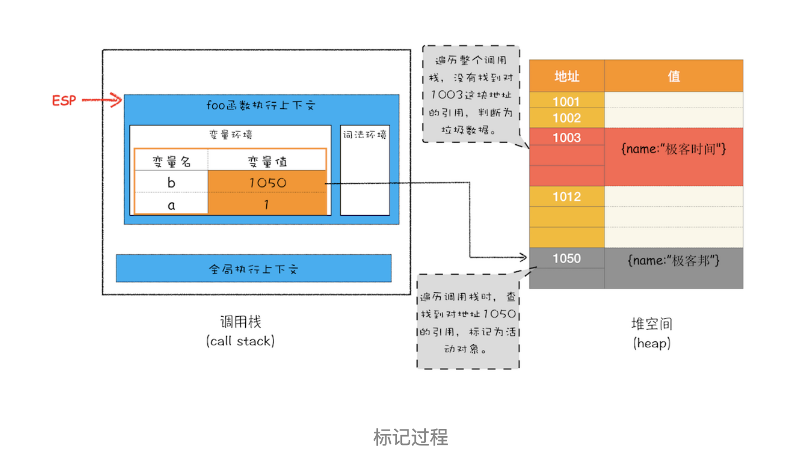

从上图你可以大致看到垃圾数据的标记过程，当 showName 函数执行结束之后，ESP 向下移动，指向了 foo 函数的执行上下文，这时候如果遍历调用栈，是不会找到引用 1003 地址的变量，也就意味着 1003 这块数据为垃圾数据，被标记为红色。由于 1050 这块数据被变量 b 引用了，所以这块数据会被标记为活动对象。这就是大致的标记过程。

接下来就是垃圾的清除过程。它和副垃圾回收器的垃圾清除过程完全不同，你可以理解这个过程是清除掉红色标记数据的过程，可参考下图大致理解下其清除过程：

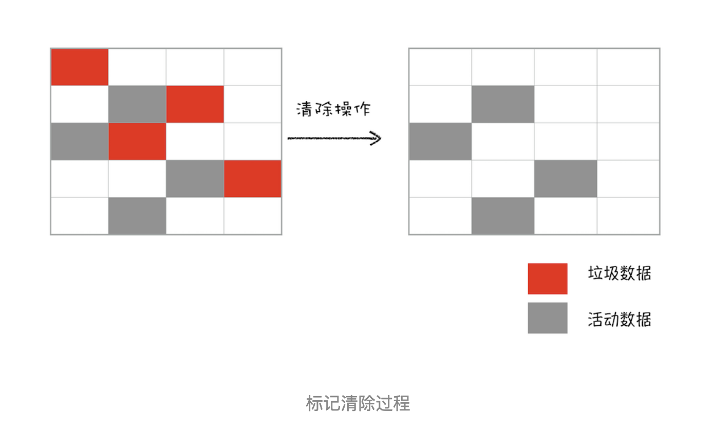

上面的标记过程和清除过程就是标记 - 清除算法，不过对一块内存多次执行标记 - 清除算法后，会产生大量不连续的内存碎片。而碎片过多会导致大对象无法分配到足够的连续内存，于是又产生了另外一种算法——标记 - 整理（Mark-Compact），这个标记过程仍然与标记 - 清除算法里的是一样的，但后续步骤不是直接对可回收对象进行清理，而是让所有存活的对象都向一端移动，然后直接清理掉端边界以外的内存。你可以参考下图

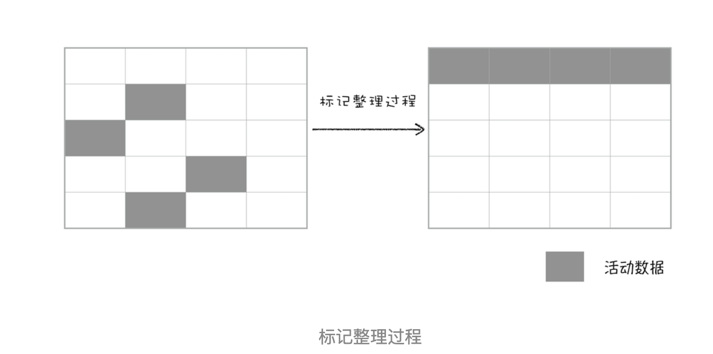

## 全停顿

现在你知道了 V8 是使用副垃圾回收器和主垃圾回收器处理垃圾回收的，不过由于 JavaScript 是运行在主线程之上的，一旦执行垃圾回收算法，都需要将正在执行的 JavaScript 脚本暂停下来，待垃圾回收完毕后再恢复脚本执行。我们把这种行为叫做全停顿（Stop-The-World）。

比如堆中的数据有 1.5GB，V8 实现一次完整的垃圾回收需要 1 秒以上的时间，这也是由于垃圾回收而引起 JavaScript 线程暂停执行的时间，若是这样的时间花销，那么应用的性能和响应能力都会直线下降。主垃圾回收器执行一次完整的垃圾回收流程如下图所示：

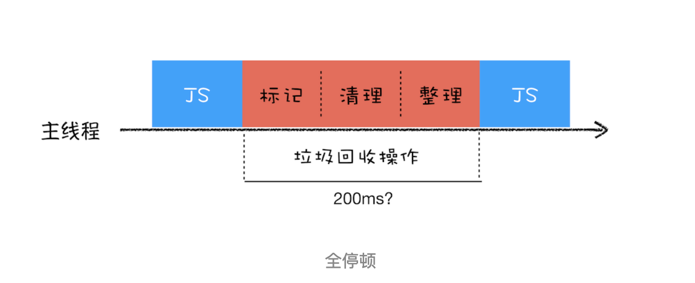

在 V8 新生代的垃圾回收中，因其空间较小，且存活对象较少，所以全停顿的影响不大，但老生代就不一样了。如果在执行垃圾回收的过程中，占用主线程时间过久，就像上面图片展示的那样，花费了 200 毫秒，在这 200 毫秒内，主线程是不能做其他事情的。比如页面正在执行一个 JavaScript 动画，因为垃圾回收器在工作，就会导致这个动画在这 200 毫秒内无法执行的，这将会造成页面的卡顿现象。

为了降低老生代的垃圾回收而造成的卡顿，V8 将标记过程分为一个个的子标记过程，同时让垃圾回收标记和 JavaScript 应用逻辑交替进行，直到标记阶段完成，我们把这个算法称为增量标记（Incremental Marking）算法。如下图所示：

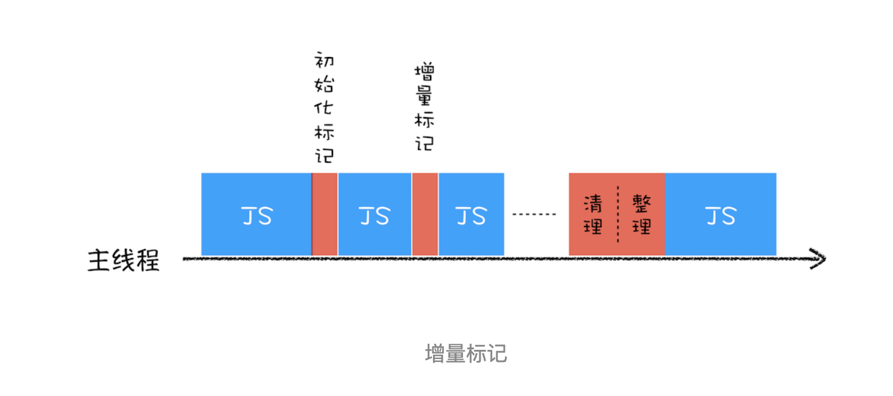

使用增量标记算法，可以把一个完整的垃圾回收任务拆分为很多小的任务，这些小的任务执行时间比较短，可以穿插在其他的 JavaScript 任务中间执行，这样当执行上述动画效果时，就不会让用户因为垃圾回收任务而感受到页面的卡顿了。

## 总结

首先我们介绍了不同语言的垃圾回收策略，然后又说明了栈中的数据是如何回收的，最后重点讲解了 JavaScript 中的垃圾回收器是如何工作的。

从上面的分析你也能看出来，无论是垃圾回收的策略，还是处理全停顿的策略，往往都没有一个完美的解决方案，你需要花一些时间来做权衡，而这需要牺牲当前某几方面的指标来换取其他几个指标的提升。

其实站在工程师的视角，我们经常需要在满足需求的前提下，权衡各个指标的得失，把系统设计得尽可能适应最核心的需求。

生活中处理事情的原则也与之类似，古人很早就说过“两害相权取其轻，两利相权取其重”，所以与其患得患失，不如冷静地分析哪些才是核心诉求，然后果断决策牺牲哪些以使得利益最大化。

# 编译器和解析器：V8 如何执行一段 JavaScript 代码的

前面我们已经花了很多篇幅来介绍 JavaScript 是如何工作的，了解这些内容能帮助你从底层理解 JavaScript 的工作机制，从而能帮助你更好地理解和应用 JavaScript。

今天这篇文章我们就继续“向下”分析，站在 JavaScript 引擎 V8 的视角，来分析 JavaScript 代码是如何被执行的。

前端工具和框架的自身更新速度非常块，而且还不断有新的出现。要想追赶上前端工具和框架的更新速度，你就需要抓住那些本质的知识，然后才能更加轻松地理解这些上层应用。比如我们接下来要介绍的 V8 执行机制，能帮助你从底层了解 JavaScript，也能帮助你深入理解语言转换器 Babel、语法检查工具 ESLint、前端框架 Vue 和 React 的一些底层实现机制。因此，了解 V8 的编译流程能让你对语言以及相关工具有更加充分的认识。

要深入理解 V8 的工作原理，你需要搞清楚一些概念和原理，比如接下来我们要详细讲解的编译器（Compiler）、解释器（Interpreter）、抽象语法树（AST）、字节码（Bytecode）、即时编译器（JIT）等概念，都是你需要重点关注的。

## 编译器和解释器

之所以存在编译器和解释器，是因为机器不能直接理解我们所写的代码，所以在执行程序之前，需要将我们所写的代码“翻译”成机器能读懂的机器语言。按语言的执行流程，可以把语言划分为编译型语言和解释型语言。

编译型语言在程序执行之前，需要经过编译器的编译过程，并且编译之后会直接保留机器能读懂的二进制文件，这样每次运行程序时，都可以直接运行该二进制文件，而不需要再次重新编译了。比如 C/C++、GO 等都是编译型语言。

而由解释型语言编写的程序，在每次运行时都需要通过解释器对程序进行动态解释和执行。比如 Python、JavaScript 等都属于解释型语言。

那编译器和解释器是如何“翻译”代码的呢？具体流程你可以参考下图

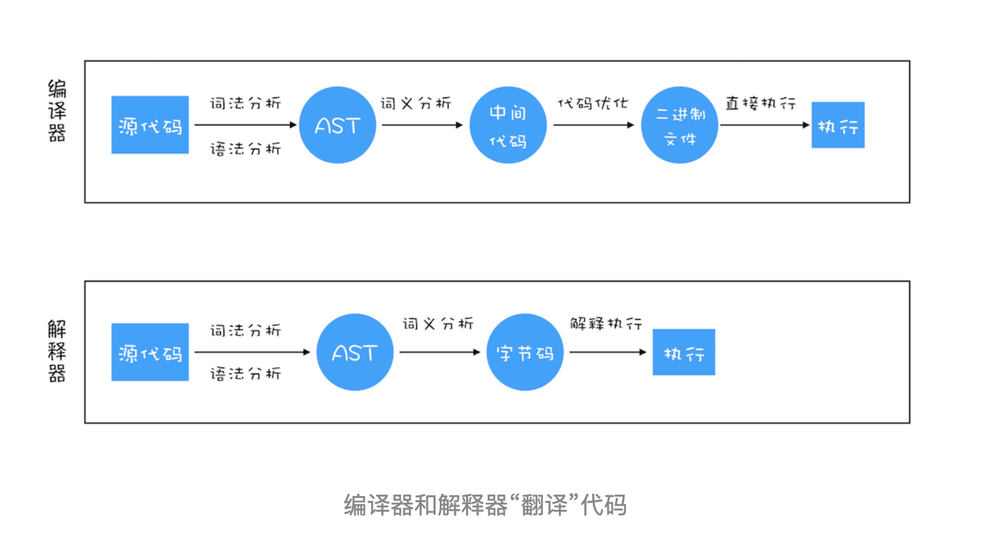

从图中你可以看出这二者的执行流程，大致可阐述为如下：

- 在编译型语言的编译过程中，编译器首先会依次对源代码进行词法分析、语法分析，生成抽象语法树（AST），然后是优化代码，最后再生成处理器能够理解的机器码。如果编译成功，将会生成一个可执行的文件。但如果编译过程发生了语法或者其他的错误，那么编译器就会抛出异常，最后的二进制文件也不会生成成功
- 在解释型语言的解释过程中，同样解释器也会对源代码进行词法分析、语法分析，并生成抽象语法树（AST），不过它会再基于抽象语法树生成字节码，最后再根据字节码来执行程序、输出结果。

## V8 是如何执行一段 JavaScript 代码的

通过上面的介绍，相信你已经了解编译器和解释器了。那接下来，我们就重点分析下 V8 是如何执行一段 JavaScript 代码的。你可以先来“一览全局”，参考下图：

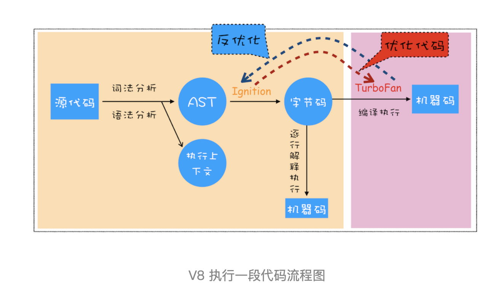

从图中可以清楚地看到，V8 在执行过程中既有解释器 Ignition，又有编译器 TurboFan，那么它们是如何配合去执行一段 JavaScript 代码的呢? 下面我们就按照上图来一一分解其执行流程。

### 生成抽象语法树（AST）和执行上下文

将源代码转换为抽象语法树，并生成执行上下文，而执行上下文我们在前面的文章中已经介绍过很多了，主要是代码在执行过程中的环境信息。

那么下面我们就得重点讲解下抽象语法树（下面表述中就直接用它的简称 AST 了），看看什么是 AST 以及 AST 的生成过程是怎样的。

高级语言是开发者可以理解的语言，但是让编译器或者解释器来理解就非常困难了。对于编译器或者解释器来说，它们可以理解的就是 AST 了。所以无论你使用的是解释型语言还是编译型语言，在编译过程中，它们都会生成一个 AST。这和渲染引擎将 HTML 格式文件转换为计算机可以理解的 DOM 树的情况类似。

你可以结合下面这段代码来直观地感受下什么是 AST：

```js
var myName = '极客时间';
function foo() {
  return 23;
}
myName = 'geektime';
foo();
```

这段代码经过 javascript-ast 站点处理后，生成的 AST 结构如下：

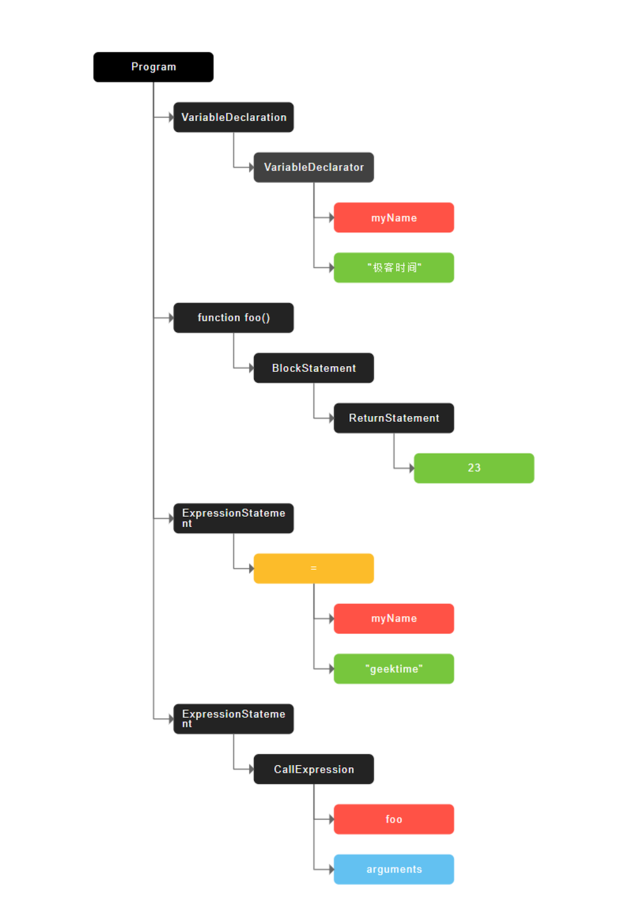

从图中可以看出，AST 的结构和代码的结构非常相似，其实你也可以把 AST 看成代码的结构化的表示，编译器或者解释器后续的工作都需要依赖于 AST，而不是源代码。

AST 是非常重要的一种数据结构，在很多项目中有着广泛的应用。其中最著名的一个项目是 Babel。Babel 是一个被广泛使用的代码转码器，可以将 ES6 代码转为 ES5 代码，这意味着你可以现在就用 ES6 编写程序，而不用担心现有环境是否支持 ES6。Babel 的工作原理就是先将 ES6 源码转换为 AST，然后再将 ES6 语法的 AST 转换为 ES5 语法的 AST，最后利用 ES5 的 AST 生成 JavaScript 源代码。

除了 Babel 外，还有 ESLint 也使用 AST。ESLint 是一个用来检查 JavaScript 编写规范的插件，其检测流程也是需要将源码转换为 AST，然后再利用 AST 来检查代码规范化的问题。

现在你知道了什么是 AST 以及它的一些应用，那接下来我们再来看下 AST 是如何生成的。通常，生成 AST 需要经过两个阶段。

第一阶段是分词（tokenize），又称为词法分析，其作用是将一行行的源码拆解成一个个 token。所谓 token，指的是语法上不可能再分的、最小的单个字符或字符串。你可以参考下图来更好地理解什么 token。

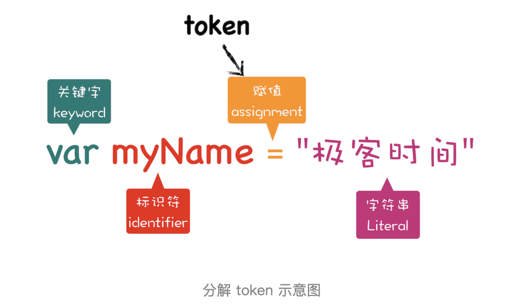

从图中可以看出，通过 var myName = “极客时间”简单地定义了一个变量，其中关键字“var”、标识符“myName” 、赋值运算符“=”、字符串“极客时间”四个都是 token，而且它们代表的属性还不一样。

第二阶段是解析（parse），又称为语法分析，其作用是将上一步生成的 token 数据，根据语法规则转为 AST。如果源码符合语法规则，这一步就会顺利完成。但如果源码存在语法错误，这一步就会终止，并抛出一个“语法错误”。

这就是 AST 的生成过程，先分词，再解析。

有了 AST 后，那接下来 V8 就会生成该段代码的执行上下文。至于执行上下文的具体内容，你可以参考前面几篇文章的讲解。

### 生成字节码

有了 AST 和执行上下文后，那接下来的第二步，解释器 Ignition 就登场了，它会根据 AST 生成字节码，并解释执行字节码。

其实一开始 V8 并没有字节码，而是直接将 AST 转换为机器码，由于执行机器码的效率是非常高效的，所以这种方式在发布后的一段时间内运行效果是非常好的。但是随着 Chrome 在手机上的广泛普及，特别是运行在 512M 内存的手机上，内存占用问题也暴露出来了，因为 V8 需要消耗大量的内存来存放转换后的机器码。为了解决内存占用问题，V8 团队大幅重构了引擎架构，引入字节码，并且抛弃了之前的编译器，最终花了将进四年的时间，实现了现在的这套架构。

那什么是字节码呢？为什么引入字节码就能解决内存占用问题呢？

字节码就是介于 AST 和机器码之间的一种代码。但是与特定类型的机器码无关，字节码需要通过解释器将其转换为机器码后才能执行。

理解了什么是字节码，我们再来对比下高级代码、字节码和机器码，你可以参考下图

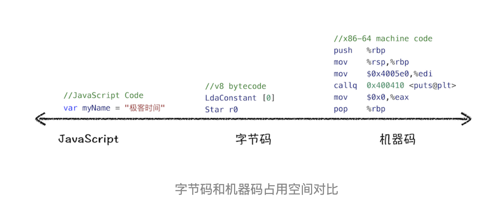

从图中可以看出，机器码所占用的空间远远超过了字节码，所以使用字节码可以减少系统的内存使用。

### 执行代码

生成字节码之后，接下来就要进入执行阶段了。

通常，如果有一段第一次执行的字节码，解释器 Ignition 会逐条解释执行。在执行字节码的过程中，如果发现有热点代码（HotSpot），比如一段代码被重复执行多次，这种就称为热点代码，那么后台的编译器 TurboFan 就会把该段热点的字节码编译为高效的机器码，然后当再次执行这段被优化的代码时，只需要执行编译后的机器码就可以了，这样就大大提升了代码的执行效率。

V8 的解释器和编译器的取名也很有意思。解释器 Ignition 是点火器的意思，编译器 TurboFan 是涡轮增压的意思，寓意着代码启动时通过点火器慢慢发动，一旦启动，涡轮增压介入，其执行效率随着执行时间越来越高效率，因为热点代码都被编译器 TurboFan 转换了机器码，直接执行机器码就省去了字节码“翻译”为机器码的过程。

其实字节码配合解释器和编译器是最近一段时间很火的技术，比如 Java 和 Python 的虚拟机也都是基于这种技术实现的，我们把这种技术称为即时编译（JIT）。具体到 V8，就是指解释器 Ignition 在解释执行字节码的同时，收集代码信息，当它发现某一部分代码变热了之后，TurboFan 编译器便闪亮登场，把热点的字节码转换为机器码，并把转换后的机器码保存起来，以备下次使用。

对于 JavaScript 工作引擎，除了 V8 使用了“字节码 +JIT”技术之外，苹果的 SquirrelFish Extreme 和 Mozilla 的 SpiderMonkey 也都使用了该技术。

这么多语言的工作引擎都使用了“字节码 +JIT”技术，因此理解 JIT 这套工作机制还是很有必要的。你可以结合下图看看 JIT 的工作过程：

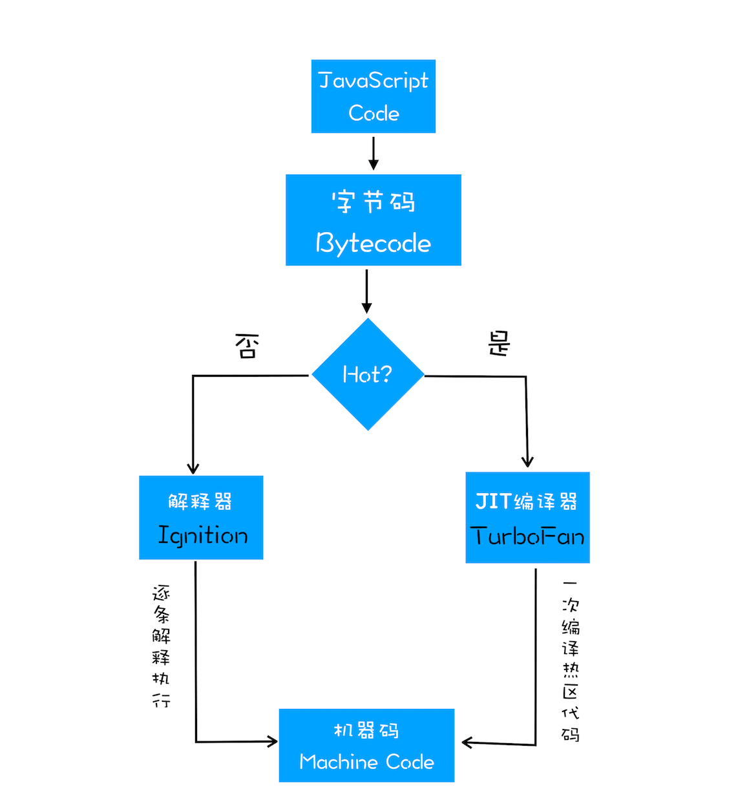

## JavaScript 的性能优化

到这里相信你现在已经了解 V8 是如何执行一段 JavaScript 代码的了。在过去几年中，JavaScript 的性能得到了大幅提升，这得益于 V8 团队对解释器和编译器的不断改进和优化。

虽然在 V8 诞生之初，也出现过一系列针对 V8 而专门优化 JavaScript 性能的方案，比如隐藏类、内联缓存等概念都是那时候提出来的。不过随着 V8 的架构调整，你越来越不需要这些微优化策略了，相反，对于优化 JavaScript 执行效率，你应该将优化的中心聚焦在单次脚本的执行时间和脚本的网络下载上，主要关注以下三点内容

- 提升单次脚本的执行速度，避免 JavaScript 的长任务霸占主线程，这样可以使得页面快速响应交互；
- 避免大的内联脚本，因为在解析 HTML 的过程中，解析和编译也会占用主线程；
- 减少 JavaScript 文件的容量，因为更小的文件会提升下载速度，并且占用更低的内存

## 总结

- 首先我们介绍了编译器和解释器的区别。
- 紧接着又详细分析了 V8 是如何执行一段 JavaScript 代码的：V8 依据 JavaScript 代码生成 AST 和执行上下文，再基于 AST 生成字节码，然后通过解释器执行字节码，通过编译器来优化编译字节码。
- 基于字节码和编译器，我们又介绍了 JIT 技术。
- 最后我们延伸说明了下优化 JavaScript 性能的一些策略。

之所以在本专栏里讲 V8 的执行流程，是因为我觉得编译器和解释器的相关概念和理论对于程序员来说至关重要，向上能让你充分理解一些前端应用的本质，向下能打开计算机编译原理的大门。通过这些知识的学习能让你将很多模糊的概念关联起来，使其变得更加清楚，从而拓宽视野，上升到更高的层次。
