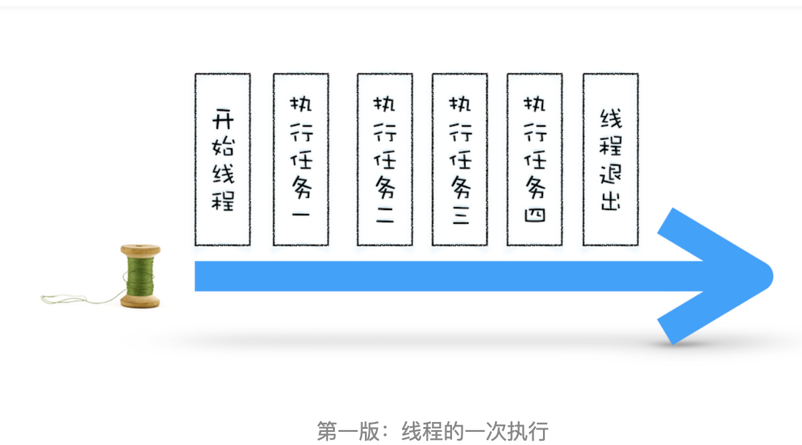
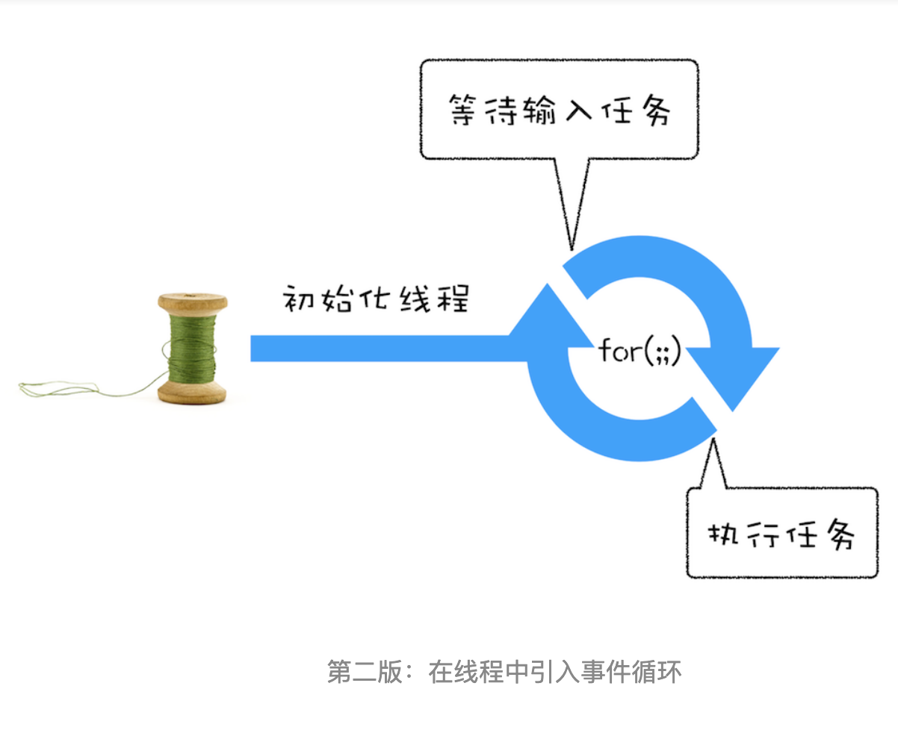
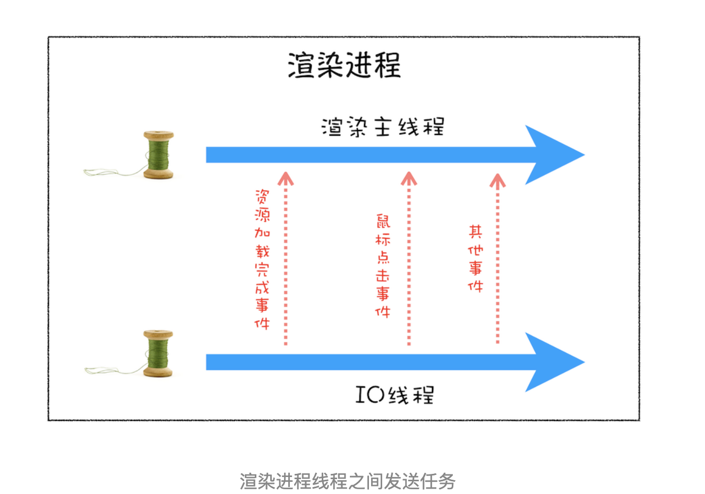
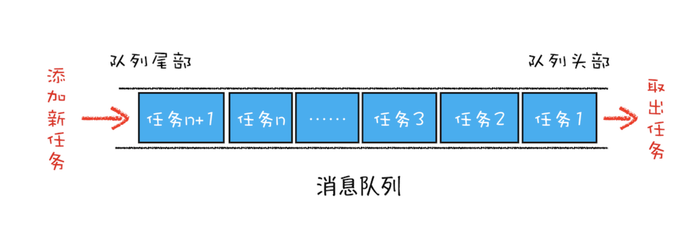
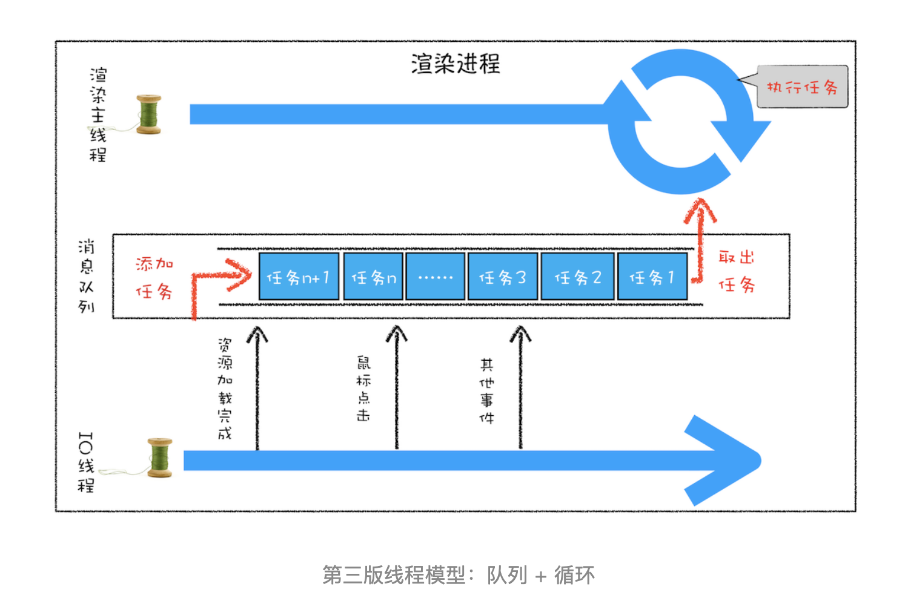
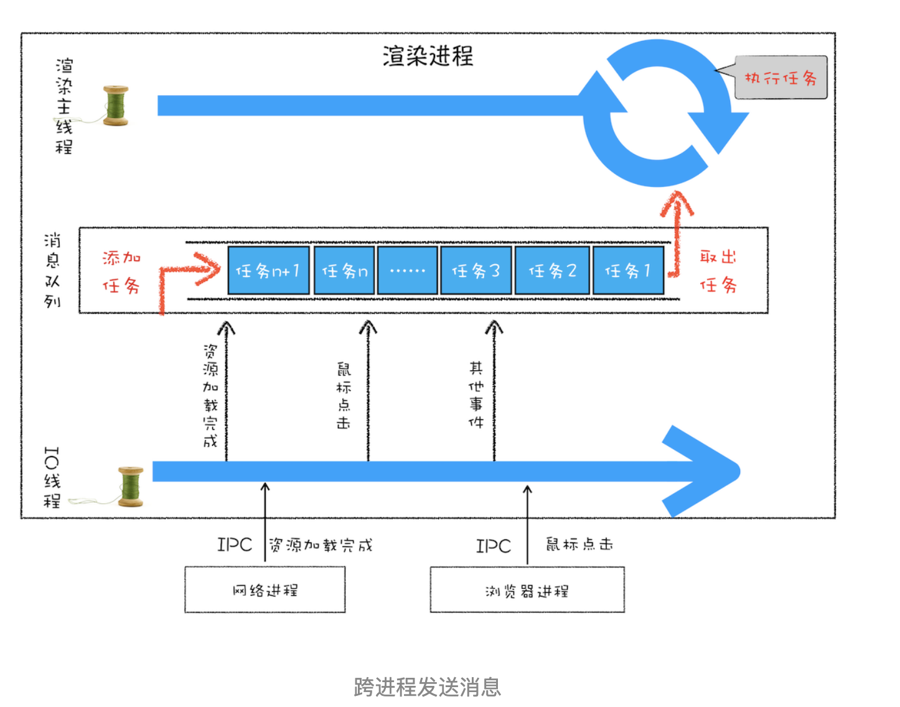
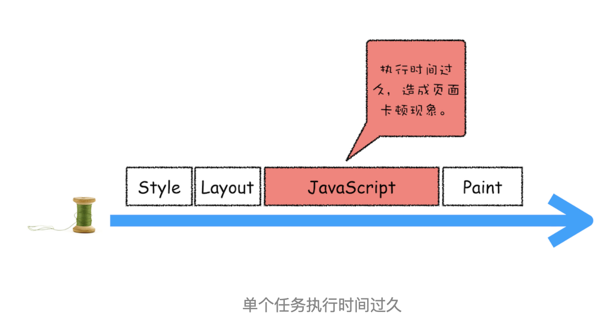
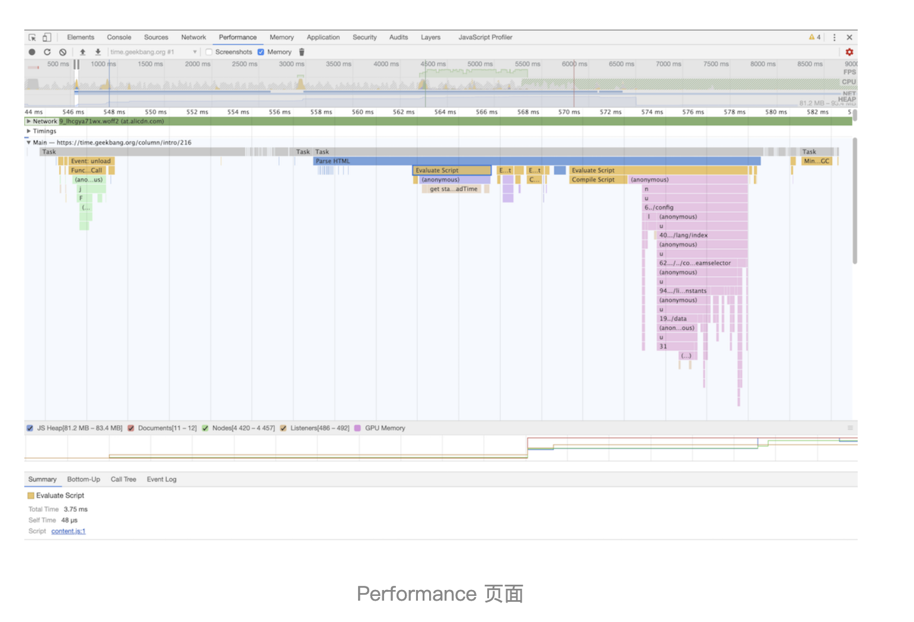
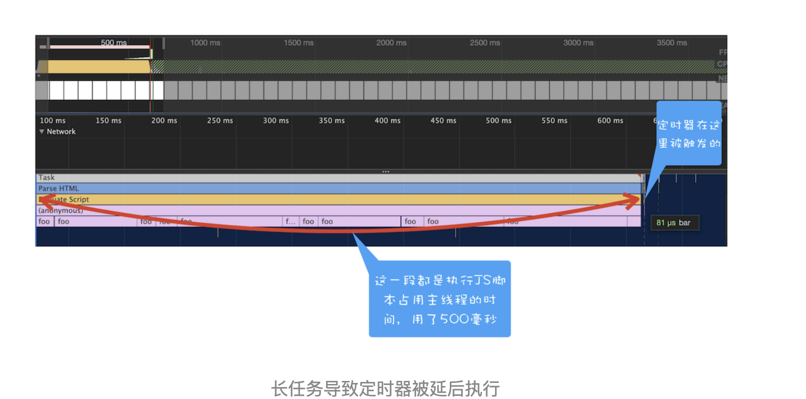
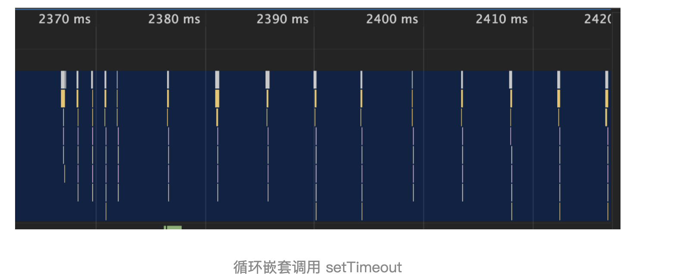

# 消息队列和事件循环：页面是怎么活起来的

前面我们讲到了每个渲染进程都有一个主线程，并且主线程非常繁忙，既要处理 DOM，又要计算样式，还要处理布局，同时还需要处理 JavaScript 任务以及各种输入事件。要让这么多不同类型的任务在主线程中有条不紊地执行，这就需要一个系统来统筹调度这些任务，这个统筹调度系统就是我们今天要讲的消息队列和事件循环系统。

在写这篇文章之前，我翻阅了大量的资料，却发现没有一篇文章能把消息循环系统给讲清楚的，所以我决定用一篇文章来专门介绍页面的事件循环系统。事件循环非常底层且非常重要，学会它能让你理解页面到底是如何运行的，所以在本篇文章中，我们会将页面的事件循环给梳理清楚、讲透彻。

为了能让你更加深刻地理解事件循环机制，我们就从最简单的场景来分析，然后带你一步步了解浏览器页面主线程是如何运作的。

需要说明的是，文章中的代码我会采用 C++ 来示范。如果你不熟悉 C++，也没有关系，这里并没有涉及到任何复杂的知识点，只要你了解 JavaScript 或 Python，你就会看懂

## 使用单线程处理安排好的任务

我们先从最简单的场景讲起，比如有如下一系列的任务：

- 任务 1：1+2
- 任务 2：20/5
- 任务 3：7\*8
- 任务 4：打印出任务 1、任务 2、任务 3 的运算结果

现在要在一个线程中去执行这些任务，通常我们会这样编写代码

```c++
void MainThread() {
  int num1 = 1+2; // 任务 1
  int num2 = 20/5; // 任务 2
  int num3 = 7*8; // 任务 3
  print(" 最终计算的值为:%d,%d,%d",num, num2, num3)； // 任务 4
}
```

在上面的执行代码中，我们把所有任务代码按照顺序写进主线程里，等线程执行时，这些任务会按照顺序在线程中依次被执行；等所有任务执行完成之后，线程会自动退出。可以参考下图来直观地理解下其执行过程：



## 在线程运行过程中处理新任务

但并不是所有的任务都是在执行之前统一安排好的，大部分情况下，新的任务是在线程运行过程中产生的。比如在线程执行过程中，又接收到了一个新的任务要求计算“10+2”，那上面那种方式就无法处理这种情况了。

要想在线程运行过程中，能接收并执行新的任务，就需要采用事件循环机制。我们可以通过一个 for 循环语句来监听是否有新的任务，如下面的示例代码：

```c++
// GetInput
// 等待用户从键盘输入一个数字，并返回该输入的数字
int GetInput() {
  int input_number = 0;
  cout<<"请输入一个数:";
  cin>>input_number;
  return input_number;
}

// 主线程(Main Thread)
void MainThread() {
  for(;;){
    int first_num = GetInput();
    int second_num = GetInput();
    result_num = first_num + second_num;
    print("最终计算的值为:%d",result_num);
  }
}
```

相较于第一版的线程，这一版的线程做了两点改进。

- 第一点引入了循环机制，具体实现方式是在线程语句最后添加了一个 for 循环语句，线程会一直循环执行。
- 第二点是引入了事件，可以在线程运行过程中，等待用户输入的数字，等待过程中线程处于暂停状态，一旦接收到用户输入的信息，那么线程会被激活，然后执行相加运算，最后输出结果。

通过引入事件循环机制，就可以让该线程“活”起来了，我们每次输入两个数字，都会打印出两数字相加的结果，你可以结合下图来参考下这个改进版的线程：



## 处理其他线程发送过来的任务

上面我们改进了线程的执行方式，引入了事件循环机制，可以让其在执行过程中接受新的任务。不过在第二版的线程模型中，所有的任务都是来自于线程内部的，如果另外一个线程想让主线程执行一个任务，利用第二版的线程模型是无法做到的。

那下面我们就来看看其他线程是如何发送消息给渲染主线程的，具体形式你可以参考下图：



从上图可以看出，渲染主线程会频繁接收到来自于 IO 线程的一些任务，接收到这些任务之后，渲染进程就需要着手处理，比如接收到资源加载完成的消息后，渲染进程就要着手进行 DOM 解析了；接收到鼠标点击的消息后，渲染主线程就要开始执行相应的 JavaScript 脚本来处理该点击事件。

那么如何设计好一个线程模型，能让其能够接收其他线程发送的消息呢？

一个通用模式是使用消息队列。在解释如何实现之前，我们先说说什么是消息队列，可以参考下图：



从图中可以看出，消息队列是一种数据结构，可以存放要执行的任务。它符合队列“先进先出”的特点，也就是说要添加任务的话，添加到队列的尾部；要取出任务的话，从队列头部去取。

有了队列之后，我们就可以继续改造线程模型了，改造方案如下图所示：



从上图可以看出，我们的改造可以分为下面三个步骤：

- 添加一个消息队列；
- IO 线程中产生的新任务添加进消息队列尾部；
- 渲染主线程会循环地从消息队列头部中读取任务，执行任务。

有了这些步骤之后，那么接下来我们就可以按步骤使用代码来实现第三版的线程模型。

首先，构造一个队列。当然，在本篇文章中我们不需要考虑队列实现的细节，只是构造队列的接口：

```c++
class TaskQueue{
  public:
  Task takeTask(); // 取出队列头部的一个任务
  void pushTask(Task task); // 添加一个任务到队列尾部
};
```

接下来，改造主线程，让主线程从队列中读取任务：

```c++
TaskQueue task_queue；
void ProcessTask();
void MainThread(){
  for(;;){
    Task task = task_queue.takeTask();
    ProcessTask(task);
  }
}
```

在上面的代码中，我们添加了一个消息队列的对象，然后在主线程的 for 循环代码块中，从消息队列中读取一个任务，然后执行该任务，主线程就这样一直循环往下执行，因此只要消息队列中有任务，主线程就会去执行。

主线程的代码就这样改造完成了。这样改造后，主线程执行的任务都全部从消息队列中获取。所以如果有其他线程想要发送任务让主线程去执行，只需要将任务添加到该消息队列中就可以了，添加任务的代码如下：

```c++
Task clickTask;
task_queue.pushTask(clickTask)
```

由于是多个线程操作同一个消息队列，所以在添加任务和取出任务时还会加上一个同步锁，这块内容也要注意下。

## 处理其他进程发送过来的任务

通过使用消息队列，我们实现了线程之间的消息通信。在 Chrome 中，跨进程之间的任务也是频繁发生的，那么如何处理其他进程发送过来的任务？你可以参考下图：



从图中可以看出，渲染进程专门有一个 IO 线程用来接收其他进程传进来的消息，接收到消息之后，会将这些消息组装成任务发送给渲染主线程，后续的步骤就和前面讲解的“处理其他线程发送的任务”一样了，这里就不再重复了。

## 消息队列中的任务类型

现在你知道页面主线程是如何接收外部任务的了，那接下来我们再来看看消息队列中的任务类型有哪些。你可以参考下 Chromium 的[官方源码](https://cs.chromium.org/chromium/src/third_party/blink/public/platform/task_type.h)，这里面包含了很多内部消息类型，如输入事件（鼠标滚动、点击、移动）、微任务、文件读写、WebSocket、JavaScript 定时器等等。

除此之外，消息队列中还包含了很多与页面相关的事件，如 JavaScript 执行、解析 DOM、样式计算、布局计算、CSS 动画等。

以上这些事件都是在主线程中执行的，所以在编写 Web 应用时，你还需要衡量这些事件所占用的时长，并想办法解决单个任务占用主线程过久的问题。

## 如何安全退出

当页面主线程执行完成之后，又该如何保证页面主线程能够安全退出呢？Chrome 是这样解决的，确定要退出当前页面时，页面主线程会设置一个退出标志的变量，在每次执行完一个任务时，判断是否有设置退出标志。

如果设置了，那么就直接中断当前的所有任务，退出线程，你可以参考下面代码：

```c++
TaskQueue task_queue；
void ProcessTask();
bool keep_running = true;
void MainThread() {
  for(;;){
    Task task = task_queue.takeTask();
    ProcessTask(task);
    if(!keep_running) // 如果设置了退出标志，那么直接退出线程循环
      break;
  }
}
```

## 页面使用单线程的缺点

上面讲述的就是页面线程的循环系统是如何工作的，那接下来，我们继续探讨页面线程的一些特征。

通过上面的介绍，你应该清楚了，页面线程所有执行的任务都来自于消息队列。消息队列是“先进先出”的属性，也就是说放入队列中的任务，需要等待前面的任务被执行完，才会被执行。鉴于这个属性，就有如下两个问题需要解决。

### 如何处理高优先级的任务

比如一个典型的场景是监控 DOM 节点的变化情况（节点的插入、修改、删除等动态变化），然后根据这些变化来处理相应的业务逻辑。一个通用的设计的是，利用 JavaScript 设计一套监听接口，当变化发生时，渲染引擎同步调用这些接口，这是一个典型的观察者模式。

不过这个模式有个问题，因为 DOM 变化非常频繁，如果每次发生变化的时候，都直接调用相应的 JavaScript 接口，那么这个当前的任务执行时间会被拉长，从而导致执行效率的下降。

如果将这些 DOM 变化做成异步的消息事件，添加到消息队列的尾部，那么又会影响到监控的实时性，因为在添加到消息队列的过程中，可能前面就有很多任务在排队了。

这也就是说，如果 DOM 发生变化，采用同步通知的方式，会影响当前任务的执行效率；如果采用异步方式，又会影响到监控的实时性

那该如何权衡效率和实时性呢？

针对这种情况，微任务就应用而生了，下面我们来看看微任务是如何权衡效率和实时性的。

通常我们把消息队列中的任务称为宏任务，每个宏任务中都包含了一个微任务队列，在执行宏任务的过程中，如果 DOM 有变化，那么就会将该变化添加到微任务列表中，这样就不会影响到宏任务的继续执行，因此也就解决了执行效率的问题。

等宏任务中的主要功能都直接完成之后，这时候，渲染引擎并不着急去执行下一个宏任务，而是执行当前宏任务中的微任务，因为 DOM 变化的事件都保存在这些微任务队列中，这样也就解决了实时性问题。

### 如何解决单个任务执行时长过久的问题

因为所有的任务都是在单线程中执行的，所以每次只能执行一个任务，而其他任务就都处于等待状态。如果其中一个任务执行时间过久，那么下一个任务就要等待很长时间。可以参考下图：



从图中你可以看到，如果在执行动画过程中，其中有个 JavaScript 任务因执行时间过久，占用了动画单帧的时间，这样会给用户制造了卡顿的感觉，这当然是极不好的用户体验。针对这种情况，JavaScript 可以通过回调功能来规避这种问题，也就是让要执行的 JavaScript 任务滞后执行。至于浏览器是如何实现回调功能的，我们在后面的章节中再详细介绍。

## 实践：浏览器页面是如何运行的

有了上面的基础知识之后，我们最后来看看浏览器的页面是如何运行的。

你可以打开开发者工具，点击“Performance”标签，选择左上角的“start porfiling and load page”来记录整个页面加载过程中的事件执行情况，如下图所示：



从图中可以看出，我们点击展开了 Main 这个项目，其记录了主线程执行过程中的所有任务。图中灰色的就是一个个任务，每个任务下面还有子任务，其中的 Parse HTML 任务，是把 HTML 解析为 DOM 的任务。值得注意的是，在执行 Parse HTML 的时候，如果遇到 JavaScript 脚本，那么会暂停当前的 HTML 解析而去执行 JavaScript 脚本。

至于 Performance 工具，在后面的章节中我们还会详细介绍，在这里你只需要建立一个直观的印象就可以了。

## 总结

- 如果有一些确定好的任务，可以使用一个单线程来按照顺序处理这些任务，这是第一版线程模型。
- 要在线程执行过程中接收并处理新的任务，就需要引入循环语句和事件系统，这是第二版线程模型。
- 如果要接收其他线程发送过来的任务，就需要引入消息队列，这是第三版线程模型。
- 如果其他进程想要发送任务给页面主线程，那么先通过 IPC 把任务发送给渲染进程的 IO 线程，IO 线程再把任务发送给页面主线程。
- 消息队列机制并不是太灵活，为了适应效率和实时性，引入了微任务

基于消息队列的设计是目前使用最广的消息架构，无论是安卓还是 Chrome 都采用了类似的任务机制，所以理解了本篇文章的内容后，你再理解其他项目的任务机制也会比较轻松。

# Webapi：setTimeout 是怎么实现的

本篇文章主要介绍的是 setTimeout。其实说起 setTimeout 方法，从事开发的同学想必都不会陌生，它就是一个定时器，用来指定某个函数在多少毫秒之后执行。它会返回一个整数，表示定时器的编号，同时你还可以通过该编号来取消这个定时器。下面的示例代码就演示了定时器最基础的使用方式：

```js
function showName() {
  console.log('极客时间');
}
var timerID = setTimeout(showName, 200);
```

执行上述代码，输出的结果也很明显，通过 setTimeout 指定在 200 毫秒之后调用 showName 函数，并输出“极客时间”四个字。

简单了解了 setTimeout 的使用方法后，那接下来我们就来看看浏览器是如何实现定时器的，然后再介绍下定时器在使用过程中的一些注意事项

## 浏览器怎么实现 setTimeout

要了解定时器的工作原理，就得先来回顾下之前讲的事件循环系统，我们知道渲染进程中所有运行在主线程上的任务都需要先添加到消息队列，然后事件循环系统再按照顺序执行消息队列中的任务。下面我们来看看那些典型的事件

- 当接收到 HTML 文档数据，渲染引擎就会将“解析 DOM”事件添加到消息队列中，
- 当用户改变了 Web 页面的窗口大小，渲染引擎就会将“重新布局”的事件添加到消息队列中。
- 当触发了 JavaScript 引擎垃圾回收机制，渲染引擎会将“垃圾回收”任务添加到消息队列中。
- 同样，如果要执行一段异步 JavaScript 代码，也是需要将执行任务添加到消息队列中

以上列举的只是一小部分事件，这些事件被添加到消息队列之后，事件循环系统就会按照消息队列中的顺序来执行事件。

所以说要执行一段异步任务，需要先将任务添加到消息队列中。不过通过定时器设置回调函数有点特别，它们需要在指定的时间间隔内被调用，但消息队列中的任务是按照顺序执行的，所以为了保证回调函数能在指定时间内执行，你不能将定时器的回调函数直接添加到消息队列中。

那么该怎么设计才能让定时器设置的回调事件在规定时间内被执行呢？你也可以思考下，如果让你在消息循环系统的基础之上加上定时器的功能，你会如何设计？

在 Chrome 中除了正常使用的消息队列之外，还有另外一个消息队列，这个队列中维护了需要延迟执行的任务列表，包括了定时器和 Chromium 内部一些需要延迟执行的任务。所以当通过 JavaScript 创建一个定时器时，渲染进程会将该定时器的回调任务添加到延迟队列中

源码中延迟执行队列的定义如下所示：

```
DelayedIncomingQueue delayed_incoming_queue;
```

当通过 JavaScript 调用 setTimeout 设置回调函数的时候，渲染进程将会创建一个回调任务，包含了回调函数 showName、当前发起时间、延迟执行时间，其模拟代码如下所示：

```
struct DelayTask{
  int64 id；
  CallBackFunction cbf;
  int start_time;
  int delay_time;
};
DelayTask timerTask;
timerTask.cbf = showName;
timerTask.start_time = getCurrentTime(); // 获取当前时间
timerTask.delay_time = 200; // 设置延迟执行时间
```

创建好回调任务之后，再将该任务添加到延迟执行队列中，代码如下所示：

```
delayed_incoming_queue.push(timerTask);
```

现在通过定时器发起的任务就被保存到延迟队列中了，那接下来我们再来看看消息循环系统是怎么触发延迟队列的。

我们可以来完善上一篇文章中消息循环的代码，在其中加入执行延迟队列的代码，如下所示

```c
void ProcessTimerTask(){
  // 从 delayed_incoming_queue 中取出已经到期的定时器任务
  // 依次执行这些任务
}

TaskQueue task_queue；
void ProcessTask();
bool keep_running = true;
void MainTherad(){
  for(;;){
    // 执行消息队列中的任务
    Task task = task_queue.takeTask();
    ProcessTask(task);

    // 执行延迟队列中的任务
    ProcessDelayTask()

    if(!keep_running) // 如果设置了退出标志，那么直接退出线程循环
        break;
  }
}
```

从上面代码可以看出来，我们添加了一个 ProcessDelayTask 函数，该函数是专门用来处理延迟执行任务的。这里我们要重点关注它的执行时机，在上段代码中，处理完消息队列中的一个任务之后，就开始执行 ProcessDelayTask 函数。ProcessDelayTask 函数会根据发起时间和延迟时间计算出到期的任务，然后依次执行这些到期的任务。等到期的任务执行完成之后，再继续下一个循环过程。通过这样的方式，一个完整的定时器就实现了。

设置一个定时器，JavaScript 引擎会返回一个定时器的 ID。那通常情况下，当一个定时器的任务还没有被执行的时候，也是可以取消的，具体方法是调用 clearTimeout 函数，并传入需要取消的定时器的 ID。如下面代码所示：

```
clearTimeout(timer_id)
```

其实浏览器内部实现取消定时器的操作也是非常简单的，就是直接从 delayed_incoming_queue 延迟队列中，通过 ID 查找到对应的任务，然后再将其从队列中删除掉就可以了。

## 使用 setTimeout 的一些注意事项

现在你应该知道在浏览器内部定时器是如何工作的了。不过在使用定时器的过程中，如果你不了解定时器的一些细节，那么很有可能掉进定时器的一些陷阱里。所以接下来，我们就来讲解一下在使用定时器过程中存在的那些陷阱。

### 如果当前任务执行时间过久，会影延迟到期定时器任务的执行

在使用 setTimeout 的时候，有很多因素会导致回调函数执行比设定的预期值要久，其中一个就是当前任务执行时间过久从而导致定时器设置的任务被延后执行。我们先看下面这段代码：

```js
function bar() {
  console.log('bar');
}
function foo() {
  setTimeout(bar, 0);
  for (let i = 0; i < 5000; i++) {
    let i = 5 + 8 + 8 + 8;
    console.log(i);
  }
}
foo();
```

这段代码中，在执行 foo 函数的时候使用 setTimeout 设置了一个 0 延时的回调任务，设置好回调任务后，foo 函数会继续执行 5000 次 for 循环。

通过 setTimeout 设置的回调任务被放入了消息队列中并且等待下一次执行，这里并不是立即执行的；要执行消息队列中的下个任务，需要等待当前的任务执行完成，由于当前这段代码要执行 5000 次的 for 循环，所以当前这个任务的执行时间会比较久一点。这势必会影响到下个任务的执行时间。

你也可以打开 Performance 来看看其执行过程，如下图所示：



从图中可以看到，执行 foo 函数所消耗的时长是 500 毫秒，这也就意味着通过 setTimeout 设置的任务会被推迟到 500 毫秒以后再去执行，而设置 setTimeout 的回调延迟时间是 0。

### 如果 setTimeout 存在嵌套调用，那么系统会设置最短时间间隔为 4 毫秒

也就是说在定时器函数里面嵌套调用定时器，也会延长定时器的执行时间，可以先看下面的这段代码：

```js
function cb() {
  setTimeout(cb, 0);
}
setTimeout(cb, 0);
```

上述这段代码你有没有看出存在什么问题？

你还是可以通过 Performance 来记录下这段代码的执行过程，如下图所示



上图中的竖线就是定时器的函数回调过程，从图中可以看出，前面五次调用的时间间隔比较小，嵌套调用超过五次以上，后面每次的调用最小时间间隔是 4 毫秒。之所以出现这样的情况，是因为在 Chrome 中，定时器被嵌套调用 5 次以上，系统会判断该函数方法被阻塞了，如果定时器的调用时间间隔小于 4 毫秒，那么浏览器会将每次调用的时间间隔设置为 4 毫秒。下面是 Chromium 实现 4 毫秒延迟的代码，你可以看下：

```c
static const int kMaxTimerNestingLevel = 5;

// Chromium uses a minimum timer interval of 4ms. We'd like to go
// lower; however, there are poorly coded websites out there which do
// create CPU-spinning loops.  Using 4ms prevents the CPU from
// spinning too busily and provides a balance between CPU spinning and
// the smallest possible interval timer.
static constexpr base::TimeDelta kMinimumInterval = base::TimeDelta::FromMilliseconds(4);
```

```
base::TimeDelta interval_milliseconds =
      std::max(base::TimeDelta::FromMilliseconds(1), interval);

  if (interval_milliseconds < kMinimumInterval &&
      nesting_level_ >= kMaxTimerNestingLevel)
    interval_milliseconds = kMinimumInterval;

  if (single_shot)
    StartOneShot(interval_milliseconds, FROM_HERE);
  else
    StartRepeating(interval_milliseconds, FROM_HERE);
```

所以，一些实时性较高的需求就不太适合使用 setTimeout 了，比如你用 setTimeout 来实现 JavaScript 动画就不是一个很好的主意。

### 未激活的页面，setTimeout 执行最小间隔是 1000 毫秒

除了前面的 4 毫秒延迟，还有一个很容易被忽略的地方，那就是未被激活的页面中定时器最小值大于 1000 毫秒，也就是说，如果标签不是当前的激活标签，那么定时器最小的时间间隔是 1000 毫秒，目的是为了优化后台页面的加载损耗以及降低耗电量。这一点你在使用定时器的时候要注意。

### 延时执行时间有最大值

除了要了解定时器的回调函数时间比实际设定值要延后之外，还有一点需要注意下，那就是 Chrome、Safari、Firefox 都是以 32 个 bit 来存储延时值的，32bit 最大只能存放的数字是 2147483647 毫秒，这就意味着，如果 setTimeout 设置的延迟值大于 2147483647 毫秒（大约 24.8 天）时就会溢出，这导致定时器会被立即执行。你可以运行下面这段代码：

```js
function showName() {
  console.log('极客时间');
}
var timerID = setTimeout(showName, 2147483648); // 会被理解调用执行
```

运行后可以看到，这段代码是立即被执行的。但如果将延时值修改为小于 2147483647 毫秒的某个值，那么执行时就没有问题了。

### 使用 setTimeout 设置的回调函数中的 this 不符合直觉

如果被 setTimeout 推迟执行的回调函数是某个对象的方法，那么该方法中的 this 关键字将指向全局环境，而不是定义时所在的那个对象。这点在前面介绍 this 的时候也提过，你可以看下面这段代码的执行结果：

```js
var name = 1;
var MyObj = {
  name: 2,
  showName: function() {
    console.log(this.name);
  }
};
setTimeout(MyObj.showName, 1000);
```

这里输出的是 1，因为这段代码在编译的时候，执行上下文中的 this 会被设置为全局 window，如果是严格模式，会被设置为 undefined。

那么该怎么解决这个问题呢？通常可以使用下面这两种方法。

第一种是将 MyObj.showName 放在匿名函数中执行，如下所示：

```js
// 箭头函数
setTimeout(() => {
  MyObj.showName();
}, 1000);
// 或者 function 函数
setTimeout(function() {
  MyObj.showName();
}, 1000);
```

第二种是使用 bind 方法，将 showName 绑定在 MyObj 上面，代码如下所示：

```js
setTimeout(MyObj.showName.bind(MyObj), 1000);
```

## 总结

- 首先，为了支持定时器的实现，浏览器增加了延时队列。
- 其次，由于消息队列排队和一些系统级别的限制，通过 setTimeout 设置的回调任务并非总是可以实时地被执行，这样就不能满足一些实时性要求较高的需求了。
- 最后，在定时器中使用过程中，还存在一些陷阱，需要你多加注意。

通过分析和讲解，你会发现函数 setTimeout 在时效性上面有很多先天的不足，所以对于一些时间精度要求比较高的需求，应该有针对性地采取一些其他的方案
