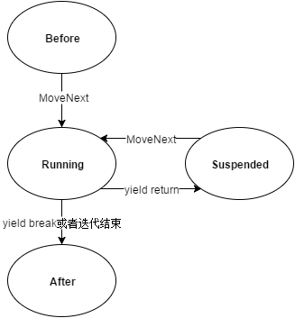
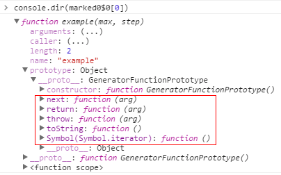
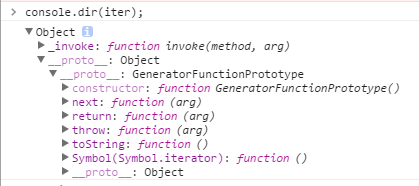

随着 Javascript 语言的发展，ES6 规范为我们带来了许多新的内容，其中生成器 Generators 是一项重要的特性。利用这一特性，我们可以简化迭代器的创建，更加令人兴奋的，是 Generators 允许我们在函数执行过程中暂停、并在将来某一时刻恢复执行。这一特性改变了以往函数必须执行完成才返回的特点，将这一特性应用到异步代码编写中，可以有效的简化异步方法的写法，同时避免陷入回调地狱。

本文将对 Generators 进行简单介绍，然后结合笔者在 C# 上的一点经验，重点探讨 Generators 运行机制及在 ES5 的实现原理。

# 介绍

一个简单的 Generator 函数示例

```js
function* example() {
  yield 1;
  yield 2;
  yield 3;
}
var iter = example();
iter.next(); // {value:1，done:false}
iter.next(); // {value:2，done:false}
iter.next(); // {value:3，done:false}
iter.next(); // {value:undefined，done:true}
```

上述代码中定义了一个生成器函数，当调用生成器函数 example() 时，并非立即执行该函数，而是返回一个生成器对象。每当调用生成器对象的 .next() 方法时，函数将运行到下一个 yield 表达式，返回表达式结果并暂停自身。当抵达生成器函数的末尾时，返回结果中 done 的值为 true，value 的值为 undefined。我们将上述 example() 函数称之为生成器函数，与普通函数相比二者有如下区别

- 普通函数使用 function 声明，生成器函数用 function\* 声明
- 普通函数使用 return 返回值，生成器函数使用 yield 返回值
- 普通函数是 run to completion 模式，即普通函数开始执行后，会一直执行到该函数所有语句完成，在此期间别的代码语句是不会被执行的；生成器函数是 run-pause-run 模式，即生成器函数可以在函数运行中被暂停一次或多次，并且在后面再恢复执行，在暂停期间允许其他代码语句被执行

# Generators in C

生成器不是一个新的概念，我最初接触这一概念是在学习使用 C# 时。C# 从 2.0 版本便引入了 yield 关键字，使得我们可以更简单的创建枚举数和可枚举类型。不同的是 C# 中未将其命名为生成器 Generators，而将其称之为迭代器。

本文不会介绍 C# 中可枚举类 IEnumerable 和枚举数 IEnumerator 内容，如需了解推荐阅读《C#4.0 图解教程》相关章节。

## C# 迭代器介绍

让我们先看一个示例，下面方法声明实现了一个产生和返回枚举数的迭代器

```cs
public IEnumerable <int> Example() {
  yield return 1;
  yield return 2;
  yield return 3;
}
```

方法定义与 ES6 Generators 定义很接近，定义中声明返回了一个 int 类型的泛型可枚举类型，方法体内通过 yield return 语句返回值并将自身暂停执行。

使用迭代器来创建可枚举类型的类

```cs
class YieldClass {
  public IEnumerable<int> Example() { // 迭代器
    yield return 1;
    yield return 2;
    yield return 3;
  }
}

class Program {
  static void Main() {
    YieldClass yc = new YieldClass();
    foreach(var a in yc.Example())
      Console.WriteLine(a);
  }
}
```

上述代码会产生如下输入

```
1
2
3
```

## C# 迭代器原理

在 .Net 中，yield 并不是 .Net runtime 的特性，而是一个语法糖，代码编译时，这一语法糖会被 C# 编译器编译成简单的 IL 代码。

继续研究上述示例，通过 Reflector 反编译工具可以看到，编译器为我们生成了一个带有如下声明的内部类

```cs
[CompilerGenerated]
private sealed class YieldEnumerator :
   IEnumerable<object>, IEnumerator<object>
{
    // Fields字段
    private int state;
    private int current;
    public YieldClass owner;
    private int initialThreadId;

    // Methods方法
    [DebuggerHidden]
    public YieldEnumerator(int state);
    private bool MoveNext();
    [DebuggerHidden]
    IEnumerator<int> IEnumerable<int>.GetEnumerator();
    [DebuggerHidden]
    IEnumerator IEnumerable.GetEnumerator();
    [DebuggerHidden]
    void IEnumerator.Reset();
    void IDisposable.Dispose();

    // Properties属性
    object IEnumerator<object>.Current
    { [DebuggerHidden] get; }

    object IEnumerator.Current
    { [DebuggerHidden] get; }
}
```

原始的 Example() 方法仅返回一个 YieldEnumerator 的实例，并将初始状态 -2 传递给它自身和其引用者，每一个迭代器保存一个状态指示

- -2：初始化为可迭代类 Enumerable
- -1: 迭代结束
- 0: 初始化为迭代器 Enumerator
- 1-n: 原始 Example() 方法中的 yield return 索引值

Example() 方法中代码被转换为 YieldingEnumerator.MoveNext()，在我们的示例中转换后代码如下

```cs
bool MoveNext() {
  switch (state) {
    case 0:
      state = -1;
      current = 1;
      state = 1;
      return true;
    case 1:
      state = -1;
      current = 2;
      state = 2;
      return true;
    case 2:
      state = -1;
      current = 3;
      state = 3;
      return true;
    case 3:
      state = -1;
      break;
  }
  return false;
}
```

利用上述的代码转换，编译器为我们生成了一个状态机，正是基于这一状态机模型，实现了 yield 关键字的特性。

迭代器状态机模型可如下图所示



- Before 为迭代器初始状态
- Running 为调用 MoveNext 后进入这个状态。在这个状态，枚举数检测并设置下一项的位置。遇到 yield return、yield break 或者迭代结束时，退出该状态
- Suspended 为状态机等待下次调用 MoveNext 的状态
- After 为迭代结束的状态

# Generators in Javascript

通过阅读上文，我们了解了 Generator 在 C# 中的使用，并且通过查看编译器生成的 IL 代码，得知编译器会生成一个内部类来保存上下文信息，然后将 yield return 表达式转换成 switch case，通过状态机模式实现 yield 关键字的特性。

## Javascript Generators 原理浅析

yield 关键字在 Javascript 中如何实现呢？

首先，生成器不是线程。支持线程的语言中，多段不同的代码可以在同一时候运行，这经常会导致资源竞争，使用得当会有不错的性能提升。生成器则完全不同，Javascript 执行引擎仍然是一个基于事件循环的单线程环境，当生成器运行的时候，它会在叫做 caller 的同一个线程中运行。执行的顺序是有序、确定的，并且永远不会产生并发。不同于系统的线程，生成器只会在其内部用到 yield 的时候才会被挂起。

既然生成器并非由引擎从底层提供额外的支持，我们可以沿用上文在 C# 中对 yield 特性的原理探究的经验，将生成器视为一个语法糖，用一个辅助工具将生成器函数转换为普通的 Javascript 代码，在经过转换的代码中，有两个关键点，一是要保存函数的上下文信息，二是实现一个完善的迭代方法，使得多个 yield 表达式按序执行，从而实现生成器的特性。

## How Generators work in ES5

Regenerator 工具已经实现了上述思路，借助 Regenerator 工具，我们已经可以在原生 ES5 中使用生成器函数，本节我们来分析 Regenerator 实现方式以深入理解 Generators 运行原理。

通过这个[在线地址](http://babeljs.io/repl/)可以方便的查看经过转换后的代码，仍然以文章初始为例

```js
function* example() {
  yield 1;
  yield 2;
  yield 3;
}
var iter = example();
iter.next();
```

经过转换后为

```js
var marked0$0 = [example].map(regeneratorRuntime.mark);
function example() {
  return regeneratorRuntime.wrap(
    function example$(context$1$0) {
      while (1)
        switch ((context$1$0.prev = context$1$0.next)) {
          case 0:
            context$1$0.next = 2;
            return 1;

          case 2:
            context$1$0.next = 4;
            return 2;

          case 4:
            context$1$0.next = 6;
            return 3;

          case 6:
          case 'end':
            return context$1$0.stop();
        }
    },
    marked0$0[0],
    this
  );
}
var iter = example();
iter.next();
```

从转换后的代码中可以看到，与 C# 编译器对 yield return 表达式的转换相似，Regenerator 将生成器函数中的 yield 表达式重写为 switch case，同时，在每个 case 中使用 context$1$0 来保存函数当前的上下文状态。

switch case 之外，迭代器函数 example 被 regeneratorRuntime.mark 包装，返回一个被 regeneratorRuntime.wrap 包装的迭代器对象。

```js
runtime.mark = function(genFun) {
  if (Object.setPrototypeOf) {
    Object.setPrototypeOf(genFun, GeneratorFunctionPrototype);
  } else {
    genFun.__proto__ = GeneratorFunctionPrototype;
  }
  genFun.prototype = Object.create(Gp);
  return genFun;
};
```

通过 mark 包装，将 example 包装成如下对象



当调用生成器函数 example() 时，返回一个被 wrap 函数包装后的迭代器对象

```js
runtime.wrap = function(innerFn, outerFn, self, tryLocsList) {
  // If outerFn provided, then outerFn.prototype instanceof Generator.
  var generator = Object.create((outerFn || Generator).prototype);
  var context = new Context(tryLocsList || []);

  // The ._invoke method unifies the implementations of the .next,
  // .throw, and .return methods.
  generator._invoke = makeInvokeMethod(innerFn, self, context);

  return generator;
};
```

返回的迭代器对象如下所示



当调用迭代器对象 iter.next() 方法时，因为有如下代码，所以会执行 \_invoke 方法，而根据前面 wrap 方法代码可知，最终是调用了迭代器对象的 makeInvokeMethod(innerFn, self, context); 方法

```js
// Helper for defining the .next, .throw, and .return methods of the
// Iterator interface in terms of a single ._invoke method.
function defineIteratorMethods(prototype) {
  ['next', 'throw', 'return'].forEach(function(method) {
    prototype[method] = function(arg) {
      return this._invoke(method, arg);
    };
  });
}
```

makeInvokeMethod 方法内容较多，这里选取部分分析。首先，我们发现生成器将自身状态初始化为“Suspended Start”

```js
function makeInvokeMethod(innerFn, self, context) {
  var state = GenStateSuspendedStart;

  return function invoke(method, arg) {
```

makeInvokeMethod 返回 invoke 函数，当我们执行 .next 方法时，实际调用的是 invoke 方法中的下面语句

```js
var record = tryCatch(innerFn, self, context);
```

这里 tryCatch 方法中 fn 为经过转换后的 example\$ 方法，arg 为上下文对象 context, 因为 invoke 函数内部对 context 的引用形成闭包引用，所以 context 上下文得以在迭代期间一直保持。

```js
function tryCatch(fn, obj, arg) {
  try {
    return { type: 'normal', arg: fn.call(obj, arg) };
  } catch (err) {
    return { type: 'throw', arg: err };
  }
}
```

tryCatch 方法会实际调用 example\$ 方法，进入转换后的 switch case, 执行代码逻辑。如果得到的结果是一个普通类型的值，我们将它包装成一个可迭代对象格式，并且更新生成器状态至 GenStateCompleted 或者 GenStateSuspendedYield

```js
var record = tryCatch(innerFn, self, context);
if (record.type === "normal") {
  // If an exception is thrown from innerFn, we leave state ===
  // GenStateExecuting and loop back for another invocation.
  state = context.done
    ? GenStateCompleted
    : GenStateSuspendedYield;

  var info = {
    value: record.arg,
    done: context.done
  };
```

# 总结

通过对 Regenerator 转换后的生成器代码及工具源码分析，我们探究了生成器的运行原理。Regenerator 通过工具函数将生成器函数包装，为其添加如 next/return 等方法。同时也对返回的生成器对象进行包装，使得对 next 等方法的调用，最终进入由 switch case 组成的状态机模型中。除此之外，利用闭包技巧，保存生成器函数上下文信息。

上述过程与 C# 中 yield 关键字的实现原理基本一致，都采用了编译转换思路，运用状态机模型，同时保存函数上下文信息，最终实现了新的 yield 关键字带来的新的语言特性。
