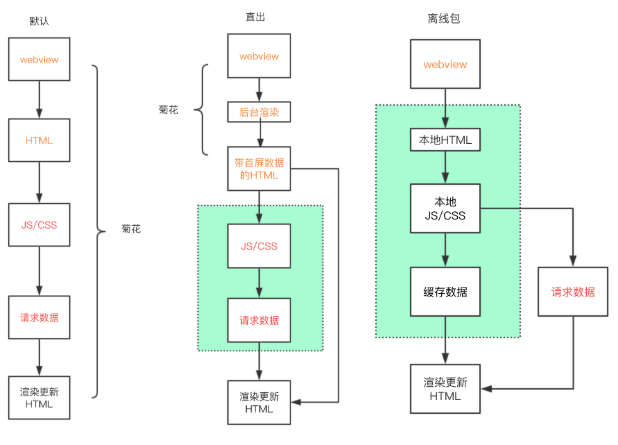
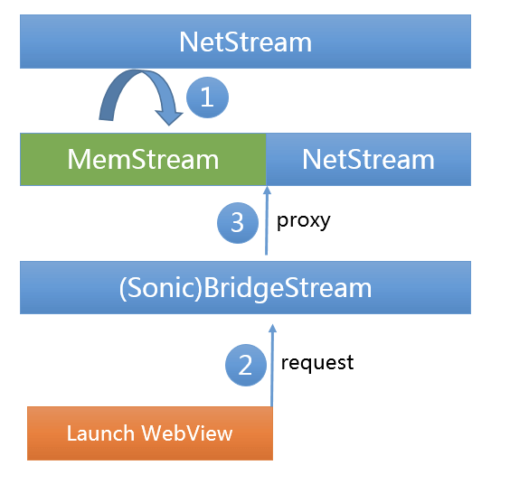
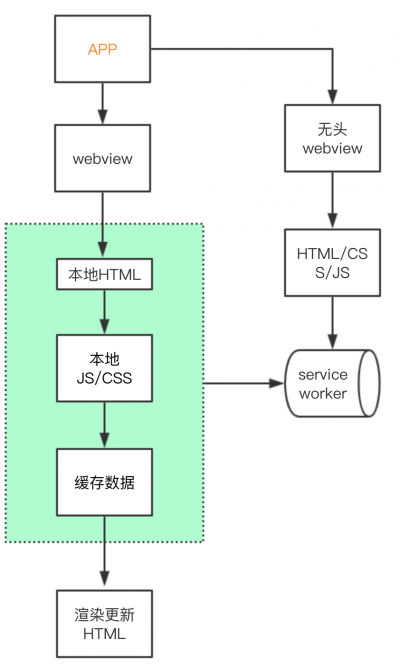
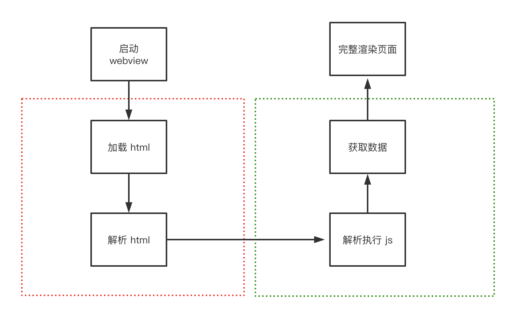
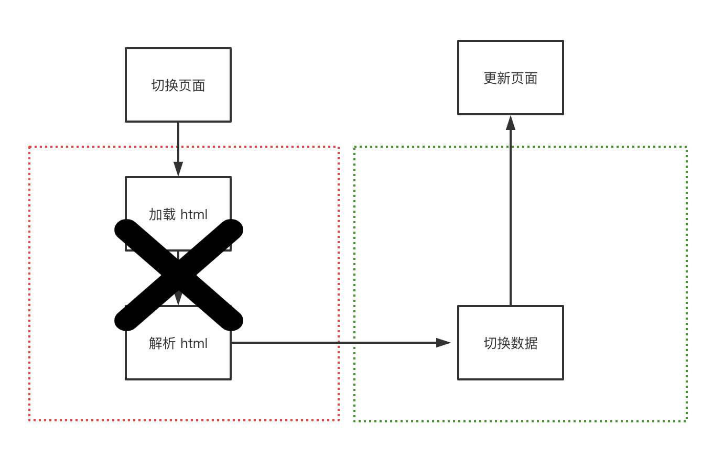
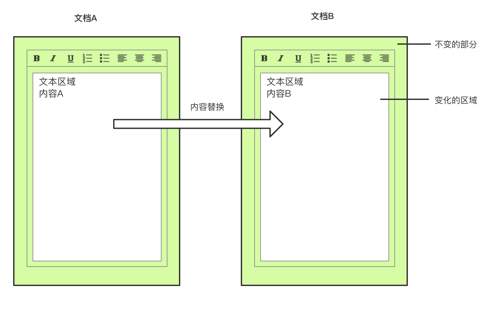
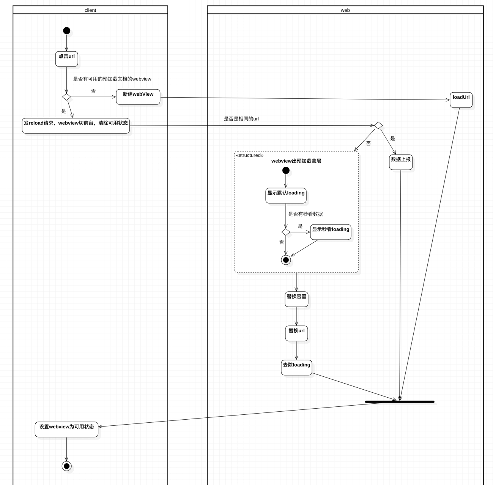
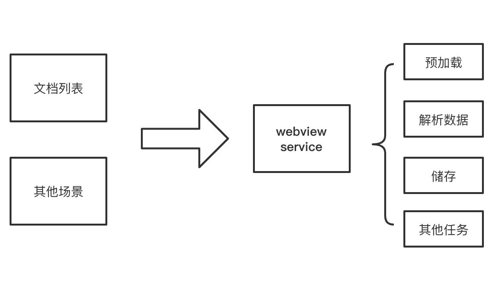
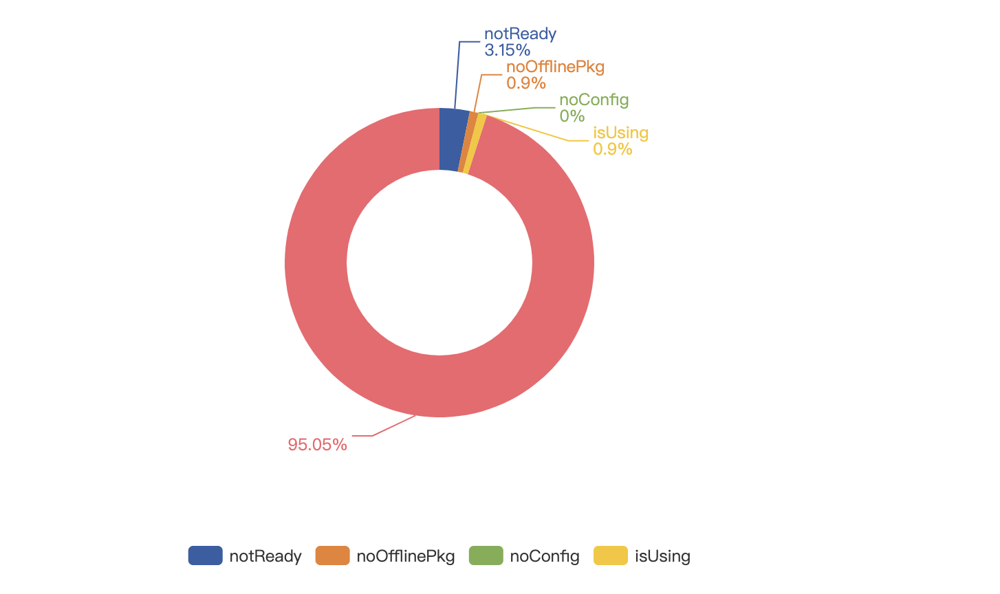

# 常用加速方法

通常的 web 优化方法，基本围绕在资源加载和 html 渲染两个方面。前者针对首屏，后者针对可交互。

资源优化上，我们总的方向是围绕更小的资源包上，比如常见的：压缩、减包、拆包、动态加载包及图片优化上。

html 渲染上总的方向是更快的展示内容，比如通过 cdn 分发、dns 解析、http 缓存、数据预请求，数据缓存及首屏优化大杀器——直出等。

这些方案是各种前端面试中必考点，也是作为一个前端开发，当遇到性能问题、需要解决性能问题时最为首要和基本的思路。而具体应该使用什么样的方案，取决于实际开发需求、优先级、综合成本、及投入产出比等。

在 react-native、weex 及 flutter 等客户端的技术不断在冲击传统 hybrid 的时候，hybrid 也在一路演化、加速，朝着一个使其达到与原生相媲美的方向发展。下面归纳了 hybrid 发展中出现的一些方案，排序不分先后。

# 直出 + 离线包缓存

为了优化首屏，大部分主流的页面会通过服务器进行渲染，吐出 html 文件到前端，解决转菊花比较久的问题，不同类型的主流框架，都会有一套后台渲染方案，比如 vue-server-renderer、react-dom/server 等。直出省去了前端渲染，及 ajax 请求的时间，虽然直出能够通过各种缓存策略优化得很好，但加载 html 仍然需要时间。

通过离线包技术能够很好解决 html 文件本身加载需要时间的问题。离线包基本思路都是通过 webview 统一拦截 url，将资源映射到本地离线包，更新的时候对版本资源检测，下载和维护本地缓存目录中的资源。比如腾讯的 webso 和 Alloykit 的离线包方案。



离线包策略在很多大厂运用比较成熟，它对 web 端而言，是相对透明，侵入性非常小。

# 客户端代理的 VasSonic：webview 初始化 + 代理请求并行 + 动态缓存 + 增量更新

在 hybrid h5 中，用户从点击到看见页面之间，还存在 webview 初始化，请求资源的时间，而这里的过程是串行的，对于追求更极致的体验来说，这里是有优化掉的空间和可能。

VasSonic 是腾讯增值会员团队研发的一个轻量级 hybrid 框架，支持上面提到的离线包策略，更进一步的是，它还做了以下优化：

- webview 初始化和通过客户端代理资源请求并行
- 流式拦截请求，边加载边渲染
- 实现了动态缓存和增量更新

简单说下它是怎么做到的，客户端代理资源请求并行没什么好说的，就是在创建 webview 之前，通过客户端代理建立网络连接，请求 html，然后缓存起来，等待 webview 线程发起 html 资源请求的时候，客户端进行拦截，将缓存好的 html 返回给 webview。

动态缓存和增量更新如何做到呢？

VasSonic 将 html 的内容分为 html 模板和动态数据两部分，如何区分这两种类型呢，它自己定义了一套 html 注释标记规则，通过标签划分哪些是动态数据，哪些是模板数据。然后再拓展了 http 头部，定制了一套请求后台的约定。webview 发起 http 请求时会将页面内容的 id 携带过去，后台处理判断后，再告诉客户端是否需要更新局部数据，如果是则将缓存的 html 模板与新数据拼接成新的 html，最后计算出数据差异部分，通过 js 回调给页面，进行布局刷新。



VasSonic 的方案整体思路和效果非常不错，特别是对于大部分 web 场景，通常我们的模板较少发生变化，大部分是数据部分变化，能够很好的通过局部刷新做到秒开效果。对于首次加载而言，通过并发请求和 webview 创建带来了不错的性能提升，还能无缝的支持离线包策略。

但是 VasSonic 定义了一套特殊的注释标记及拓展了头部，需要包括后台在内的前后端进行改造，对 web 侵入性非常强，接入的工作量及维护成本会非常大。

# PWA + 直出 + 预加载

不管是离线包技术，还是 webview 代理请求，都是对前端侵入非常大的，pwa 作为 web 标准，能够通过纯 web 的方案去加速和优化加载性能。

首先，pwa 能够通过 cacheStorage 缓存普通的图片、js、css 资源。另一方面，在传统的 http cache 中，我们一般不会缓存 html，这是因为页面一旦设置了过长的 max-age，在浏览器缓存过期时间内，用户看到的永远将是旧的。

如果使用了 pwa 的 html 页面，能否直接缓存呢？由于 pwa 可精细化控制缓存，答案是可以的。

对于直出 html，我们可以配合 pwa，将从后台直出的文件，缓存到 cacheStorage，在下一次请求时，优先从本地缓存中获取，同时发起网络请求更新本地 html 文件。

但是在 hybrid 的 h5 应用，第一次启动的加载资源仍然费时，我们可以通过 app 端上支持预加载一个 javascript 脚本，拉取需要 PWA 缓存的页面，可以提前完成缓存。

对于非直出的页面，我们仍然无法避免浏览器渲染 html 时间的问题，应该如何减少这里的时间呢？

这里明确两个点，第一次永远只能靠提前加载，所以上面的借助端上预加载脚本仍然生效；第二点非直出页面，每个页面需要有独一无二的标记，比如 hash。浏览器获取到数据，并且渲染好的 html，能够通过 outerHTML 方法，将 html 页面缓存到 cacheStorage 中，第二次访问优先从本地获取，同时发起 html 请求，通过对比其中唯一标识的差异，决定是否需要更新。



pwa 一系列方案替代离线包策略，带来的好处是，属于 web 标准，适用于普通能够支持 service-worker 的 H5 页面。在允许兼容问题允许的情况下，建议主加。

# NSR 渲染：JS-Runtime + 预渲染 + MemoryCache

GMTC 2019 全球大前端技术上 UC 团队提到了 0.3 秒的 “闪开” 方案。NSR 就是前端版本的 SSR，非常具有启发性。

其核心思路是，借助浏览器启用一个 JS-Runtime，提前将下载好的 html 模板及预取的 feed 流数据进行渲染，然后将 html 设置到内存级别的 MemoryCache 中，从而达到点开即看的效果。

NSR 将 SSR 渲染的过程分发到了各个用户的端中，在减少了后台请求压力的同时，也加进一步快了页面打开速度，堪称做到极致。

问题是数据预取和预渲染带来额外的流量和性能开销，特别是流量，如何更准确的预测用户行为，提高命中率是非常重要的事。类似 NSR 的方案我们也在逐步探索中。

# 客户端 PWA

在实际测试以及和浏览器团队的同学了解和沟通中，service-worker 在 webview 实现性能并没有想象中好。在某项目下掉 sw 后，整体大盘访问速度整体反而提升上升了大概 300ms。这对 hybrid 应用而言，就提出了一项新的思路和挑战，能否在客户端上实现一套基本的 service-worker api？从而达到和 web 标准相兼容。这里也只是一种思路和想法，有大量待探索的问题点，比如 webview sw 具体的性能现状，未来的支持情况呢，自行实现的成本，及最终带来的效果和价值等。

# 小程序化

小程序生态已经非常成熟了，各大厂也都已经推出了自己平台的小程序，国内厂商也不断在尝试推进 MiniApp w3c 标准。不管从加载速度还是页面流畅度小程序都要高于 H5 页面，其原因是通过在架构上对开发进行规范化和约束化，小程序内部将 webview 渲染和 js 执行分离开来，然后通过离线包，页面拆分，预加载页面等一系列优化手段，让小程序天然具备了大量的 H5 优化后的效果，其代价是牺牲了 web 的灵活性。但对于 hybrid 开发，通过原生客户端底层支持这种小程序环境，然后大量业务逻辑采用小程序方案开发，来达到迭代速度与性能兼并的效果，是一种非常不错的方向。

# 小结

不管哪种类型的方案，发现其总的思路和方向都是：

- 在整个链路中减少中间环节。比如将串行改并行，包括小程序内部执行机制。
- 尽可能的预加载、预执行。比如从数据预取，到页面预取渲染等。

任何转换都有代价，加速本质上就是在用更多的网络、内存和 CPU 换取速度，以空间换时间。

# 以上“传统”方案的不足

在大部分场景中，这些方案都足够用，也能得到出色的效果，但仍有无法尽善尽美的地方：

- 短暂的白屏现象不可避免
- 对于超大型 web 应用难以做到秒开

结合客户端特性，我们有没有办法，进一步做到极致，打开 web 页面和打开客户端页面无差异的体验呢？

无论是 html 离线，还是直出，以及让 webview 启动和网络请求并行，页面的切换和打开都无法避免 html 加载这一过程。对于大型应用而言，庞大的 js 初始化解析和执行会耗费巨大的时间。



速度优化的本质是以空间换时间。我们是否可以从这个思路，将打开 webview 及解析 html 这以过程省略掉呢？答案是可以的。



# 容器化方案：webview 常驻 + 数据替换

容器化即是我们最终探索与实践的出来的一套方案。正常 web 页面关闭后，webview 组件即会销毁掉，下一次再打开需要重新启动。通常让 webview 保持常驻的做法可以节省 webview 启动时间， 但简单的常驻 webview 并不能做到页面秒开，页面打开仍然需要重新解析 html。

对于我们的应用特征而言，页面切换实际上是仅仅内容数据的变化，比如切换一篇文档，其 html 容器及样式都是同一套，而差异仅仅只是在数据上，重新载入 html 及初始化 js 这部分耗时完全可以避免掉。让 webview 组件及其容器内的 html 页面常驻，在文档切换的过程，仅仅对数据进行替换，这即是容器化方案。容器化方案省去了 webview 重复启动和渲染 html 的问题，打开文档，耗时只在做数据替换，真正做到了秒开。



## 容器切换

web 侧如何感知到不同的页面在进行互切换，数据如何做到替换呢？

首先在 app 打开的时候，文档列表会进行数据预拉取，同时触发客户端预启动容器，除此外，其他任意场景也能按需触发容器启动（后面会聊到）。容器内会提前进行 html 渲染和 js 执行，此时的数据是空的。用户点击文档，客户端会对打开 url 这一行为进行监听，同时解析 url，取出唯一标识符，判断本地是否已经存在并且符合要求的数据，如果条件命中，直接使用已经打开的容器切出，通知到容器内的 web，web 收到通知，通过 url 取出标识符，从本地进行数据获取，然后对数据进行替换渲染，从而完成页面切换。



## 容器化数据替换

直接容器替换的思路省去了代码加载和解析时间，但对于前端代码而言，需要支持直接替换数据。大部分前端项目代码设计都是自执行调用方式，支持容器化的前提是：需要对代码改造成可支持数据组装和销毁。

```js
// 大部分应用加载页面初始化的场景
class App {
    public init() {
     initA();
     initB();
     // 初始化各种模块
    }
}

const app = new App();
app.init();
```

自执行调用后，大量的内部依赖模块也依次进行初始化，然后数据常驻在内存中，通常对于加载一个正常网页而言，用户每次都是新开页面，加载 html，重新进行解析和初始化，并不会带来什么问题。

但是按照容器化思路，页面不会重新载入，只进行数据替代，对于大型应用而言意味着成千上万的模块需要支持内存释放和数据切换，一旦没有处理好，会面临严重的内存泄露和代码健壮性问题。如何组织和管理这些代码，支持可插拔式，让整个页面初始化流程都能链式组装，可以进行配置，是进行容器化代码改造的难点。

### 依赖倒置

依赖倒置原则的是指内部模块不应该依赖外部模块，底层模块不应该依赖上层模块。

哪些才是底层模块，哪些才是上层模块呢？通常而言，越稳定不变逻辑，应该是越底层，越接近用户交互，容易变化的部分是上层。具体层级划分需要分析应用的结构和依赖关系，良好划分层级的应用是容器化改造的前提。

### 职责链模式

职责链模式是指每个对象都有接受请求的可能，这些对象连接成一条链，请求沿着这条链的传递，直到有对象处理，这样做的好处是减少接受者和发送者直接的耦合。

比如在一个页面加载生命周期中，我们可以让内部模块到外部模块都实现相应的生命周期职责，应用启动和销毁的过程，请求沿着指定链条从外到内传递，也可以按需指定跳跃某个模块，这样大大降低了模块之间的耦合，从而更好的管理代码。

```js
export default interface IRestart{
    emitter: EventEmitter;
    startDestroy(): void;
    destroy(): void;
    restart(): void;
    restartEnd(): void;
    // ...
}
```

```js
class Page {
  next: PageFlow | null;
  cache: {
    start: (() => Promise<any>)[],
    end: (() => Promise<any>)[]
  };
  waitStart(callback: () => Promise<any>) {
    this.cache.start.push(callback);
  }
  waitEnd(callback: () => Promise<any>) {
    this.cache.end.push(callback);
  }
  setNext(flow: PageFlow) {
    this.next = flow;
    return flow;
  }
  // ...
}
```

### 依赖注入

所谓依赖注入是当指 A 对象依赖另一个 B 对象时，不直接在 A 对象内初始化 B，而是通过外部环境进行初始化，作为参数传入 A 对象中。

这样做的好处是当 B 模块的初始化等条件发生变化时，不必在 A 对象中进行重复的修改。管理成百上千个这样模块相互依赖的代码中，统一的依赖注入管理器会让依赖关系管理变得更方便。

```js
// 模块加载器
class ServiceLoader {
  source: CONFIG;
  loaded: boolean; // 是否已加载
  initialized: boolean; // 是否已初始
  module: any;
  constructor(source: CONFIG) {
    this.loaded = false;
    this.initialized = false;
    // ...
  }
  async load(params?: any): Promise<any> {
    // ..load module
    return this.module;
  }
  //...
}
```

```js
// 模块管理器
class ServiceCollection {
    stack: ServiceLoader[];
    private services = new Map<CONFIG, ServiceLoader>();
    constructor() {
        this.stack = [];
    }
    createLoader(config: CONFIG): ServiceLoader {
        const loader: ServiceLoader =  new ServiceLoader(config);
        this.services.set(config, loader);
        return loader;
    }
    // ...
}
```

```js
initA () {
    const ALoader= this.serviceCollection.createLoader(CONFIG.A);
    const discussMobile = ALoader.init(this.app);
}
```

# 数据预拉服务

容器是否会命中依赖两个条件，其一对应离线包代码是否下载好；其二对应版本的数据是否已经预拉缓存完毕。

用户进入文档管理首页，首先会去拉取列表索引数据，然后通过列表数据 id 进行文档内容数据做预拉，储存在本地数据库。

## webview service

在整个数据预拉的过程，我们是通过一套独立的客户端后台 webview 服务执行具体任务，独立服务的好处是让各种容器化基础服务和文档管理列表本身进行解耦，同时将拉取、解析、储存数据这一对性能有消耗的过程放后台服务，减少了列表用户交互界面层的性能压力。

另一方面，作为多端公用的一个服务，构建流程上单独部署，更新代码的时候能够不依赖其他页面，变得更灵活。



## 数据快照

对于纯 dom 结构的文档型品类，我们会在打开文档，解析数据后，把生成的 html 缓存在本地数据库一张快照表里。下一次切换容器时，在取本地数据去解析的同时，会判断对应 id 在快照表是否存在缓存，如果有，直接取出来，覆盖在 html 上，用户可以提前看到上一次渲染的数据，等本地数据真正解析完，再展示可交互界面。解析数据准备渲染也是需要一个上百毫秒的过程，这一策略可以让用户提前看到内容。

## 预创建

有了极致的打开速度，如何优化新建速度呢。正常的新建流程是这样的，用户点击新建按钮，前端请求创建 cgi, 等待后台创建成功返回新文档 url，前端再新开 webview，加载展示页面。我们可以看，由于需要等待创建接口返回的原因，到新建的过程比正常打开一个文档还要更久。

怎么样才能让新建也做到秒开呢？思路和数据预拉取一样，在用户进入文档首页的同时，我们会提前预请求一批创建 id，然后缓存到本地，同时根据创建 id 生成一篇空白文档数据，储存在本地，标示状态为未使用。用户点击新建按钮，本质上是从本地取一个未使用的文档 url，直接用容器切换打开，然后再和后台进行同步。

# 监控与开关系统

容器方案使用了数据预取场景，命中率的监控非常重要。由于切换页面的过程，如果命中容器，我们会接受来自客户端的通知，在这个时机，我们可以进行上报。

另外一个非常重要的是容器能力的开关系统，在发布之初保持现网稳定性是非常重要的措施，但任何程序都不能保证没有 bug，我们通过内部七彩石配置系统控制这套容器方案的各种特性在不同品类下是否启用，同时这套配置也支持灰度和回滚方案，能够应急各种突发问题。

灰度期容器间命中率



# 待优化的问题

容器化方案用各种预创建 webview 的方式换取了打开速度，app 内存占用上会比未使用容器化方案要大非常多，webview 的释放时机、预加载数据的策略优化，以及从客户端到 web 端，如何更好的做内存管理是接下来需要进一步优化的点。
