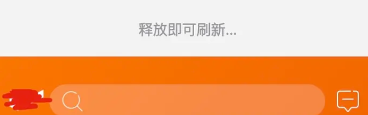
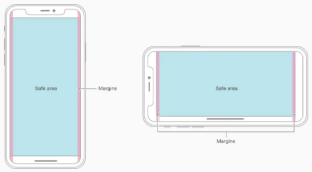
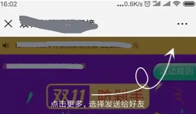

# IOS fix 定位不准

## 现象

在有输入框的情况下尽量不要用 fixed 定位，用 absolute，否则在 IOS 下会出现很多问题，比如输入法收起时 fixed 定位的元素其实还在未收起的地方，会造成在输入法收起时输入框不能点击

## 解决方案

当然在用 absolute 的时候，需要注意 body、html 的定位（设置为 relative 或者不设），放在 body 的下面等等问题

# 微信下 IOS13 输入法不恢复

## 现象

在 IOS13 系统下，点击输入框弹出输入法，再收起输入法时会发现输入法回去了，整个页面留下输入法的空白，上下滑动一下布局恢复正常

## 解决方案

在微信端的输入法键盘收起时滑动一下页面

```js
let currentPosition;
const speed = 1; // 页面滚动距离
const timer = setInterval(() => {
  currentPosition = document.documentElement.scrollTop || document.body.scrollTop;
  currentPosition -= speed;
  window.scrollTo(0, currentPosition); // 页面向上滚动
  currentPosition += speed; // speed变量
  window.scrollTo(0, currentPosition); // 页面向下滚动
  clearInterval(timer);
}, 1);
```

# 移动端输入法收起时布局不恢复

## 现象

移动端网站打开输入法后再收起，此时还会保持在打开输入法时的布局

## 产生原因

我们在 app 布局中会有个固定的底部，安卓一些版本中，输入弹窗出来，将挤压 absolute 和 fixed 定位的元素，导致可视区域变小，布局错乱。

## 解决方案

### 收起时置为初始位置

在输入法键盘收起时将窗口置为初始位置

```js
setTimeout(() => {
  if (document.body) {
    document.body.scrollTop = 0;
  }
}, 100);
```

### 监听页面高度变化，强制恢复成弹出前的高度

```js
// 记录原有的视口高度
const originalHeight = document.body.clientHeight || document.documentElement.clientHeight;

window.onresize = function() {
  var resizeHeight = document.documentElement.clientHeight || document.body.clientHeight;
  if (resizeHeight < originalHeight) {
    // 恢复内容区域高度
    // const container = document.getElementById("container")
    // 例如 container.style.height = originalHeight;
  }
};
```

键盘不能回落问题出现在 iOS 12+ 和 wechat 6.7.4+ 中，而在微信 H5 开发中是比较常见的 Bug。

兼容原理：

1. 判断版本类型
2. 更改滚动的可视区域

```js
const isWechat = window.navigator.userAgent.match(/MicroMessenger\/([\d\.]+)/i);
if (!isWechat) return;
const wechatVersion = wechatInfo[1];
const version = navigator.appVersion.match(/OS (\d+)_(\d+)_?(\d+)?/);

// 如果设备类型为iOS 12+ 和wechat 6.7.4+，恢复成原来的视口
if (+wechatVersion.replace(/\./g, '') >= 674 && +version[1] >= 12) {
  window.scrollTo(0, Math.max(document.body.clientHeight, document.documentElement.clientHeight));
}
```

> window.scrollTo(x-coord, y-coord)，其中 window.scrollTo(0, clientHeight)恢复成原来的视口

# IOS 第三方输入法会遮挡（不完美）

## 现象

IOS 第三方输入法比如搜狗，打开输入法时工具栏会遮挡输入框

## 解决方案

在输入法键盘打开时，强制滚动到输入框的焦点，此方案在移动端浏览器会造成布局的错乱

```js
// 会造成移动端bug，暂时不用
const timer = setInterval(function() {
  element.scrollIntoView(true);
  clearInterval(timer);
}, 100);
```

# IOS 滑动不流畅

## 现象

上下滑动页面会产生卡顿，手指离开页面，页面立即停止运动，整体表现就是滑动不流畅，没有滑动惯性。

## 产生原因

在 iOS 5.0 以及之后的版本，滑动有定义有两个值 auto 和 touch，默认值为 auto。

```css
-webkit-overflow-scrolling: touch; /* 当手指从触摸屏上移开，会保持一段时间的滚动 */
-webkit-overflow-scrolling: auto; /* 当手指从触摸屏上移开，滚动会立即停止 */
```

## 解决方案

### 在滚动容器上增加滚动 touch 方法

将 -webkit-overflow-scrolling 值设置为 touch，同时要设置滚动条隐藏 .container ::-webkit-scrollbar {display: none;}

可能会导致使用 position:fixed; 固定定位的元素，随着页面一起滚动

### 设置 overflow

设置外部 overflow 为 hidden,设置内容元素 overflow 为 auto。内部元素超出 body 即产生滚动，超出的部分 body 隐藏。

```css
body {
  overflow-y: hidden;
}

.wrapper {
  overflow-y: auto;
}
```

# iOS 上拉边界下拉出现白色空白

## 现象

手指按住屏幕下拉，屏幕顶部会多出一块白色区域。手指按住屏幕上拉，底部多出一块白色区域。

## 产生原因

在 iOS 中，手指按住屏幕上下拖动，会触发 touchmove 事件。这个事件触发的对象是整个 webview 容器，容器自然会被拖动，剩下的部分会成空白。

## 解决方案

### 监听事件禁止滑动

移动端触摸事件有三个，分别定义为

1. touchstart ：手指放在一个 DOM 元素上。
2. touchmove ：手指拖曳一个 DOM 元素。
3. touchend ：手指从一个 DOM 元素上移开。

touchmove 事件的速度是可以实现定义的，取决于硬件性能和其他实现细节，同时 preventDefault 方法，阻止同一触点上所有默认行为，比如滚动。

由此我们找到解决方案，通过监听 touchmove，让需要滑动的地方滑动，不需要滑动的地方禁止滑动。

> 值得注意的是我们要过滤掉具有滚动容器的元素。

```js
document.body.addEventListener(
  'touchmove',
  function(e) {
    if (e._isScroller) return;
    // 阻止默认事件
    e.preventDefault();
  },
  {
    // 防止 treated as passive 报错
    passive: false
  }
);
```

### 滚动妥协填充空白，装饰成其他功能

在很多时候，我们可以不去解决这个问题，换思路。根据场景，我们可以将下拉作为一个功能性的操作。

比如下拉后刷新页面



# 页面放大或缩小不确定性行为

## 现象

双击或者双指张开手指页面元素，页面会放大或缩小。

## 产生原因

HTML 本身会产生放大或缩小的行为，比如在 PC 浏览器上，可以自由控制页面的放大缩小。但是在移动端，我们是不需要这个行为的。所以，我们需要禁止该不确定性行为，来提升用户体验。

## 解决方案

HTML meta 元标签标准中有个 viewport 属性，用来控制页面的缩放，一般用于移动端。

移动端常用写法

```html
<meta name="viewport" content="width=device-width, initial-scale=1.0" />
```

因此我们可以设置 maximum-scale、minimum-scale 与 user-scalable=no 用来避免这个问题

```html
<meta
  name="viewport"
  content="width=device-width, initial-scale=1.0, minimum-scale=1.0 maximum-scale=1.0, user-scalable=no"
/>
```

# click 点击事件延时与穿透

## 现象

监听元素 click 事件，点击元素触发时间延迟约 300ms。

点击蒙层，蒙层消失后，下层元素点击触发。

## 产生原因

### 点击延时

iOS 中的 safari，为了实现双击缩放操作，在单击 300ms 之后，如果未进行第二次点击，则执行 click 单击操作。也就是说来判断用户行为是否为双击产生的。但是，在 App 中，无论是否需要双击缩放这种行为，click 单击都会产生 300ms 延迟。

### 点击穿透

双层元素叠加时，在上层元素上绑定 touch 事件，下层元素绑定 click 事件。由于 click 发生在 touch 之后，点击上层元素，元素消失，下层元素会触发 click 事件，由此产生了点击穿透的效果。

## 解决方案

### 使用 touchstart 替换 click

移动设备不仅支持点击，还支持几个触摸事件。那么我们现在基本思路就是用 touch 事件代替 click 事件。将 click 替换成 touchstart 不仅解决了 click 事件都延时问题，还解决了穿透问题。因为穿透问题是在 touch 和 click 混用时产生。

```js
el.addEventListener(
  'touchstart',
  () => {
    console.log('ok');
  },
  false
);
```

那么，是否可以将 click 事件全部替换成 touchstart 呢？为什么开源框架还会给出 click 事件呢？

我们想象一种情景，同时需要点击和滑动的场景下。如果将 click 替换成 touchstart 会怎样？

> 事件触发顺序: touchstart, touchmove, touchend, click。

很容易想象，在我需要 touchmove 滑动时候，优先触发了 touchstart 的点击事件，是不是已经产生了冲突呢？

所以呢，在具有滚动的情况下，还是建议使用 click 处理。

在接下来的 fastclick 开源库中也做了如下处理。 针对 touchstart 和 touchend，截取了部分源码。

```js
// If the target element is a child of a scrollable layer (using -webkit-overflow-scrolling: touch) and:
// 1) the user does a fling scroll on the scrollable layer
// 2) the user stops the fling scroll with another tap
// then the event.target of the last 'touchend' event will be the element that was under the user's finger
// when the fling scroll was started, causing FastClick to send a click event to that layer - unless a check
// is made to ensure that a parent layer was not scrolled before sending a synthetic click (issue #42).
this.updateScrollParent(targetElement);
```

```js
// Don't send a synthetic click event if the target element is contained within a parent layer that was scrolled
// and this tap is being used to stop the scrolling (usually initiated by a fling - issue #42).
scrollParent = targetElement.fastClickScrollParent;
if (scrollParent && scrollParent.fastClickLastScrollTop !== scrollParent.scrollTop) {
  return true;
}
```

主要目的就是，在使用 touchstart 合成 click 事件时，保证其不在滚动的父元素之下。

### 使用 fastclick 库

使用 npm/yarn 安装后使用

```js
import FastClick from 'fastclick';
FastClick.attach(document.body, options);
```

同样，使用 fastclick 库后，click 延时和穿透问题都没了

# iPhone X 系列安全区域适配问题

## 现象

头部刘海两侧区域或者底部区域，出现刘海遮挡文字，或者呈现黑底或白底空白区域。

## 产生原因

iPhone X 以及它以上的系列，都采用刘海屏设计和全面屏手势。头部、底部、侧边都需要做特殊处理。才能适配 iPhone X 的特殊情况。

## 解决方案

### 设置安全区域

设置安全区域，填充危险区域，危险区域不做操作和内容展示。

> 危险区域指头部不规则区域，底部横条区域，左右触发区域。



具体操作为：viewport-fit meta 标签设置为 cover，获取所有区域填充。 判断设备是否属于 iPhone X，给头部底部增加适配层

viewport-fit 有 3 个值分别为：

- auto：此值不影响初始布局视图端口，并且整个 web 页面都是可查看的。
- contain：视图端口按比例缩放，以适合显示内嵌的最大矩形。
- cover：视图端口被缩放以填充设备显示。强烈建议使用 safe-area-inset 变量，以确保重要内容不会出现在显示之外。

#### 设置 viewport-fit 为 cover

```html
<meta name="viewport" content="width=device-width, initial-scale=1.0, user-scalable=yes, viewport-fit=cover" />
```

#### 增加适配层

使用 safe-area-inset 变量

```css
/* 适配 iPhone X 顶部填充*/
@supports (top: env(safe-area-inset-top)) {
  body,
  .header {
    padding-top: constant(safe-area-inset-top, 40px);
    padding-top: env(safe-area-inset-top, 40px);
    padding-top: var(safe-area-inset-top, 40px);
  }
}

/* 判断 iPhoneX 将 footer 的 padding-bottom 填充到最底部 */
@supports (bottom: env(safe-area-inset-bottom)) {
  body,
  .footer {
    padding-bottom: constant(safe-area-inset-bottom, 20px);
    padding-bottom: env(safe-area-inset-bottom, 20px);
    padding-top: var(safe-area-inset-bottom, 20px);
  }
}
```

> safe-area-inset-top, safe-area-inset-right, safe-area-inset-bottom, safe-area-inset-left, safe-area-inset-\*由四个定义了视口边缘内矩形的 top, right, bottom 和 left 的环境变量组成，这样可以安全地放入内容，而不会有被非矩形的显示切断的风险。对于矩形视口，例如普通的笔记本电脑显示器，其值等于零。 对于非矩形显示器（如圆形表盘，iPhoneX 屏幕），在用户代理设置的四个值形成的矩形内，所有内容均可见。

其中 env() 用法为 `env( <custom-ident> , <declaration-value>? )`，第一个参数为自定义的区域，第二个为备用值。

其中 var() 用法为 `var( <custom-property-name> , <declaration-value>? )`，作用是在 env() 不生效的情况下，给出一个备用值。

`constant()` 被 css 2017-2018 年为草稿阶段，是否已被标准化未知。而其他 iOS 浏览器版本中是否有此函数未知，作为兼容处理而添加进去。

# 页面生成为图片和二维码问题

## 现象

在工作中有需要将页面生成图片或者二维码的需求。可能我们第一想到的，交给后端来生成更简单。但是这样我们需要把页面代码全部传给后端，网络性能消耗太大。

## 解决方案

### 生成二维码

使用 QRCode 生成二维码

```js
import QRCode from 'qrcode';
// 使用 async 生成图片
const options = {};
const url = window.location.href;
async (url) => {
  try {
    console.log(await QRCode.toDataURL(url, options));
  } catch (err) {
    console.error(err);
  }
};
```

将 await QRCode.toDataURL(url, options) 赋值给 图片 url 即可

### 生成图片

主要是使用 htmlToCanvas 生成 canvas 画布

```js
import html2canvas from 'html2canvas';

html2canvas(document.body).then(function(canvas) {
  document.body.appendChild(canvas);
});
```

但是不单单在此处就完了，由于是 canvas 的原因。移动端生成出来的图片比较模糊。

我们使用一个新的 canvas 方法多倍生成，放入一倍容器里面，达到更加清晰的效果，通过超链接下载图片

```js
const scaleSize = 2;
const newCanvas = document.createElement("canvas");
const target = document.querySelector('div');
const width = parseInt(window.getComputedStyle(target).width);
const height = parseInt(window.getComputedStyle(target).height);
newCanvas.width = width * scaleSize;
newCanvas.height = widthh * scaleSize;
newCanvas.style.width = width + "px";
newCanvas.style.height = width + "px";
const context = newCanvas.getContext("2d");
context.scale(scaleSize, scaleSize);
html2canvas(document.querySelector('.demo'), { canvas: newCanvas }).then(function(canvas) {
  // 简单的通过超链接设置下载功能
  document.querySelector(".btn").setAttribute('href', canvas.toDataURL());
}
```

> 根据需要设置 scaleSize 大小

# 微信公众号分享问题

## 现象

在微信公众号 H5 开发中，页面内部点击分享按钮调用 SDK，方法不生效。

## 解决方案

### 添加一层蒙层做分享引导

因为页面内部点击分享按钮无法直接调用，而分享功能需要点击右上角更多来操作。

然后用户可能不知道通过右上角小标里面的功能分享。又想引导用户分享，这时应该怎么做呢？

技术无法实现的，从产品出发。



---

更新于 `2020-1-20 11:27:54`

# 第三方 cookie 失效

## 现象

第三方 cookie 在苹果浏览器失效，在 windows 最新版本的 chrome（版本号：80.0.3987.132）也有这个问题

## 产生原因

### 苹果浏览器

在苹果浏览器失效是由于默认开启阻止跨站跟踪导致的，具体表现为最新的 IOS 系统下的 safari，chrome 都有这个问题

### 谷歌浏览器

至于最新版本的 chrome 是由于默认开启了 SameSite: Lax

> Chrome 计划将 Lax 变为默认设置。这时网站可以选择显式关闭 SameSite 属性，将其设为 None。不过前提是必须同时设置 Secure 属性（Cookie 只能通过 HTTPS 协议发送），否则无效。

下面的设置无效：

```
Set-Cookie: widget_session=abc123; SameSite=None
```

下面的设置有效：

```
Set-Cookie: widget_session=abc123; SameSite=None; Secure
```

相同二级域名的子域名下是没有 SameSite 的限制的，举例来说 www.web.dev 和 static.web.dev 之间就没有限制，注意跨站与跨域的区别

具体可查看 [当 CORS 遇到 SameSite](https://juejin.im/post/5e7097b4518825496452cef9?utm_source=gold_browser_extension)

不过经过具体实践，即使设置了也没有用，有可能是我们公司后台的 flask 版本过低，设置 SameSite 没什么效果

[如何在 flask 中显式设置 samesite = None](https://stackoverflow.com/questions/56828663/how-to-explicitly-set-samesite-none-on-a-flask-response)

## 解决方案

### 手动关闭

用户手动关闭阻止跨站跟踪或者 SameSite 限制，并在产品上予以提示

### 重定向页面

重定向到第三方域中托管的登录页面，授权后返回到原始页面或者直接打开新窗口展示，不过这样会造成用户体验不佳

### 存储到 localstorage

后端接口明确返回 token 相关信息保存到 localstorage 中，并在下次判断 localstorage 有相关 token 信息时，在全局方法中随请求发出，不过有被 xss（跨站脚本攻击）的风险
