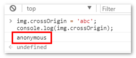
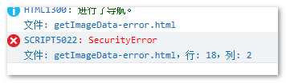

# 图片服务器需要配置 Access-Control-Allow-Origin

一般团队都会有一个专门域名放置静态资源，例如腾讯是 gtimg.com，百度是 bdimg.com；或者很多团队使用的是腾讯云或者阿里云的服务。

而主页面所在域名往往不一样，当需要需要对 canvas 图片进行 getImageData()或 toDataURL()操作的时候，跨域问题就出来了，而且跨域问题还不止一层。

首先，第一步，图片服务器需要配置 Access-Control-Allow-Origin 信息，例如：

如 PHP 添加响应头信息，\*通配符表示允许任意域名：

```php
header("Access-Control-Allow-Origin: *");
```

或者指定域名：

```php
header("Access-Control-Allow-Origin: 你的网站域名");
```

此时，Chrome 浏览器就不会有 Access-Control-Allow-Origin 相关的错误信息了，但是，还会有其他的跨域错误信息。

# canvas 图片 getImageData cross-origin 跨域问题

对于跨域的图片，只要能够在网页中正常显示出来，就可以使用 canvas 的 drawImage() API 绘制出来。但是如果你想更进一步，通过 getImageData()方法获取图片的完整的像素信息，则多半会出错。

举例来说，使用下面代码获取 github 上的自己头像图片信息：

```js
var canvas = document.createElement('canvas');
var context = canvas.getContext('2d');

var img = new Image();
img.onload = function() {
  context.drawImage(this, 0, 0);
  context.getImageData(0, 0, this.width, this.height);
};
img.src = 'https://avatars3.githubusercontent.com/u/496048?s=120&v=4';
```

结果在 Chrome 浏览器下显示如下错误：

> Uncaught DOMException: Failed to execute ‘getImageData’ on ‘CanvasRenderingContext2D’: The canvas has been tainted by cross-origin data.

Firefox 浏览器错误为：

> SecurityError: The operation is insecure.

如果使用的是 canvas.toDataURL()方法，则会报：

> Failed to execute ‘toDataURL’ on 　’HTMLCanvasElement’: Tainted canvased may not be exported

原因其实都是一样的，跨域导致。

那有没有什么办法可以解决这个问题呢？

可以试试 crossOrigin 属性。

# HTML crossOrigin 属性解决资源跨域问题

在 HTML5 中，有些元素提供了支持 CORS(Cross-Origin Resource Sharing)（跨域资源共享）的属性，这些元素包括``，`<video>`，`<script>`等，而提供的属性名就是 crossOrigin 属性。

因此，上面的跨域问题可以这么处理：

```js
var canvas = document.createElement('canvas');
var context = canvas.getContext('2d');

var img = new Image();
img.crossOrigin = '';
img.onload = function() {
  context.drawImage(this, 0, 0);
  context.getImageData(0, 0, this.width, this.height);
};
img.src = 'https://avatars3.githubusercontent.com/u/496048?s=120&v=4';
```

增加一个 img.crossOrigin = ''即可，虽然 JS 代码这里设置的是空字符串，实际上起作用的属性值是 anonymous。

crossOrigin 可以有下面两个值：

- anonymous：元素的跨域资源请求不需要凭证标志设置。
- use-credentials：元素的跨域资源请求需要凭证标志设置，意味着该请求需要提供凭证。

其中，只要 crossOrigin 的属性值不是 use-credentials，全部都会解析为 anonymous，包括空字符串，包括类似'abc'这样的字符。

```js
img.crossOrigin = 'abc';
console.log(img.crossOrigin); // 结果是'anonymous'
```



另外还有一点需要注意，那就是虽然没有 crossOrigin 属性，和设置 crossOrigin="use-credentials"在默认情况下都会报跨域出错，但是性质上却不一样，两者有较大区别。

## crossOrigin 兼容性

IE11+(IE Edge)，Safari，Chrome，Firefox 浏览器均支持，IE9 和 IE10 会报 SecurityError 安全错误，如下截图：



# crossOrigin 属性为什么可以解决资源跨域问题？

crossOrigin=anonymous 相对于告诉对方服务器，你不需要带任何非匿名信息过来。例如 cookie，因此，当前浏览器肯定是安全的。

就好比你要去别人家里拿一件衣服，crossOrigin=anonymous 相对于告诉对方，我只要衣服，其他都不要。如果不说，可能对方在衣服里放个窃听器什么的，就不安全了，浏览器就会阻止。

# IE10 浏览器不支持 crossOrigin 怎么办？

我们请求图片的时候，不是直接通过 new Image()，而是借助 ajax 和 URL.createObjectURL()方法曲线救国。

代码如下：

```js
var xhr = new XMLHttpRequest();
xhr.onload = function() {
  var url = URL.createObjectURL(this.response);
  var img = new Image();
  img.onload = function() {
    // 此时你就可以使用canvas对img为所欲为了
    // ... code ...
    // 图片用完后记得释放内存
    URL.revokeObjectURL(url);
  };
  img.src = url;
};
xhr.open('GET', url, true);
xhr.responseType = 'blob';
xhr.send();
```

此方法不仅 IE10 浏览器 OK，原本支持 crossOrigin 的诸位浏览器也是支持的。

也就多走一个 ajax 请求，还可以！

根据，根据实践发现，在 IE 浏览器下，如果请求的图片过大，几千像素那种，图片会加载失败，我猜是超过了 blob 尺寸限制。
