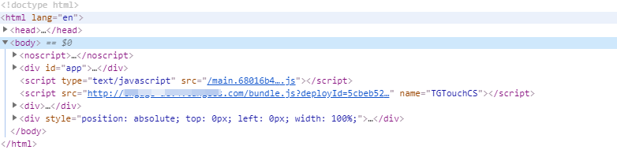
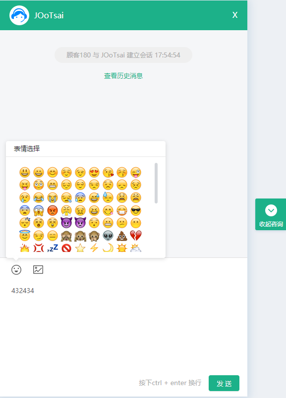

# 需求背景

最近要做一个将第三方聊天库打包为链接，以便于顾客端使用，类似于这个样子 `<script src="打包后库的地址?deployId=部署ID" name="唯一标识符"></script>`, 以实现将代码嵌入到顾客端网站的`</body>`标签之前即可完成部署，开发过程中遇到诸多难点

# 需求难点

## 打包工具选型

最容易想到的办法就是沿用公司之前的webpack框架，这里升级到了 webpack4（见之前的文章 [Webpack配置笔记](/webpack-config-note/)），考虑到打包后可能会包含一些 webpack 的多余代码，因此不是最优方案。但迫于技术的不成熟以及开发时间的压力，还是把 webpack 作为此次选型。这里需要后期优化，考虑到的方案有 rollup.js、jQuery、VanillaJS（原生 js）

## 打包工具重构

这里需要将所有代码打包成一个类似于一个js文件，所以这里需要对框架做出调整，以下只列出改动的地方，其中标红的部分是最核心的改动

### webpack.base.babel.js

```js{16-18}
// const CopyWebpackPlugin = require('copy-webpack-plugin'); 去掉copy-webpack-plugin

{
  test: /\.(jpe?g|png|gif|svg)$/,
  use: [
    {
      loader: 'url-loader',
      options: {
        // Inline files smaller than 10 kB，尽可能将所有的图片内联到js
        limit: 100 * 1024,
      },
    },
  ],
},

new webpack.optimize.MinChunkSizePlugin({
  minChunkSize: Infinity, // Minimum number of characters，尽可能的打包js为一个文件
}),

// 屏蔽CopyWebpackPlugin，没用
// new CopyWebpackPlugin([
//   'app/favicon.ico',
//   'app/manifest.json',
// ].map((src) => ({ from: src, to: path.resolve(process.cwd(), 'build') }))),
```

### webpack.prod.babel.js

```js
// const LodashModuleReplacementPlugin = require('lodash-webpack-plugin'); 实测对打包成一个js时有影响，暂未找到原因

cssDebug: true, // 打开cssDebug，以避免使用MiniCssExtractPlugin，会产生多余的css
entry: './app/app.js', // 改变入口，不分包
output: {
  filename: 'bundle.js', // 只输出一个 bundle.js 文件
},

splitChunks: false,  // 关闭分包优化，下面同理
runtimeChunk: false,

// new LodashModuleReplacementPlugin(), // lodash优化，暂时屏蔽，理由同上
// new webpack.HashedModuleIdsPlugin(), // 不需要固定chunkhash，因为只有一个文件
```

以上就实现了将所有代码都打包到一个 bundle.js 文件

## bundle.js 插入渲染结点

原来的方式是在 index.html 中写要渲染的 div 标签，由于引入到顾客端时是不可能在别人的 html 中写入 div 标签，所以解决方案如下

主要是对 app.js 入口文件做出改动，在渲染 app.js 时通过主动创建一个 div 结点加入到 body 标签的最后

```js
const render = () => {
  const root = document.createElement('div');
  document.querySelector('body').appendChild(root);
  ReactDOM.render(
    <App />,
    root
  );
};

render();
```

## bundle.js 二次引入 babel-polyfill

在顾客端同样引用 babel-polyfill 的情况下，会造成 bundle.js 的报错，此时需要判断

```js
if (!global._babelPolyfill) { // 防止二次引入
  require('babel-polyfill');
}
```

## bundle.js 报错会引起顾客端整个崩溃

需要引入 ErrorBoundary 组件，即使报错也只有引入的 bundle.js 聊天窗口崩溃

```js
import React from 'react';
import PropTypes from 'prop-types';

class ErrorBoundary extends React.Component {
  static propTypes = {
    children: PropTypes.node,
  };

  constructor(props) {
    super(props);
    this.state = { error: null, errorInfo: null };
  }

  componentDidCatch(error, errorInfo) {
    console.log(error, errorInfo);
    // Display fallback UI
    this.setState({ error, errorInfo });
    // You can also log the error to an error reporting service
  }

  render() {
    // if (this.state.hasError) {
    //   // You can render any custom fallback UI
    //   return <h1>Something went wrong.</h1>;
    // }
    return this.props.children;
  }
}

export default ErrorBoundary;
```

然后在预测可能要报错的结点前包裹 ErrorBoundary

## 修改主题色

由于需要实现读取后端给出的样式变量，所以需要实现在 css 样式中读取到 js 变量，找了很多资料，发现最理想的还是 styled-components 可以在内联的 css 中读取到变量

但是由于 bundle.js 的大小已经达到了 1.6M 左右，再引入 styled-components 只怕会更大，所以暂时只能通过 style 样式在代码里写，当然，这个是不能实现比如说在 hover 状态下改变 css 样式，对于这个问题，暂未想到比较好的解决方案

## nginx 相关设置

### 跨域设置 cookie

由于顾客端是未知域名，所以涉及到跨域设置 cookie 的问题，需要前后端同时设置才能做到跨域设置 cookie

#### 后端

```bash
# 设置到某个文件下的别名，可以通过 /im 访问到调试端
location ^~ /im { 
  alias /home/frontend/pony/;
}
# 设置到某个文件下的别名，可以通过 /bundle.js 直接访问到 bundle.js
location = /bundle.js {
  alias /home/frontend/pony/bundle.js;
}
# 反代设置跨域并允许设置 cookie
location /service-tp-api/ {
  add_header Access-Control-Allow-Credentials true;  # 是否允许发送Cookie
  add_header Access-Control-Allow-Origin $http_origin; # 这里 $http_origin 代表引用 bundle.js 的网站域名，不能设置为 * ，否则不能成功设置 cookie
  add_header Access-Control-Allow-Methods 'GET, POST, OPTIONS'; # 用到哪些 HTTP 方法
  add_header Access-Control-Allow-Headers 'DNT,X-Mx-ReqToken,Keep-Alive,User-Agent,X-Requested-With,If-Modified-Since,Cache-Control,Content-Type,Authorization,Cookie,Set-Cookie,x-requested-with,content-type,pragma'; # 允许使用的 header 字段，可以查看自己的 request 来进行添加

  if ($request_method = 'OPTIONS') {
    return 204;
  }

  # 以下是反代到哪里
  proxy_pass http://localhost:10602/api/im-service/;
  proxy_redirect off;
  proxy_set_header Host $host;
  proxy_set_header X-Real-IP $remote_addr;
  proxy_set_header X-Forward-For $proxy_add_x_forwarded_for;
}
```

#### 前端

主要就是 fetch 方法里面添加 mode 和 credentials 字段，或者如果是 xhr 的话设置 withCredentials

```js
export function createDebugUserInfo(data) {
  return httpFetch('/service-tp-api/create-debug-user', {
    method: 'POST',
    data,
    mode: 'cors',
    credentials: 'include',
  });
}
```

以上更新于`2019-5-11 17:52:48`

---

# 最终实现效果



