根据其目的（模式是用来做什么的）可分为创建型(Creational)，结构型(Structural)和行为型(Behavioral)三种：

- 创建型模式主要用于创建对象。
- 结构型模式主要用于处理类或对象的组合。
- 行为型模式主要用于描述对类或对象怎样交互和怎样分配职责。


# 创建型模式

## 单例模式(Singleton)

保证一个类仅有一个实例，并提供一个访问它的全局访问点。

### 模式动机

对于系统中的某些类来说，有且只能有一个实例。例如：一个系统只能有一个窗口管理器。系统中可以有许多打印机，但是只能有一个打印机正在工作。

### 模式定义 

单例模式确保某一个类只有一个实例，而且自行实例化并向整个系统提供这个实例，这个类称为单例类，它提供全局访问的方法。

单例模式的要点有三个：

1. 一是某个类只能有一个实例；
2. 是它必须自行创建这个实例；
3. 是它必须自行向整个系统提供这个实例，单例模式是一种对象创建型模式。

### 模式结构

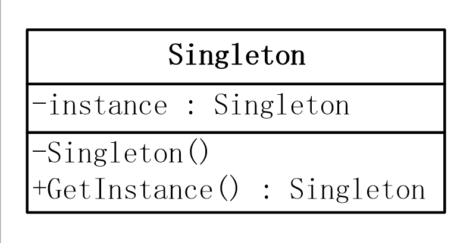

```c++
public class Singleton 
{
    //4：定义一个变量来存储创建好的类实例
    //5：因为这个变量要在静态方法中使用，所以需要加上static修饰
    private static Singleton instance = null;
    //1：私有化构造方法，便于在内部控制创建实例的数目
    private Singleton()
    {    
    }
    //2：定义一个方法来为客户端提供类实例
    //3：这个方法需要定义成类方法，也就是要加static
    public static Singleton GetInstance(){
        //6：判断存储实例的变量是否有值
        if(instance == null){
          //6.1：如果没有，就创建一个类实例，并把值赋给存储类实例的变量
          instance = new Singleton();
        }
        //6.2：如果有值，那就直接使用
        return instance;
    }
}
```

### 优缺点

- 优点
    - 提供了对唯一实例的受控访问。 
    - 由于系统中只存在一个对象，因此可以节约系统资源，对于一些需要频繁创建和销毁的对象，单例模式无疑可以提高系统的性能。
    - 允许可变数目的实例。可以对单例模式进行扩展，设计指定个数的实例对象，即节省系统资源，又解决了由于单例对象共享过多有损性能的问题
- 缺点
    - 由于单例模式中没有抽象层，因此单例类的扩展有很大困难。 
    - 单例类的职责过重，在一定程度上违背了单一职责原则。因为单例模式既提供业务方法，又提供了创建对象的方法，将对象功能和创建耦合在一起。
    - 很多面向对象语言的GC垃圾回收技术，实例化的对象长期不使用，系统会认为是垃圾，自动销毁并回收资源，这将导致共享的单例对象状态的丢失。

### 模式使用

- 系统只需要一个实例对象。例如，系统要求提供一个唯一的系列号生成器或资源管理器，或资源消耗太大而只允许创建一个对象。 
- 客户调用类的单个实例只允许使用一个公共访问点。

**例子一**

问： 我的一个系统需要一些“全局”变量。学习了单例模式后，我发现可以使用一个单例类盛放所有的“全局”变量。请问这样做对吗？

答：这样做是违背单例模式的用意的。单例模式只应当在有真正的“单一实例”的需求时才可使用。

>设计得当的系统不应当有所谓的“全局”变量，这些变量一个应当放到它们所描述的实体所对应的类中去。将这些变量从它们所描述的实体类中抽出来，放到一个不相干的单例类中去，会使得这些变量产生错误的依赖关系和耦合关系。

**例子二**

问：我的一个系统需要管理与数据库的连接。学习了单例模式后，我发现可以使用一个单例类包装一个 Connection 对象，并在 finalize() 方法中关闭这个 Connection 对象。这样的话，在这个单例类的实例没有被人引用时，这个finalize()对象就会被调用，因此，Connection 对象就会被释放。这多妙啊。

答：这样做是不恰当的。除非有单一实例的需求，不然不要使用单例模式。在这里Connection 对象可以同时有几个实例共存，不需要是单一实例。

>单例模式有很多的错误使用案例都与此例子相似，它们都是试图使用单例模式管理共享资源的生命周期，这是不恰当的。

### 模式应用

- 数据库主键编号分配

### 单例模式扩展

- 高并发、线程不安全
- 懒汉式单例
- 饿汉式单例
- 单例模式—管理多个对象

**懒汉式单例**

- 单例模式在整个应用程序的生命周期中只存在一个实例
- 懒汉式单例就是这个单例类的这个唯一实例 new 是在第一次使用 GetInstance()时实例化的
- 如果不调用 GetInstance() 的话，这个实例是不会存在的，即为 null
- 形象点说呢，就是你不去动它的话，它自己是不会实例化的，所以可以称之为懒汉。
- 前面在介绍单例模式的这几个 Demo 中都是使用的懒汉式单例

```c++
public class Singleton
{
    private static Singleton singleton;
    //定义一个只读静态对象 
    //且这个对象是在程序运行时创建的 
    private static readonly object syncObject = new object();
    private Singleton()
    {}
    public static Singleton GetInstance()
    {
        //第一重 singleton == null，为了性能，解释如下
        if (singleton == null)
        {
            // 单线程
            lock (syncObject)
            {
                //第二重 singleton == null，为了单一实例
                if (singleton == null)
                {
                    singleton = new Singleton();
                }
            }
        }
        return singleton;
    }
}
```

>如果没有第一重 singleton == null 的话，每一次有线程调用GetInstance（）时，均会执行锁定操作来实现线程同步，这是非常耗费性能的。
而如果加上第一重 singleton == null 的话，那么就只有在第一次，也就是 singleton ==null 成立时的情况下执行一次锁定以实现线程同步，而以后的话，便只要直接返回 Singleton 实例就 OK 了而根本无需再进入 lock 语句块了，这样就可以解决由线程同步带来的性能问题了。

**饿汉式单例**

- 饿汉式单例的话，则刚好相反，
- 其由于肚子饿了，所以到处找东西吃，人也变得主动了很多，所以根本就不需要别人来催他实例化单例类的为一实例，
- 其自己就会主动实例化单例类的这个唯一类。

```c++
// 
public class Singleton
{
    private static readonly Singleton singleton = new Singleton();

    private Singleton()
    {
    }

    public static Singleton GetInstance()
    {
        return singleton;
    }
}
```

- C# 与 CLR 会自动解决前面提到的懒汉式单例类时出现的多线程同步问题
- 上面的饿汉式单例类中可以看到，当整个类被加载的时候，就会自行初始化 singleton 这个静态只读变量。
- 而非在第一次调用 GetInstance（）时再来实例化单例类的唯一实例，所以这就是一种饿汉式的单例类。
- 在 C# 中，可以用特殊的方式实现饿汉式单例，即使用静态初始化来完成饿汉式单例模式。

**单例模式—管理多个对象**

```c++
public class Singleton
{
    private static int maxTeacherNum = 5;
    private static IList<Singleton> Singletons;
    private Singleton()
    {  }
    public static Singleton GetInstance()
    {
        if (Singletons == null)
        {
            Singletons = new List<Singleton>();
            for (int i = 0; i < maxTeacherNum; i++)
            {
                Singletons.Add(new Singleton());
            }
        }
        Random random = new Random();
        int k = random.Next(0, maxTeacherNum);
        Console.WriteLine("ID="+ k);
        return Singletons[k];
    }
}
static void Main(string[] args)
{
    Singleton singletonOne = Singleton.GetInstance();

    for (int i = 0; i < 2; i++)
    {
        Singleton singletonTwo = Singleton.GetInstance();
        if (singletonOne.Equals(singletonTwo))
        {
            Console.WriteLine("singletonOne 和 singletonTwo 代表的是同一个实例");
        }
        else
        {
            Console.WriteLine("singletonOne 和 singletonTwo 代表的是不同实例");
        }               
    }
    Console.ReadKey();
}
```

## 工厂方法模式(Factory Method)

定义一个用于创建对象的接口，让子类决定实例化哪一个类。

### 简单工厂问题背景

```c++
class Operation
{
    public static double GetResult(double numberA, double numberB, string operate)
    {
        double result = 0;
        switch (operate)
        {
            case "+":
                result = numberA + numberB;
                break;
            case "-":
                result = numberA - numberB;
                break;
            case "*":
                result = numberA * numberB;
                break;
            case "/":
                result = numberA / numberB;
                break;
        }
        return result;
    }
}
```

Switch中添加一个分支就可以了，运算 + - * /  的代码GetResult是正确的，却需要在修改的时候暴露，违反了开放封闭原则，继续改进。

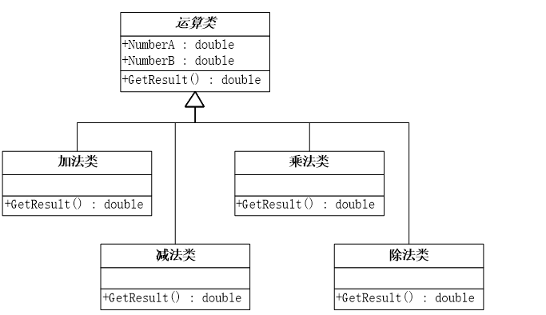

```c++
class Operation
{
    private double _numberA = 0;
    private double _numberB = 0;

    public double NumberA
    {
        get
        { return _numberA;}
        set
        { _numberA = value;}
    }
    public double NumberB
    {
        get
        { return _numberB;}
        set
        { _numberB = value;}
    }
    public virtual double GetResult()
    {
        return 0;
    }
}

// 加法类，其他同理
class OperationAdd : Operation  
{
    public override double GetResult()
    {
        double result = 0;
        result = NumberA + NumberB;
        return result;
    }
}

// 调用
OperationAdd add = new OperationAdd();
add.NumberA = double.Parse(strNumberA);
add.NumberB = double.Parse(strNumberB);
strResult = add.GetResult().ToString();
```

设计带来的新问题：虽然满足了开放封闭原则，单一职责原则，但是对于众多类，客户端使用起来非常不方便，这时就要用到简单工厂模式，以下类来负责创建对象。

### 简单工厂范例

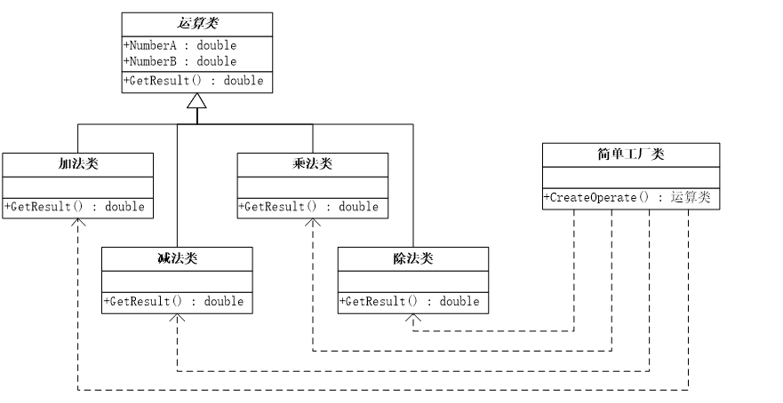

```c++
class OperationFactory
{
    public static Operation createOperate(string operate)
    {
        Operation oper = null;
        switch (operate)
        {
            case "+":
                {
                    oper = new OperationAdd();
                    break;
                }
            case "-":
                {
                    oper = new OperationSub();
                    break;
                }
                ……
        }
        return oper;
    }
}

// 调用
Operation oper;
oper = OperationFactory.createOperate(strOperate);
oper.NumberA = Convert.ToDouble(strNumberA);
oper.NumberB = Convert.ToDouble(strNumberB);
strResult = oper.GetResult().ToString();
```

以上代码只需简单参数即可获得所需对象，实现对象的创建和使用的分离，这就是简单工厂模式。

### 简单工厂概述

**定义**

简单工厂模式(Simple Factory Pattern)：又称为静态工厂方法(Static Factory Method)模式，属于类的创建型模式，通过它根据自变量的不同返回不同的类的实例。简单工厂模式专门定义一个类来负责创建其它类的实例，被创建的实例通常都具有共同的父类。

**模式结构**

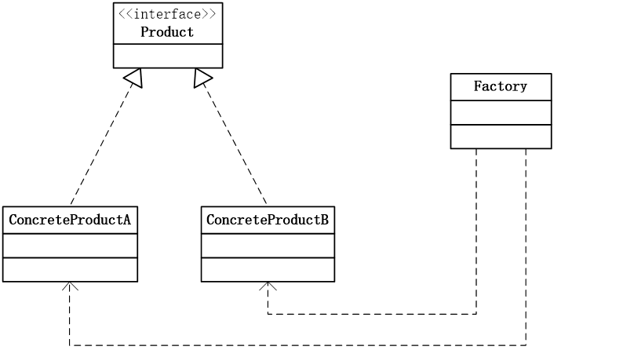

```c++
public class OperationFactory //工厂角色
{
    public static Operation createOperate(string operate)
    {
        Operation oper = null;// 抽象产品角色
        switch (operate)
        {
            case "+":
                {
                    oper = new OperationAdd();// 具体产品角色
                    break;
                }
            case "-":
                {
                    oper = new OperationSub();
                    break;
                }
         }
        return oper;
    }
}
```

**优缺点**

- 优点：
    - 工厂类含有必要的判断逻辑，可以决定在什么时候创建哪一个产品类的实例，客户端可以免除直接创建产品对象的责任，而仅仅“消费”产品。简单工厂模式通过这种做法实现了对象创建和使用的分离
    - 客户端代码简洁，无需知道所创建具体产品的类名，只需知道对应的参数，可以减少使用者的记忆量。
- 缺点：
    - 工厂类集中了所有产品创建逻辑，一旦不能正常工作，整个系统都要受到影响。
    - 增加了系统中类的数量，增加了系统的复杂度和理解难度。
    - 系统扩展困难，一旦添加新产品就不得不修改工厂逻辑，有可能造成工厂逻辑过于复杂，不利于扩展。
    - 简单工厂模式通常使用静态工厂方法，造成工厂角色无法形成基于继承的等级结构。

**模式应用**

- 根据各类算法的密码生成器。
- 根据各类数据进行图表绘制。

### 工厂方法问题背景

简单工厂中的工厂类随着新方法的添加需要修改代码，同样违反了开放封闭原则，抽象化如下图。

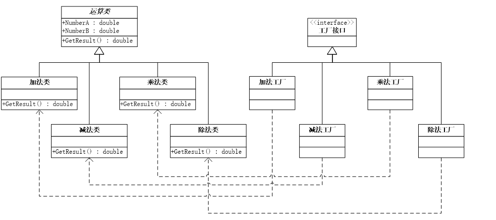

```c++
// 工厂方法
interface IFactory
{
    Operation CreateOperation();
}

// 专门负责生产“+”的工厂，其他同理
class AddFactory : IFactory
{
    public Operation CreateOperation()
    {
        return new OperationAdd();
    }
}

// 调用
IFactory operFactory = new AddFactory();
Operation oper = operFactory.CreateOperation();
oper.NumberA = Convert.ToDouble(strNumberA);
oper.NumberB = Convert.ToDouble(strNumberB);
strResult = oper.GetResult().ToString();
```

### 工厂方法概述

**定义**

工厂方法模式(Factory Method Pattern)：工厂方法模式又简称为工厂模式，也叫虚拟构造器(Virtual Constructor)模式或者多态模式，属于类的创建型模式。在工厂方法模式中，父类负责定义创建对象的公共接口，而子类则负责生成具体的对象，这样做的目的是将类的实例化操作延迟到子类中完成，即由子类来决定究竟应该实例化(创建) 哪一个类。

**模式结构**

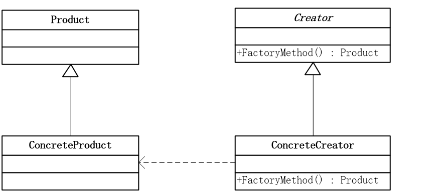

- Product：抽象产品
- ConcreteProduct：具体产品
- Factory：抽象工厂
- ConcreteFactory：具体工厂

工厂方法模式是简单工厂模式的延伸，它继承了简单工厂模式的优点，同时还弥补了简单工厂模式的不足。工厂方法模式是使用频率最高的设计模式之一，是很多开源框架和API类库的核心模式。

**优缺点**

- 优点
    - 在工厂方法模式中，工厂方法用来创建客户所需要的产品，同时还向客户隐藏了哪种具体产品类被实例化这一细节，用户只需要关心所需产品对应的工厂，无需关心创建产品的细节，甚至无需知道产品类的类名。
    - 基于工厂角色和产品角色的多态性设计是工厂方法模式的关键。它能够使工厂可以自主确定创建何种产品对象，而如何创建这个对象的细节则完全封装在具体工厂内部。
    - 使用工厂方法模式的另一个优点是在系统中加入新产品时，无需修改抽象工厂和抽象产品提供的接口，无需修改客户端，也无需修改其它的具体工厂和具体产品，而只要添加一个新的具体工厂和具体产品即可。
- 缺点
    - 在添加新产品时，需要编写新的具体产品类，而且还要提供与之对应的具体工厂类，类成对增加，将导致系统设计较为庞大，且运行时系统会有额外的开销。
    - 由于考虑到系统的可扩展性，需要引入抽象层，在客户端代码中均使用抽象层进行定义，增加了系统的抽象性和理解难度，且在实现的时候可能需要用到反射等技术，增加了系统的实现难度。

**模式使用**

- 不能清楚知道所必须创建的对象的类。
- 一个类希望由它的子类来指定它所创建的对象。
- 将创建对象的职责委托给多个子类中的某一个，且不同子类提供不同实现。

## 抽象工厂模式(Abstract Factory)

提供一个创建一系列相关或相互依赖对象的接口，而无需指定它们具体的类。

### 问题背景

不能不换数据库？

- 以前基于Access的数据库项目，需要修改为SQL Server
- SQL语言函数不一样，参数格式不一样
- 如SQL Server中GetDate()，Access中为Now()

最简单的数据库程序

- 假定使用SQL Server数据库
- 数据库中有用户表(User)，用户类有2个字段ID和Name
- 程序中有用户管理，可以对用户添加和查询

```c++
// 用户类，假定用户只有ID 和 Name两个字段
class User
{
    private int _id;
    public int ID
    {
        get { return _id; }
        set { _id = value; }
    }

    private string _name;
    public string Name
    {
        get { return _name; }
        set { _name = value; }
    }
}

// SqlserverUser类，用于操作User表,假定用户只有新增用户和得到用户方法，具体语句省略
class SqlserverUser
{
    public void Insert(User user)
    {
        Console.WriteLine("在Sqlserver中给User表增加一条记录");
    }

    public User GetUser(int id)
    {
        Console.WriteLine("在Sqlserver中根据ID得到User表一条记录");
        return null;
    }
}

// Su对象框死在Sqlserver数据库上了，加入要换Access数据库，跟Su对象相关的代码都要修改
static void Main(string[] args)
{
    User user = new User();

    SqlserverUser su = new SqlserverUser();

    su.Insert(user);

    su.GetUser(1);

    Console.Read();
}
```

利用上面学习到的工厂方法修改代码如下：

```c++
interface IUser
{
    void Insert(User user);

    User GetUser(int id);
}
class SqlserverUser : IUser
{
    public void Insert(User user)
    {
        Console.WriteLine("在Sqlserver中给User表增加一条记录");
    }

    public User GetUser(int id)
    {
        Console.WriteLine("在Sqlserver中根据ID得到User表一条记录"); 
        return null;
    }
}
class AccessUser : IUser
{
    public void Insert(User user)
    {
        Console.WriteLine("在Access中给User表增加一条记录");
    }

    public User GetUser(int id)
    {
        Console.WriteLine("在Access中根据ID得到User表一条记录");    
        return null;
    }
}
interface IFactory
{
    IUser CreateUser();
}
class SqlServerFactory : IFactory
{
    public IUser CreateUser()
    {
        return new SqlserverUser();
    }
}
class AccessFactory : IFactory
{
    public IUser CreateUser()
    {
        return new AccessUser();
    }
}
static void Main(string[] args)
{
    User user = new User();

    IFactory factory = new AccessFactory();   //SqlServerFactory();

    IUser iu = factory.CreateUser();

    iu.Insert(user);
    iu.GetUser(1);

    Console.Read();
}
```

- 数据库只有一个表吗？
- 假如增加部门表，如何处理？

```c++
class Department
{
    private int _id;
    public int ID
    {
        get { return _id; }
        set { _id = value; }
    }

    private string _deptName;
    public string DeptName
    {
        get { return _deptName; }
        set { _deptName = value; }
    }
}
interface IDepartment
{
    void Insert(Department department);
    Department GetDepartment(int id);
}
class SqlserverDepartment : IDepartment
{
    public void Insert(Department department)
    {
        Console.WriteLine("在Sqlserver中给Department表增加一条记录");
    }
    public Department GetDepartment(int id)
    {
        Console.WriteLine("在Sqlserver中根据ID得到Department表一条记录");  return null;
    }
}
class AccessDepartment : IDepartment
{
    public void Insert(Department department)
    {
        Console.WriteLine("在Access中给Department表增加一条记录");
    }
    public Department GetDepartment(int id)
    {
        Console.WriteLine("在Access中根据ID得到Department表一条记录");   return null;
    }
}
interface IFactory
{
    IUser CreateUser();

    IDepartment CreateDepartment();
}
class SqlServerFactory : IFactory
{
    public IUser CreateUser()
    {
        return new SqlserverUser();
    }
    public IDepartment CreateDepartment()
    {
        return new SqlserverDepartment();
    }
}
class AccessFactory : IFactory
{
    public IUser CreateUser()
    {
        return new AccessUser();
    }
    public IDepartment CreateDepartment()
    {
        return new AccessDepartment();
    }
}
static void Main(string[] args)
{
    User user = new User();
    Department dept = new Department();

    IFactory factory = new AccessFactory();  //SqlServerFactory();
    
    IUser iu = factory.CreateUser();
    iu.Insert(user);
    iu.GetUser(1);

    IDepartment id = factory.CreateDepartment();
    id.Insert(dept);
    id.GetDepartment(1);

    Console.Read();
}
```

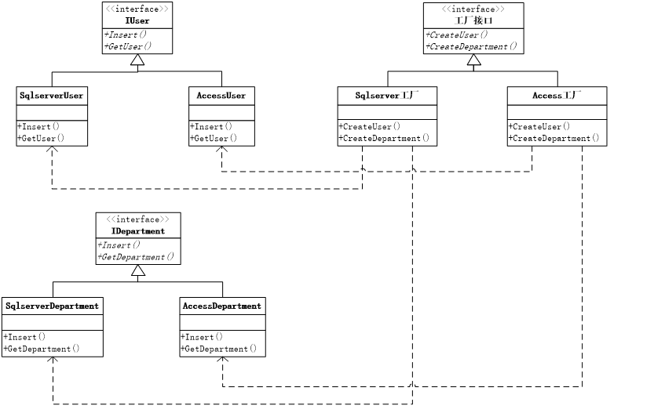

以上就是抽象工厂模式。

### 模式动机

在工厂方法模式中具体工厂负责生产具体的产品，每一个具体工厂对应一种具体产品，工厂方法也具有唯一性，一般情况下，一个具体工厂中只有一个工厂方法或者一组重载的工厂方法。但是有时候我们需要一个工厂可以提供多个产品对象，而不是单一的产品对象。

### 模式定义

提供一个创建一系列相关或相互依赖对象的接口，而无需指定它们具体的类。抽象工厂模式又称为Kit模式，属于对象创建型模式。

### 模式结构

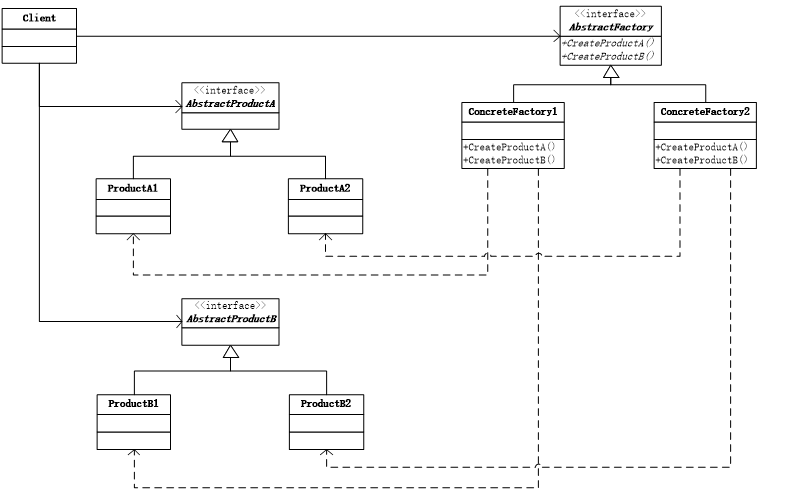

- AbstractFactory：抽象工厂
- ConcreteFactory：具体工厂
- AbstractProduct：抽象产品
- Product：具体产品
- Client：客户类

### 优缺点

- 优点
    - 抽象工厂模式的主要优点是隔离了具体类的生成，使得客户并不需要知道什么被创建。由于这种隔离，更换一个具体工厂就变得相对容易。
    - 所有的具体工厂都实现了抽象工厂中定义的那些公共接口，因此只需改变具体工厂的实例，就可以在某种程度上改变整个软件系统的行为。另外，应用抽象工厂模式可以实现高内聚低耦合的设计目的，因此抽象工厂模式得到了广泛的应用。
- 缺点
    - 抽象工厂模式的缺点是在添加新的产品对象时，难以扩展抽象工厂以便生产新种类的产品，这是因为在抽象工厂角色中规定了所有可能被创建的产品集合，要支持新种类的产品就意味着要对该接口进行扩展，而这将涉及到对抽象工厂角色及其所有子类的修改，显然会带来很多不便。
    - 开闭原则的倾斜性（增加新的工厂和产品族容易，增加新的产品等级结构麻烦）

### 模式使用

- 一个系统不应当依赖于产品类实例如何被创建、组合和表达的细节，这对于所有形态的工厂模式都很重要。
- 系统有多于一个的产品族，而客户端只消费其中某一产品族。 
- 系统提供一个产品类的库，所有的产品以同样的接口出现，从而使客户端不依赖于实现。

## 建造者模式(Builder)

将一个复杂对象的构建与它的表示分离，使得同样的构建过程可以创建不同的表示。

### 模式背景

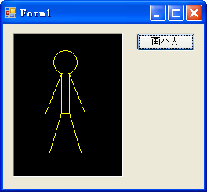

```c++
private void button1_Click(object sender, EventArgs e)
{
    Graphics person = pictureBox1.CreateGraphics();
    Pen p = new Pen(Color.Yellow);
    person.DrawEllipse(p, 50, 20, 30, 30);
    person.DrawRectangle(p, 60, 50, 10, 50);
    person.DrawLine(p, 60, 50, 40, 100);
    person.DrawLine(p, 70, 50, 90, 100);
    person.DrawLine(p, 60, 100, 45, 150);
    person.DrawLine(p, 70, 100, 85, 150);
}
```

需求改变，再画一个胖一点的小人

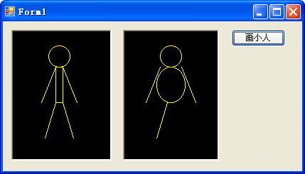

晕，少画了一条腿，难道每次都要重新写一遍代码？

如何设计？使得凡是绘制小人，都必须有头、身、两个手和两个脚？


```c++
abstract class PersonBuilder
{
    protected Graphics g;
    protected Pen p;

    public PersonBuilder(Graphics g, Pen p)
    {
        this.g = g;
        this.p = p;
    }

    public abstract void BuildHead();
    public abstract void BuildBody();
    public abstract void BuildArmLeft();
    public abstract void BuildArmRight();
    public abstract void BuildLegLeft();
    public abstract void BuildLegRight();
}
class PersonThinBuilder : PersonBuilder
{
    public PersonThinBuilder(Graphics g, Pen p)
        : base(g, p) { }        
    public override void BuildHead()
    {
        g.DrawEllipse(p, 50, 20, 30, 30);
    }
    public override void BuildBody()
    {
        g.DrawRectangle(p, 60, 50, 10, 50);
    }
    public override void BuildArmLeft()
    {
        g.DrawLine(p, 60, 50, 40, 100);
    }
    public override void BuildArmRight()
    {
        g.DrawLine(p, 70, 50, 90, 100);
    }
    public override void BuildLegLeft()
    {
        g.DrawLine(p, 60, 100, 45, 150);
    }
    public override void BuildLegRight()
    {
        g.DrawLine(p, 70, 100, 85, 150);
    }
}
class PersonFatBuilder : PersonBuilder
{
    public PersonFatBuilder(Graphics g, Pen p)
        : base(g, p) { }
    public override void BuildHead()
    {
        g.DrawEllipse(p, 50, 20, 30, 30);
    }
    public override void BuildBody()
    {
        g.DrawEllipse(p, 45, 50, 40, 50);
    }
    public override void BuildArmLeft()
    {
        g.DrawLine(p, 50, 50, 30, 100);
    }
    public override void BuildArmRight()
    {
        g.DrawLine(p, 80, 50, 100, 100);
    }
    public override void BuildLegLeft()
    {
        g.DrawLine(p, 60, 100, 45, 150);
    }
    public override void BuildLegRight()
    {
        g.DrawLine(p, 70, 100, 85, 150);
    }
}
```

继承自抽象类，如果不重写抽象方法，编译器都不通过?

```c++
private void button2_Click(object sender, EventArgs e)
{
    Pen p = new Pen(Color.Yellow);
    PersonThinBuilder thin = new PersonThinBuilder(pictureBox1.CreateGraphics(),p);
    thin.BuildHead();
    thin.BuildBody();
    thin.BuildArmLeft();
    thin.BuildArmRight();
    thin.BuildLegLeft();
    thin.BuildLegRight();

}
```

用户调用创建类对象绘制小人，还需要知道头、手、脚这些方法？以下是解决方法。


```c++
class PersonDirector
{
    private PersonBuilder pb;
    public void CreatePerson()
    {
        pb.BuildHead();
        pb.BuildBody();
        pb.BuildArmLeft();
        pb.BuildArmRight();
        pb.BuildLegLeft();
        pb.BuildLegRight();
    }
    public PersonDirector(PersonBuilder pb)
    {
        this.pb = pb;
    }
}
private void button3_Click(object sender, EventArgs e)
{
    Pen p = new Pen(Color.Yellow);
    PersonThinBuilder pb = new PersonThinBuilder(pictureBox1.CreateGraphics(), p);
    PersonDirector pd = new PersonDirector(pb);
    pd.CreatePerson();
}
private void button3_Click(object sender, EventArgs e)
{
    Pen p = new Pen(Color.Yellow);
    PersonFatBuilder pb = new PersonFatBuilder(pictureBox1.CreateGraphics(), p);
    PersonDirector pd = new PersonDirector(pb);
    pd.CreatePerson();
}
```

建造者模式中，添加了一个很重要的类，指挥者类(Director)，用它来控制建造过程，也用它来隔离用户与建造过程之间的关联

### 模式动机

在某些情况下，一个对象会有一些重要的属性，在它们没有恰当的值之前，对象不能作为一个完整的产品使用。比如，一个电子邮件有发件人地址、收件人地址、主题、内容、附录等部分，而在最起码的收件人地址未被赋值之前，这个电子邮件不能发出。

### 模式定义

将一个复杂对象的构建与它的表示分离，使得同样的构建过程可以创建不同的表示。建造者模式是一步一步创建一个复杂的对象，它允许用户只通过指定复杂对象的类型和内容就可以构建它们，用户不需要知道内部的具体构建细节。建造者模式属于对象创建型模式。

### 模式结构


```c++
class Product
{
    private string partA;
    private string partB;
    private string partC;
    public string PartA
    {
        set { partA = value; }
        get { return partA; }
    }
    public string PartB
    {
        set { partB = value; }
        get { return partB; }
    }
    public string PartC
    {
        set { partC = value; }
        get { return partC; }
    }
    public void Introduce()
    {
        Console.WriteLine(PartA);
        Console.WriteLine(PartB);
        Console.WriteLine(PartC);
        Console.WriteLine();
    }
}
abstract class Builder
{
    protected Product product = new Product();
    public abstract void BuildPartA();
    public abstract void BuildPartB();
    public abstract void BuildPartC();
    public Product GetResult()
    {
        return product;
    }
}
class ConcreteBuilderOne : Builder
{
    public override void BuildPartA()
    {
        product.PartA = "Finish PartA for ProductOne";
    }
    public override void BuildPartB()
    {
        product.PartB = "Finish PartB for ProductOne";
    }
    public override void BuildPartC()
    {
        product.PartC = "Finish PartC for ProductOne";
    }
}
class ConcreteBuilderTwo : Builder
{
    public override void BuildPartA()
    {
        product.PartA = "完成第二个产品PartA";
    }
    public override void BuildPartB()
    {
        product.PartB = "完成第二个产品PartB";
    }
    public override void BuildPartC()
    {
        product.PartC = "完成第二个产品PartC";
    }
}
class Director
{
    private Builder builder;
    public Director(Builder builder)
    {
        this.builder = builder;
    }
    public void SetBuilder(Builder builder)
    {
        this.builder = builder;
    }
    public void Construct()
    {
        builder.BuildPartA();
        builder.BuildPartB();
        builder.BuildPartC();
    }
}
static void Main(string[] args)
{
    Product pt;
    Builder bd = new ConcreteBuilderOne();
    Director dt = new Director(bd);
    dt.Construct();
    pt = bd.GetResult();
    pt.Introduce();

    bd = new ConcreteBuilderTwo();
    dt.SetBuilder(bd);
    dt.Construct();
    pt = bd.GetResult();
    pt.Introduce();
    
    Console.ReadKey();
}
```

- Builder：抽象建造者
- ConcreteBuilder：具体建造者
- Director：指挥者
- Product：产品角色

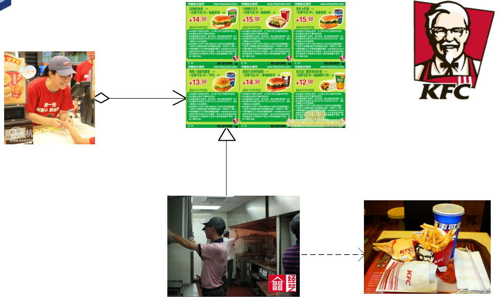

### 优缺点

- 建造者模式的使用使得产品的内部组成可以独立的变化，使用建造者模式可以使客户端不必知道产品内部组成的细节。
- 每一个Builder都相对独立，而与其他的Builder无关。
- 模式所建造的最终产品更易于控制。

### 模式使用

- 需要生成的产品对象有复杂的内部结构。
- 需要生成的产品对象的属性相互依赖，建造者模式可以强迫生成顺序。
- 在对象创建过程中会使用到系统中的一些其他对象，这些对象在产品对象的创建过程中不易得到。

### 模式应用

Mail（一步一步构造一个完整的邮件对象，然后发送）

```c++
public void set主题(String 主题) {
    this.主题 = 主题;}
public void set发件人(Email地址 发件人) {
    this.发件人 = 发件人;}
public void set抄送人(List<Email地址> 抄送人) {
    this.抄送人 = 抄送人; }
public void set收件人(List<Email地址> 收件人) {
    this.收件人 = 收件人;}
public void set正文(String 正文) {
    this.正文 = 正文;}
public void set邮件时间(Date time) {
    this.邮件时间 = time;}
public void set附件(List<File> files) {
    this.附件 = files;}
```

## 原型模式(Prototype)

用原型实例指定创建对象的种类，并且通过拷贝这些原型创建新的对象。

### 模式背景

**简历投递**

```c++
class Resume     //简历类
{  
    private string name, sex , age , timeArea, company , AimCompany;
    public Resume(string name)
    {
        this.name = name;
    }
    public void SetPersonalInfo(string sex, string age)    //设置个人信息
    {
        this.sex = sex;     this.age = age;
    }
    public void SetWorkExperience(string timeArea, string company)    //设置工作经历
    {
        this.timeArea = timeArea;     this.company = company;
    }
    public void SetAimCompany(string AimCompany)    //设置目标公司名称
    {
        this.AimCompany = AimCompany;
    }
    public void Display()     //显示
    {
        Console.WriteLine("尊敬的" + AimCompany + "公司领导，您好：")
        Console.WriteLine("{0} {1} {2}", name, sex, age);
        Console.WriteLine("工作经历：{0} {1}", timeArea, company);
    }
}
```

内容相似只能Ctrl+C, Ctrl+V?

```c++
static void Main(string[] args)
{
    Resume a = new Resume(“张三");
    a.SetPersonalInfo("男", "22");
    a.SetWorkExperience("1998-2000", “XX 公司");
    a.SetAimCompany("Google");
                
    Resume b = a;            

    a.Display();
    b.Display();

    b.SetAimCompany(“Baidu");
    
    a.Display();
    b.Display();

    Console.Read();
}
```

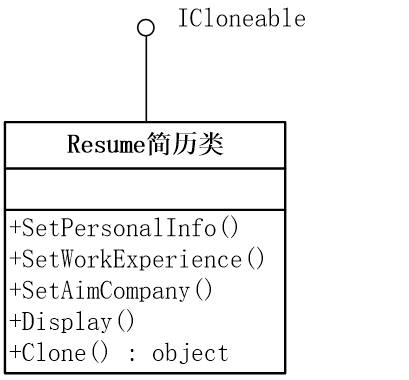 

以下做原型模式的改进

```c++
class Resume: Icloneable //简历类
{  
    private string name, sex , age , timeArea, company , AimCompany;
    public Resume(string name)
    {
        this.name = name;
    }
    public void SetPersonalInfo(string sex, string age)    //设置个人信息
    {
        this.sex = sex;     this.age = age;
    }
    public void SetWorkExperience(string timeArea, string company)    //设置工作经历
    {
        this.timeArea = timeArea;     this.company = company;
    }
    public void SetAimCompany(string AimCompany)    //设置目标公司名称
    {
        this.AimCompany = AimCompany;
    }
    public void Display()     //显示
    {
        Console.WriteLine("尊敬的" + AimCompany + "公司领导，您好：")
        Console.WriteLine("{0} {1} {2}", name, sex, age);
        Console.WriteLine("工作经历：{0} {1}", timeArea, company);
    } 
    public Object Clone()
    {
        return this.MemberwiseClone();
    }
}

static void Main(string[] args)
{
    Resume a = new Resume(“张三");
    a.SetPersonalInfo("男", "22");
    a.SetWorkExperience("1998-2000", “XX 公司");
    a.SetAimCompany("Google");
    
    Resume b = (Resume)a.Clone();            

    a.Display();
    b.Display();

    b.SetAimCompany(“Baidu");
    
    a.Display();
    b.Display();

    Console.Read();
}
```


**配钥匙**

前几天，我很不幸把大门的钥匙给弄丢了，结果进不了家门。万幸的是，同学那儿还有一把，于是第二天我拿了他的那把去配钥匙。另外，他还让我顺便给他配一把房间的钥匙。现在配个钥匙真是简单，把钥匙给他，他直接找一个合适的钥匙胚子，把我的钥匙夹在配钥匙机的一端，胚子夹在另一端，一开电源，一把标尺比着我的钥匙齿型走一遍，砂轮就在胚子上复制出一把钥匙来！一分钟不到，两把新钥匙就搞定了！

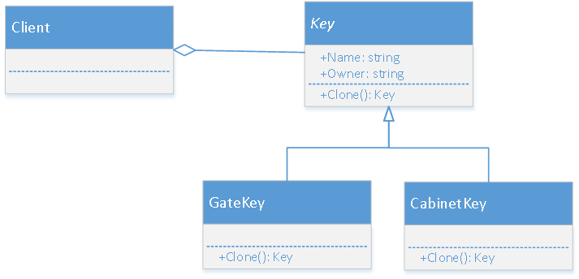 

```c++
public abstract class Key
{
    private string name;
    public string Name
    {
        get { return name; }
        set { name = value; }
    }

    private string owner;
    public string Owner
    {
        get { return owner; }
        set { owner = value; }
    }

    public Key(string name, string owner)
    {
        this.name = name;
        this.owner = owner;
    }
    //钥匙复制自身的抽象定义
    public abstract Key Clone();
    public override String ToString()
    {
        return this.Name + ", 属于 " + this.Owner;
    }
}

//大门钥匙
public class GateKey : Key
{ 
    public GateKey(string owner) : base("大门 钥匙", owner) { }

    public override Key Clone()
    {
        return new GateKey(this.Owner);
    }
}

//橱柜钥匙
public class CabinetKey : Key
{
    public CabinetKey(string owner) : base("房间 钥匙", owner) { }

    public override Key Clone()
    {
        return new CabinetKey(this.Owner);
    }
}

public static void Main(string[] args)
{
    Key oldGateKey, newGateKey, oldCabinetKey, newCabinetKey;
    oldGateKey = new GateKey("同学");
    newGateKey = oldGateKey.Clone();
    newGateKey.Owner = "我";

    oldCabinetKey = new CabinetKey("我");
    newCabinetKey = oldCabinetKey.Clone();
    newCabinetKey.Owner = "同学";

    Console.WriteLine(oldGateKey.ToString());
    Console.WriteLine(newGateKey.ToString());
    Console.WriteLine(oldCabinetKey.ToString());
    Console.WriteLine(newCabinetKey.ToString());
    Console.Read();
}

```

### 模式动机

有些对象的创建过程较为复杂，而且有时候需要频繁创建，原型模式通过给出一个原型对象来指明所要创建的对象的类型，然后用复制这个原型对象的办法创建出更多同类型的对象。这就是原型模式的动机。

### 模式定义

它是一种对象创建型模式，用原型实例指定创建对象的种类，并且通过拷贝这些原型创建新的对象。原型模式允许一个对象再创建另外一个可定制的对象，无需知道任何创建的细节。

通过将一个原型对象传给那个要发动创建的对象，这个要发动创建的对象通过请求原型对象拷贝原型自己来实现创建过程。

### 模式结构

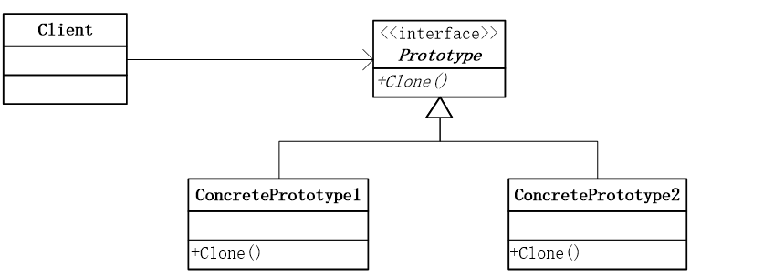

- Prototype：抽象原型类
- ConcretePrototype：具体原型类
- Client：客户

**抽象原型类**

```c++
abstract class Prototype
{
    private string id;

    // Constructor 
    public Prototype(string id)
    {
        this.id = id;
    }

    // Property 
    public string Id
    {
        get { return id; }
    }

    public abstract Prototype Clone();
}
```

**具体原型类**

```c++
class ConcretePrototype1 : Prototype
{
    // Constructor 
    public ConcretePrototype1(string id) : base(id)
    {
    }

    public override Prototype Clone()
    {
        // Shallow copy 
        return (Prototype) new ConcretePrototype1(this.Id);        
    }
}
```

**客户端代码**

```c++
static void Main(string[] args)
{
    Prototype p1, c1;

    p1 = new ConcretePrototype1(“Design Pattern");

    c1 = p1.Clone();

    Console.WriteLine("Cloned: {0}", c1.Id);

    Console.Read();
}
```

### 模式解析

- 对于.Net而言，其他许多语言同理，原型抽象类Prototype是用不着的，因为克隆实在太常用了，所以.Net在System命名空间中提供了Icloneable接口，其中就是一个唯一的方法Clone()，这样，只用实现这个接口就可以完成原型模式了。
- 另一方面，所有的Java类都继承自java.lang.Object，而Object类提供一个clone()方法，可以将一个Java对象复制一份。但是，这个Java类必须实现一个标识接口Cloneable，标识这个Java类支持复制。

**深克隆与浅克隆** 

接上例中的简历内容，给Resume添加一些新的内容

```c++
public class IDInfo
{
    public int IdNumber;
    public IDInfo(int IdNumber)
    {
        this.IdNumber = IdNumber;
    }
}
//简历
class Resume : ICloneable
{
    private string name;
    private string sex;
    private string age;
    private string timeArea;
    private string company;
    public IDInfo idinfo;

    public Resume(string name)
    {
        this.name = name;
        idinfo = new IDInfo(123456);
    }
    public void Display()
    {
        Console.WriteLine("尊敬的" + AimCompany + "公司领导，您好：");
        Console.WriteLine("{0} {1} {2}", name, sex, age);
        Console.WriteLine("工作经历：{0} {1}", timeArea, company);
        Console.WriteLine("ID号码:" + idinfo.IdNumber.ToString());
        Console.WriteLine("");
    }
}
static void Main(string[] args)
{
    Resume a = new Resume(“张三");
    a.SetPersonalInfo("男", "22");
    a.SetWorkExperience("1998-2000", “XX 公司");
    a.SetAimCompany("Google");
                
    Resume b = (Resume)a.Clone();            

    a.Display();
    b.Display();

    b.SetAimCompany(“Baidu");
    b.idinfo.IdNumber = 56789;
    
    a.Display();
    b.Display();

    Console.Read();
}
```

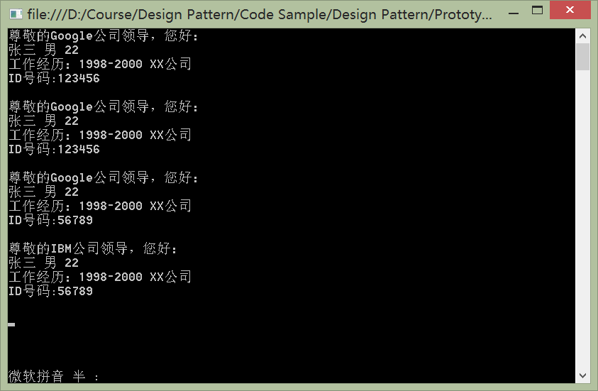

结果错误！张三的ID也跟着变了！

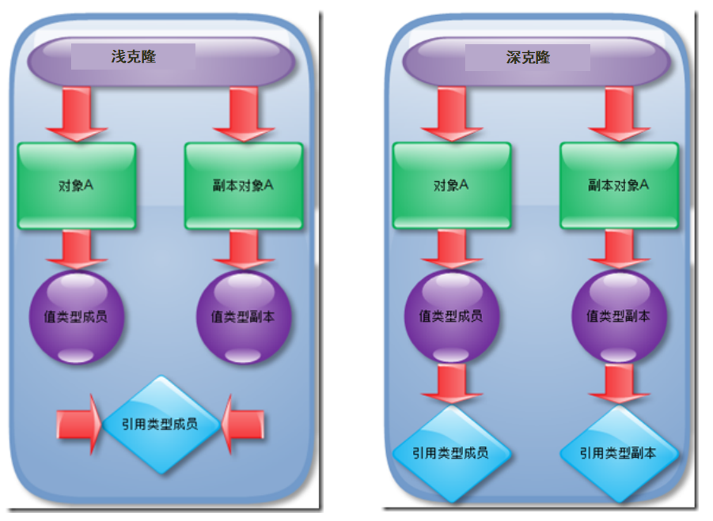

- 在浅克隆中，被复制对象的所有变量都具有与原来的对象相同的值，而所有对其它对象的引用仍然指向原来的对象。换言之，浅克隆仅仅复制所考虑的对象，而不复制它所引用的对象，也就是说其中的成员对象并不复制。在浅克隆中，当对象被复制时它所包含的成员对象却没有被复制。
- 在深克隆中，对象在复制的同时其成员对象也将复制。

```c++
// 将代码加入Resume类中
public Object DeepClone()
{
    Resume rsm = (Resume)this.MemberwiseClone();
    rsm.idinfo = new IDInfo(this.idinfo.IdNumber);
    return rsm;
}
// 调用
Resume b = (Resume)a.DeepClone();
```

### 优缺点

- 优点
    - 当创建新的对象实例较为复杂时，使用原型模式可以简化的对象的创建过程，通过复制一个已有实例可以提高新实例的创建效率。
    - 原型模式允许动态增加或减少产品类。
    - 原型模式具有给一个应用软件动态加载新功能的能力。 
    - 产品类不需要非得有任何事先确定的等级结构 。
- 缺点
    - 原型模式的最主要缺点就是每一个类必须配备一个克隆方法。而且这个克隆方法需要对类的功能进行通盘考虑，这对全新的类来说不是很难，但对已有的类进行改造时，不一定是件容易的事。
    - 原型模式的另一个缺点是在实现深克隆时需要编写较为复杂的代码。

### 模式使用

- 创建新对象成本较大(CPU，初始化)。
- 系统要保存对象的状态，对象状态变化很小。
- 当一个类的实例只有几个不同状态组合时，建立相应数目的原型并克隆它们可能比每次用合适的状态手工实例化更为方便。

### 模式应用

原型模式在很多软件都可以找到它的应用，如果实例化一个类要花大量时间，原型模式是最好的解决方案。很多软件提供的复制、粘贴功能都是原型模式的应用。类型相同，但内存地址不同的对象。