## 适配器模式(Adapter)

将一个类的接口转换成客户希望的另外一个接口。Adapter 模式使得原本由于接口不兼容而不能一起工作的那些类可以一起工作。

### 问题背景

在 NBA 我需要翻译

- 姚明刚来到 NBA，身材够高，球技够好
- 但是英语不是很懂，听不懂教练的战术安排
- 球员分为前锋、中锋和后卫
- 教练会给球员分配进攻、防守任务

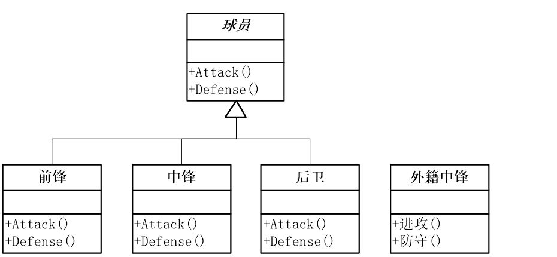

### 模式动机

- 通常，客户类(client of class)通过类的接口访问它提供的服务。有时现有的类(existing class)可以提供客户类的功能需要，但是它所提供的接口不一定是客户类所期望的。这是由于现有的接口名称与客户类所查找的不同等诸多不同原因导致的。
- 在这种情况下， 现有的接口需要转化 (convert) 为客户类期望的接口，这样保证了对现有类的重用。适配器模式(Adapter Pattern)可以完成这样的转化。

### 模式定义

适配器模式(Adapter Pattern)： 将一个接口转换成客户希望的另一个接口，适配器模式使接口不兼容的那些类可以一起工作，其别名为包装器(Wrapper)。适配器模式既可以作为类结构型模式，也可以作为对象结构型模式。

### 模式结构


- Target：目标抽象类
- Adapter：适配器类
- Adaptee：适配者类（被适配）
- Client：客户类

**篮球运动员**

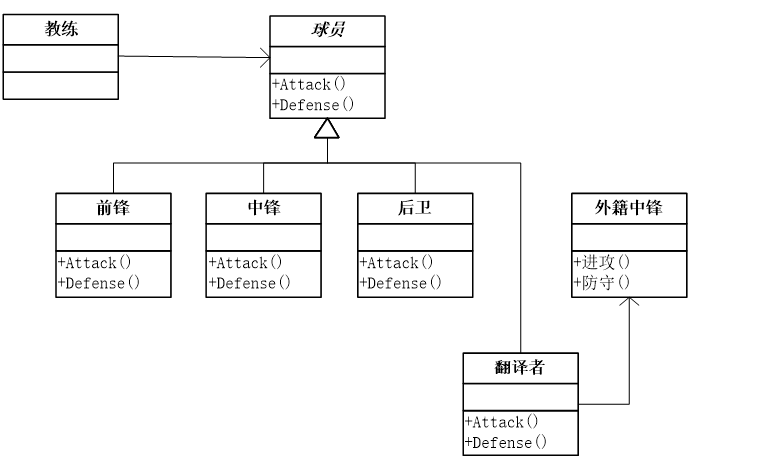

```cpp
abstract class Player    //篮球运动员
{
    protected string name;
    public Player(string name)
    {
        this.name = name;
    }
    public abstract void Attack();
    public abstract void Defense();
}
class Forwards : Player   //前锋
{
    public Forwards(string name) : base(name)
    {
    }
    public override void Attack()
    {
        Console.WriteLine("前锋 {0} 进攻", name);
    }
    public override void Defense()
    {
        Console.WriteLine("前锋 {0} 防守", name);
    }
}
class ForeignCenter   //外籍中锋
{
    private string name;
    public string Name
    {
        get { return name; }
        set { name = value; }
    }
    public void 进攻()
    {
        Console.WriteLine("外籍中锋 {0} 进攻", name);
    }
    public void 防守()
    {
        Console.WriteLine("外籍中锋 {0} 防守", name);
    }
}
static void Main(string[] args)
{
    Player pp = new Forwards("Patrick Patterson");
    pp.Attack();

    Player tw = new Guards("Terrence Williams");
    tw.Attack();

    ForeignCenter ym = new ForeignCenter("姚明");
    ym.进攻();

    Console.Read();
}
class Translator : Player   //翻译者
{
    private ForeignCenter wjzf = new ForeignCenter();

    public Translator(string name) : base(name)
    {
        wjzf.Name = name;
    }

    public override void Attack()
    {
        wjzf.进攻();
    }

    public override void Defense()
    {
        wjzf.防守();
    }
}
static void Main(string[] args)
{
    Player pp = new Forwards("Patrick Patterson");
    pp.Attack();

    Player tw = new Guards("Terrence Williams");
    tw.Attack();

    Player ym = new Translator ("姚明");
    ym.Attack ();

    Console.Read();
}
```

**鸭子适配器**

```cpp
interface Duck
{
    public void quack();
    public void fly();
}
// 野鸭子类
class MallardDuck : Duck
{
    public void quack()
    {
        Console.WriteLine("嘎嘎嘎...");
    }

    public void fly()
    {
        Console.WriteLine("我在飞哦！");
    }
}
interface Turkey
{
    public void gobble();
    public void fly();
}
// 野火鸡类
class WildTurkey : Turkey
{
    public void gobble()
    {
        Console.WriteLine("咕咕咕...");
    }

    public void fly()
    {
        Console.WriteLine("我在飞，不过飞不远。");
    }
}
// 火鸡适配器
class TurkeyAdapter : Duck
{
    Turkey turkey;
    public TurkeyAdapter(Turkey turkey)
    {
        this.turkey = turkey;
    }
    public void quack()
    {
        turkey.gobble();
    }
    public void fly()
    {
        turkey.fly();
    }
}
// 使用适配器
static void Main(string[] args)
{
    MallardDuck duck = new MallardDuck();
    WildTurkey turkey = new WildTurkey();
    Duck turkeyAdapter = new TurkeyAdapter(turkey);

    turkey.gobble();
    turkey.fly();

    testDuck(duck);
    testDuck(turkeyAdapter);
}
static void testDuck(Duck duck)
{
    duck.quack();
    duck.fly();
}
```

**类适配器与对象适配器**

假设我们在软件开发中要记录日志，包括数据库记录日志 DatabaseLog 和文本文件记录日志 WriteLog

开发过程需要引入一个新的日志接口，但新的日志接口和以前的不一样

_类适配器方式如下_

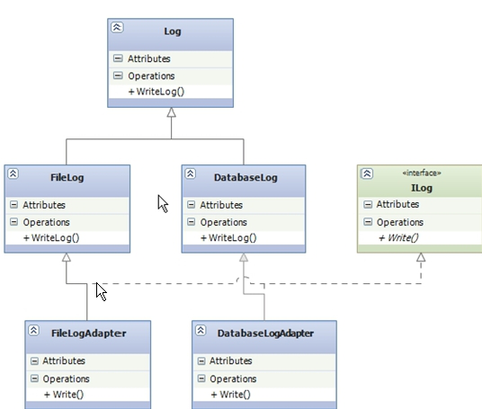

```cpp
class DatabaseLogAdapter : DatabaseLog, Ilog
{
    public void Write()
    {
        this.WirteLog();
    }
}
class FileLogAdapter : FileLog, Ilog
{
    public void Write()
    {
        this.WirteLog();
    }
}
```

_对象适配器_

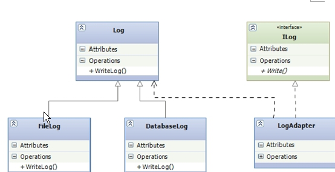

```cpp
class LogAdapter : Ilog
{
    private Log log;
    public LogAdapter(Log log)
    {
        this.log = log;
    }
    public void Write()
    {
        log.WriteLog();
    }
}
```

上面两种适配方式，可以看出在类适配方式中，是通过类的继承来实现的，同时也具有接口 ILog 的所有行为，这些就违背了面向对象设计原则中的类的单一职责原则，而对象适配器则是通过对象组合的方式来实现的，则符合面向对象的精神，所以推荐用对象适配的模式。

### 优缺点

- _将目标类和适配者类解耦_，通过引入一个适配器类来重用现有的适配者类，而无须修改原有代码。
- _增加了类的透明性和复用性_，将具体的实现封装在适配者类中，对于客户端类来说是透明的，而且提高了适配者的复用性。
- _灵活性和扩展性都非常好_，通过使用配置文件，可以很方便地更换适配器，也可以在不修改原有代码的基础上增加新的适配器类，完全符合“开闭原则”。

### 模式使用

- 系统需要使用的类的接口不符合系统的要求。
- 想要建立一个可以重复使用的类，用于与一些彼此之间没有太大关联的一些类，包括一些可能在将来引进的类一起工作。这些源类不一定有很复杂的接口。
- （对象适配器而言）在设计里，需要改变多个已有子类的接口，如果使用类的适配器模式，就要针对每一个子类做一个适配器，而这不太实际。

## 桥接模式(Bridge)

将抽象部分与它的实现部分分离，使它们都可以独立地变化。

### 问题背景

凭什么你的手机游戏我不能玩？

- M 品牌手机的游戏，N 品牌不能玩
- 不同品牌手机操作系统不同，软件不通用
- 用程序模拟，N 品牌手机，有一个游戏，运行游戏的程序如何写

```cpp
static void Main(string[] args)
{
    MobilePhoneNGame game = new MobilePhoneNGame();
    game.Run();

    Console.Read();
}

class MobilePhoneNGame
{
    public void Run()
    {
        Console.WriteLine("运行N品牌手机游戏");
    }
}
```

如果有一个 M 品牌手机，也有游戏可以运行，如何设计？

```cpp
class MobilePhoneGame
{
    public virtual void Run()
    {
    }
}

class MobilePhoneNGame : MobilePhoneGame
{
    public override void Run()
    {
        Console.WriteLine("运行N品牌手机游戏");
    }
}

class MobilePhoneMGame : MobilePhoneGame
{
    public override void Run()
    {
        Console.WriteLine("运行M品牌手机游戏");
    }
}
```

如果 M 品牌和 N 品牌手机，都添加了通讯录怎么办？

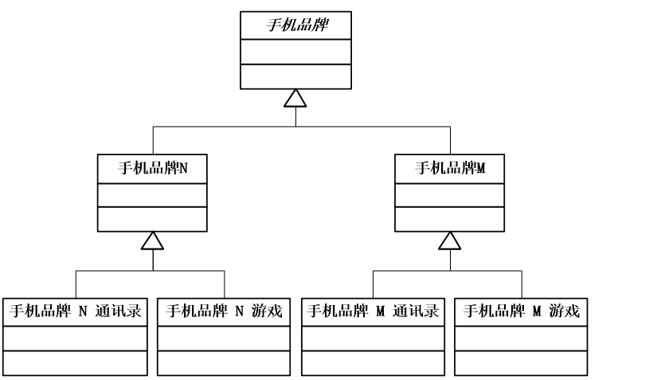

如果再添加 Mp3 音乐播放功能，怎么修改？

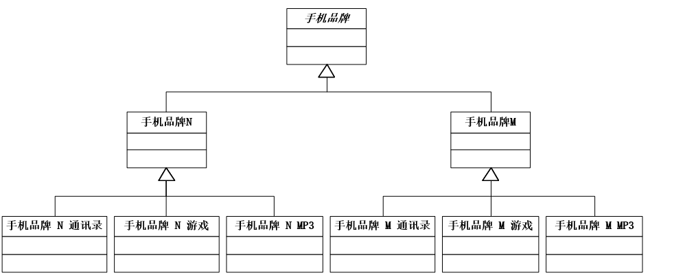

如果再添加 S 品牌手机，并且有相同功能，怎么修改？


怎么这么麻烦，换一种方式试一下

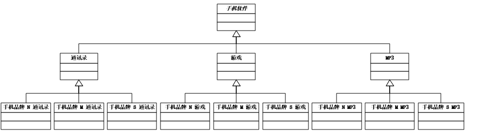

违背了面向对象单一职责原则

为什么抽象了手机品牌，或抽象了手机软件，当需求变化时，感觉如此不稳定？

### 模式动机

桥接模式的用意是“将抽象化(Abstraction)与实现化(Implementation)脱耦，使得二者可以独立地变化”。

### 模式定义

将抽象部分与它的实现部分分离，使它们都可以独立地变化。它是一种对象结构型模式，又称为柄体(Handle and Body)模式或接口(Interface)模式。

### 解耦变化

我们需要解耦这两个方向的变化，把它们之间的强耦合关系改成弱联系。我们把手机品牌和手机软件的实现分别当作两个独立的部分来对待。


这时对于手机品牌和手机软件这两个类都可以独立的变化了！我们要做的工作就是把这两部分之间连接起来，那如何连接呢？Bridge 使用了对象聚合的方式，像一座桥。

```cpp
abstract class MobilePhoneSoft  //手机软件
{

    public abstract void Run();
}
class MobilePhoneGame : MobilePhoneSoft   //手机游戏
{
    public override void Run()
    {
        Console.WriteLine("运行手机游戏");
    }
}
class MobilePhoneAddressList : MobilePhoneSoft    //手机通讯录
{
    public override void Run()
    {
        Console.WriteLine("运行手机通讯录");
    }
}
class MobilePhoneMP3 : MobilePhoneSoft    //手机MP3播放
{
    public override void Run()
    {
        Console.WriteLine("运行手机MP3播放");
    }
}
abstract class MobilePhoneBrand //手机品牌
{
    protected MobilePhoneSoft soft;

    //设置手机软件
    public void SetHandsetSoft(MobilePhoneSoft soft)
    {
        this.soft = soft;
    }
    //运行
    public abstract void Run();
}
class MobilePhoneN : MobilePhoneBrand //手机品牌N
{
    public override void Run()
    {
        soft.Run();
    }
}
static void Main(string[] args)
{
    MobilePhoneBrand ab;
    ab = new MobilePhoneN();

    ab.SetHandsetSoft(new MobilePhoneGame());
    ab.Run();

    ab.SetHandsetSoft(new MobilePhoneAddressList());
    ab.Run();

    Console.Read();
}
```

### 模式结构

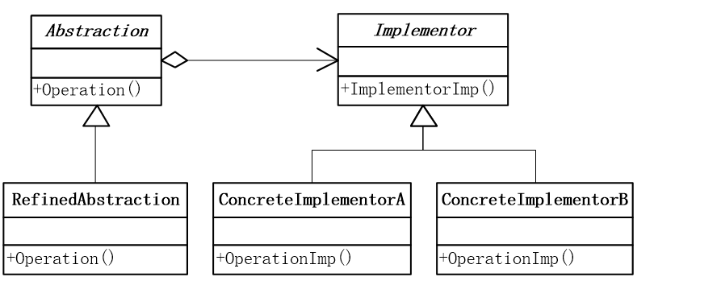

- Abstraction：抽象类
- RefinedAbstraction：扩充抽象类
- Implementor：实现类接口
- ConcreteImplementor：具体实现类

在桥接模式中不仅 Implementor 具有变化(ConcreateImplementior)，而且 Abstraction 也可以发生变化(RefinedAbstraction)，这是一个多对多的关系，而且两者的变化是完全独立的。RefinedAbstraction 与 ConcreateImplementior 之间松散耦合，它们仅仅通过 Abstraction 与 Implementor 之间的聚合关系联系起来。

### 模式范例

考虑不同平台的日志记录，对于操作数据库、写入文本文件所调用的方式可能是不一样的，为此对于不同的日志记录方式，我们需要提供各种不同平台上的实现，对上面的类做进一步的设计得到了下面的结构图

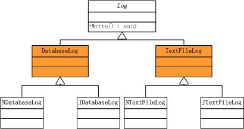

现在的这种设计方案本身是没有任何错误的，假如现在我们要引入一种新的 xml 文件的记录方式，则上面的类结构图会变成

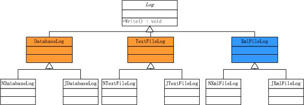

我们新增加了一个继承于 Log 基类的子类，而没有修改其它的子类，这样也符合了开放-封闭原则。如果我们引入一种新的平台，比如说我们现在开发的日志记录工具还需要支持 Borland 平台，此时该类结构又变成

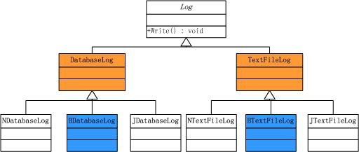

Bridge 模式粉墨登场，我们需要解耦这两个方向的变化，把它们之间的强耦合关系改成弱联系。我们把日志记录方式和不同平台上的实现分别当作两个独立的部分来对待

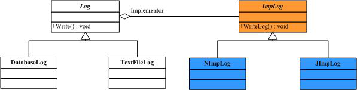

- 这样的设计是脆弱的，它在遵循开放-封闭原则的同时，违背了类的单一职责原则，即一个类只有一个引起它变化的原因，而这里引起 Log 类变化的原因却有两个，即日志记录方式的变化和日志记录平台的变化。
- 重复代码会很多，不同的日志记录方式在不同的平台上也会有一部分的代码是相同的；再次是类的结构过于复杂，继承关系太多，难于维护，最致命的一点是扩展性太差。上面我们分析的变化只是沿着某一个方向，如果变化沿着日志记录方式和不同的运行平台两个方向变化，我们会看到这个类的结构会迅速的变庞大。

### 优缺点

- 优点
  - 分离接口及其实现部分。桥接模式使用“对象间的组合关系”解耦了抽象和实现之间固有的绑定关系，使得抽象和实现可以沿着各自的维度来变化。 所谓抽象和实现沿着各自维度的变化，即“子类化”它们，得到各个子类之后，从而获得不同平台上的不同型号。
  - 桥接模式的应用一般在“两个非常强的变化维度”，有时候即使有两个变化的维度，但是某个方向的变化维度并不剧烈——换言之两个变化不会导致纵横交错的结果，并不一定要使用桥接模式。桥接模式提高了系统的可扩充性。
  - 实现细节对客户透明，可以对用户隐藏实现细节。
  - 桥接模式有时候类似于多继承方案，但是多继承方案往往违背了类的单一职责原则（即一个类只有一个变化的原因），复用性比较差。桥接模式是比多继承方案更好的解决方法。

### 模式使用

- 如果一个系统需要在构件的抽象化角色和具体化角色之间增加更多的灵活性， 避免在两个层次之间建立静态的联系。
- 设计要求实现化角色的任何改变不应当影响客户端，或者说实现化角色的改变对客户端是完全透明的。
- 一个构件有多于一个的抽象化角色和实现化角色，系统需要它们之间进行动态耦合。
- 虽然在系统中使用继承是没有问题的，但是由于抽象化角色和具体化角色需要独立变化，设计要求需要独立管理这两者。

### 模式应用

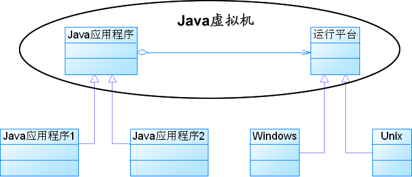

## 组合模式(Composite)

将对象组合成树形结构以表示"部分-整体"的层次结构，"Composite 使得用户对单个对象和组合对象的使用具有一致性。"

### 模式背景

设计一个绘图程序

- 绘制基本图元线对象(Line)、圆对象(Circle)、矩形对象(Rectangle)
- 绘制组合对象(Picture)，可包含任意基本图元的组合

```cpp
public class Line
{
    public void Draw()
    {
        Console.WriteLine("Draw a Line");
    }
}

public class Circle
{
    public void Draw()
    {
        Console.WriteLine("Draw a Circle");
    }
}

public class Rectangle
{
    public void Draw()
    {
        Console.WriteLine("Draw a Rectangle");
    }
}

public class Picture
{
    protected ArrayList picList = new ArrayList();

    public void Add(object pic)
    {
        picList.Add(pic);
    }
    public void Remove(object pic)
    {
        picList.Remove(pic);
    }
    public ArrayList GetChilds()
    {
        return picList;
    }
}

static void Main(string[] args)
{
    Picture root = new Picture();
    Picture branch1 = new Picture();
    Picture branch2 = new Picture();

    Line line1 = new Line();
    Circle circle1 = new Circle();
    Rectangle rect1 = new Rectangle();

    Line line2 = new Line();
    Circle circle2 = new Circle();
    Rectangle rect2 = new Rectangle();

    root.Add(line1);
    root.Add(circle1);
    root.Add(branch1);
    branch1.Add(line2);
    branch1.Add(branch2);
    branch2.Add(circle2);
    branch2.Add(rect2);
    root.Add(rect1);

    Display(root.GetChilds());

    Console.Read();
}
public static void Display(ArrayList root)
{
    for (int i = 0; i < root.Count; i++)
    {
        if (root[i] is Line)
        {
            ((Line)root[i]).Draw();
        }
        else if (root[i] is Circle)
        {
            ((Circle)root[i]).Draw();
        }
        else if (root[i] is Rectangle)
        {
            ((Rectangle)root[i]).Draw();
        }
        else if (root[i] is Picture)
        {
            Display(((Picture)root[i]).GetChilds());
        }
    }
}
```

实现判断太麻烦！

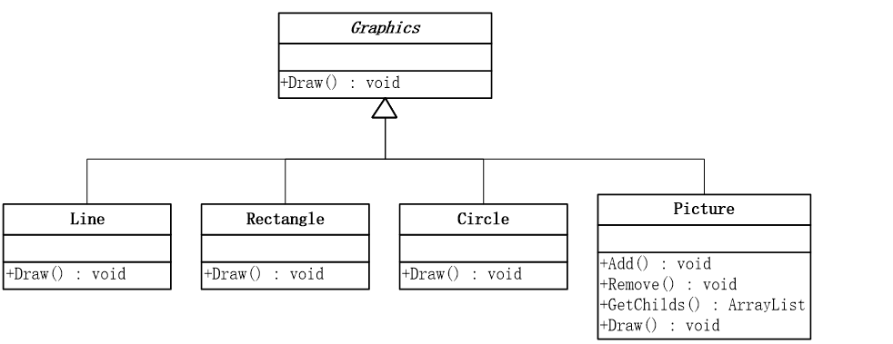

```cpp
public abstract class Graphics
{
    public abstract void Draw();
}

public class Line : Graphics
{
    public override void Draw()
    {
        Console.WriteLine("Draw a Line");
    }
}

public class Circle : Graphics
{
    public override void Draw()
    {
        Console.WriteLine("Draw a Circle");
    }
}

public class Rectangle : Graphics
{
    public override void Draw()
    {
        Console.WriteLine("Draw a Rectangle");
    }
}

public class Picture : Graphics
{
    protected ArrayList picList = new ArrayList();

    public override void Draw()
    {
        Display(picList);
    }
    public void Display(ArrayList root)
    {
        for (int i = 0; i < root.Count; i++)
        {
            if (root[i] is Line)
            {
                ((Line)root[i]).Draw();
            }
            else if (root[i] is Circle)
            {
                ((Circle)root[i]).Draw();
            }
            else if (root[i] is Rectangle)
            {
                ((Rectangle)root[i]).Draw();
            }
            else if (root[i] is Picture)
            {
                Display(((Picture)root[i]).GetChilds());
            }
        }
    }
}

static void Main(string[] args)
{
    Picture root = new Picture();
    Picture branch1 = new Picture();
    Picture branch2 = new Picture();

    Line line1 = new Line();
    Circle circle1 = new Circle();
    Rectangle rect1 = new Rectangle();

    Line line2 = new Line();
    Circle circle2 = new Circle();
    Rectangle rect2 = new Rectangle();

    root.Add(line1);
    root.Add(circle1);
    root.Add(branch1);
    branch1.Add(line2);
    branch1.Add(branch2);
    branch2.Add(circle2);
    branch2.Add(rect2);
    root.Add(rect1);

    root.Draw();

    Console.Read();
}
```

拥有了公共的 Draw 方法，统一了绘制图形接口

以上代码没有错误，就是优秀的设计吗？

可以将判断代码依赖于抽象编程，将类型转换为抽象类 Graphics

```cpp
public class Picture : Graphics
{
    protected ArrayList picList = new ArrayList();

    public override void Draw()
    {
        for (int i = 0; i < picList.Count; i++)
        {
            ((Graphics)picList[i]).Draw();
        }
    }
}
```

这种思想就是组合模式。

### 模式动机

- 对于树形结构，当容器对象（如文件夹）的某一个方法被调用时，将遍历整个树形结构，寻找也包含这个方法的成员对象（可以是容器对象，也可以是叶子对象，如子文件夹和文件）并调用执行。（递归调用）
- 由于容器对象和叶子对象在功能上的区别，在使用这些对象的客户端代码中必须有区别地对待容器对象和叶子对象，而对于这些对象的区别对待将会使得程序非常复杂。
- 组合模式描述了如何将容器对象和叶子对象进行递归组合，使得用户在使用时无须对它们进行区分，可以一致地对待容器对象和叶子对象，这就是组合模式的模式动机。

### 模式定义

组合多个对象形成树形结构以表示“整体—部分”的结构层次。组合模式对单个对象（即叶子对象）和组合对象（即容器对象）的使用具有一致性。组合模式又可以称为“整体—部分”(Part-Whole)模式，属于对象的结构模式，它将对象组织到树结构中，可以用来描述整体与部分的关系。

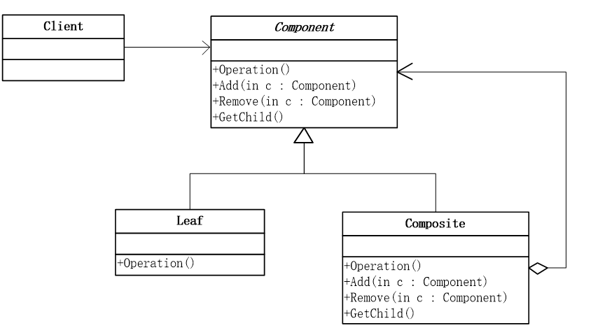

- Component：抽象构件（接口或抽象类）
- Leaf：叶子构件
- Composite：容器构件
- Client：客户类

应该是在 Graphic(Component)中声明这些集合操作，并使得这些操作对 Leaf 类有意义，还是只应该在 Picture(Composite)和它的子类中声明并定义这些操作呢？这就要分为以下两种方式。

**安全方式**

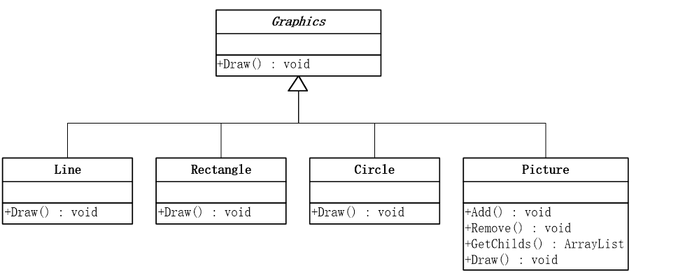

在 Composite 类中定义管理子部件的方法具有良好的安全性，因为在 C++这样的静态类型语言中，在编译时任何从 Leaf 中增加或删除对象的尝试都将被发现。但是这又损失了透明性，因为 Leaf 和 Composite 显然具有不同的接口。

**透明方式**

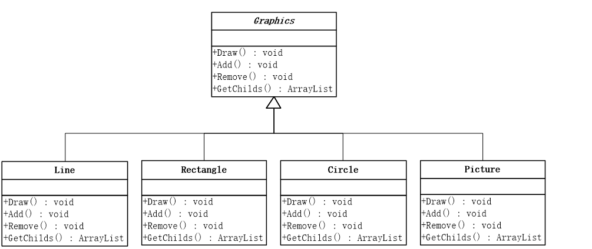

在类层级结构的根部定义子节点管理接口的方法具有良好的透明性，因为你可以一致地使用所有的组件，但是这一方法以安全性为代价，因为客户有可能会做一些无意义的事情，例如在 Leaf 中增加和删除对象。

### 优缺点

- 优点
  - 使客户端调用简单，客户端可以一致的使用组合结构或其中单个对象，用户就不必关系自己处理的是单个对象还是整个组合结构，这就简化了客户端代码。
  - 定义了包含叶子对象和容器对象的类层次结构，叶子对象可以被组合成更复杂的容器对象，而这个容器对象又可以被组合，这样不断地递归下去。客户代码中，任何用到叶子对象的地方都可以使用容器对象。
  - 客户端不必因为加入了新的对象构件而更改代码。
- 缺点
  - 组合模式的缺陷是使得设计变得更加抽象，对象的商业规则如果很复杂，则实现组合模式较困难。
  - 此外，不是所有的方法都与叶子构件子类都有关联
  - 有时候我们希望一个容器中只能有某些特定的构件。使用组合模式时，不能依赖类型系统来施加这些约束，因为它们都来自于相同的抽象层，在这种情况下，必须通过在运行时进行类型检查来实现。

### 模式使用

- 需要表示一个对象整体或部分层次。
- 想让客户能够忽略不同对象层次的变化。
- 对象的结构是动态的并且复杂程度不一样，但客户需要一致地处理它们。

### 模式应用

**XML 文档解析**

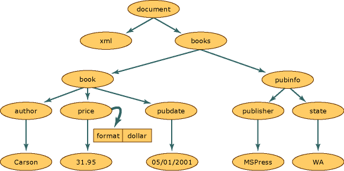

**文件目录操作**

操作系统中的目录结构是一个树形结构，因此在对文件和文件夹进行操作时可以应用组合模式，例如杀毒软件在查毒或杀毒时，既可以针对一个具体文件，也可以针对一个目录。如果是对目录查毒或杀毒，将递归处理目录中的每一个子目录和文件。

## 装饰模式(Decorator)

动态地给一个对象添加一些额外的职责。就增加功能来说，Decorator 模式相比生成子类更为灵活

### 模式背景

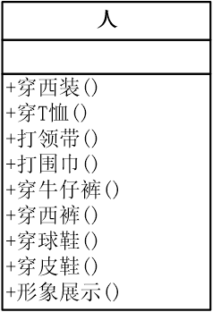

```cpp
class Person
{
    private string name;
    public Person(string name)
    {
        this.name = name;
    }
    public void WearTShirts()
    {
        Console.Write("T恤 ");
    }
    public void WearJeans()
    {
        Console.Write("牛仔裤 ");
    }
    public void WearSneakers()
    {
        Console.Write("球鞋 ");
    }
    public void WearSuit()
    {
        Console.Write("西装 ");
    }
    public void WearTrousers()
    {
        Console.Write("西裤 ");
    }
    public void WearLeatherShoes()
    {
        Console.Write("皮鞋 ");
    }
    public void Show()
    {
        Console.WriteLine("装扮的{0}", name);
    }
}
static void Main(string[] args)
{
    Person zs = new Person("张三");

    Console.WriteLine("\n第一种装扮：");
    zs.WearTShirts();
    zs.WearJeans();
    zs.WearSneakers();
    zs.Show();

    Console.WriteLine("\n第二种装扮：");
    zs.WearSuit();
    zs.WearTrousers();
    zs.WearLeatherShoes();
    zs.Show();

    Console.Read();
}
```

不断添加新的衣服怎么办? 原则?

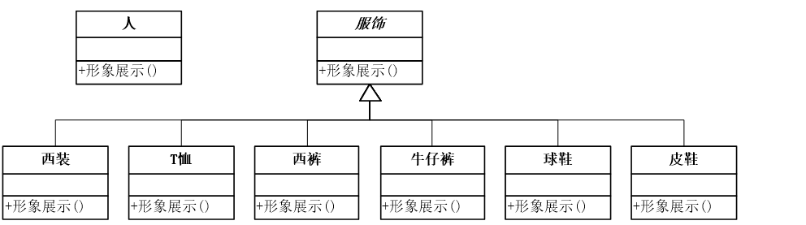

```cpp
class Person
{
    private string name;
    public Person(string name)
    {
        this.name = name;
    }

    public void Show()
    {
        Console.WriteLine("装扮的{0}", name);
    }
}
abstract class Finery   //服饰
{
    public abstract void Show();
}

class TShirts : Finery   //T恤
{
    public override void Show()
    {
        Console.Write("T恤 ");
    }
}
class Jeans : Finery   //牛仔裤
{
    public override void Show()
    {

        Console.Write("牛仔裤 ");
    }
}
class Sneakers : Finery   //球鞋
{
    public override void Show()
    {

        Console.Write("球鞋 ");
    }
}
static void Main(string[] args)
{
    Person zs = new Person("张三");

    Console.WriteLine("\n第一种装扮：");
    Finery tx = new TShirts();
    Finery nzk = new Jeans();
    Finery qx = new Sneakers();

    tx.Show();
    nzk.Show();
    qx.Show();
    zs.Show();

    Console.WriteLine("\n第二种装扮：");
    Finery xz = new Suit();
    Finery xk = new Trousers();
    Finery px = new LeatherShoes();

    xz.Show();
    xk.Show();
    px.Show();
    zs.Show();

    Console.Read();
}
```

期望：内部组装完毕，再显示出来，这就要用到装饰模式。

### 模式动机

- 有时我们希望给某个对象而不是整个类添加一些功能。例如：一个图形用户界面工具箱允许我们对任意一个用户界面组件添加一些新的特性，如增加一个边框；或者增加一些行为，如窗口的滚动。
- 一种较为灵活的方式是将组件嵌入另一个对象中，由这个对象来添加边框。我们称这个嵌入的对象为装饰器（Decorator）。这个装饰与它所装饰的组件接口一致，因此它对使用该组件的客户透明。它将客户请求转发给该组件，并且可能在转发前后执行一些额外的动作。这种透明性使得我们可以递归嵌套多个装饰，从而可以添加任意多的功能。

### 模式定义

动态地给一个对象增加一些额外的职责（Responsibility），就增加对象功能来说，装饰模式比生成子类实现更为灵活。其别名为包装器(Wrapper)。装饰模式是一种对象结构型模 式。

### 模式结构

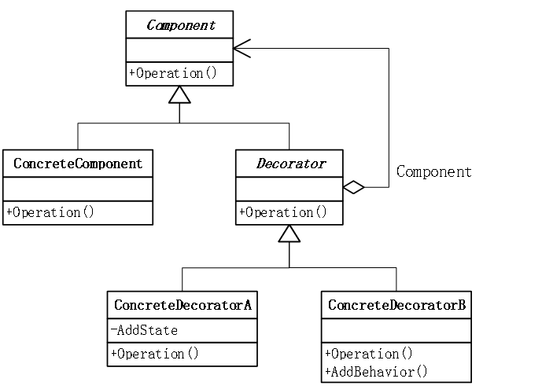

- Component：组件
- ConcreteComponent：具体组件
- Decorator：抽象装饰类
- ConcreteDecorator：具体装饰类

**穿衣服**

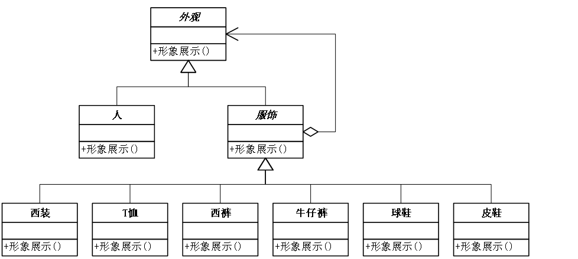

```cpp
abstract class Appearance
{
    public abstract void Show();
}
class Person : Appearance
{
    private string name;

    public Person(string name)
    {
        this.name = name;
    }

    public override void Show()
    {
        Console.WriteLine("装扮的{0}", name);
    }
}
abstract class Finery : Appearance
{
    protected Appearance component;

    public void Decorate(Appearance component)
    {
        this.component = component;
    }

    public override void Show()
    {
        if (component != null)
        {
            component.Show();
        }
    }
}
class TShirts : Finery
{
    public override void Show()
    {
        base.Show();
        Console.Write("T恤");

    }
}
class Jeans : Finery
{
    public override void Show()
    {
        base.Show();
        Console.Write("牛仔裤");
    }
}
class Sneakers : Finery
{
    public override void Show()
    {
        base.Show();
        Console.Write("球鞋");
    }
}
static void Main(string[] args)
{
    Person xc = new Person("小菜");

    Console.WriteLine("\n第一种装扮：");

    Sneakers qx = new Sneakers();
    Jeans nzk = new Jeans();
    TShirts tx = new TShirts();

    tx.Decorate(xc);
    nzk.Decorate(tx);
    qx.Decorate(nzk);

    qx.Show();

    Console.Read();
}
```

### 模式应用

**星巴克咖啡订单管理系统管理**

- 如果有一张订单：“双倍摩卡豆浆奶泡拿铁咖啡”，应该如何进行设计？
- 如果有一张订单：“奶泡摩卡加冰浓缩咖啡”，应该如何进行设计？

_实现一_

类爆炸

- 调料的增加/删除
- 调料价格的修改

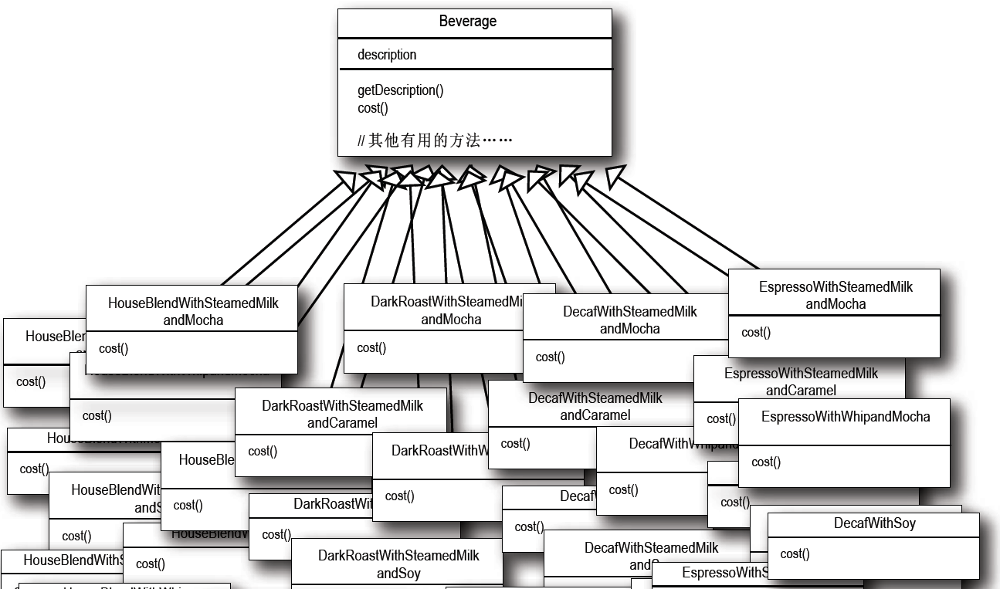

_实现二_

使用实例变量和继承，跟踪这些调料

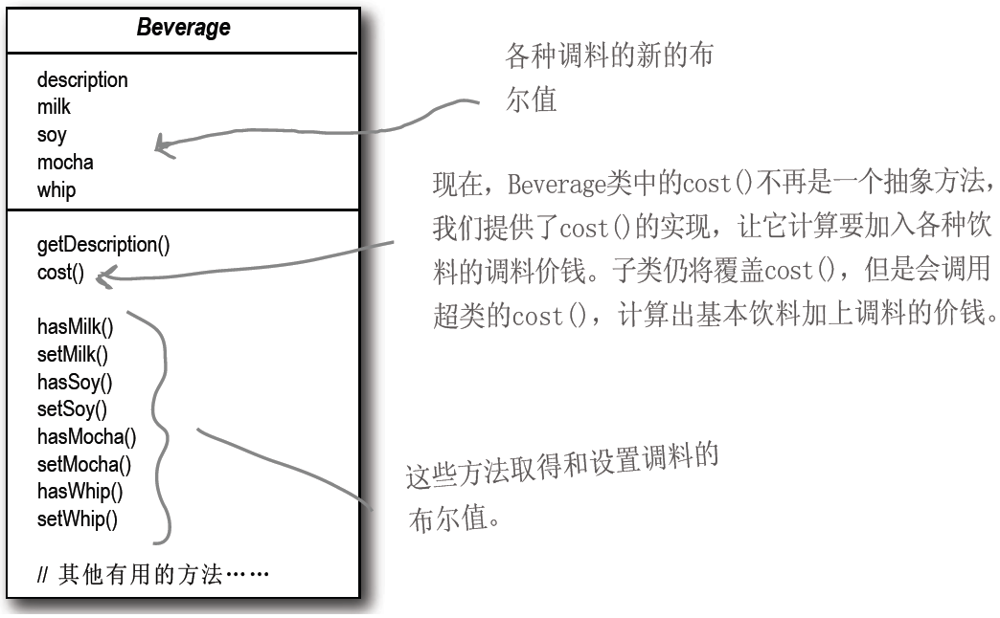

_实现三_

应用以上的装饰模式

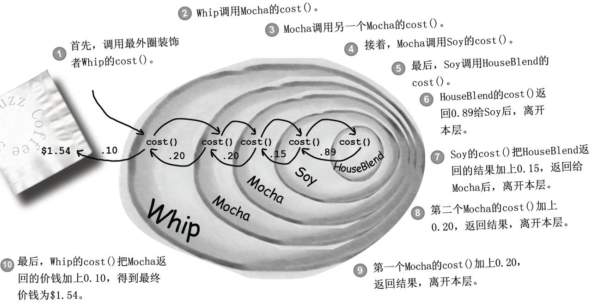

### 优缺点

- 优点
  - 装饰模式与继承关系的目的都是要扩展对象的功能，但是装饰模式可以提供比继承更多的灵活性。
  - 通过使用不同的具体装饰类以及这些装饰类的排列组合，设计师可以创造出很多不同行为的组合。
  - 这种比继承更加灵活机动的特性，也同时意味着装饰模式比继承更加易于出错。
- 缺点
  - 采用装饰模式进行系统设计往往会产生许多看上去类似的小对象，这些对象仅仅在他们相互连接的方式上有所不同，而不是它们的类或是它们的属性值有所不同。尽管对于那些了解这些系统的人来说，很容易对它们进行定制，但是很难学习这些系统，排错也很困难。

### 模式使用

- 在不影响其它对象的情况下，以动态、透明的方式给单个对象添加职责。 需要动态地给一个对象增加功能，这些功能可以再动态地被撤销。
- 当不能采用生成子类的方法进行扩充时。一种情况是，可能有大量独立的扩展，每一种组合将产生大量的子类，使得子类数目呈爆炸性增长。另一种情况可能是因为类定义不能继承(final 类)，或类不能用于生成子类。

### 需要注意的问题

- 一个装饰类的接口必须与被装饰类的接口保持相同，对于客户端来说无论是装饰之前的对象还是装饰之后的对象都可以一致对待。
- 尽量保持具体构件类 Component 作为一个“轻”类，也就是说不要把太多的逻辑和状态放在具体构件类中，可以通过装饰类对其进行扩展。
