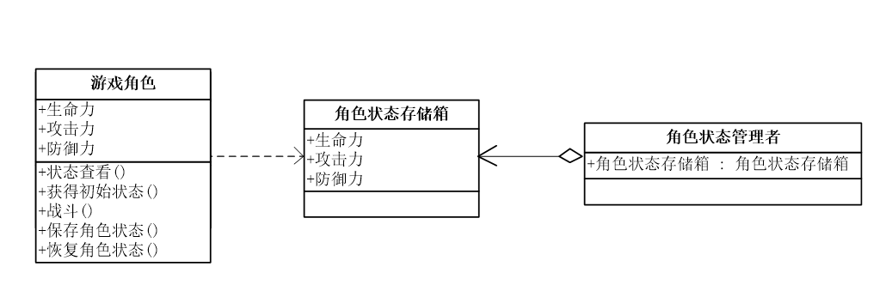
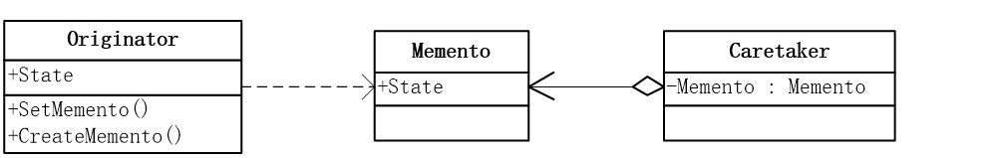
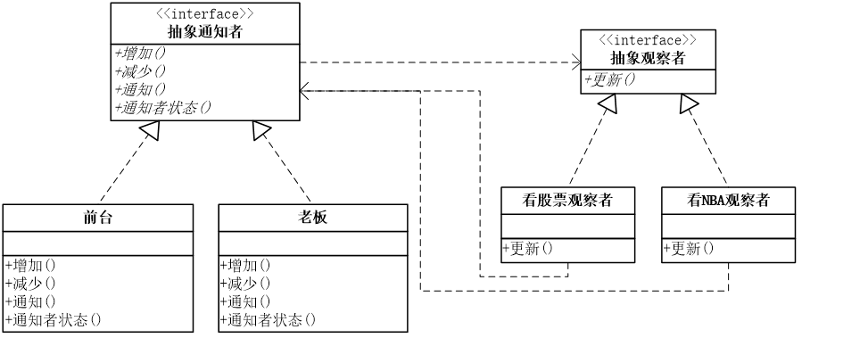
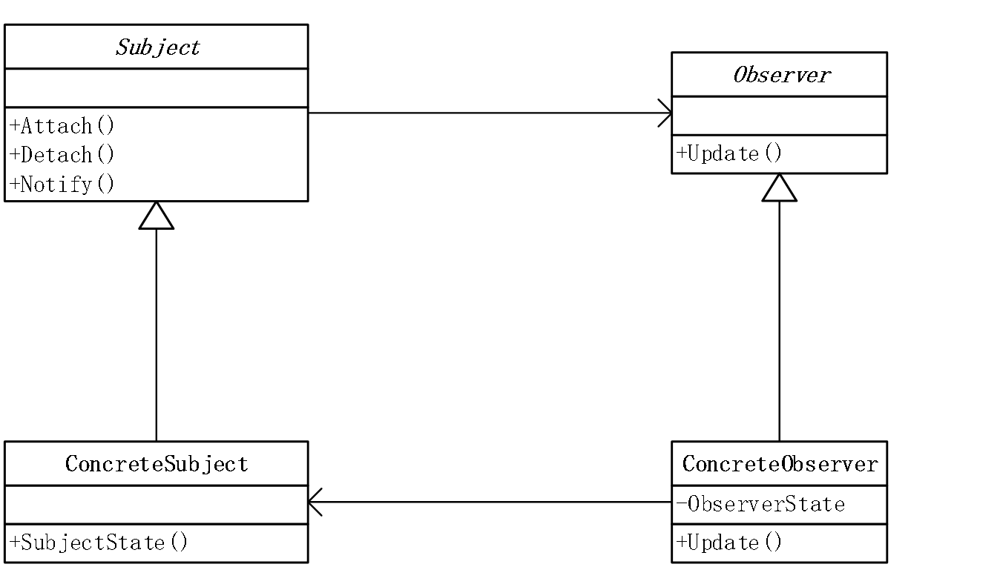
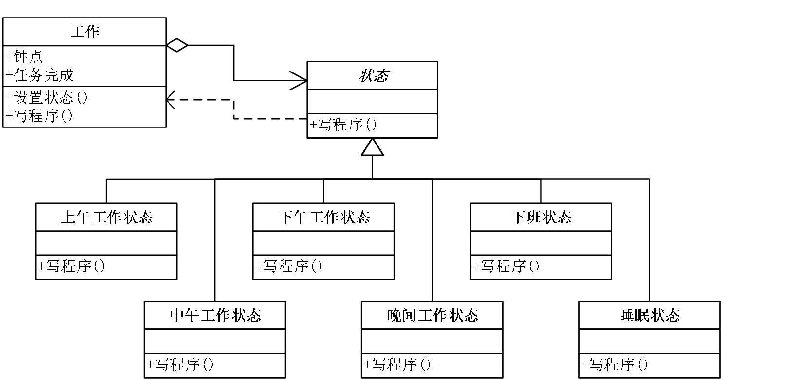
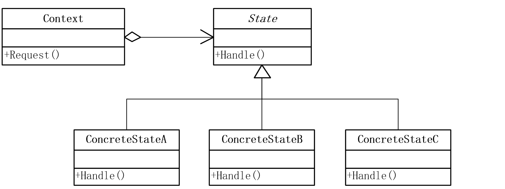
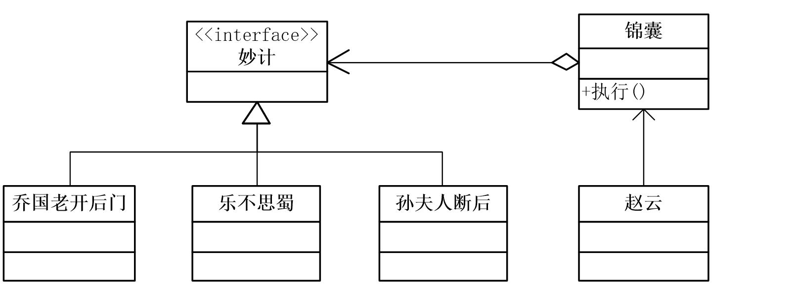
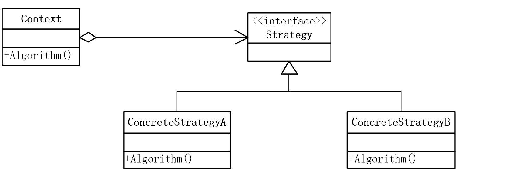

## 备忘录模式(Memento)

在不破坏封装性的前提下，捕获一个对象的内部状态，并在该对象之外保存这个状态。这样以后就可将该对象恢复到原先保存的状态。

### 模式背景

我要保存游戏进度

- 游戏角色，生命力、攻击力、防御力
- 模拟战斗代码，读取进度

```cpp
class GameRole
{
    //生命力
    private int vit;
    public int Vitality
    {
        get { return vit; }
        set { vit = value; }
    }

    //攻击力
    private int atk;
    public int Attack
    {
        get { return atk; }
        set { atk = value; }
    }

    //防御力
    private int def;
    public int Defense
    {
        get { return def; }
        set { def = value; }
    }
    //状态显示
    public void StateDisplay()
    {
        Console.WriteLine("角色当前状态：");
        Console.WriteLine("体力：{0}", this.vit);
        Console.WriteLine("攻击力：{0}", this.atk);
        Console.WriteLine("防御力：{0}", this.def);
        Console.WriteLine("");
    }

    //获得初始状态
    public void GetInitState()
    {
        this.vit = 100;
        this.atk = 100;
        this.def = 100;
    }

    //战斗
    public void Fight()
    {
        this.vit = 0;
        this.atk = 0;
        this.def = 0;
    }
}

static void Main(string[] args)
{
    //大战Boss前
    GameRole lixiaoyao = new GameRole();
    lixiaoyao.GetInitState();
    lixiaoyao.StateDisplay();

    //保存进度
    GameRole backup = new GameRole();
    backup.Vitality = lixiaoyao.Vitality;
    backup.Attack = lixiaoyao.Attack;
    backup.Defense = lixiaoyao.Defense;

    //大战Boss时，损耗严重
    lixiaoyao.Fight();
    lixiaoyao.StateDisplay();

    //恢复之前状态
    lixiaoyao.Vitality = backup.Vitality;
    lixiaoyao.Attack = backup.Attack;
    lixiaoyao.Defense = backup.Defense;

    lixiaoyao.StateDisplay();
    Console.Read();
}

```

### 模式动机

- 在应用软件的开发过程中，有时我们有必要记录一个对象的内部状态。为了允许用户取消不确定的操作或从错误中恢复过来，需要实现备份点和撤销机制，而要实现这些机制，我们必须事先将状态信息保存在某处，这样状态才能将对象恢复到它们原先的状态。
- 但是对象通常封装了其部分或所有的状态信息，使得其状态不能被其它对象访问，也就不可能在该对象之外保存其状态，而暴露其内部状态又将违反封装的原则，可能有损系统的可靠性和可扩展性。

### 模式定义

在不破坏封装的前提下，捕获一个对象的内部状态，并在该对象之外保存这个状态，这样可以在以后将对象恢复到原先保存的状态。



```cpp
class GameRole
{
    ……

    //保存角色状态
    public RoleStateMemento SaveState()
    {
        return (new RoleStateMemento(vit, atk, def));
    }

    //恢复角色状态
    public void RecoveryState(RoleStateMemento memento)
    {
        this.vit = memento.Vitality;
        this.atk = memento.Attack;
        this.def = memento.Defense;
    }

    ……
}

class RoleStateMemento    //角色状态存储箱
{
    private int vit;
    private int atk;
    private int def;

    public RoleStateMemento(int vit, int atk, int def)
    {
        this.vit = vit;
        this.atk = atk;
        this.def = def;
    }

    public int Vitality   //生命力
    {
        get { return vit; }
        set { vit = value; }
    }

    public int Attack   //攻击力
    {
        get { return atk; }
        set { atk = value; }
    }

    public int Defense    //防御力
    {
        get { return def; }
        set { def = value; }
    }
}
//角色状态管理者
class RoleStateCaretaker
{
    private RoleStateMemento memento;

    public void ImportState(RoleStateMemento Record)
    {
        memento = Record;
    }

    public RoleStateMemento ExportState()
    {
        return memento;
    }
}

static void Main(string[] args)
{
    //大战Boss前
    GameRole lixiaoyao = new GameRole();
    lixiaoyao.GetInitState();
    lixiaoyao.StateDisplay();

    //保存进度
    RoleStateCaretaker stateAdmin = new RoleStateCaretaker();
    stateAdmin.ImportState(lixiaoyao.SaveState());

    //大战Boss时，损耗严重
    lixiaoyao.Fight();
    lixiaoyao.StateDisplay();

    //恢复之前状态
    lixiaoyao.RecoveryState(stateAdmin.ExportState());
    lixiaoyao.StateDisplay();

    Console.Read();
}
```

### 模式结构



- Originator：原发器
- Memento：备忘录
- Caretaker：负责人

### 优缺点

- 优点
  - 备忘录模式提供了一种状态恢复的实现机制，使得用户可以方便地回到一个特定的历史步骤，当新的状态无效或者存在问题时，可以使用暂时存储起来的备忘录将状态复原。
  - 备忘录模式保存了封装的边界信息，Memento 对象是原发器对象的表示，不会被其它代码改动，这种模式简化了原发器对象，Memento 只保存原发器的状态，采用堆栈来存储备忘录对象可以实现多次取消操作。
- 缺点
  - 资源消耗过大，如果类的成员变量太多，就不可避免占用大量的内存了，而且每保存一次对象的状态都需要消耗内存资源，如果知道这一点大家就容易理解为什么一些提供了 Undo 功能的软件在运行时需要的内存和硬盘空间比较大了。

### 模式使用

- 必须保存一个对象在某一个时刻的状态/部分状态，这样以后需要时它能够恢复到先前的状态。
- 如果一个用接口来让其它对象得到这些状态，将会暴露对象的实现细节并破坏对象的封装性。

### 模式应用

- Undo 功能
- 配置文件
- Cookie Session 对象

## 观察者模式(Observer)

定义对象间的一种一对多的依赖关系，当一个对象的状态发生改变时，所有依赖于它的对象都得到通知并被自动更新。

### 模式背景

晕，老板回来了，我不知道

- 股市特别火，同事在上班期间偷偷看股票行情
- 如果老板出门回来，公司前台 MM 电话事先通知
- 可是…..
- 老板今天刚一回来，让前台 MM 去打印资料了
- 同事背对着大门大喊了一声“耶！我的股票涨停啦！”
- 程序模拟发生的事情

```cpp
class Secretary   //前台秘书类
{
    //同事列表
    private IList<StockObserver> observers = new List<StockObserver>();
    private string action;
    //增加
    public void Attach(StockObserver observer)
    {
        observers.Add(observer);
    }
    //减少
    public void Detach(StockObserver observer)
    {
        observers.Remove(observer);
    }
    //通知
    public void Notify()
    {
        foreach (StockObserver o in observers)
            o.Update();
    }
    //前台状态
    public string SecretaryAction
    {
        get { return action; }
        set { action = value; }
    }
}
//看股票的同事
class StockObserver
{
    private string name;
    private Secretary sub;

    public StockObserver(string name, Secretary sub)
    {
        this.name = name;
        this.sub = sub;
    }

    public void Update()
    {
        Console.WriteLine("{0} {1} 关闭股票行情，继续工作！", sub.SecretaryAction, name);
    }
}
static void Main(string[] args)
{
    //前台秘书MM
    Secretary MM = new Secretary();
    //看股票的同事
    StockObserver tongshi1 = new StockObserver("魏关姹", MM);
    StockObserver tongshi2 = new StockObserver("易管查", MM);

    //前台记下了两位同事
    MM.Attach(tongshi1);
    MM.Attach(tongshi2);
    //发现老板回来
    MM.SecretaryAction = "老板回来了！";
    //通知两个同事
    MM.Notify();

    Console.Read();
}
```

如果有人聊 QQ，有人看 NBA 都需要通知，如何修改？思考：违背了那些原则？

```cpp
//抽象观察者
abstract class Observer
{
    protected string name;
    protected Secretary sub;

    public Observer(string name, Secretary sub)
    {
        this.name = name;
        this.sub = sub;
    }

    public abstract void Update();
}
//看股票的同事
class StockObserver : Observer
{
    public StockObserver(string name, Secretary sub) : base(name, sub)
    {
    }
    public override void Update()
    {
        Console.WriteLine("{0} {1} 关闭股票行情，继续工作！", sub.SecretaryAction, name);
    }
}

//看NBA的同事
class NBAObserver : Observer
{
    public NBAObserver(string name, Secretary sub)  : base(name, sub)
    {
    }
    public override void Update()
    {
        Console.WriteLine("{0} {1} 关闭NBA直播，继续工作！", sub.SecretaryAction, name);
    }
}

class Secretary    //前台秘书类
{
    //同事列表
    private IList<Observer> observers = new List<Observer>();
    private string action;

    //增加
    public void Attach(Observer observer)
    {
        observers.Add(observer);
    }

    //减少
    public void Detach(Observer observer)
    {
        observers.Remove(observer);
    }

    //通知
    public void Notify()
    {
        foreach (Observer o in observers)
            o.Update();
        …..
    }
}
```

其实作为通知者，老板、秘书、所有人都可以成为通知者，应该抽象出来

```cpp
//通知者接口
interface Subject
{
    void Attach(Observer observer);
    void Detach(Observer observer);
    void Notify();
    string SubjectState
    {
        get;
        set;
    }
}
class Secretary : Subject
{
    //同事列表
    private IList<Observer> observers = new List<Observer>();
    private string action;
    //增加
    public void Attach(Observer observer)
    {
        observers.Add(observer);
    }
    //减少
    public void Detach(Observer observer)
    {
        observers.Remove(observer);
    }
    //通知
    public void Notify()
    {
        foreach (Observer o in observers)
            o.Update();
    }
    //前台状态
    public string SubjectState
    {
        get { return action; }
        set { action = value; }
    }
}
class Boss : Subject
{
    //同事列表
    private IList<Observer> observers = new List<Observer>();
    private string action;
    //增加
    public void Attach(Observer observer)
    {
        observers.Add(observer);
    }
    //减少
    public void Detach(Observer observer)
    {
        observers.Remove(observer);
    }
    //通知
    public void Notify()
    {
        foreach (Observer o in observers)
            o.Update();
    }
    //老板状态
    public string SubjectState
    {
        get { return action; }
        set { action = value; }
    }
}
static void Main(string[] args)
{
    //老板胡汉三
    Boss huhansan = new Boss();

    //看股票的同事
    StockObserver tongshi1 = new StockObserver("魏关姹", huhansan);
    //看NBA的同事
    NBAObserver tongshi2 = new NBAObserver("易管查", huhansan);

    huhansan.Attach(tongshi1);
    huhansan.Attach(tongshi2);

    huhansan.Detach(tongshi1);

    //老板回来
    huhansan.SubjectState = "我胡汉三回来了！";
    //发出通知
    huhansan.Notify();

    Console.Read();
}
```



### 模式动机

建立一种对象与对象之间的依赖关系，一个对象发生改变时将自动通知其他对象，其他对象将相应做出反应。在此，发生改变的对象称为观察目标，而被通知的对象称为观察者，一个观察目标可以对应多个观察者，而且这些观察者之间没有相互联系，可以根据需要增加和删除观察者，使得系统更易于扩展，这就是观察者模式的模式动机。

### 模式定义

- 观察者模式(Observer Pattern)：定义对象间的一种一对多依赖关系，使得每当一个对象状态发生改变时，其相关依赖对象皆得到通知并被自动更新。
- 观察者模式又叫做发布-订阅（Publish/Subscribe）模式、模型-视图（Model/View）模式、源-监听器（Source/Listener）模式或从属者（Dependents）模式。观察者模式是一种对象行为型模式。

### 模式结构



- Subject：目标（被观察对象）
- ConcreteSubject：具体目标
- Observer：观察者
- ConcreteObserver：具体观察者

注册的投资者在股票市场发生变化时，可以自动得到通知

```cpp
abstract class Stock
{
    // Fields
    protected string symbol;
    protected double price;
    private ArrayList investors = new ArrayList();

    // Constructor
    public Stock( string symbol, double price )
    {
        this.symbol = symbol;
        this.price = price;
    }

    // Properties
    public double Price
    {
        get{ return price; }
        set
        {
            price = value;
            Notify();
        }
    }

    public string Symbol
    {
        get{ return symbol; }
        set{ symbol = value; }
    }

    // Methods
    public void Attach( Investor investor )
    {
        investors.Add( investor );
    }

    public void Detach( Investor investor )
    {
        investors.Remove( investor );
    }

    public void Notify()
    {
        foreach( Investor i in investors )
        i.Update( this );
    }

}


// "ConcreteSubject"
class IBM : Stock
{
    // Constructor
    public IBM( string symbol, double price )
        : base( symbol, price ) {}
}

// "Observer"
interface IInvestor
{
    // Methods
    void Update( Stock stock );
}

// "ConcreteObserver"
class Investor : IInvestor
{
    // Fields
    private string name;
    private string observerState;
    private Stock stock;

    // Constructors
    public Investor( string name )
    {
        this.name = name;
    }

    // Methods
    public void Update( Stock stock )
    {
        Console.WriteLine( "Notified investor {0} of {1}'s change to {2:C}",
        name, stock.Symbol, stock.Price );
    }

    // Properties
    public Stock Stock
    {
        get{ return stock; }
        set{ stock = value; }
    }
}

public static void Main( string[] args )
{
    // Create investors
    Investor s = new Investor( "Sorros" );
    Investor b = new Investor( "Berkshire" );

    // Create IBM stock and attach investors
    IBM ibm = new IBM( "IBM", 120.00 );
    ibm.Attach( s );
    ibm.Attach( b );

    // Change price, which notifies investors
    ibm.Price = 120.10;
    ibm.Price = 121.00;
    ibm.Price = 120.50;
    ibm.Price = 120.75;
}

```

### 模式分析

- 观察者模式描述了如何建立对象与对象之间的依赖关系，如何构造满足这种需求的系统。
- 这一模式中的关键对象是观察目标和观察者，一个目标可以有任意数目的与之相依赖的观察者，一旦目标的状态发生改变，所有的观察者都将得到通知。
- 作为对这个通知的响应，每个观察者都将即时更新自己的状态，以与目标状态同步，这种交互也称为发布-订阅(publish-subscribe)。目标是通知的发布者，它发出通知时并不需要知道谁是它的观察者，可以有任意数目的观察者订阅它并接收通知。

### 优缺点

- 优点
- 观察者模式可以实现表示层和数据逻辑层的分离，并定义了稳定的消息更新传递机制，抽象了更新接口，使得可以有各种各样不同的表示层作为具体观察者角色。
- 观察者模式在观察目标和观察者之间建立一个抽象的耦合。
- 观察者模式支持广播通信。
- 观察者模式符合“开闭原则”的要求。
- 缺点
- 如果一个观察目标对象有很多直接和间接的观察者的话，将所有的观察者都通知到会花费很多时间。
- 如果在观察者和观察目标之间有循环依赖的话，观察目标会触发它们之间进行循环调用，可能导致系统崩溃。
- 观察者模式没有相应的机制让观察者知道所观察的目标对象是怎么发生变化的，而仅仅只是知道观察目标发生了变化。

### 模式使用

- 一个抽象模型有两个方面，其中一个方面依赖于另一个方面。将这些方面封装在独立的对象中使它们可以各自独立地改变和复用。
- 一个对象的改变将导致其他一个或多个对象也发生改变，而不知道具体有多少对象将发生改变，可以降低对象之间的耦合度。
- 一个对象必须通知其他对象，而并不知道这些对象是谁。
- 需要在系统中创建一个触发链，A 对象的行为将影响 B 对象，B 对象的行为将影响 C 对象……，可以使用观察者模式创建一种链式触发机制。

### 模式应用

- JDK1.1 版本及以后的各个版本中，事件处理模型采用基于观察者模式的委派事件模型(Delegation Event Model, DEM)。
- 在 DEM 中，事件的发布者称为事件源(Event Source)，而订阅者叫做事件监听器(Event Listener)，在这个过程中还可以通过事件对象(Event Object)来传递与事件相关的信息，事件源对象、事件监听对象（事件处理对象）和事件对象构成了 Java 事件处理模型的三要素。
- 观察者模式在软件开发中应用非常广泛，如某电子商务网站可以在执行发送操作后给用户多个发送商品打折信息，某团队战斗游戏中某队友牺牲将给所有成员提示等等，凡是涉及到一对一或者一对多的对象交互场景都可以使用观察者模式。

## 状态模式(State)

当一个对象的内在状态改变时允许改变其行为，这个对象看起来像是改变了其类。

### 模式背景

又要加班了?(工作状态函数)

- 上午工作状态 ( h<12 点 )
- 中午工作状态 ( 12<h<13 点 )
- 下午工作状态 ( 13<h<17 点 )
- 晚间工作状态 ( 17<h<21 点 )
- 睡眠状态 ( h>21 点 )
- 下班状态

```cpp
public static void WriteProgram()
{
    if (Hour < 12)
    {
        Console.WriteLine("当前时间：{0}点 上午工作，精神百倍", Hour);
    }
    else if (Hour < 13)
    {
        Console.WriteLine("当前时间：{0}点 饿了，午饭；犯困，午休。", Hour);
    }
    else if (Hour < 17)
    {
        Console.WriteLine("当前时间：{0}点 下午状态还不错，继续努力", Hour);
    }
    else
    {
        if (WorkFinished)
        {
            Console.WriteLine("当前时间：{0}点 下班回家了", Hour);
        }
        else
        {
            if (Hour < 21)
            {
                Console.WriteLine("当前时间：{0}点 加班哦，疲累之极", Hour);
            }
            else
            {
                Console.WriteLine("当前时间：{0}点 不行了，睡着了。", Hour);
            }
        }
    }
}

static int Hour = 0;
static bool WorkFinished = false;

static void Main(string[] args)
{
    Hour = 9;
    WriteProgram();
    Hour = 10;
    WriteProgram();
    Hour = 12;
    WriteProgram();
    Hour = 13;
    WriteProgram();
    Hour = 14;
    WriteProgram();
    Hour = 17;

    WorkFinished = true; // false;

    WriteProgram();
    Hour = 19;
    WriteProgram();
    Hour = 22;
    WriteProgram();

    Console.Read();
}
```

面向过程的思维，通过面向对象完成代码的责任分解

```cpp
public class Work   //工作
{
    //钟点
    private int hour;
    public int Hour
    {
        get { return hour; }
        set { hour = value; }
    }

    //任务完成
    private bool finish = false;
    public bool TaskFinished
    {
        get { return finish; }
        set { finish = value; }
    }


    public void WriteProgram()
    {
        ……
    }
}

static void Main(string[] args)
{
    Work MisProject = new Work();
    MisProject.Hour = 10;
    MisProject.WriteProgram();

    Work MisProject = new Work();
    MisProject.Hour = 13;
    MisProject.WriteProgram();

    Work MisProject = new Work();
    MisProject.Hour = 16;
    MisProject.WriteProgram();

    Console.Read();
}

```

过多的判断分支，说明类的责任过大，无论何种状态改变，都需要通过它来改变，违背的原则？

### 模式动机

- 在很多情况下，一个对象的行为取决于一个或多个动态变化的属性，这样的属性叫做状态，这样的对象叫做有状态的(stateful)对象。这样的对象状态是从事先定义好的一系列值中取出的。当一个这样的对象与外部事件产生互动时，其内部状态就会改变，从而使得系统的行为也随之发生变化。
- 考虑一个银行系统，一个账户对象的状态处于若干个不同状态之一：开户状态、正常状态、透支状态、冻结状态。当顾客在对账户进行存取款操作时，账户类根据自身的当前状态作出不同的反应，同时进行对象状态的切换。例如：如果账户处于冻结状态就没有办法再进行取款操作，一个取款操作需要先了解账户对象的状态。
- 状态(State)模式描述了账户如何在每一种状态下表现出不同的行为。而一旦取款操作完成，对象的状态也将动态发生变化，如取款后账户余额低于某一值其状态可能从正常状态转为透支状态。
- 状态模式的关键是引入了一个抽象类来专门表示对象的状态，这个类我们叫做状态类，而对象的具体状态都继承了该类，并在不同具体状态类中实现了不同状态的行为，包括各种状态之间的转换。

### 模式定义

允许一个对象在其内部状态改变时改变它的行为，对象看起来似乎修改了它的类。其别名为状态对象(Objects for States)。状态模式是一种对象行为型模式。

当一个对象的行为取决于它的状态，并且在运行时需要根据状态改变行为的时候，将特定状态的相关行为放到一个对象中，可以通过定义新的子类增加新的状态和转换。



```cpp
public class Work    //工作
{
    private State current;
    public Work()
    {
        current = new ForenoonState();
    }

    private double hour;
    public double Hour
    {
        get { return hour; }
        set { hour = value; }
    }

    private bool finish = false;
    public bool TaskFinished
    {
        get { return finish; }
        set { finish = value; }
    }

    public void SetState(State s)
    {
        current = s;
    }

    public void WordHard()
    {
        current.WriteProgram(this);
    }
}

public abstract class State     //抽象状态
{
    public abstract void WriteProgram(Work w);
}
public class ForenoonState : State     //上午工作状态
{
    public override void WriteProgram(Work w)
    {
        if (w.Hour < 12)
        {
            Console.WriteLine("当前时间：{0}点 上午工作，精神百倍", w.Hour);
        }
        else
        {
            w.SetState(new NoonState());
            w.WorkHard();
        }
    }
}
public class NoonState : State     //中午工作状态
{
    public override void WriteProgram(Work w)
    {
        if (w.Hour < 13)
        {
            Console.WriteLine("当前时间：{0}点 饿了，午饭；犯困，午休。", w.Hour);
        }
        else
        {
            w.SetState(new AfternoonState());
            w.WorkHard();
        }
    }
}

static void Main(string[] args)
{
    //紧急项目
    Work EmProject = new Work();
    EmProject.Hour = 9;
    EmProject.WorkHard();
    EmProject.Hour = 10;
    EmProject.WorkHard();
    EmProject.Hour = 12;
    EmProject.WorkHard();
    EmProject.Hour = 13;
    EmProject.WorkHard();
    EmProject.Hour = 14;
    EmProject.WorkHard();
    EmProject.Hour = 17;

    EmProject.TaskFinished = true;
    // EmProject.TaskFinished = false;

    EmProject.WriteProgram();
    EmProject.Hour = 19;
    EmProject.WriteProgram();
    EmProject.Hour = 22;
    EmProject.WriteProgram();

    Console.Read();
}

```

### 模式结构



- Context：环境类
- State：抽象状态类
- ConcreteState：具体状态类

```cpp
public class Context
{
    private State state;

    public Context(State state)
    {
        this.state = state;
    }

    public State State
    {
        get { return state; }
        set { state = value; }
    }

    public void Request()
    {
        state.Handle(this);
    }
}
public abstract class State
{
    public abstract void Handle(Context context);
}
public class ConcreteStateA : State
{
    public override void Handle(Context context)
    {
        Console.WriteLine("当前状态是 A.");
        context.State = new ConcreteStateB();
    }
}

public class ConcreteStateB : State
{
    public override void Handle(Context context)
    {
        Console.WriteLine("当前状态是 B.");
        context.State = new ConcreteStateA();
    }
}

class Program
{
    static void Main(string[] args)
    {
        // 设置Context的初始状态为ConcreteStateA
        Context context = new Context(new ConcreteStateA());

        // 不断地进行请求，同时更改状态
        context.Request();
        context.Request();
        context.Request();
        context.Request();

        Console.Read();
    }
}

```

### 模式应用

- 灯泡的开与关
- qq 在线状态
- 文档编辑器状态切换
- 工作流系统
- 游戏开发

### 优缺点

- 优点
  - 封装转换过程，也就是转换规则。
  - 枚举可能的状态，因此，需要事先确定状态种类。
  - 将所有与某个状态有关的行为放到一个对象里。
  - 允许状态转换逻辑与状态对象合成一体，而不是某一个巨大的条件语句块或 switch 语句。
  - 避免了状态的不一致性，因为状态的改变只使用一个状态对象而不是几个对象或属性。
- 缺点
  - 状态模式的使用必然会增加系统类和对象的个数。

### 模式使用

- 对象的行为依赖于它的状态（属性）并且它必须可以根据它的状态改变而改变它的相关行为。
- 操作的很多部分都带有与对象状态有关的大量条件语句，大量条件语句的出现，会导致代码的可维护性和灵活性变差，不能方便地增加删除状态，使客户类与类库之间的耦合增强。

## 策略模式(Strategy)

定义一系列的算法,把它们一个个封装起来,并且使它们可相互替换。

### 模式背景

周郎妙计安天下，赔了夫人又折兵

- 第一个锦囊：找乔国老帮忙，让吴国太给孙权施加压力
- 第二个锦囊：刘备乐不思蜀，谎报曹操要报赤壁大败之仇
- 第三个锦囊：追兵来了，孙尚香断后



```cpp
public interface IStrategy
{
    void operate();
}

public class OpenBackDoor : IStrategy
{
    public void operate()
    {
        Console.WriteLine("找乔国老帮忙，让吴国太给孙权施加压力");
    }
}

public class HappyForgetShu : IStrategy
{
    public void operate()
    {
        Console.WriteLine("刘备乐不思蜀，谎报曹操要报赤壁大败之仇");
    }
}

public class BlockEnemy : IStrategy
{
    public void operate()
    {
        Console.WriteLine("追兵来了，孙夫人断后");
    }
}
public class Context
{
    private IStrategy strategy;
    public Context(IStrategy strategy)
    {
        this.strategy = strategy;
    }

    public void operation()
    {
        this.strategy.operate();
    }
}
static void Main(string[] args)
{
    Context context;
    context = new Context(new OpenBackDoor());
    context.operation();

    context = new Context(new HappyForgetShu());
    context.operation();

    context = new Context(new BlockEnemy());
    context.operation();

    Console.Read();
}
```

### 模式动机

- 完成一项任务，往往可以有多种不同的方式，每一种方式称为一个策略，我们可以根据环境或者条件的不同选择不同的策略来完成该项任务。
- 在软件开发中也常常遇到类似的情况，实现某一个功能有多个途径，此时可以使用一种设计模式来使得系统可以灵活地选择解决途径，也能够方便地增加新的解决途径。
- 在软件系统中，有许多算法可以实现某一功能，如查找、排序等，一种常用的方法是硬编码(Hard Coding)在一个类中，如需要提供多种查找算法，可以将这些算法写到一个类中，在该类中提供多个方法，每一个方法对应一个具体的查找算法；当然也可以将这些查找算法封装在一个统一的方法中，通过 if…else…等条件判断语句来进行选择。
- 为了解决这些问题，可以定义一些独立的类来封装不同的算法，每一个类封装一个具体的算法，在这里，每一个封装算法的类我们都可以称之为策略(Strategy)，为了保证这些策略的一致性，一般会用一个抽象的策略类来做算法的定义，而具体每种算法则对应于一个具体策略类。

### 模式定义

定义一系列算法，将每一个算法封装起来，并让它们可以相互替换。策略模式让算法独立于使用它的客户而变化。策略模式是一种对象行为型模式。

### 模式结构



- Context: 环境类
- Strategy: 抽象策略类
- ConcreteStrategy: 具体策略类

### 模式应用

- 直接插入排序、希尔排序、冒泡排序、快速排序、直接选择排序、堆排序、归并排序、基数排序的选择。
- 交通工具的选择。

### 优缺点

- 优点
  - 提供了对“开闭原则”的完美支持，用户可以在不修改原有系统的基础上选择算法或行为，也可以灵活地增加新的算法或行为。
  - 提供了管理相关的算法族的办法。
  - 提供了可以替换继承关系的办法。
  - 可以避免使用多重条件转移语句。
- 缺点
  - 客户端必须知道所有的策略类，并自行决定使用哪一个策略类。
  - 策略模式将造成产生很多策略类，可以通过使用享元模式在一定程度上减少对象的数量。

### 模式使用

- 如果在一个系统里面有许多类，它们之间的区别仅在于它们的行为，那么使用策略模式可以动态地让一个对象在许多行为中选择一种行为。
- 如果一个对象有很多的行为，如果不用恰当的模式，这些行为就只好使用多重的条件选择语句来实现。
- 一个系统需要动态地在几种算法中选择一种。
- 不希望客户端知道复杂的、与算法相关的数据结构，在具体策略类中封装算法和相关的数据结构，提高算法的保密性与安全性。

### 模式应用

- 在微软公司提供的演示项目 PetShop 4.0 中使用策略模式来处理同步订单和异步订单的问题。
- 在 BLL 中的 Order 类里通过反射机制从配置文件中读取策略配置的信息以决定到底是使用哪种订单处理方式。只需要修改配置文件即可更改订单处理方式，提高了系统的灵活性。

### 策略模式与状态模式

- 可以通过环境类状态的个数来决定是使用策略模式还是状态模式。
- 策略模式的环境类自己选择一个具体策略类，具体策略类无须关心环境类；而状态模式的环境类由于外在因素需要放进一个具体状态中，以便通过其方法实现状态的切换，因此环境类和状态类之间存在一种双向的关联关系。
- 使用策略模式时，客户端需要知道所选的具体策略是哪一个，而使用状态模式时，客户端无须关心具体状态，环境类的状态会根据用户的操作自动转换。
- 如果系统中某个类的对象存在多种状态，不同状态下行为有差异，而且这些状态之间可以发生转换时使用状态模式；如果系统中某个类的某一行为存在多种实现方式，而且这些实现方式可以互换时使用策略模式。
