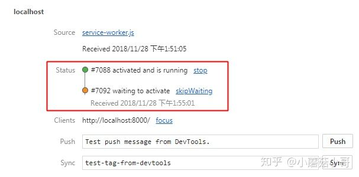

Service Worker 以其 `异步安装` 和 `持续运行` 两个特点，决定了针对它的更新操作必须非常谨慎小心。因为它具有拦截并处理网络请求的能力，因此必须做到网页(主要是发出去的请求)和 Service Worker 版本一致才行，否则就会导致新版本的 Service Worker 处理旧版本的网页，或者一个网页先后由两个版本的 Service Worker 控制引发种种问题。

# 前置知识

- SW 的作用
- SW 的注册方式 (navigator.serviceWorker.register)
- SW 的生命周期 (install -> waiting -> activate -> fetch)

# 组织 SW 的两大禁忌

- 不要给 service-worker.js 设置不同的名字，这是由于 v1 升级为 v2 依赖于 index.html 引用地址的变化，但它本身却被缓存了起来，除非手动清除卸载 v1
- 不要给 service-worker.js 设置缓存，设置 Cache-control: no-store 是比较安全的，理由同上

# SW 的 waiting 状态

注册 SW 是通过 `navigator.serviceWorker.register(swUrl, options)` 方法进行的。但和普通的 JS 代码不同，这句执行在浏览器看来其实有两种不同的情况：

- 如果目前尚未有活跃的 SW ，那就直接安装并激活。
- 如果已有 SW 安装着，向新的 swUrl 发起请求，获取内容和和已有的 SW 比较。如没有差别，则结束安装。如有差别，则安装新版本的 SW（执行 install 阶段），之后令其等待（进入 waiting 阶段），此时当前页面会有两个 SW，但状态不同，如下图：

  

- 如果老的 SW 控制的所有页面全部关闭，则老的 SW 结束运行，转而激活新的 SW（执行 activated 阶段），使之接管页面。

由于浏览器的内部实现原理，当页面切换或者自身刷新时，浏览器是等到新的页面完成渲染之后再销毁旧的页面。这表示新旧两个页面中间有共同存在的交叉时间，因此简单的切换页面或者刷新是不能使得 SW 进行更新的，老的 SW 依然接管页面，新的 SW 依然在等待。（这点也要求我们在检测 SW 更新时，除了 onupdatefound 之外，还需要判断是否存在处在等待状态的 SW，即 reg.waiting 是否存在。不过这在本文讨论范围之外，就不展开了）

假设我们提供了一次重大升级，希望新的 SW 尽快接管页面，应该怎么做呢？

# 具体方法

## skipWaiting

在遭遇突发情况时，很容易想到通过“插队”的方式来解决问题，现实生活中的救护车消防车等特种车辆就采用了这种方案。SW 也给程序员提供了实现这种方案的可能性，那就是在 SW 内部的 self.skipWaiting() 方法。

```js
self.addEventListener('install', (event) => {
  self.skipWaiting();
  // 预缓存其他静态内容
});
```

### 优点

这样可以让新的 SW “插队”，强制令它立刻取代老的 SW 控制所有页面，而老的 SW 被“斩立决”，简单粗暴。Lavas 最初就使用了这个方案，因为实在是太容易想到也太容易实现了，诱惑极大。

### 缺点

我们想象如下场景：

1. 一个页面 index.html 已安装了 sw.v1.js （实际地址都是 sw.js，只是为了明显区分如此表达而已）
2. 用户打开这个页面，所有网络请求都通过了 sw.v1.js，页面加载完成。
3. 因为 SW 异步安装的特性，一般在浏览器空闲时，他会去执行那句 navigator.serviceWorker.register。这时候浏览器发现了有个 sw.v2.js 存在，于是安装并让他等待。
4. 但因为 sw.v2.js 在 install 阶段有 self.skipWaiting()，所以浏览器强制退休了 sw.v1，而是让 sw.v2 马上激活并控制页面。
5. 用户在这个 index.html 的后续操作如有网络请求，就由 sw.v2.js 处理了。

很明显，同一个页面，前半部分的请求是由 sw.v1.js 控制，而后半部分是由 sw.v2.js 控制。这两者的不一致性很容易导致问题，甚至网页报错崩溃。比如说 sw.v1.js 预缓存了一个 v1/image.png，而当 sw.v2.js 激活时，通常会删除老版本的预缓存，转而添加例如 v2/image.png 的缓存。所以这时如果用户网络环境不畅或者断网，或者采用的是 CacheFirst 之类的缓存策略时，浏览器发现 v1/image.png 已经在缓存中找不到了。即便网络环境正常，浏览器也得再发一次请求去获取这些本已经缓存过的资源，浪费了时间和带宽。再者，这类 SW 引发的错误很难复现，也很难 DEBUG，给程序添加了不稳定因素。

### 应用场景

需要保证同一个页面在两个版本的 SW 相继处理的情况下依然能够正常工作，才能使用这个方案。

## skipWaiting + 刷新

方法一的问题在于，skipWaiting 之后导致一个页面先后被两个 SW 控制。那既然已经安装了新的 SW，则表示老的 SW 已经过时，因此可以推断使用老的 SW 处理过的页面也已经过时。我们要做的是让页面从头到尾都让新的 SW 处理，就能够保持一致，也能达成我们的需求了。所以我们想到了刷新，废弃掉已经被处理过的页面。

在注册 SW 的地方（而不是 SW 里面）可以通过监听 controllerchange 事件来得知控制当前页面的 SW 是否发生了变化，如下：

```js
navigator.serviceWorker.addEventListener('controllerchange', () => {
  window.location.reload();
});
```

### 优点

当发现控制自己的 SW 已经发生了变化，那就刷新自己，让自己从头到尾都被新的 SW 控制，就一定能保证数据的一致性。

### 缺点

但是突然的更新会打断用户的操作，可能会引发不适。刷新的源头在于 SW 的变更；SW 的变更又来源于浏览器安装新的 SW 碰上了 skipWaiting，所以这次刷新绝大部分情况会发生在加载页面后的几秒内。用户刚开始浏览内容或者填写信息就遇上了莫名的刷新，可能会砸键盘。

另外这里还有两个注意点：

### SW 的更新和页面的刷新

在讲到 SW 的 waiting 状态时，我曾经说过简单的切换页面或者刷新是不能使得 SW 进行更新的，而这里又一次牵涉到了 SW 的更新和页面的刷新，不免产生混淆。

我们简单理一下逻辑，其实也不复杂：

1. 刷新不能使得 SW 发生更新，即老的 SW 不会退出，新的 SW 也不会激活。
2. 这个方法是通过 skipWaiting 迫使 SW 新老交替。在交替完成后，通过 controllerchange 监听到变化再执行刷新。

所以两者的因果是相反的，并不矛盾。

### 避免无限刷新

在使用 Chrome Dev Tools 的 Update on Reload 功能时，使用如上代码会引发无限的自我刷新。为了弥补这一点，需要添加一个 flag 判断一下，如下：

```js
let refreshing = false;
navigator.serviceWorker.addEventListener('controllerchange', () => {
  if (refreshing) {
    return;
  }
  refreshing = true;
  window.location.reload();
});
```

## 给用户一个提示

方法二有一个思路值得借鉴，即“通过 SW 的变化触发事件，而在事件监听中执行刷新”。但毫无征兆的刷新页面的确不可接受，所以我们再改进一下，给用户一个提示，让他来点击后更新 SW，并引发刷新，岂不美哉？

大致的流程是：

1. 浏览器检测到存在新的（不同的）SW 时，安装并让它等待，同时触发 updatefound 事件
2. 我们监听事件，弹出一个提示条，询问用户是不是要更新 SW

   

3. 如果用户确认，则向处在等待的 SW 发送消息，要求其执行 skipWaiting 并取得控制权
4. 因为 SW 的变化触发 controllerchange 事件，我们在这个事件的回调中刷新页面即可

这里值得注意的是第 3 步。因为用户点击的响应代码是位于普通的 JS 代码中，而 skipWaiting 的调用位于 SW 的代码中，因此这两者还需要一次 postMessage 进行通讯。

代码方面，我们以 Lavas 的实现来分步骤看一下：

第 1 步是浏览器执行的，与我们无关。第 2 步需要我们监听这个 updatefound 事件，这是需要通过注册 SW 时返回的 Registration 对象来监听的，因此通常我们可以在注册时直接监听，避免后续还要再去获取这个对象，徒增复杂。

```js
function emitUpdate() {
  var event = document.createEvent('Event');
  event.initEvent('sw.update', true, true);
  window.dispatchEvent(event);
}

if ('serviceWorker' in navigator) {
  navigator.serviceWorker
    .register('/service-worker.js')
    .then(function(reg) {
      if (reg.waiting) {
        emitUpdate();
        return;
      }

      reg.onupdatefound = function() {
        var installingWorker = reg.installing;
        installingWorker.onstatechange = function() {
          switch (installingWorker.state) {
            case 'installed':
              if (navigator.serviceWorker.controller) {
                emitUpdate();
              }
              break;
          }
        };
      };
    })
    .catch(function(e) {
      console.error('Error during service worker registration:', e);
    });
}
```

这里我们通过发送一个事件 (名为 sw.update，位于 emitUpdate() 方法内) 来通知外部，这是因为提示条是一个单独的组件，不方便在这里直接展现。当然如果你的应用有不同的结构，也可以自行修改。总之想办法展示提示条，或者单纯使用 confirm 让用户确认即可。

第 3 步需要处理用户点击，并和 SW 进行通讯。处理点击的代码比较简单，就不重复了，这里主要列出和 SW 的通讯代码：

```js
try {
  navigator.serviceWorker.getRegistration().then((reg) => {
    reg.waiting.postMessage('skipWaiting');
  });
} catch (e) {
  window.location.reload();
}
```

注意通过 reg.waiting 向 等待中的 SW 发消息，而不是向当前的老的 SW 发消息。而 SW 部分则负责接收消息，并执行“插队”逻辑。

```js
// service-worker.js
// SW 不再在 install 阶段执行 skipWaiting 了
self.addEventListener('message', (event) => {
  if (event.data === 'skipWaiting') {
    self.skipWaiting();
  }
});
```

第 4 步和方法二一致，也是通过 navigator.serviceWorker 监听 controllerchange 事件来执行刷新操作，这里就不重复列出代码了。

### 缺点

从运行结果上看，这个方法兼顾了快速更新和用户体验，是当前最好的解决方案。但它也有弊端。

#### 过于复杂

- 在文件数量方面，涉及到至少 2 个文件（注册 SW，监听 updatefound 和处理 DOM 的展现和点击在普通的 JS 中，监听信息并执行 skipWaiting 是在 SW 的代码中），这还不算我们可能为了代码的模块分离，把 DOM 的展现点击和 SW 的注册分成两个文件
- 在 API 种类方面，涉及到 Registration API（注册，监听 updatefound 和发送消息时使用），SW 生命周期和 API（skipWaiting）以及普通的 DOM API
- 测试和 DEBUG 方法复杂，至少需要制造新老 2 个版本 SW 的环境，并且熟练掌握 SW 的 DEBUG 方式。

尤其是为了达成用户点击后的 SW “插队”，需要从 DOM 点击响应，到发送消息给 SW，再到 SW 里面操作。这一串操作横跨好几个 JS，非常不直观且复杂。为此已有 Google 大佬 Jake Archibald 向 W3C 提出建议，简化这个过程，允许在普通的 JS 中通过 reg.waiting.skipWaiting() 直接插队，而不是只能在 SW 内部操作。

#### 必须通过 JS 完成更新

这里指的是 SW 的更新只能通过用户点击通知条上的按钮，使用 JS 来完成，而不能通过浏览器的刷新按钮完成。这其实是浏览器的设计问题，而非方案本身的问题。

不过反过来说，如果浏览器帮助我们完成了上述操作，那就变成允许通过一个 Tab 的刷新去强制其他 Tab 刷新，在当前浏览器以 Tab 为单位的前提下，存在这种交叉控制也是不安全和难以理解的。

唯一可行的优化是当 SW 控制的页面仅存在一个 Tab 时，刷新这个 Tab 如果能够更新 SW，也能给我们省去不少操作，也不会带来交叉控制的问题。只是这样可能加重了浏览器的判断成本，也丧失了操作一致性的美感，只能说这可能也是一个久远的梦想了。

# 总结

SW 的功能相当强大，但同时涉及的 API 也相对较多，是一个需要投入相当学习成本的强力技术（国外文章称之为 rocket science）。SW 的更新对使用 SW 的站点来说非常重要，但如上所述，其方案也相对复杂，远远超过了其他常用前端基础技术的复杂度（例如 DOM API，JS 运算，闭包等等）。不过 SW 从其起步至今也不过两三年的时间，尚处在发展期。相信通过 W3C 的不断修正以及前端圈的持续使用，会有更加简洁，更加自动，更加完备的方案出现，届时我们可能就能像使用 DOM API 那样简单地使用 SW 了。
