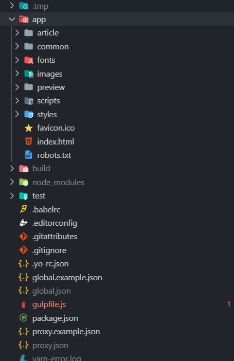
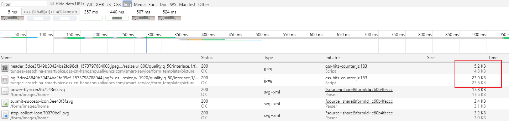
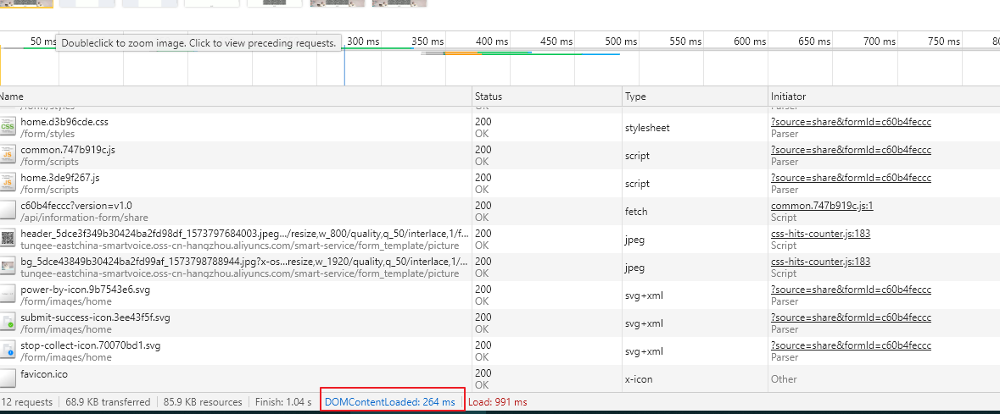
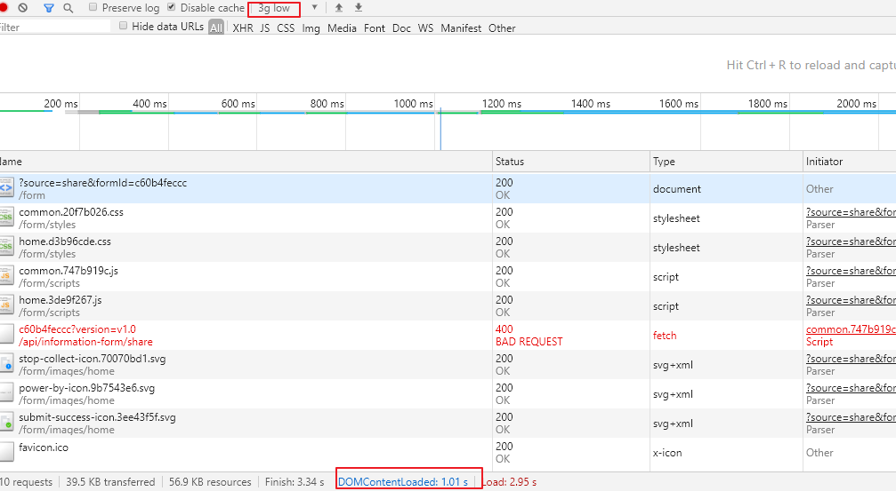

# 需求背景

最近在做表单分享的需求，类似于问卷调查，需要在三端（桌面端、移动端、微信端）同时兼容

# 技术方案

1. 我出的方案：采用原生语法新框架写，考虑到首屏渲染的问题未采用
2. 主管出的方案：采用后端渲染模板的方式，最大化首屏加载速度，但有以下问题：
   1. 后端渲染对服务器 CPU 的要求较高
   2. 本来打算用 oss 来减少后端渲染，但考虑到表单经常变化，且分享的链接要尽可能的保持不变，这就限制了 oss 的使用
   3. 同样由于分享的链接要尽可能的保持不变，在新的表单分享模板加入后需要后端刷数据，容错性较低
3. 最终讨论结果：采用前后端分离的方式，用原生语法新框架写，需要考虑到版本兼容（新的模板数据和旧的模板数据要同时兼容，在接口里面加一个版本号）、模板枚举 wiki 的命名（减少沟通成本同时缩短分享链接的长度）、loading 页（首屏加载时间可能较长）

# 方案调研

刚开始考虑到用官网的框架，但是由于官网的框架构建过程有太多冗余的东西、以及只能在 node v9.11.2 里面使用的原因，决定自己在 [generator-webapp](https://github.com/yeoman/generator-webapp) 生成的框架上做一下改造，以下是改造的要点：

1. 资源文件 hash
2. 接口代理
3. 模板功能

# 具体实施

## 构建框架搭建

### gulp 打包优化

gulpfile.js

```js
// generated on 2019-11-07 using generator-webapp 4.0.0-6
const { src, dest, watch, series, parallel, lastRun } = require('gulp');
const gulpLoadPlugins = require('gulp-load-plugins');
const browserSync = require('browser-sync');
const del = require('del');
// const autoprefixer = require('autoprefixer');
const cssnano = require('cssnano');
const { argv } = require('yargs');
const proxy = require('http-proxy-middleware');
const postcssPresetEnv = require('postcss-preset-env');

const config = require('./proxy.json');
const globalJSON = require('./global.json');

const $ = gulpLoadPlugins();
const server = browserSync.create();

const port = argv.port || config.port || 9000;
const buildPath = argv.buildPath || 'build';
const varsEnv = argv.server || 'master';
const globalVars = globalJSON.runtime[varsEnv];
const publicPath = argv.publicPath || '/form';

const isProd = process.env.NODE_ENV === 'production';
const isTest = process.env.NODE_ENV === 'test';
const isDev = !isProd && !isTest;

// 配置反向代理
const middleware = config.proxies.map((item) =>
  proxy(item.match, {
    target: item.host,
    changeOrigin: true
  })
);

function styles() {
  return src('app/styles/*.css')
    .pipe($.if(!isProd, $.sourcemaps.init()))
    .pipe(
      $.postcss([
        // autoprefixer(),
        // 采用 postcss 最新语法
        postcssPresetEnv({
          stage: 0
        })
      ])
    )
    .pipe($.if(!isProd, $.sourcemaps.write()))
    .pipe(dest('.tmp/styles'))
    .pipe(server.reload({ stream: true }));
}

function scripts() {
  return (
    src('app/scripts/**/*.js')
      // plumber 插件防止 gulp 报错崩溃
      .pipe($.plumber())
      .pipe($.if(!isProd, $.sourcemaps.init()))
      .pipe($.babel())
      .pipe($.if(!isProd, $.sourcemaps.write('.')))
      .pipe(dest('.tmp/scripts'))
      .pipe(server.reload({ stream: true }))
  );
}

const lintBase = (files) => {
  return src(files)
    .pipe($.eslint({ fix: true }))
    .pipe(server.reload({ stream: true, once: true }))
    .pipe($.eslint.format())
    .pipe($.if(!server.active, $.eslint.failAfterError()));
};

function lint() {
  return lintBase('app/scripts/**/*.js').pipe(dest('app/scripts'));
}

function lintTest() {
  return lintBase('test/spec/**/*.js').pipe(dest('test/spec'));
}

function html() {
  // 合成 js、css 过程中，要过滤掉模板编译文件夹的代码
  // 注意这里的 useref 插件合成 js、css 有一个问题文件行尾必须为 crlf，否则此文件不能正常合成
  // 可用 .editorconfig 来限制文件行尾符
  return src(['app/**/*.html', '.tmp/**/*.html', '!app/common/**/*.html', '!.tmp/common/**/*.html'])
    .pipe($.useref({ searchPath: ['.tmp', 'app', '.'] }))
    .pipe($.if(/\.js$/, $.uglify({ compress: { drop_console: true } })))
    .pipe($.if(/\.css$/, $.postcss([cssnano({ safe: true, autoprefixer: false })])))
    .pipe(
      $.if(
        /\.html$/,
        $.htmlmin({
          collapseWhitespace: true,
          minifyCSS: true,
          minifyJS: { compress: { drop_console: true } },
          processConditionalComments: true,
          removeComments: true,
          removeEmptyAttributes: true,
          removeScriptTypeAttributes: true,
          removeStyleLinkTypeAttributes: true
        })
      )
    )
    .pipe(dest(buildPath));
}

function images() {
  return src('app/images/**/*', { since: lastRun(images) }).pipe(dest(`${buildPath}/images`));
}

function fonts() {
  return src('app/fonts/**/*.{eot,svg,ttf,woff,woff2}').pipe(
    $.if(!isProd, dest('.tmp/fonts'), dest(`${buildPath}/fonts`))
  );
}

function extras() {
  // 过滤掉模板编译文件夹的代码与 html 代码
  return src(['app/*', '!app/**/*.html', '!app/common'], {
    dot: true
  }).pipe(dest(buildPath));
}

function clean() {
  return del(['.tmp', `${buildPath}/*`]);
}

function measureSize() {
  return src(`${buildPath}/**/*`).pipe($.size({ title: 'build', gzip: true }));
}

const build = series(
  clean,
  parallel(lint, series(parallel(styles, scripts, fileVarInclude), html), images, fonts, extras),
  revAll,
  measureSize
);

function startAppServer() {
  server.init({
    notify: false,
    port,
    server: {
      baseDir: ['.tmp', 'app'],
      routes: {
        '/node_modules': 'node_modules'
      },
      middleware
    }
  });

  watch(['app/**/*.html', 'app/images/**/*', '.tmp/fonts/**/*']).on('change', server.reload);

  watch('app/styles/*.css', styles);
  watch('app/scripts/**/*.js', scripts);
  watch('app/fonts/**/*', fonts);
  // 监控 html 编译模板改动
  watch('app/**/*.html', fileVarInclude);
}

function startTestServer() {
  server.init({
    notify: false,
    port,
    ui: false,
    server: {
      baseDir: 'test',
      routes: {
        '/scripts': '.tmp/scripts',
        '/node_modules': 'node_modules'
      }
    }
  });

  watch('app/scripts/**/*.js', scripts);
  watch(['test/spec/**/*.js', 'test/index.html']).on('change', server.reload);
  watch('test/spec/**/*.js', lintTest);
}

function startDistServer() {
  server.init({
    notify: false,
    port,
    server: {
      baseDir: buildPath,
      routes: {
        '/node_modules': 'node_modules',
        // 注意这里的别名也要配置，否则资源访问不到
        [publicPath]: buildPath
      },
      middleware
    }
  });
}

// 资源 hash，注意要在最后一步，同时配置路径别名，注意所有的资源引用必须以 "/" 开头，否则别名替换不成功
function revAll() {
  return src(`${buildPath}/**`)
    .pipe(
      $.revAll.revision({
        prefix: publicPath,
        dontRenameFile: [/^\/favicon.ico$/g, '.html', 'robots.txt']
      })
    )
    .pipe($.revDeleteOriginal())
    .pipe(dest(buildPath));
}

function fileVarInclude() {
  return src('app/**/*.html')
    .pipe($.plumber())
    .pipe(
      $.fileInclude({
        prefix: '@@',
        basepath: '@root',
        // 环境变量注入
        // 需要在公共的模板文件中注入此变量
        // <script>
        //   window.GLOBAL_VARS = @@GLOBAL_VARS;
        // </script>
        context: {
          GLOBAL_VARS: JSON.stringify(globalVars)
        }
      })
    )
    .pipe(dest('.tmp'))
    .pipe(server.reload({ stream: true }));
}

let serve;
if (isDev) {
  serve = series(clean, parallel(styles, scripts, fonts, fileVarInclude), startAppServer);
} else if (isTest) {
  serve = series(clean, scripts, startTestServer);
} else if (isProd) {
  serve = series(build, startDistServer);
}

exports.serve = serve;
exports.build = build;
exports.default = build;
```

### 文件目录结构



## 代码优化

1. 除了在使用大量原生语法外，利用 gulp-file-include 插件大量复用了模板代码，确保多次使用的 html 代码在模板代码文件夹下。
2. 同时为了首屏加载速度，图片需要压缩，这里用了阿里云的 oss 图片压缩服务，代码如下：
   ```js
   // 参数的功能分别是调整宽度、质量、是否是渐进式、格式转换为 jpg
   function compressImg(oss, width = window.innerWidth) {
     return `${oss}?x-oss-process=image/resize,w_${width}/quality,q_50/interlace,1/format,jpg`;
   }
   ```
3. 尽量在各自对应的平台加载相应的代码，比如微信分享脚本只在微信端加载，背景图只在桌面端加载，图片压缩的宽度尽可能的小

# 加载效果

加载大小非自定义图片部分 28.4kb，自定义图片部分 57.5kb。

加载速度（不限速）264ms，3g low（限速 120 kb/s）1.01s。







