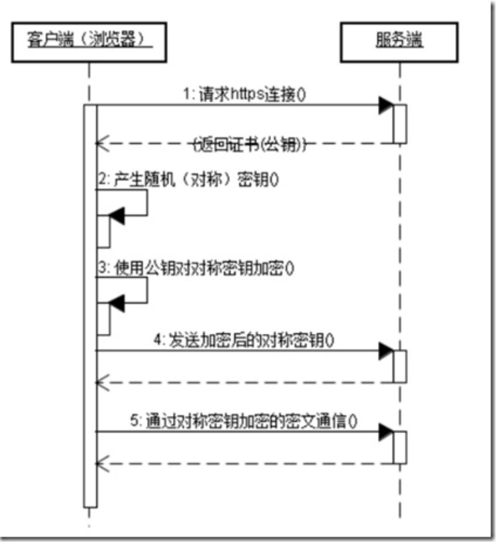

对应文章 [面试实录](/interview-record/)

# 腾讯

## 一面

### Ionic框架是做什么的？

Ionic 是一个用HTML, CSS 跟JS 开发的一个用于移动设备的混合 APP 开发框架，采用 Sass与AngularJS 开发。

### Ionic前身是解决什么问题的？

开发混合手机应用的，开源的，免费的代码库，开发成本低

### websocket怎么实现的？

WebSocket是HTML5出的东西（协议），也就是说HTTP协议没有变化，或者说没关系，但HTTP是不支持持久连接的（长连接，循环连接的不算）

#### 客户端发出websocket

```js
// 客户端websocket
GET /chat HTTP/1.1
Host: server.example.com
Upgrade: websocket
Connection: Upgrade
Sec-WebSocket-Key: x3JJHMbDL1EzLkh9GBhXDw==
Sec-WebSocket-Protocol: chat, superchat
Sec-WebSocket-Version: 13
Origin: http://example.com
```

```js
Upgrade: websocket
Connection: Upgrade
```

这个就是Websocket的核心了，告诉Apache、Nginx等服务器，找到对应的websocket请求处理器

```js
Sec-WebSocket-Key: x3JJHMbDL1EzLkh9GBhXDw==
Sec-WebSocket-Protocol: chat, superchat
Sec-WebSocket-Version: 13
```

- Sec-WebSocket-Key 是一个Base64 encode的值，这个是浏览器随机生成的，告诉服务器验证是不是真的是Websocket助理。
- Sec_WebSocket-Protocol 是一个用户定义的字符串，用来区分同URL下，不同的服务所需要的协议。简单理解要服务A来处理，-Sec-WebSocket-Version 是告诉服务器所使用的Websocket Draft（协议版本），然后服务器会返回下列东西，表示已经接受到请求，成功建立Websocket！

#### 服务器响应websocket

```js
// 服务器websocket
HTTP/1.1 101 Switching Protocols
Upgrade: websocket
Connection: Upgrade
Sec-WebSocket-Accept: HSmrc0sMlYUkAGmm5OPpG2HaGWk=
Sec-WebSocket-Protocol: chat
```

- 这里开始就是HTTP最后负责的区域了，告诉客户端，我已经成功切换协议~
- Sec-WebSocket-Accept 这个则是经过服务器确认，并且加密过后的 Sec-WebSocket-Key。服务器：好啦好啦，知道啦，给你看我的ID CARD来证明行了吧。
- Sec-WebSocket-Protocol 则是表示最终使用的协议。至此，HTTP已经完成它所有工作了，接下来就是完全按照Websocket协议进行了。

```js
Upgrade: websocket
Connection: Upgrade
```

依然是固定的，告诉客户端即将升级的是Websocket协议，而不是 mozillasocket，lurnarsocket或者shitsocket。

#### websocket背景

**背景技术**

- ajax轮询
    ```js
    setInterval(function() {
        $.ajax({
            url: 'https://www.baidu.com/',
            success: function() {
                //success code
            }
        });
    }, 3000);
    ```
    ajax轮询的原理非常简单，让浏览器隔个几秒就发送一次请求，询问服务器是否有新信息。
- long poll 
    ```js
    function async() {
        $.ajax({
            url: 'http://api.3g.qq.com',
            success: function() {
                async();
                //success code
            }
        });
    }
    ```
    采用轮询的方式，不过采取的是阻塞模型，也就是说，客户端发起连接后，如果没消息，就一直不返回Response给客户端。直到有消息才返回，返回完之后，客户端再次建立连接，周而复始。

**相同点**

都是在不断地建立HTTP连接，然后等待服务端处理，可以体现HTTP协议的另外一个特点，被动性。

**缺点**

- ajax轮询需要服务器有很快的处理速度和资源。
- long poll需要有很高的并发，也就是说同时响应客户端的能力。

#### websocket实现原理

- 我们所用的程序是要经过两层代理的，即 HTTP 协议在 Nginx 等服务器的解析下，然后再传送给相应的 Handler（PHP等）来处理。
- 简单地说，我们有一个非常快速的接线员（Nginx），他负责把问题转交给相应的客服（Handler）。本身接线员基本上速度是足够的，但是每次都卡在客服（Handler）了，老有客服处理速度太慢，导致客服不够。
- Websocket 就解决了这样一个难题，建立后，可以直接跟接线员建立持久连接，有信息的时候客服想办法通知接线员，然后接线员在统一转交给客户。这样就可以解决客服处理速度过慢的问题了。

#### js调用代码

```js
var websocket = new WebSocket("ws://www.host.com/path");   
websocket.onopen = function(evt) { onOpen(evt) };   
websocket.onclose = function(evt) { onClose(evt) };   
websocket.onmessage = function(evt) { onMessage(evt) };   
websocket.onerror = function(evt) { onError(evt) }; }    
function onMessage(evt) { alert( evt.data); }  
function onError(evt) { alert( evt.data); }    
websocket.send("client to server"); 
```

### 还有什么别的方式来实现消息推送机制？

1. 长链接 
    例如用 iframe 维护长链接开销较大，而且页面会显示一直在加载，不利于使用
2. flash socket
    利用 flash 插件提供的 socket，需要会 flash，无法避免如安全

### 双向绑定是怎么实现的？

#### 发布者-订阅者模式（backbone.js）

一般通过sub, pub的方式实现数据和视图的绑定监听，更新数据方式通常做法是vm.set('property', value)，这种方式现在毕竟太low了，我们更希望通过 vm.property = value 这种方式更新数据，同时自动更新视图，于是有了下面两种方式

#### 脏值检查（angular.js）

angular.js 是通过脏值检测的方式比对数据是否有变更，来决定是否更新视图，最简单的方式就是通过 setInterval() 定时轮询检测数据变动，当然Google不会这么low，angular只有在指定的事件触发时进入脏值检测，大致如下：

- DOM事件，譬如用户输入文本，点击按钮等( ng-click )
- XHR响应事件 ( `$http` )
- 浏览器Location变更事件 ( `$location` )
- Timer事件( `$timeout` , `$interval` )
- 执行 `$digest()` 或 `$apply()`

#### 数据劫持（vue.js）

vue.js 则是采用数据劫持结合发布者-订阅者模式的方式，通过Object.defineProperty()来劫持各个属性的setter，getter，在数据变动时发布消息给订阅者，触发相应的监听回调。

#### mvvm的实现

通过Object.defineProperty()来实现对属性的劫持，达到监听数据变动的目的

1. 实现一个数据监听器Observer，能够对数据对象的所有属性进行监听，如有变动可拿到最新值并通知订阅者
2. 实现一个指令解析器Compile，对每个元素节点的指令进行扫描和解析，根据指令模板替换数据，以及绑定相应的更新函数
3. 实现一个Watcher，作为连接Observer和Compile的桥梁，能够订阅并收到每个属性变动的通知，执行指令绑定的相应回调函数，从而更新视图
4. mvvm入口函数，整合以上三者


后见本篇文章[](/mvvm-principle/)

### 301与302区别？

302重定向只是暂时的重定向，搜索引擎会抓取新的内容而保留旧的地址，因为服务器返回302，所以，搜索搜索引擎认为新的网址是暂时的。

301重定向是永久的重定向，搜索引擎在抓取新的内容的同时也将旧的网址替换为了重定向之后的网址。

### jquery中bind和on的用法？以及他们的区别？优缺点？

#### bind()

1. 使用方式：`$(selector).bind(event,data,function)`；
2. event：必需项；添加到元素的一个或多个事件，例如 click,dblclick 等；
3. 单事件处理：例如 `$(selector).bind("click",data,function)`；
4. 多事件处理：
    1. 利用空格分隔多事件，例如 `$(selector).bind("click dbclick mouseout",data,function)`;
    2. 利用大括号灵活定义多事件，例如 `$(selector).bind({event1:function, event2:function, ...})`；
    3. 空格相隔方式：绑定较为死板，不能给事件单独绑定函数,适合处理多个事件调用同一函数情况；
    4. 大括号替代方式：绑定较为灵活，可以给事件单独绑定函数；
5. data：可选；需要传递的参数；
6. function：必需；当绑定事件发生时，需要执行的函数；
7. 适用所有版本，但是根据官网解释，自从jquery1.7版本以后bind()函数推荐用on()来代替。

#### on()

1. 使用方式：`$(selector).on(event,childselector,data,function)`:
2. event：必需项；添加到元素的一个或多个事件，例如 click,dblclick 等；
3. 单事件处理：例如 `$(selector).on("click",childselector,data,function)`;
4. 多事件处理：
    1. 利用空格分隔多事件，例如 `$(selector).on("click dbclick mouseout",childseletor,data,function)`;
    2. 利用大括号灵活定义多事件，例如 `$(selector).on({event1:function, event2:function, ...},childselector)`;　
    3. 空格相隔方式：绑定较为死板，不能给事件单独绑定函数,适合处理多个事件调用同一函数情况；
    4. 大括号替代方式：绑定较为灵活，可以给事件单独绑定函数；　
5. childSelector: 可选；需要添加事件处理程序的元素，一般为selector的子元素；　　  
6. data：可选；需要传递的参数；
7. function：必需；当绑定事件发生时，需要执行的函数；
8. jquery1.7及其以上版本；jquery1.7版本出现之后用于替代bind()，live()绑定事件方式；

#### 相同点

1. 都支持单元素多事件的绑定，空格相隔方式或者大括号替代方式;
2. 均是通过事件冒泡方式，将事件传递到document进行事件的响应；

#### 比较和联系

1. bind()函数只能针对已经存在的元素进行事件的设置；但是live(),on(),delegate()均支持未来新添加元素的事件设置；
2. bind()函数在jquery1.7版本以前比较受推崇，1.7版本出来之后，官方已经不推荐用bind()，替代函数为on()，这也是1.7版本新添加的函数，同样，可以用来代替live()函数，live()函数在1.9版本已经删除；
3. live()函数和delegate()函数两者类似，但是live()函数在执行速度，灵活性和CSS选择器支持方面较delegate()差些，想了解具体情况，[请戳这](http://kb.cnblogs.com/page/94469/)；
4. bind()支持Jquery所有版本；live()支持jquery1.8-；delegate()支持jquery1.4.2+；on()支持jquery1.7+；
5. 如果项目中引用jquery版本为低版本，推荐用delegate(),高版本jquery可以使用on()来代替。

### react？react虚拟dom算法的实现方式？虚拟dom是什么？

#### React定义

1. 是一个用于构建用户界面的 js 库；
2. 主要用于构建UI，很多人认为 React 是 MVC 中的 V（视图）；
3. 起源于 Facebook 的内部项目，用来架设 Instagram 的网站，并于 2013 年 5 月开源；
4. 拥有较高的性能，代码逻辑非常简单，越来越多的人已开始关注和使用它。

#### react虚拟dom算法

见 [本篇文章](/react-virtual-dom/)

### 重绘与重排是什么？他们的区别？有一个动画怎样实现使它的dom的重排重绘改变最小？也就是更流畅？

重绘：是一个元素的外观变化所引发的浏览器行为；例如改变visibility、outline、背景色等属性。  
重排：是引起DOM树重新计算的行为；

#### 引发重排

1. 添加、删除可见的dom
2. 元素的位置改变
3. 元素的尺寸改变(外边距、内边距、边框厚度、宽高、等几何属性)
4. 页面渲染初始化
5. 浏览器窗口尺寸改变

#### 升华版

1. dom树的结构变化 (添加、删除dom)
2. 获取某些属性 offsetTop、offsetLeft、 offsetWidth、offsetHeight、scrollTop、scrollLeft、scrollWidth、scrollHeight、clientTop、clientLeft、clientWidth、clientHeight

#### 改进的方法

1. 将多次dom修改合并成一次操作
2. 多次重排的元素，先脱离文档流，在修改
3. display属性为none，减少重排
4. 在需要经常获取那些引起浏览器重排的属性值时，要缓存到变量
5. 在内存中多次操作节点，完成后再添加到文档中去（有动画效果时）

#### 浏览器加载文档过程

>浏览器从下载文档到显示页面的过程是个复杂的过程，这里包含了重绘和重排。各家浏览器引擎的工作原理略有差别，但也有一定规则。简单讲，通常在文档初次加载时，浏览器引擎会解析HTML文档来构建DOM树，之后根据DOM元素的几何属性构建一棵用于渲染的树。渲染树的每个节点都有大小和边距等属性，类似于盒子模型（由于隐藏元素不需要显示，渲染树中并不包含DOM树中隐藏的元素）。当渲染树构建完成后，浏览器就可以将元素放置到正确的位置了，再根据渲染树节点的样式属性绘制出页面。由于浏览器的流布局，对渲染树的计算通常只需要遍历一次就可以完成。但table及其内部元素除外，它可能需要多次计算才能确定好其在渲染树中节点的属性，通常要花3倍于同等元素的时间。这也是为什么我们要避免使用table做布局的一个原因。

### 什么是一级dom和二级dom？

文档对象模型（Document Object Model，简称DOM），是W3C组织推荐的处理可扩展标志语言的标准编程接口。Document Object Model的历史可以追溯至1990年代后期微软与Netscape的“浏览器大战”，双方为了在JavaScript与JScript一决生死，于是大规模的赋予浏览器强大的功能。微软在网页技术上加入了不少专属事物，计有VBScript、ActiveX、以及微软自家的DHTML格式等，使不少网页使用非微软平台及浏览器无法正常显示。DOM即是当时蕴酿出来的杰作。

根据W3C DOM规范，DOM是HTML与XML的应用编程接口（API），DOM将整个页面映射为一个由层次节点组成的文件。有1级、2级、3级共3个级别。

#### 1级DOM

1级DOM在1998年10月份成为W3C的提议，由DOM核心与DOM HTML两个模块组成。DOM核心能映射以XML为基础的文档结构，允许获取和操作文档的任意部分。DOM HTML通过添加HTML专用的对象与函数对DOM核心进行了扩展。

#### 2级DOM

鉴于1级DOM仅以映射文档结构为目标，DOM 2级面向更为宽广。通过对原有DOM的扩展，2级DOM通过对象接口增加了对鼠标和用户界面事件（DHTML长期支持鼠标与用户界面事件）、范围、遍历（重复执行DOM文档）和层叠样式表（CSS）的支持。同时也对DOM 1的核心进行了扩展，从而可支持XML命名空间。

2级DOM引进了几个新DOM模块来处理新的接口类型：

- DOM视图：描述跟踪一个文档的各种视图（使用CSS样式设计文档前后）的接口；
- DOM事件：描述事件接口；
- DOM样式：描述处理基于CSS样式的接口；
- DOM遍历与范围：描述遍历和操作文档树的接口；

#### 3级DOM

3级DOM通过引入统一方式载入和保存文档和文档验证方法对DOM进行进一步扩展，DOM3包含一个名为“DOM载入与保存”的新模块，DOM核心扩展后可支持XML1.0的所有内容，包括XML Infoset、 XPath、和XML Base。

#### 0级DOM

当阅读与DOM有关的材料时，可能会遇到参考0级DOM的情况。需要注意的是并没有标准被称为0级DOM，它仅是DOM历史上一个参考点（0级DOM被认为是在Internet Explorer 4.0 与Netscape Navigator4.0支持的最早的DHTML）。

### 跨域postMessage内部的实现方式？调用过程？伪装域名怎么解决？其中服务器端怎么实现Access-Control-Allow-Origin的跨域的（怎么拦截跨域的）？

window.postMessage() 方法被调用时，会在所有页面脚本执行完毕之后（e.g., 在该方法之后设置的事件、之前设置的timeout 事件,etc.）向目标窗口派发一个  MessageEvent 消息。 该MessageEvent消息有四个属性需要注意： message 属性表示该 message 的类型； data 属性为 window.postMessage 的第一个参数；origin 属性表示调用 window.postMessage() 方法时调用页面的当前状态； source 属性记录调用 window.postMessage() 方法的窗口信息。

#### postMessage语法

>`otherWindow.postMessage(message, targetOrigin, [transfer])`;

- otherWindow
    其他窗口的一个引用，比如iframe的contentWindow属性、执行window.open返回的窗口对象、或者是命名过或数值索引的window.frames。
- message
    将要发送到其他 window的数据。它将会被结构化克隆算法序列化。这意味着你可以不受什么限制的将数据对象安全的传送给目标窗口而无需自己序列化。
- targetOrigin
    通过窗口的origin属性来指定哪些窗口能接收到消息事件，其值可以是字符串"*"（表示无限制）或者一个URI。在发送消息的时候，如果目标窗口的协议、主机地址或端口这三者的任意一项不匹配targetOrigin提供的值，那么消息就不会被发送；只有三者完全匹配，消息才会被发送。这个机制用来控制消息可以发送到哪些窗口；例如，当用postMessage传送密码时，这个参数就显得尤为重要，必须保证它的值与这条包含密码的信息的预期接受者的origin属性完全一致，来防止密码被恶意的第三方截获。如果你明确的知道消息应该发送到哪个窗口，那么请始终提供一个有确切值的targetOrigin，而不是*。不提供确切的目标将导致数据泄露到任何对数据感兴趣的恶意站点。

>window.addEventListener("message", function(event){}, false);

- data
    从其他 window 中传递过来的对象。
- origin
    调用 postMessage 时消息发送方窗口的 origin . 这个字符串由 协议、“://“、域名、“ : 端口号”拼接而成。例如 “https://example.org (隐含端口 443)”、“http://example.net (隐含端口 80)”、“http://example.com:8080”。请注意，这个origin不能保证是该窗口的当前或未来origin，因为postMessage被调用后可能被导航到不同的位置。
- source
    对发送消息的窗口对象的引用; 您可以使用此来在具有不同origin的两个窗口之间建立双向通信。

#### 伪装域名解决？

- 如果您不希望从其他网站接收message，请不要为message事件添加任何事件侦听器。
- 始终使用origin和source属性验证发件人的身份
- 当您使用postMessage将数据发送到其他窗口时，始终指定精确的目标origin，而不是*。

#### 实现Access-Control-Allow-Origin的跨域

- 直接在浏览器地址栏中，输入某接口地址。是不会产生跨域问题的；
- 只有当在某域名的页面中，由该页面发起的接口请求。才可能会跨域；
- nginx就类似于这个浏览器，它接收到外部对它的请求（注意，nginx只会接收别人对它的请求，而不会拦截浏览器的请求），再类似浏览器地址栏一样去请求某个接口，最后将请求到的内容返回回去。

### 缓存的实现方式？

#### 强缓存

##### Expires

- 表示存在时间，允许客户端在这个时间之前不去检查（发请求），例如：Expires: Wed, 21 Oct 2015 07:28:00 GMT
- 以上时间表示消息发送的时间，时间的描述格式由rfc822定义。例如，Web服务器告诉浏览器在2018-04-28 03:30:01这个时间点之前，可以使用缓存文件。发送请求的时间是2018-04-28 03:25:01，即缓存5分钟。

##### cache-control

1. max-age
    - “max-age”指令指定从请求的时间开始，允许获取的响应被重用的最长时间（单位：秒）。如果还有一个设置了 "max-age" 或者 "s-max-age" 指令的Cache-Control响应头，那么 Expires 头就会被忽略。
    - 该缓存策略弊端： 当设定时间内更新文件了，浏览器并不知道。
2. no-cache： 表示每次请求都需要与服务器确认一次，这种情况一般带有ETag，当服务器端验证无修改时，则从缓存中取文件，服务器无需返回文件。
3. no-store: 表示无论如何都不允许客户端做缓存，每次都需要做一次完整的请求和完整的响应。
4. public：如果响应被标记为“public”，则即使它有关联的 HTTP 身份验证，甚至响应状态代码通常无法缓存，也可以缓存响应。大多数情况下，“public”不是必需的，因为明确的缓存信息（例如“max-age”）已表示响应是可以缓存的。我们有时可以在memory,disk,路由等找到缓存就是因为这是public的设置。
5. private：不允许任何中间缓存对其进行缓存，只能最终用户做缓存。

##### 例子

缓存设置max-age=86400浏览器以及任何中间缓存均可将响应（如果是“public”响应）缓存长达 1 天（60 秒 x 60 分钟 x 24 小时）。private, max-age=600客户端的浏览器只能将响应缓存最长 10 分钟（60 秒 x 10 分钟）。no-store不允许缓存响应，每次请求都必须完整获取。

##### 引申问题： from memory cache 与 from disk cache 的区别

浏览器访问页面时，查找静态文件首先会从缓存中读取，缓存分为两种，内存缓存与硬盘缓存。查找文件的顺序为：memory -> disk -> 服务器。内存缓存是在kill进程时删除，即关闭浏览器时内存缓存消失，而硬盘缓存则是即使关闭浏览器也仍然存在。当我们首次访问页面，需要从服务器获取资源，将可缓存的文件缓存在内存与硬盘，当刷新页面时(这种情况没有关闭浏览器)则从内存缓存中读取，我们可以在上面的截图看到from memory cache的所需要的时间为0，这是最快的读取文件方式，当我们重新开一个页面时，也就是已经kill这个进程，内存缓存已经消失了，这时候就从硬件缓存获取，而当我们手动在浏览器清除缓存时，下次访问就只能再去服务器拉取文件了。但有一点可以从上面图中看到，并不是从硬盘获取缓存的时间一定比从网络获取的时间短，示例中的时间是更长的，这取决于网络状态和文件大小等因素，从缓存获取有利有弊，当网络较差或者文件较大时，从硬盘缓存获取可以给用户较好的体验。

#### 协商缓存

##### Last-Modified

标示这个响应资源的最后修改时间。web 服务器在响应请求时，告诉浏览器资源的最后修改时间

##### If-Modify-since 

再次向服务器请求时带上，如果资源已修改，返回 HTTP 200，未被修改，返回 HTTP 304

##### ETag

告诉浏览器当前资源在服务器的唯一标识

##### If-None-Match

再次向服务器请求时带上，如果资源已修改，返回 HTTP 200,未被修改，返回 HTTP 304

#### 总结

浏览器获取文件的过程如下：


### dns的查询过程？

假设www.abc.com的主机要查询www.xyz.abc.com的服务器ip地址。
 
#### 知识点

1. hosts文件：以静态映射的方式提供IP地址与主机名的对照表，类似ARP表
2. 域：abc.com是一个域，它可以划分为多个区域，如abc.com和xyz.abc.com

#### 步骤

##### 递归查询

1. 在hosts静态文件、DNS解析器缓存中查找某主机的ip地址
2. 上一步无法找到，去DNS本地服务器（即域服务器）查找，其本质是去区域服务器、服务器缓存中查找
3. 本地DNS服务器查不到就根据‘根提示文件’向负责顶级域‘.com’的DNS服务器查询
4. ‘根DNS服务器’根据查询域名中的‘xyz.com’，再向xyz.com的区域服务器查询
5. www.xyz.abc.com的DNS服务器直接解析该域名，将查询到的ip再原路返回给请求查询的主机

##### 迭代查询

1. 在hosts静态文件、DNS解析器缓存中查找某主机的ip地址
2. 上一步无法找到，在DNS本地服务器（即域服务器）查找所有本层次的区域服务器
3. 本地DNS服务器查不到就查询上一层次的所有区域服务器，以此类推直至根域名DNS服务器‘.’
4. 到达根域名服务器后又向下查询，直至查到结果为止。

##### 迭代查询与递归查询结合

递归查询需要经过逐层查询才能获得查询结果，当查询具有许多层次的DNS结构时效率很低，所以一般采用两者相结合的查询方式。

1. 在hosts静态文件、DNS解析器缓存中查找某主机的ip地址
2. 上一步无法找到，去DNS本地服务器（即域服务器）查找，其本质是去区域服务器、服务器缓存中查找
3. 本地DNS服务器查不到就根据‘根提示文件’向负责顶级域‘.com’的根DNS服务器查询
4. 根DNS服务器直接将其区域DNS服务器的ip地址返回给本地服务器，而不用再向xyz.com的区域服务器查询。
5. 本地DNS服务器将结果返回给请求的主机


# SHEIN

## 一面

### react v15 与 v16 的主要变化？

1. render 函数支持返回数组和字符串
2. 更好的异常处理，可在其子组件树的任何位置捕获 JavaScript 错误并显示后备 UI，而不是崩溃的组件树
3. 新的组件类型 portals，将子树声明渲染到另一个 DOM 节点中 ReactDOM.createPortal()
4. 更好的服务端渲染，使用 ReactDOMServer.renderToNodeStream() 和启用服务器端渲染的流模式 ReactDOMServer.renderToStaticNodeStream()
5. 支持自定义 DOM 元素，新版本将不会再抛出不支持的 DOM 元素错误，而是将所有开发者自定义的 DOM 元素都传递到相应的 DOM 节点上。
6. 更小的打包大小，总体体积减少 30%
8. 新的核心架构 Fiber，正是得益于 FIber，上述提到的支持返回数据及错误边界等功能才变得可能。Fiber 相较于之前最大的不同是它可以支持异步渲染（async rendering），这意味着 React 可以在更细的粒度上控制组件的绘制过程，从最终的用户体验来讲，用户可以体验到更流畅交互及动画体验。而因为异步渲染涉及到 React 的方方面面甚至未来，在 16.0 版本中 React 还暂时没有启用，并将在未来几个月陆续推出。

见文章 [React16 新特性](/react-16-new-feature/)

### react v15 getChildContext 与 react v16 Context.Provider 优缺点？

缺点：

1. 新的 Context API 通过创建一个 Context 对象来完成，在实际项目中，Provider 和 Consumer 往往都存在于不同的源代码文件中，在一个文件中定义 Context 对象，然后，这个文件被被其他文件来 import，老的 Context API 并不需要共同依赖一个什么对象
2. 引入新的问题——如何管理 Context 对象

优点：

1. 新的 Context 有一个明显实用好处，可以很清晰地让多个 Context 交叉使用，比如组件树上可以有两个 Context Provider，而 Consumer 总是可以区分开哪个 Context 是哪个。

### redux 与 mobx 的优缺点？

使用场景：

redux
- store - view - action 的闭环
- Redux 颗粒度更细, 相对更安全

mobx
- store - view 的闭环
- 使用了类双向绑定的思维

从目前经验来看，我建议前端数据流不太复杂的情况使用 Mobx，因为更加清晰，也便于维护；如果前端数据流极度复杂，建议谨慎使用 Redux，通过中间件减缓巨大业务复杂度，但还是要做到对开发人员尽量透明，如果可以建议使用 typescript 辅助。

Redux 的优缺点：

- 数据流流动很自然，因为任何 dispatch 都会导致广播，需要依据对象引用是否变化来控制更新粒度。
- 如果充分利用时间回溯的特征，可以增强业务的可预测性与错误定位能力。
- 时间回溯代价很高，因为每次都要更新引用，除非增加代码复杂度，或使用 immutable。
- 时间回溯的另一个代价是 action 与 reducer 完全脱节，数据流过程需要自行脑补，原因是可回溯必然不能保证引用关系。
- 引入中间件，其实主要为了解决异步带来的副作用，业务逻辑或多或少参杂着 magic。
- 但是灵活利用中间件，可以通过约定完成许多复杂的工作。
- 对 typescript 支持困难。

Mobx 的优缺点：

- 数据流流动不自然，只有用到的数据才会引发绑定，局部精确更新，但免去了粒度控制烦恼。
- 没有时间回溯能力，因为数据只有一份引用。
- 自始至终一份引用，不需要 immutable，也没有复制对象的额外开销。
- 没有这样的烦恼，数据流动由函数调用一气呵成，便于调试。
- 业务开发不是脑力活，而是体力活，少一些 magic，多一些效率。
- 由于没有 magic，所以没有中间件机制，没法通过 magic 加快工作效率（这里 magic 是指 action 分发到 reducer 的过程）。
- 完美支持 typescript。

### 组件怎么做性能优化？
### mobx 怎么做性能优化？
### table 的某一行有很多组件，使用起来卡顿，怎么优化？
### webpack v2 升级到 webpack v4 你主要做了哪些优化？
### 页面性能优化？
### react 页面白屏的原因及解决方法？
### react 中全局主题色怎么配置？
### style 与 className 那种更好？

style-components

### react 组件最耗性能的地方？怎么优化？

如何防止不必要的渲染是解决问题的关键。

1. 尽量多使用无状态函数构建组件
2. 拆分组件为子组件，对组件做更细粒度的控制
3. 减少 render 的次数，类组件可以使用 shouldComponentUpdate 或 PureComponent，函数组件可以利用高级组件的特性或者 React.memo
4. Immutable 实现的原理是持久化的数据结构，即使用旧数据创建新数据时，保证新旧数据同时可用且不变。同时为了避免深拷贝带来的性能损耗，Immutable使用了结构共享(structural sharing)，即如果对象树中一个节点发生变化，只修改这个节点和受它影响的父节点，其他节点则进行共享。

### 面试需要几轮？
### 面试官是做什么业务的？

## 二面

### 介绍自己
### 有没有女朋友
### 工作经历中隔了一年是什么原因
### 为什么跳槽
### 为什么要选你
### 页面上有图片加载，图片有懒加载，如何计算曝光度？如何计算图片曝光性能更好？

监听 img 的 onload，一开始获取全部的 img 的 ID，一个个去掉

### 根据上面的条件，除了图片曝光信息之外，还有浏览器上有一些数据要采集，如何发给后端？

直接写在 img 的 src 中

### 架构组主要做些什么
### 上线的流程怎么样

以上更新于`2020-5-20 09:17:01`

---

# 数字广东

## 一面

### 输入网址浏览器执行的过程
### TCP 连接时为什么三次握手

因为三次握手刚好完成了两次一问一答的通信。说明可以建立全双工的通信了。
 
1. 如果一次就建立连接：那么客户端怎么知道服务端接收到了呢？
2. 由于网路阻塞，客户端第一次发送的连接没有及时到达，然后重新发送报文，然后建立通信，然后通信结束，然后第一次发送的报文到达了。然后服务端无端端的又激活了，但是客户端已经不需要在和服务端通信了。这种情况是不是浪费服务端资源？所以两次也不可靠，为什么不是两次的原因下面的参考连接也有说。
3. 如果是四次握手：仔细看看第四次要做的是不是和第二次很像？其实非要说四次行不行？我觉得是行的，但是四次就冗余了，所以其实 4 次、5 次、6 次都是可以的，为了兼顾性能和可靠性三次就够了。第四次以后的握手已经可以用来传输数据了

### TCP 断开时为什么四次挥手

因为四次最可靠，最顺利。

客服端告诉服务端，我的数据发完了。你看看你还有没有数据要发给我，没有的话，我们的通信就可以断了。服务端也告诉客户端，我的数据也发完了，我们一起关闭吧。你看都顺畅，一点都没有冗余，也不用等待，大家都顺顺利利，愉快的快速结束。

我们来看看一次挥手行不行？

答案是行，其实0次都行。客户端和服务端都有重试和超时机制，如果触发了这两个机制，就会主动关闭。应用层，也可以主动关闭tcp并且不发出通信信息。想想两台电脑同时断电了？是不是一次挥手也没有？但是连接已经断了。所以实际情况0次挥手，1次挥手，2次挥手，3次挥手都是可能发生。超过四次的挥手就冗余了，不需要那么多次。所以兼顾性能和可靠性，四次挥手是最合适的。1次、2次、3次都是不可靠的。

### vue 用法？
### react 16 与 15 的区别
### 为什么要加上 react 16 的生命周期？
### fiber 原理？底层架构？

[React Fiber数据结构](/react-fiber-data-struct/)

### webpack 原理？
### webpack 分包机制？webpack 4 与 2 的有什么区别？

解决复杂场景下的代码拆分问题，针对异步加载中公共模块的拆分，我们只需设置需要被公共打包的代码，SplitChunksPlugin 就会自动帮我们按照各异步模块的需求，将公共的 Chunk 拆分成一些小的公共 Chunks 供各异步模块使用，并且这些公共 Chunks 不会首屏加载，会随着使用使用它们的异步模块，使用时再一同并行加载。

webpack 4 与 2 区别：

1. webpack 4 更快（速度提升 98%），多项性能改进，尤其是更快的增量重建；UglifyJs现在默认情况下会缓存并进行参数化；RemoveParentModulesPlugin 的性能改进
2. Mode 配置，零配置以及默认值
3. CommonsChunkPlugin -> optimization.splitChunks，optimization.runtimeChunk
4. WebAssembly 支持
5. 模块类型以及 .mjs 支持
6. NoEmitOnErrorsPlugin -> optimization.noEmitOnErrors，ModuleConcatenationPlugin-> optimization.concatenateModules，NamedModulesPlugin-> optimization.namedModules
7. 可以本地处理 JSON
8. sideEffects: false 现在在 package.json 中受支持

webpack 5 新特性：

1. 优化持久缓存：v5 中缓存默认是 memory，你可以修改设置写入硬盘。之前版本的替代者是 cache-loader 和 babel-loader 中的 cacheDirectory 选项。缓存（内存 / 磁盘两种形式）中的主要内容是 module objects，在编译的时候会将 graph 以二进制或者 json 文件存储在硬盘上。每当代码变化、模块之间依赖关系改变导致 graph 改变时，Webpack 会读取记录做增量编译。
2. 优化长期缓存：针对 moduleId 和 chunkId 的计算方式进行了优化，增加确定性的 moduleId 和 chunkId 的生成策略。moduleId 根据上下文模块路径，chunkId 根据 chunk 内容计算，最后为 moduleId 和 chunkId 生成 3 - 4 位的数字 id，实现长期缓存，生产环境下默认开启。
    1. 原来的 moduleId 默认值自增 id，容易导致文件缓存失效。在 v4 之前，可以安装 HashedModuleIdsPlugin 插件覆盖默认的 moduleId 规则， 它会使用模块路径生成的 hash 作为 moduleId。在 v4 中，可以配置 optimization.moduleIds = 'hashed'
    2. 原来的 chunkId 默认值自增 id。比如这样的配置下，如果有新的 entry 增加，chunk 数量也会跟着增加，chunkId 也会递增。之前可以安装 NamedChunksPlugin 插件来稳定 chunkId；或者配置 optimization.chunkIds = 'named'
3. NodeJS 的 polyfill 脚本被移除
4. 更好的 TreeShaking：在 v5 中会分析模块 export 与 import 之间的依赖关系，最终的代码生成非常简洁
5. Module Federation：让 Webpack 达到了线上 runtime 的效果，让代码直接在独立应用间利用 CDN 直接共享，不再需要本地安装 NPM 包、构建再发布了！之前代码共享一般通过
NPM、UMD、微前端
6. Top Level Await
7. SplitChunks 支持更灵活的资源拆分
8. 不包含 JS 代码的 Chunk 将不再生成 JS 文件
9. Output 默认生成 ES6 规范代码，也支持配置为 5 - 11

[Webpack5新特性](/webpack-v5-new-feature/)

### 网页性能优化
### 图片格式的选择？
### 拿到美工的图片时会怎么选择？做什么处理？
### iconfont 字体库原理？

使用 @font-face 定义一个字体 family

```css
@font-face {
  font-family: 'iconfont';
  src: url('//at.alicdn.com/t/font_1453702746_9938898.eot'); 
  src: url('//at.alicdn.com/t/font_1453702746_9938898.eot?#iefix') format('embedded-opentype'), /* IE6-IE8 */
  url('//at.alicdn.com/t/font_1453702746_9938898.woff') format('woff'), /* chrome、firefox */
  url('//at.alicdn.com/t/font_1453702746_9938898.ttf') format('truetype'), /* chrome、firefox、opera、Safari, Android, iOS 4.2+*/
  url('//at.alicdn.com/t/font_1453702746_9938898.svg#iconfont') format('svg'); /* iOS 4.1- */
}

.test{
  font-size: 16px;
  font-family: 'iconfont';
}
```

这样我们就可以用自定义字体渲染这些文字了，每一个字都有对应的 unicode，比如我们在 web 上输入我跟输入 `&#x6211;` 是一样的，浏览器会自动帮你找到对应的图形去渲染。

>当然因为兼容性的问题，不同的浏览器需要加载不同格式的字体，所以我们要同时支持四种字体。

### css 选择器优先级？
### 对方技术栈？
### 对方面试几轮？
### 对方做什么业务？

# 腾讯

## 一面

### 项目介绍？
### 浏览器缓存介绍？
### sw 缓存怎么实现的？原理是什么？

一个服务器与浏览器之间的中间人角色，如果网站中注册了 service worker 那么它可以拦截当前网站所有的请求，进行判断（需要编写相应的判断程序），如果需要向服务器发起请求的就转给服务器，如果可以直接使用缓存的就直接返回缓存不再转给服务器。从而大大提高浏览体验。

1. 注册 Service worker 在你的 index.html 加入以下内容

```js
/* 判断当前浏览器是否支持serviceWorker */
if ('serviceWorker' in navigator) {
  /* 当页面加载完成就创建一个serviceWorker */
  window.addEventListener('load', function () {
      /* 创建并指定对应的执行内容 */
      /* scope 参数是可选的，可以用来指定你想让 service worker 控制的内容的子目录。 在这个例子里，我们指定了 '/'，表示根网域下的所有内容，这也是默认值。 */
      navigator.serviceWorker.register('./serviceWorker.js', {scope: './'})
          .then(function (registration) {
              console.log('ServiceWorker registration successful with scope: ', registration.scope);
          })
          .catch(function (err) {
              console.log('ServiceWorker registration failed: ', err);
          });
  });
}
```

2. 安装 worker：在我们指定的处理程序 serviceWorker.js 中书写对应的安装及拦截逻辑

```js
/* 监听安装事件，install 事件一般是被用来设置你的浏览器的离线缓存逻辑 */
this.addEventListener('install', function (event) {
    /* 通过这个方法可以防止缓存未完成，就关闭 serviceWorker */
    event.waitUntil(
        /* 创建一个名叫V1的缓存版本 */
        caches.open('v1').then(function (cache) {
            /* 指定要缓存的内容，地址为相对于跟域名的访问路径 */
            return cache.addAll([
                './index.html'
            ]);
        })
    );
});

/* 注册fetch事件，拦截全站的请求 */
this.addEventListener('fetch', function(event) {
  event.respondWith(
    // magic goes here
      
    /* 在缓存中匹配对应请求资源直接返回 */
    caches.match(event.request)
  );
});
```

### sw 缓存机制是否有了解？如何更新 sw 缓存？

[谨慎处理 Service Worker 的更新](/handle-service-worker-updates/)

### https 原理？中途被篡改的话该怎么预防？

https 本质上是加密版本的 http，提供传输安全性，通过 ssl 协议提供安全层，然后通过 http 进行传输的协议



中途被篡改的话该怎么预防？

这个时候就要使用数字签名了，数字签名的定义是：`将原文(部分数据关键信息)先用 Hash 函数生成消息摘要`，然后`用发送者的私钥加密生成数字签名`，与原文一起传送给接收者。

然后接受者用`服务端的公钥去解密数字签名得到消息摘要`和`用 Hash 函数对收到的原文计算生成的摘要信息`进行比较，如果一致则数据未篡改。同时要注意服务器的公钥必须是数字证书认证机构（CA）认证的数字证书，浏览器会将内置的数字证书与传过来的数字证书做对比，如果不一致则报证书错误。

### 代码劫持实现 XMLHttpRequest Send 方法，要求每个 ajax 请求把请求参数打印出来？

```js
XMLHttpRequest.prototype.realSend = XMLHttpRequest.prototype.send;
var newSend = function(params) { 
  console.log("params: " + params);
  this.realSend(params); 
};
XMLHttpRequest.prototype.send = newSend;
```

### 叙述一下js事件的处理机制？
### 实现一段程序，检测括号是否成对出现？例如`(())()`

```js
// 左括号入栈，右括号与栈顶比较是否匹配，匹配弹出栈顶，不匹配 return false
// 查看栈是否为空
var isValid = function(s) {
  if (!s.length) {
    return true;
  }
  let stack = [];
  for (let i = 0; i < s.length; i++) {
      if (s[i] === '(' || s[i] === '{' || s[i] === '[') {
          stack.unshift(s[i]);
      } else {
          if (s[i] === ')') {
              if (stack[0] === '(') {
                stack.shift();
              } else {
                return false;
              }
          } else if (s[i] === ']') {
              if (stack[0] === '[') {
                stack.shift();
              } else {
                return false;
              }
          } else if (s[i] === '}') {
              if (stack[0] === '{') {
                stack.shift();
              } else {
                return false;
              }
          }
      }
  }
  return stack.length === 0;
};
```

### 实现一个sum函数，要求：`sum(1, 2).result = 3;sum(1, 2)(3).result = 6;sum(1, 2)(3, 4).result = 10;sum(1, 2)(3, 4)(5).result = 15`

```js
function sum() {
   var args = Array.prototype.slice.call(arguments);

   var fn = function () {
     var arg_fn = Array.prototype.slice.call(arguments);
     return sum.apply(null, args.concat(arg_fn));
   }

  //  fn.valueOf = function() {
  //    return args.reduce(function(a, b) {
  //        return a + b;
  //    })
  //  }

   fn.result = args.reduce(function(a, b) {
    return a + b;
   })

   return fn;
}

console.log(
  sum(1)(2).result,
  sum(1, 2)(3).result,
  sum(1, 2)(3, 4).result,
  sum(1, 2)(3, 4)(5).result
);
```

函数柯里化：

```js
// 实现1
function currying(fn, length) {
  length = length || fn.length; // 第一次调用获取函数 fn 参数的长度，后续调用获取 fn 剩余参数的长度
  return function (...args) {  // currying 包裹之后返回一个新函数，接收参数为 ...args
    return args.length >= length  // 新函数接收的参数长度是否大于等于 fn 剩余参数需要接收的长度
    	? fn.apply(this, args)  // 满足要求，执行 fn 函数，传入新函数的参数
      : currying(fn.bind(this, ...args), length - args.length) // 不满足要求，递归 currying 函数，新的 fn 为 bind 返回的新函数（bind 绑定了 ...args 参数，未执行），新的 length 为 fn 剩余参数的长度
  }
}

// 实现2
const currying = fn =>
    judge = (...args) =>
        args.length >= fn.length
            ? fn(...args)
            : (...arg) => judge(...args, ...arg)
```

### 求字符串的最长公共前缀，例如输入：`["flower", "flow", "flight"]`，输出：`fl`

```js
var longestCommonPrefix = function(strs) {
  if (!strs.length) {
    return '';
  }
  strs.sort();
  let a = strs[0];
  let b = strs[strs.length - 1];
  let res = '';
  for (let i = 0; i < a.length; i++) {
    if (i < b.length && a[i] === b[i]) {
        res += a[i];
    } else {
      break;
    }
  }
  return res;
};
```

# 晓教育

## 一面

### 冒泡排序与选择排序的区别？

排序的稳定性和复杂度

不稳定：

1. 选择排序 (selection sort) — O(n2)
2. 快速排序 (quicksort) — O(nlogn) 平均时间, O(n2) 最坏情况; 对于大的、乱序串列一般认为是最快的已知排序
3. 堆排序 (heapsort) — O(nlogn)
4. 希尔排序 (shell sort) — O(nlogn)
5. 基数排序 (radix sort) — O(n·k); 需要 O(n) 额外存储空间 （K为特征个数）

稳定：

1. 插入排序（insertion sort) — O(n2)
2. 冒泡排序（bubble sort) — O(n2)
3. 归并排序 （merge sort) — O(nlogn); 需要 O(n) 额外存储空间
4. 二叉树排序（Binary tree sort) — O(nlogn); 需要 O(n) 额外存储空间
5. 计数排序 (counting sort) — O(n+k); 需要 O(n+k) 额外存储空间，k 为序列中 Max-Min+1
6. 桶排序 (bucket sort)— O(n); 需要 O(k) 额外存储空间

### BFC 与 IFC？
### react 生命周期？
### 移动端适配的点？

[移动端适配汇总](/mobile-adaptation-summary/)

### 移动端像素的适配做过没？rem 转 px 之类的方案？

[移动端Web页面适配](/mobile-page-adaptation/)

### webpack pc/mobile 是怎么多渠道打包的？
### 怎么加速 webpack 的构建？
### 微前端有做过吗？讲下实践过程及原理？
### websocket做过吗？有自己写过的socket库吗？

## 二面

### app 冷启动怎样更快

常用的加速方法

通常的 web 优化方法，基本围绕在资源加载和 html 渲染两个方面。前者针对首屏，后者针对可交互。

资源优化上，我们总的方向是围绕更小的资源包上，比如常见的：压缩、减包、拆包、动态加载包及图片优化上。html 渲染上总的方向是更快的展示内容，比如通过 cdn 分发、dns 解析、http 缓存、数据预请求，数据缓存及首屏优化大杀器——直出等。

- 直出 + 离线包缓存：通过 webview 统一拦截 url，将资源映射到本地离线包，更新的时候对版本资源检测，下载和维护本地缓存目录中的资源，比如腾讯的 webso 和 Alloykit 的离线包方案
- 客户端代理的 VasSonic：webview 初始化和通过客户端代理资源请求并行、流式拦截请求，边加载边渲染、实现了动态缓存和增量更新（定义了一套 html 注释标记规则，通过标签划分哪些是动态数据，后端根据传过来的页面内容的 ID 来判断是否更新，然后进行 html 拼接返回给前端）。
- PWA+直出+预加载：对于直出 html，我们可以配合 pwa，将从后台直出的文件，缓存到 cacheStorage，在下一次请求时，优先从本地缓存中获取，同时发起网络请求更新本地 html 文件；但是在 hybrid 的 h5 应用，第一次启动的加载资源仍然费时，我们可以通过 app 端上支持预加载一个 javascript 脚本，拉取需要 PWA 缓存的页面，可以提前完成缓存。
- NSR 渲染：前端版本的 SSR，借助浏览器启用一个 JS-Runtime，提前将下载好的 html 模板及预取的 feed 流数据进行渲染，然后将 html 设置到内存级别的 MemoryCache 中，从而达到点开即看的效果。
- 客户端 PWA：service-worker 在 webview 实现性能并没有想象中好。在某项目下掉 sw 后，整体大盘访问速度整体反而提升上升了大概 300ms，需要自行实现。
- 小程序化：通过在架构上对开发进行规范化和约束化，小程序内部将 webview 渲染和 js 执行分离开来，然后通过离线包，页面拆分，预加载页面等一系列优化手段，让小程序天然具备了大量的 H5 优化后的效果，其代价是牺牲了 web 的灵活性。

总的思路是

- 在整个链路中减少中间环节。比如将串行改并行，包括小程序内部执行机制。
- 尽可能的预加载、预执行。比如从数据预取，到页面预取渲染等。

以上方案仍有两种无法尽善尽美的地方：其一是短暂的白屏现象不可避免，其二是对于超大型 web 应用难以做到秒开

无论是 html 离线，还是直出，以及让 webview 启动和网络请求并行 ，页面的切换和打开都无法避免 html 加载这一过程。对于大型应用而言，庞大的 js 初始化解析和执行会耗费巨大的时间。

让 webview 组件及其容器内的 html 页面常驻，在文档切换的过程，仅仅对数据进行替换，这即是容器化方案。

支持容器化的前提是：需要对代码改造成可支持数据组装和销毁。

- 依赖倒置：越稳定不变逻辑，应该是越底层，越接近用户交互，容易变化的部分是上层。具体层级划分需要分析应用的结构和依赖关系，良好划分层级的应用是容器化改造的前提
- 职责链模式：职责链模式是指每个对象都有接受请求的可能，这些对象连接成一条链，请求沿着这条链的传递，直到有对象处理，这样做的好处是减少接受者和发送者直接的耦合。比如在一个页面加载生命周期中，我们可以让内部模块到外部模块都实现相应的生命周期职责，应用启动和销毁的过程，请求沿着指定链条从外到内传递，也可以按需指定跳跃某个模块，这样大大降低了模块之间的耦合，从而更好的管理代码。
- 依赖注入：作为参数传入 A 对象中。这样做的好处是当 B 模块的初始化等条件发生变化时，不必在 A 对象中进行重复的修改。

数据预拉服务：容器是否会命中依赖两个条件，其一对应离线包代码是否下载好；其二对应版本的数据是否已经预拉缓存完毕。

用户进入文档管理首页，首先会去拉取列表索引数据，然后通过列表数据 id 进行文档内容数据做预拉，储存在本地数据库，本地数据库的存储可以参考前端离线化探索。

- webview service：在整个数据预拉的过程，我们是通过一套独立的客户端后台 webview 服务执行具体任务
- 数据快照：对于纯 dom 结构的文档型品类，我们会在打开文档，解析数据后，把生成的 html 缓存在本地数据库一张快照表里。下一次切换容器时，在取本地数据去解析的同时，会判断对应 id 在快照表是否存在缓存，如果有，直接取出来，覆盖在 html 上，用户可以提前看到上一次渲染的数据，等本地数据真正解析完，再展示可交互界面。解析数据准备渲染也是需要一个上百毫秒的过程，这一策略可以让用户提前看到内容。
- 预创建：有了极致的打开速度，如何优化新建速度呢。正常的新建流程是这样的，用户点击新建按钮，前端请求创建 cgi, 等待后台创建成功返回新文档 url，前端再新开 webview，加载展示页面。我们可以看，由于需要等待创建接口返回的原因，到新建的过程比正常打开一个文档还要更久。

怎么样才能让新建也做到秒开呢？思路和数据预拉取一样，在用户进入文档首页的同时，我们会提前预请求一批创建 id，然后缓存到本地，同时根据创建 id 生成一篇空白文档数据，储存在本地，标示状态为未使用。用户点击新建按钮，本质上是从本地取一个未使用的文档 url，直接用容器切换打开，然后再和后台进行同步。

待优化的问题：容器化方案用各种预创建 webview 的方式换取了打开速度，app 内存占用上会比未使用容器化方案要大非常多，webview 的释放时机、预加载数据的策略优化，及从客户端到 web 端，如何更好的做内存管理是接下来需要进一步优化的点。

### cdn 原理

CDN 是将源站内容分发至最接近用户的节点，使用户可就近取得所需内容，提高用户访问的响应速度和成功率。解决因分布、带宽、服务器性能带来的访问延迟问题，适用于站点加速、点播、直播等场景。

最简单的 CDN 网络由一个 DNS 服务器和几台缓存服务器组成：

- 当用户点击网站页面上的内容 URL，经过本地 DNS 系统解析，DNS 系统会最终将域名的解析权交给 CNAME 指向的 CDN 专用 DNS 服务器。
- CDN 的 DNS 服务器将 CDN 的全局负载均衡设备 IP 地址返回用户。
- 用户向 CDN 的全局负载均衡设备发起内容 URL 访问请求。
- CDN 全局负载均衡设备根据用户 IP 地址，以及用户请求的内容 URL，选择一台用户所属区域的区域负载均衡设备，告诉用户向这台设备发起请求。
- 区域负载均衡设备会为用户选择一台合适的缓存服务器提供服务，选择的依据包括：根据用户 IP 地址，判断哪一台服务器距用户最近；根据用户所请求的 URL 中携带的内容名称，判断哪一台服务器上有用户所需内容；查询各个服务器当前的负载情况，判断哪一台服务器尚有服务能力。基于以上这些条件的综合分析之后，区域负载均衡设备会向全局负载均衡设备返回一台缓存服务器的 IP 地址。
- 全局负载均衡设备把服务器的 IP 地址返回给用户。
- 用户向缓存服务器发起请求，缓存服务器响应用户请求，将用户所需内容传送到用户终端。如果这台缓存服务器上并没有用户想要的内容，而区域均衡设备依然将它分配给了用户，那么这台服务器就要向它的上一级缓存服务器请求内容，直至追溯到网站的源服务器将内容拉到本地。

cdn 解决的问题：

- 加速网站的访问
- 实现跨运营商、跨地域的全网覆盖
- 保障你的网站安全
- 异地备援
- 节约成本投入
- 让你更专注业务本身

# 青鹿教育

## 二面

### 个人介绍？
### 项目介绍？
### 你搭建的脚手架或者说技术方案会带来什么商业价值？

说实话不清楚，这方面需要多加思考

### 负责产品的用户规模？
### 未来规划？
### 你如何达到前端架构师/架构师的高度？

需要架构、后端的知识，大规模业务下的锤炼、熟练业务设计出符合业务的架构、多多考虑商业价值

### 如果带人你会怎么去带人？以身作责、技术分享、教他们做事的方法

# 腾讯

## 一面

### 合并两个升序链表。比如：L1={1, 3, 5}, L2={2, 4}, L1.merge(L2)后，L1={1, 2, 3, 4, 5}

```js
/**
 * function LinkNode(val) {
 *     this.val = val;
*     this.next = null;
* }
*
* @param {LinkNode} headL2
*/
LinkNode.prototype.merge = function (headL2) {

}
```

### 给定一个递增的循环数组，从里面找出最小的元素。比如：[50, 52, 63, 90, 3, 8, 15, 44]，最小元素为3，要求时间复杂度尽可能小。

```js
/**
 * @param {number[]} nums
* @returns {number}
*/
const findmin = function (nums) {

}
```

### 找出二叉排序树中第3大的节点，要求空间复杂度为O(1)。

```js
/**
* function TreeNode(value) {
*     this.value = value
*     this.left = null
*     this.right = null
* }
*
*
* @param {TreeNode} root
* @returns {number}
*/
const find = function (root) {

}
```

### 完成函数inherit，使得函数Child继承函数Parent，这里的子类为什么能访问到父类中的变量a？

```js
/**
* function Parent() {
*     this.a = 'a'
* }
*
* function Child() {
*     Parent.call(this)
*     this.b = 'b'
* }
*
* inherit(Child, Parent)
*/
const inherit = function (a, b) {
  a.prototype = Object.create(b.prototype);
  a.prototype.constructor = a;
}
```

### 将一个带 callback 参数的函数 promise 化

```js
/**
* const callbackFunc = function (callback) {
*     callback()
* }
*
* promisify(callbackFunc).call(this).then(() => {
*     // after callback() called
* })
*/
function promisify(original) {

}
```

### 项目难点介绍
### 微前端是什么？解决什么问题？
### https原理？如果中间人伪造了权威机构的 ca 证书的话，有什么办法解决？

每年都会有 CA 评级，把垃圾 CA 加入到操作系统的 untrusted root 列表或者从 Firefox 中移除

### 兼容性平时怎么做的？做过一体化的解决方法没？

类似于 polyfill

### 对方人员构成？

8 个人左右，都是轮流负责任务，没有专人负责某一块的说法

### 对方技术栈？

老的都是用原生的，新的用 vue

# 头条

## 一面

### 写出执行结果

```js
function a() {
    console.log('a');
    Promise.resolve().then(() => {
      console.log('e');
    });
}

function b() {
    console.log('b');
}

function c() {
  console.log('c');
}

function d() {
    setTimeout(a, 0);
    var temp = Promise.resolve().then(b);
    setTimeout(c, 0);
    console.log('d');
}
d();
```

d b a e c

### 实现以下函数，失败时重试次数为 retryTime，延时执行的时间 delay

```js
fetchTry(url, retryTime, delay)
```

### 实现一个函数 add 3 个数相加， add(1, 2, 3), add(1)(2)(3), add(1, 2)(3), add(1)(2,3) 都返回6

```js
function add() {
  const args = [...arguments];
  function fn() {
    return add.apply(null, [...args, ...arguments]);
  }
  fn.toString = function() {
    return args.reduce((sum, item) => sum + item, 0);
  }
  return fn;
}
```

### react fiber 架构，如何实现不影响 ui 主线程并顺序更新？
### async 如何实现 promise？
### redux 结构怎样？api 有哪些？写过 redux 中间件吗？connect 原理？

中间件源码

```js
export default function applyMiddleware(...middlewares) {
  return createStore => (...args) => {
    // 利用传入的 createStore 和 reducer 和创建一个 store
    const store = createStore(...args);
    let dispatch = () => {
      throw new Error(
      )
    };
    const middlewareAPI = {
      getState: store.getState,
      dispatch: (...args) => dispatch(...args),
    }
    // 让每个 middleware 带着 middlewareAPI 这个参数分别执行一遍
    const chain = middlewares.map(middleware => middleware(middlewareAPI));
    // 接着 compose 将 chain 中的所有匿名函数，组装成一个新的函数，即新的 dispatch
    dispatch = compose(...chain)(store.dispatch);
    return {
      ...store,
      dispatch,
    }
  }
}
```

redux-thunk

```js
function createThunkMiddleware(extraArgument) {
  return ({ dispatch, getState }) => next => action => {
    if (typeof action === 'function') {
      return action(dispatch, getState, extraArgument);
    }
    return next(action);
  };
}
const thunk = createThunkMiddleware();
thunk.withExtraArgument = createThunkMiddleware;
export default thunk;
```

redux-promise

```js
import { isFSA } from 'flux-standard-action';

function isPromise(val) {
  return val && typeof val.then === 'function';
}

export default function promiseMiddleware({ dispatch }) {
  return next => action => {
    if (!isFSA(action)) {
      return isPromise(action)
        ? action.then(dispatch)
        : next(action);
    }

    return isPromise(action.payload)
      ? action.payload.then(
          result => dispatch({ ...action, payload: result }),
          error => {
            dispatch({ ...action, payload: error, error: true });
            return Promise.reject(error);
          }
        )
      : next(action);
  };
}
```

### webpack 加速构建？
### webpack 的 loader、plugin 是什么？写过 plugin 吗？

```js
// A JavaScript class.
class MyExampleWebpackPlugin {
  // Define `apply` as its prototype method which is supplied with compiler as its argument
  apply(compiler) {
    // Specify the event hook to attach to
    compiler.hooks.emit.tapAsync(
      'MyExampleWebpackPlugin',
      (compilation, callback) => {
        console.log('This is an example plugin!');
        console.log('Here’s the `compilation` object which represents a single build of assets:', compilation);

        // Manipulate the build using the plugin API provided by webpack
        compilation.addModule(/* ... */);

        callback();
      }
    );
  }
}
```

一个 webpack 插件的基本模式包括几个要素：类名、apply 方法、event hook、compilation 的处理和 hook type 及其回调处理。

apply 方法是必须有的，因为 webpack 运行的时候会调用 plugin 实例的 apply 方法。

compiler 可以理解为全局的 webpack 实例，webpack 在生命周期的不同阶段提供了不同的钩子，方便我们自定义 webpack 打包的行为。

compliation 是 webpack 要进行处理的资源（js、css、html 等），我们可以根据自己的需要对资源进行加工。

在上面，tapAsync 是 hook type 的一种，第一个参数一般跟插件的类名一样，主要用来区分在该 hook type 上定义的不同的回调行为。

`event hook`

webpack plugin 的 event hook 很多，如：entryOption，run，compile，make，emit，done等等。具体可以参照官方文档，这里不一一介绍。这些钩子在 webpack 编译的不同阶段会依次触发，开发插件的时候只要选择自己需要的钩子做处理就可以了。

`hook type`

webpack 的事件机制是基于 tapable 这个库实现的，tapable 的具体使用方式可以参考它的 README。

开发 webpack plugin 主要用到的 hook type 是：tap（同步），tapAsync（异步，回调写法），tapPromise（异步，Promise 写法）

# 果肉教育

## 一面

### react-lite 少了什么东西？

- 所有 React.PropTypes 方法都是 no-op（空函数）
- 在服务器端渲染中使用 React，在浏览器中使用 React-lite
- react-lite 将用新的 dom 树替换 dom 树
- 您最好避免 script|head|link 在客户端标记
- 不能使用 react-dev-tool inspect react-lite，应该切换到常规的 react 进行调试
- react-lite 仅适用于 JSX 工具链（问题）
- 与 react 不同，eventreact-lite 中的对象始终是持久性的，并且 event.persist 设置为 no-op 以避免抛出错误。
- react-lite 无法使用 react-tap-event-plugin，请用 fastclick 代替，或添加别名'react-tap-event-plugin': 'react-lite/lib/react-tap-event-plugin'，就像这里不能使用 transform-react-inline-elements，您将获得包含 react 和捆绑包 react-lite。
- react-lite 只遵循 React 最佳实践。

### react hooks 原理

- React 中是通过类似单链表的形式来代替数组的，通过 next 按顺序串联所有的 hook。

```js
type Hooks = {
  memoizedState: any, // 指向当前渲染节点 Fiber
  baseState: any, // 初始化 initialState， 已经每次 dispatch 之后 newState
  baseUpdate: Update<any> | null, // 当前需要更新的 Update ，每次更新完之后，会赋值上一个 update，方便 react 在渲染错误的边缘，数据回溯
  queue: UpdateQueue<any> | null, // UpdateQueue 通过
  next: Hook | null, // link 到下一个 hooks，通过 next 串联每一个 hooks
}

type Effect = {
  tag: HookEffectTag, // effectTag 标记当前 hook 作用在 life-cycles 的哪一个阶段
  create: () => mixed, // 初始化 callback
  destroy: (() => mixed) | null, // 卸载 callback
  deps: Array<mixed> | null,
  next: Effect, // 同上 
};
```

- memoizedState，cursor 是存在哪里的？如何和每个函数组件一一对应的？

我们知道，react 会生成一棵组件树（或Fiber 单链表），树中每个节点对应了一个组件，hooks 的数据就作为组件的一个信息，存储在这些节点上，伴随组件一起出生，一起死亡。

### react hooks 生命周期类似实现方式
### 后端服务
### 文件 hash 算法原理？

# 酷狗

## 一面

### try catch 能捕获什么，不能捕获什么

Promise

### mobx 与 redux 区别
### mobx 使用了什么设计模式

观察者模式，装饰器模式

### webpack4 之前使用了什么做 treeshaking

es 模块可以使用

### webpack4 优化步骤
### 小程序是否有做过
### 跨端是否有做过
### nodejs 服务搭建过吗？
### 一个嵌在 app 内，背景图为视频不支持苹果端怎么办？gif 图片过大，怎么提高首页加载速度？怎么监听 gif 图片加载完成？

- gif或者由canvas组成图片播放
- 给一个占位图，即刚进页面先放一个占位符，等gif在后台加载完成后再进行替换
- onload事件

### 中台是否有做过？
### 对我的评价
### react hooks 怎么写自定义的 hook？如果要写一个 fetch 有什么要注意的点？是否考虑全局化的比如埋点操作？

fetch有竞态、组件销毁、并行请求、防抖、节流，这里的格局要大些，需要注意可以加入一些埋点、全局监控、全局报错等等一些相关操作

### 打包时间怎么算的？首屏时间怎么算？

白屏时间的计算，待整理

### 编译时间节省了什么？是否考虑放到自动化编译工具上？在 nodejs 链路上需要注意什么？
